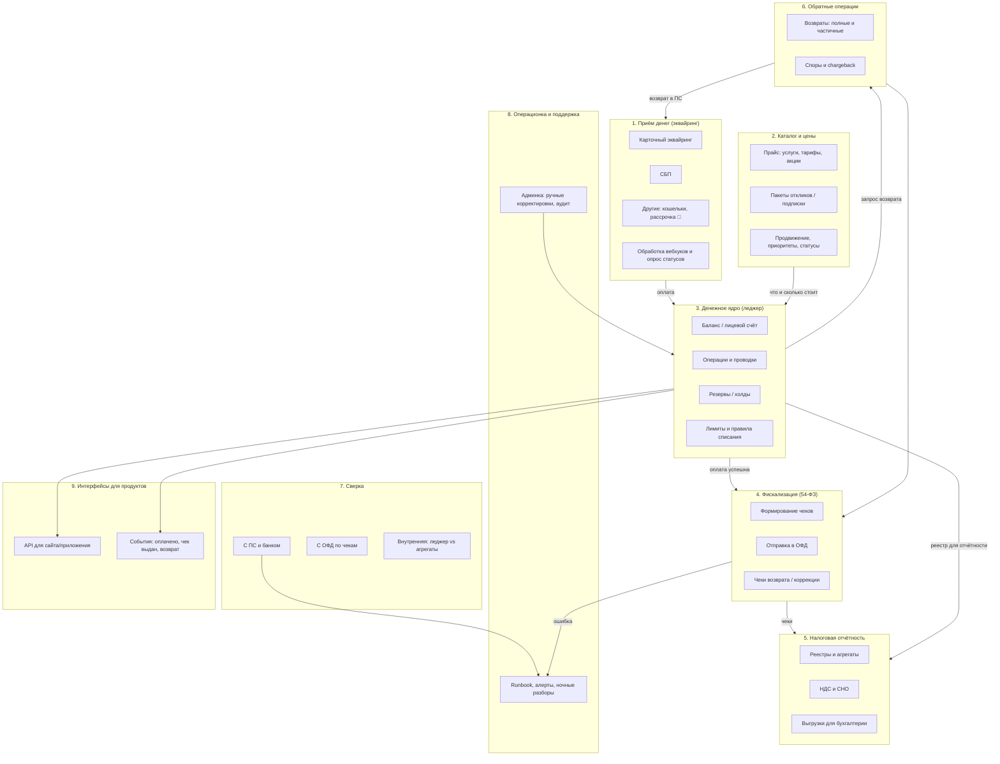

# 02. Профи.ру и биллинг: что за продукт, откуда деньги, из чего состоит система

> ⚠️ **Честная пометка.** Внутреннее устройство биллинга Профи.ру в вакансии не описано.
> Ниже — **модель на основе публично известной бизнес-модели маркетплейса услуг
> и типового устройства биллингов таких сервисов**. Цель — чтобы ты говорил предметно
> и задавал правильные вопросы, а не угадывал. Все предположения помечены 🔎
> («предположение, уточнить на собеседовании»). Не выдавай их за факты — а вот
> **спрашивать про них — сильно**.

---

## 1. Что такое Профи.ру как бизнес

Профи.ру — маркетплейс услуг: на одной стороне **специалисты** (репетиторы, мастера,
юристы, ремонт, психологи, красота и т.д.), на другой — **клиенты**, которые ищут исполнителя.
Сервис сводит спрос и предложение и зарабатывает на **специалистах**.

Ключевая экономика, которую надо понимать:

```
                    ┌─────────────────────────────────────────────┐
                    │        Кто платит Профи.ру (сегодня)        │
                    └─────────────────────────────────────────────┘
   Клиент ────────► бесплатно (создаёт спрос, оставляет заявку)
     │
     │ заявка / контакт
     ▼
   Специалист ─────► ПЛАТИТ (основной источник выручки):
                      • за отклик на заказ / за контакт клиента
                      • подписка / абонемент на пакет откликов
                      • продвижение профиля, приоритет в выдаче
                      • «Профи»-статус / комиссия за сделку
```

**Что отсюда следует для биллинга:**
плательщик — юридически и физически один и тот же «пользователь-специалист», платит
**мелкими суммами и часто** (микротранзакции: 100–500 ₽ за отклик). Это определяет
характер системы: много мелких операций, высокая частота, ощутимая стоимость транзакции
относительно её суммы, серьёзная нагрузка на таблицу операций и на фискализацию
(каждый отклик → потенциально чек).

**А теперь главное изменение из вакансии:** «деньги будут принимать не только со
специалистов, но и с клиентов». Это не «добавить кнопку оплаты». Это:

| Что меняется | Почему это большая работа |
|---|---|
| Появляется **второй тип плательщика** (заказчик) | Нужны роли, договоры/оферты, разные НДС-режимы, разный состав чека |
| Скорее всего появляется **предоплата за услугу** | Значит, двухэтапные чеки (аванс → зачёт), холды, «деньги у нас, услуга ещё не оказана», возвраты до оказания |
| Появляется **выплата специалисту** | Значит, выплатные реестры, НДФЛ/агентские схемы, реквизиты, отдельная сверка |
| Появляется **риск** (спор «услуга не оказана») | Chargeback, спор по чеку, ручной разбор — то есть процесс, а не только код |

> **Готовый тезис вслух:** «Пока деньги принимаются только со специалистов — это
> классический B2C-приём: мелкие частые платежи, фискализация на каждого, простая
> сверка. Когда появляется второй плательщик-клиент и услуга с отложенным оказанием,
> у нас меняется уже не интеграция, а модель учёта: появляются авансы, зачёты,
> обязательство вернуть деньги, и в чеке оказывается уже не „отклик“, а „услуга“.
> Вот это, я думаю, и есть та часть большого рефакторинга.»

---

## 2. Из чего состоит биллинг (типовая разборка на части)

На собеседовании про тебя спросят «разобраться, из каких частей состоит биллинг, за что
они отвечают и как связаны». Значит, у тебя в голове должна быть **карта из 8–9 частей**.
Вот она (используй как каркас ответа):



**Как этим пользоваться в разговоре:** когда Миша спросит «с чего начнёшь разбираться
в системе», ответь по этой карте, но **сократи до трёх блоков** (не перечисляй все девять —
это выглядит как вызубренный список):

> «Я бы разложил биллинг на три контура. Первый — **деньги**: приём платежа, зачисление,
> баланс, возврат. Второй — **юридический след**: чеки и отчётность, потому что это то,
> из-за чего сейчас рефакторинг и где ошибки самые дорогие. Третий — **эксплуатация**:
> сверки, алерты, runbook, админка. И дальше в каждом контуре смотрел бы: какие таблицы,
> кто владеет данными, где точки согласованности между контурами — то есть где может
> получиться так, что деньги есть, а чека нет.»

Этот последний пункт («деньги есть, а чека нет») — **золотая фраза**. Она показывает,
что ты уже думаешь про расхождения между подсистемами, а это и есть суть биллинга.

---

## 3. Главный поток денег: как выглядит «специалист купил отклик»

Пройди этот путь один раз внимательно — на нём построено 80% практических задач.

```mermaid
sequenceDiagram
    autonumber
    participant S as Специалист (сайт)
    participant API as API биллинга
    participant DB as MySQL (леджер)
    participant PSP as Платёжная система
    participant MQ as RabbitMQ
    participant FISC as Сервис фискализации
    participant OFD as ОФД

    S->>API: POST /payments (сумма, услуга, idempotency_key)
    API->>DB: BEGIN; INSERT payment (status=pending, idem_key UNIQUE)
    API->>PSP: createPayment(...) — внешняя сеть, может зависнуть!
    PSP-->>API: payment_url / подтверждение
    API->>DB: COMMIT (payment=waiting_for_callback)
    API-->>S: redirect / статус «ожидает оплату»

    Note over PSP,API: Пользователь платит на стороне ПС.<br/>Результат придёт вебхуком... или не придёт.

    PSP->>API: webhook: paid (event_id=...) — 200, но требует проверки подписи
    API->>DB: BEGIN; SELECT ... FOR UPDATE (по payment_id)
    API->>DB: INSERT payment_event (event_id UNIQUE) — защита от дубля вебхука
    API->>DB: UPDATE payment SET status=paid; INSERT ledger_entry (проводки)
    API->>DB: INSERT outbox (receipt.requested) — в ТОЙ ЖЕ транзакции
    API->>DB: COMMIT
    API-->>PSP: 200 OK (быстро, без ожидания чека)

    MQ->>FISC: consume receipt.requested
    FISC->>FISC: собрать теги чека, проверить идемпотентность
    FISC->>OFD: зарегистрировать чек (внешний вызов, может упасть)
    OFD-->>FISC: фискальный признак, номер ФД
    FISC->>DB: UPDATE receipt SET status=printed, fd_number=...
    FISC->>MQ: ack
```

**Три вещи, которые на этом пути ломаются (запомни — это твои ответы на «поведение при сбоях»):**

1. **Ответ ПС потерялся после того, как деньги реально списались.** Платёж в нашей БД
   `pending`, у пользователя деньги списаны. Решение: периодический **опрос статуса** (reconciliation
   job) + вебхук; состояние `unknown` как честный статус, а не «failed».
2. **Вебхук пришёл дважды.** Платёж не должен зачислиться дважды. Решение: UNIQUE на
   `event_id`/`idempotency_key` + транзакция.
3. **Платёж зачислен, чек не сформирован.** Деньги есть — документа нет. Решение: **outbox
   в той же транзакции**, что и зачисление; отставание чеков = метрика + алерт + ночной
   «дожим».

---

## 4. Почему «новые виды услуг → иначе формируются чеки» (ключ к рефакторингу)

Это то место, где бизнес-логика реально протекает в биллинг. Разные виды услуг
дают **разные параметры фискализации**, хотя «пользователь заплатил Х рублей» выглядит одинаково:

| Вид услуги | Что в чеке (упрощённо) | Чем отличается технически |
|---|---|---|
| Доступ к контактам / отклик | Предмет расчёта «услуга», полный расчёт, НДС по нашей СНО | Просто: приход на сумму платежа |
| Пакет/подписка на несколько откликов | Оплата за пакет; по мере использования — зачёт аванса | Нужен учёт **сколько раз** из пакета израсходовано, а чек — на момент оказания |
| Продвижение профиля (рекламная услуга) | «Услуга» с конкретным наименованием, часто **без НДС** или с иным признаком | Другое наименование и признак предмета расчёта |
| Агентская/посредническая схема | В чеке — **наше вознаграждение**, и признак агента | Разделение суммы на «наше вознаграждение» и «деньги принципала» |
| Оплата от клиента за услугу специалиста | Чек на услугу, часто **предоплата (аванс)**, потом зачёт | Двухэтапная фискализация, «услуга оказана» — событие вне биллинга |
| Возврат по любой из схем | Отдельный чек возврата прихода | Отдельный тип чека, привязка к исходному чеку |

> **Вывод, который стоит произнести:** «Правила фискализации не должны жить в `if`
> внутри создания платежа. Иначе каждый новый вид услуги — это правка денежного кода
> и релиз ядра. Их надо вынести в **данные**: у вида услуги есть параметры фискализации
> (предмет расчёта, признак способа расчёта, ставка НДС, признак агента, момент оказания),
> а код читает эти параметры. Тогда „новый вид услуги“ — это запись в справочнике и
> тест, а не переписывание биллинга.»

Это ровно то, что просит вакансия: «чтобы новую логику чеков, налоговой отчётности и
платёжных сценариев можно было добавлять быстрее и проще».

---

## 5. Что уточнить про Профи.ру именно (готовые вопросы)

Не спрашивай «расскажите про архитектуру» — слишком широко. Спрашивай по делу:

1. «Какой сейчас основной сценарий списания — баланс пополняется и потом списывается,
   или каждый отклик оплачивается отдельной транзакцией? Это определяет, есть ли у вас
   авансы и чеки на зачёт.»
2. «Фискализация — через собственный интегратор ОФД, через агрегатора (АТОЛ Онлайн, Модульбанк)
   или через несколько? Есть ли мульти-ККТ/мультиюрлицо?»
3. «Платёжные системы — свой адаптер под каждую или общая прослойка? Сколько сейчас провайдеров
   и сколько занимает подключение нового?»
4. «Что для вас главный источник риска в биллинге сегодня: расхождения в сверке, отставание
   чеков, повторные зачисления или ручные правки?»
5. «Рефакторинг из-за налоговой — он про новые теги/ФФД, про разделение по юрлицам,
   про НДС или про новые предметы расчёта? Что самое срочное?»
6. «Возвраты — сколько их в месяц и сколько ручной работы в них сейчас?»
7. «Как сейчас отлаживаются инциденты: есть ли возможность „проиграть“ платёж на стейдже,
   есть ли окружение с песочницей ПС?»
8. «Чего вы ждёте от нового человека в первые три месяца, кроме „разобраться“ — какая задача
   точно должна быть закрыта к концу испытательного?»

Полный список с пояснениями — `00-vacancy/05-questions-to-employer.md`.

---

## 6. Мини-шпаргалка «кто в биллинге за что отвечает»

Держи в голове, когда на собеседовании начнётся «а кто у вас владеет этим данным»:

| Сущность | Владелец | Кто ещё читает | Что нельзя делать |
|---|---|---|---|
| `payment` (платёж в ПС) | Биллинг | Поддержка, аналитика | Менять статус руками без аудита |
| `ledger_entry` (проводки) | Биллинг (деньги!) | Бухгалтерия, отчётность | UPDATE/DELETE — только вставка компенсирующей проводки |
| `receipt` (чек) | Биллинг/фискальный сервис | Бухгалтерия, ОФД | Перевыпуск «тихо»; только чек коррекции |
| `order`/`lead` (заказ, отклик) | Продуктовая команда | Биллинг (стимул отменить) | Считать деньги похороненными прямо в заказе |
| Прайс/тарифы | Продукт/финмодель | Биллинг | Хардкодить цены в коде биллинга |
| Данные для налоговой | Бухгалтерия (владелец) | Биллинг (поставщик данных) | Молча менять формат выгрузки |

> Фраза-маркер: «Деньги и отчётность — это данные, где **владелец не разработчик**.
> Бухгалтерия владеет смыслом, мы владеем корректностью. Поэтому изменения здесь
> согласовываются, версионируются и покрываются тестами на конкретных кейсах.»

---

## Чек-лист по этому файлу

- [ ] Могу за 60 секунд объяснить бизнес-модель Профи.ру и откуда деньги (специалист → отклик/подписка/продвижение).
- [ ] Помню 9 частей биллинга, но вслух называю 3 контура: деньги / юридический след / эксплуатация.
- [ ] Могу пересказать поток «оплата отклика» и назвать три места, где он ломается.
- [ ] Готов ответ, почему новые виды услуг требуют рефакторинга (правила фискализации → в данные, а не в `if`).
- [ ] Выбрал 2 из 8 вопросов выше и готов задать их своими словами.
