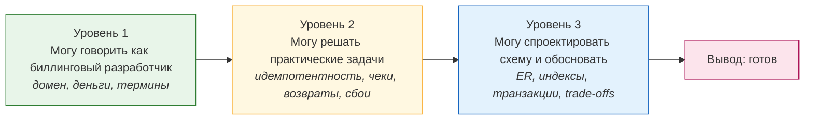

# 04. План подготовки: 14 дней / 7 дней / 3 дня / день перед собесом

> План построен не «пройти всё», а «обеспечить минимальный достаточный уровень».
> Если времени мало — иди по колонке нужного срока. Порядок блоков менять нельзя:
> домен → практика → техника → дизайн → прогон. Причина: техника без домена на
> этом собеседовании не спасает.

---

## Как устроена подготовка: три уровня готовности

**Если ты не успеваешь пройти всё** — жертвуй в таком порядке:
1. `08-system-design/03-legacy-refactoring.md` (можно ответить логикой из головы)
2. `07-typescript/01-ts-node-for-php-devs.md`
3. `03-messaging/02-rabbitmq-in-billing.md`, `04-cache/01-redis-memcached.md` (сработает твой опыт)
4. `02-mysql/04-explain-and-sql-tasks.md` (задачи — по остаточному принципу)

**Никогда не жертвуй:** `06-reliability/01-idempotency-state-machines.md`,
`09-practical-tasks/*`, `10-mock-interview/*`, `05-billing-domain/03-receipts-54fz.md`.
Это ядро собеседования, без вариантов.

---

## Вариант «14 дней» (по 1.5–2 часа в день)

| День | Что читаешь | Что делаешь руками | Критерий готовности |
|---|---|---|---|
| 1 | `00-vacancy/01-vacancy-breakdown.md`, `02-profiru-billing-domain.md` | Выписываешь свой питч (90 сек) на бумагу | Питч рассказал вслух без подглядывания |
| 2 | `05-billing-domain/01-domain-map.md`, `11-cheatsheets/05-billing-glossary.md` | Учишь 30 ключевых терминов | Можешь по каждому дать определение и пример из опыта |
| 3 | `05-billing-domain/02-payments-and-acquiring.md` | Рисуешь свою диаграмму потока оплаты по памяти | Диаграмма совпадает по смыслу со схемой в файле |
| 4 | `05-billing-domain/03-receipts-54fz.md` | Разбираешь 5 кейсов «какой чек нужен» из заданий в конце | 5/5 верно |
| 5 | `06-reliability/01-idempotency-state-machines.md` | Пишешь машину состояний платежа на бумаге | Можешь назвать все переходы и защиту от дубля |
| 6 | `06-reliability/02-consistency-patterns.md`, `03-failures-runbook.md` | Составляешь мини-runbook на инцидент «чеки отстают» | Runbook содержит «что смотреть → что делать → кого звать» |
| 7 | `09-practical-tasks/01-payment-acceptance.md`, `02-receipt-formation.md` | Решаешь сам, потом сверяешься | Нашёл минимум 3 свои ошибки/пропуска |
| 8 | `09-practical-tasks/03-refunds.md`, `04-idempotent-reprocessing.md` | Решаешь сам | Готов ответ на частичный возврат и на порядок событий |
| 9 | `09-practical-tasks/05-failures-and-self-check.md` | Проходишь чек-лист самопроверки | Все пункты чек-листа закрыты |
| 10 | `02-mysql/01-innodb-indexes.md`, `02-transactions-isolation-locks.md` | Поднимаешь `12-labs/`, гоняешь EXPLAIN и дедлок из примеров | Видел своими глазами лок-ожидание и дедлок |
| 11 | `01-php/01-money-precision-php.md`, `02-pdo-transactions.md` | Пишешь обработчик вебхука с идемпотентностью | Код работает и не задваивает при двойном вызове |
| 12 | `08-system-design/02-db-design-walkthrough.md` | Проектируешь схему с нуля на бумаге, потом сравниваешь | Совпало по сути: платежи, леджер, чеки, события |
| 13 | `08-system-design/01-billing-architecture.md`, `03-legacy-refactoring.md`, `07-typescript/01-ts-node-for-php-devs.md` | Формулируешь одну историю рефакторинга (история №4) | 90 секунд, с цифрами |
| 14 | `10-mock-interview/*` | Полный прогон вслух на 60 минут | Прошёл без затыков дольше 5 секунд |

---

## Вариант «7 дней» (сжатый, самый реалистичный)

| День | Блок | Фокус |
|---|---|---|
| 1 | `00-vacancy/01` + `02` + `03` | Понять, что проверяют, собрать питч и истории |
| 2 | `05-billing-domain/01`, `02`, `03` | Домен + платежи + чеки (самое важное из домена) |
| 3 | `06-reliability/01`, `09-practical-tasks/01`, `02` | Идемпотентность и первые две практические задачи |
| 4 | `09-practical-tasks/03`, `04`, `05` + `05-billing-domain/04`, `05` | Возвраты, повторная обработка, сбои, отчётность |
| 5 | `02-mysql/01`, `02` + `01-php/02` | MySQL-ядро: индексы, транзакции, локи + PDO |
| 6 | `08-system-design/02` + `10-mock-interview/02` | Схема БД и живой диалог проектирования |
| 7 | `10-mock-interview/01` + `03` + `11-cheatsheets/06-last-day.md` | Полный прогон и поведенческая часть |

Что деградируем на этом плане: `03-messaging`, `04-cache`, `07-typescript` — только
`11-cheatsheets/03-rabbitmq.md`, `04-redis.md` по диагонали; `02-mysql/03`, `04` — не читаешь
вовсе (там ответишь общими принципами).

---

## Вариант «3 дня» (аварийный)

| Когда | Что |
|---|---|
| Всё время | `06-reliability/01`, `09-practical-tasks/*`, `10-mock-interview/01` |
| Между делом | `11-cheatsheets/05-billing-glossary.md`, `01-mysql.md`, `06-last-day.md` |
| Обязательный минимум | `08-system-design/02-db-design-walkthrough.md` — потому что это точно спросят |
| Игнорируй | всё остальное, кроме `00-vacancy/03` (истории) и `05-questions-to-employer.md` |

Правило для аварийного режима: **не пытайся узнать больше — учись лучше рассказывать то, что уже знаешь.**
Твой опыт процессинга покрывает большую часть вакансии; задача — не провалиться на
специфике (фискализация, локи MySQL), а специфику ты уже читаешь в этих файлах.

---

## День перед собеседованием

**Утром (2 часа):**
1. `11-cheatsheets/06-last-day.md` — прочитать вслух все 30 тезисов.
2. `10-mock-interview/03-behavioral-and-tricky.md` — раздел «каверзные вопросы», ответить самому.
3. `05-questions-to-employer.md` — выбрать 5 вопросов и записать их как заметки.

**Днём (1 час):** поднять `12-labs/docker-compose.yml`, выполнить `sql/03-queries.sql` —
это нужно не для знаний, а чтобы руки помнили, что ты «работаешь с MySQL».

**Вечером — ничего не учить.** Прочитать `00-vacancy/02-profiru-billing-domain.md` §5
(вопросы про Профи.ру) и лечь спать. Свежая голова важнее одного вечернего файла.

**Проверить заранее (не в день собеса):**
- [ ] Ссылка/звонок работает, микрофон и наушники проверены.
- [ ] Тихое место, свет, ничего не отвлекает.
- [ ] Перед глазами — распечатка/второй монитор: `11-cheatsheets/06-last-day.md` + свои 6 историй.
- [ ] Разрешение писать/рисовать есть (иногда просят расшарить экран: проверь, что можешь
      быстро открыть редактор или экранную доску).

---

## Что делать после собеседования (тоже важно)

1. **Через 30 минут** после: записать, на какие вопросы ответил слабо (свежая память).
2. Разобрать их по этим материалам, дописать в соответствующий файл — папка должна
   стать живой, а не одноразовой.
3. Отправить follow-up в течение 24 часов: короткое письмо/сообщение с 2–3 мыслями
   обсуждённого (например, «подумал про ваш вопрос о двух плательщиках — вот что ещё
   пришло в голову»). Это реально влияет на решение по небольшой команде.

---

## Трекер подготовки

Отмечай по мере прохождения (только 4 состояния: не начал / прочитал / решил сам / могу объяснить вслух):

| Блок | Прочитал | Решил сам | Объясняю вслух |
|---|---|---|---|
| Домен: карта, платежи, чеки, отчётность | ☐ | ☐ | ☐ |
| Идемпотентность и состояния | ☐ | ☐ | ☐ |
| Практические задачи (5 штук) | ☐ | ☐ | ☐ |
| MySQL: индексы, транзакции, локи | ☐ | ☐ | ☐ |
| PHP: деньги, транзакции, PHP 8 | ☐ | ☐ | ☐ |
| Схема БД (дизайн) | ☐ | ☐ | ☐ |
| Сбои, ретраи, runbook | ☐ | ☐ | ☐ |
| RabbitMQ / Redis | ☐ | ☐ | ☐ |
| Истории STAR (6) | ☐ | ☐ | ☐ |
| Вопросы работодателю (5) | ☐ | ☐ | ☐ |

> **Критерий «готов»:** не «прочитал всё», а «могу закрыть толковый разбор задачи
> по каждому блоку и назвать цену своего решения». Если по блоку не можешь назвать
> компромисс — блок не закрыт.
