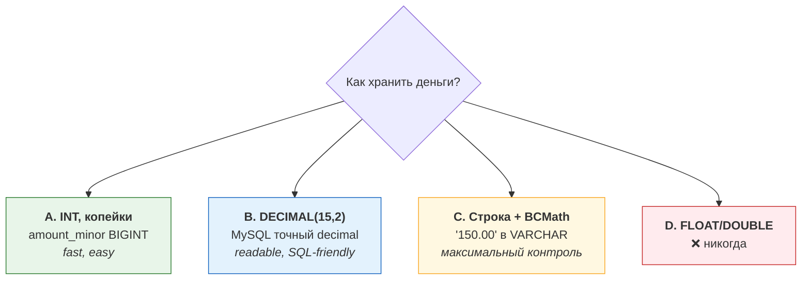

# 01. Деньги и точность в PHP: float, копейки, DECIMAL, BCMath

> **Что проверяют.** Понимаешь ли ты, что деньги — это не `float`, и знаешь ли, где
> именно в PHP и MySQL точность теряется. Это вопрос-маркер: если кандидат говорит
> «храню как `float`» или «сравниваю через `==`» — дальше разговор про биллинг бессмысленен.
>
> Здесь: как устроена проблема изнутри, четыре способа хранить деньги, где каждый ломается,
> округление (это отдельная тема с подвохом), готовый Value Object и подборка задач.

---

## 1. Почему float нельзя (и как это объяснить на собеседовании)

`float` в PHP — это IEEE 754 double: 64 бита, из них 52 — мантисса. Двоичная дробь
**не может** точно представить 0.1, 0.2, 0.3 — так же как в десятичной нельзя точно
записать 1/3. Значит, любая сумма с копейками хранится **приблизительно**.

Проверить в консоли:

```php
php -r 'var_dump(0.1 + 0.2 === 0.3);'          // false
php -r 'var_dump(0.1 + 0.2);'                  // float(0.30000000000000004)
php -r 'var_dump((int) (0.29 * 100));'         // int(28)  ← вот это уже потерянные деньги
php -r 'var_dump(round(2.675 * 100));'         // 267 или 268 — зависит от представления
php -r 'var_dump(1e20 - 1e20 + 1);'            // float(1)
```

**Как это формулировать вслух:**

> «`float` — двоичная дробь. Копейки в неё не влезают точно, накапливается ошибка, и при
> агрегации за месяц мы можем не сойтись с банком на рубли. Плюс сравнение `==` для
> дробей не работает, а `(int)($sum * 100)` теряет копейку из-за представления.
> Поэтому деньги у меня всегда в целых минимальных единицах или в строковом decimal —
> ни в коем случае не во float.»

### Ловушка, о которой почти никто не думает: `JSON` и float

```php
// API отдаёт сумму
echo json_encode(['amount' => 0.1 + 0.2]);       // {"amount":0.30000000000000004}
echo json_encode(['amount' => 1234567890123456789]); // зависит от platform
// PHP >= 7.1 есть serialize_precision=-1, но клиенты на JS всё равно разберут как double
```

`JSON.parse` в JS даёт `Number` = double. То есть даже если сервер аккуратен, **в браузере
сумма станет float**. Поэтому: в JSON суммы передаём **строкой** (`"150.00"`) или
**копейками целым числом** (`15000`) — и договариваемся об этом в контракте.

---

## 2. Четыре способа хранить деньги: сравнение



| Способ | Точность | Плюсы | Минусы | Когда выбирать |
|---|---|---|---|---|
| **INT — минимальные единицы** (копейки) | идеальная | атомарные `INCR`/`SUM`, компактно (8 байт), быстро в индексе, нет вопросов округления в БД | надо помнить про экспоненту валюты (не везде 2 знака), надо форматировать на выводе | **Основной выбор** для сумм, балансов, лимитов, счётчиков |
| **DECIMAL(15,2)** | идеальная (десятичная) | читаемо в консоли и отчётах, `SUM()` в SQL точен, привычно бухгалтерии | дороже по CPU, в PHP приходит **строкой** (и это хорошо — см. ниже), не для накопительных счётчиков (`UPDATE ... SET x = x + 0.01` тоже точен, но медленнее) | Для сумм, которые читают люди и бухгалтерия: начисления, чеки, отчёты |
| **VARCHAR + BCMath** | максимальная | контроль над масштабом и округлением, работает с огромными числами | нет арифметики в SQL, легко ошибиться, индекс не применить для сравнений | Крипта, высокоточные ставки, суммы с >2 знаков |
| **FLOAT/DOUBLE** | ❌ | «удобно» | всё, что выше | Никогда |

### Про экспоненту валюты (важный нюанс, который любят спрашивать)

ISO 4217 задаёт **minor unit exponent**: обычно 2, но:

| Валюта | Экспонента | Что значит |
|---|---|---|
| RUB, USD, EUR | 2 | копейки/центы |
| JPY, KRW | 0 | нет дробной части: `1000 JPY` = `1000` minor |
| KWD, BHD, TND | 3 | 1/1000 |
| крипта (BTC) | 8 (satoshi, не ISO) | свои правила |

**Отсюда правило:** «копейки» — это не универсально «умножить на 100». Нужна таблица
валют с экспонентой, и все преобразования — через неё. Иначе при добавлении новой валюты
получишь ошибку в 100 раз.

```sql
CREATE TABLE currency (
  code        CHAR(3)      NOT NULL PRIMARY KEY,   -- 'RUB'
  exponent    TINYINT      NOT NULL,               -- 2
  name        VARCHAR(64)  NOT NULL
) ENGINE=InnoDB;
```

### Про PHP_INT_MAX

64-битный PHP: `PHP_INT_MAX = 9_223_372_036_854_775_807` — это ~92 квадриллиона **копеек**,
т.е. ~92 триллиона рублей. Оборот в месяц у маркетплейса — миллиарды копеек, запас огромный.
Но: `SUM()` в MySQL по `BIGINT` возвращает `DECIMAL`, и **PDO отдаёт это строкой** — нельзя
просто складывать с `int` без проверки. Про переполнение:

```php
PHP_INT_MAX + 1;              // float(9.2233720368548E+18)  ← молча превращается во float!
intdiv(PHP_INT_MAX, 100);     // корректное деление
```

**Вывод вслух:** «`BIGINT` в копейках хватает с запасом, но на границе с БД надо помнить,
что агрегаты приходят как `DECIMAL`/строкой — я их не конвертирую во `float`, а работаю
строкой или привожу к `int` осознанно.»

---

## 3. Что PDO отдаёт из базы (и почему это ловушка)

```php
$pdo = new PDO($dsn, $user, $pass, [
    PDO::ATTR_ERRMODE            => PDO::ERRMODE_EXCEPTION, // обязательно
    PDO::ATTR_EMULATE_PREPARES   => false,                  // настоящие подготовленные запросы
    PDO::ATTR_STRINGIFY_FETCHES  => false,
    PDO::ATTR_DEFAULT_FETCH_MODE => PDO::FETCH_ASSOC,
]);

$row = $pdo->query('SELECT amount_minor, total_decimal FROM payment LIMIT 1')->fetch();
var_dump($row);
// [
//   'amount_minor'  => 15000,        // int  (BIGINT)
//   'total_decimal' => '150.00',     // string! (DECIMAL) — это ХОРОШО
// ]
```

**Три вывода:**

1. `DECIMAL` приходит **строкой**. Это не баг — это защита от потери точности. Конвертировать
   в `float` нельзя. Работаем строкой/Bcmath или парсим в минорные единицы **осознанно**.
2. `BIGINT` приходит `int` — но только при `ATTR_STRINGIFY_FETCHES=false` и неэмулированных
   запросах; в старых конфигурациях может прийти строкой. Поэтому код не должен зависеть
   от того, `int` там или `'15000'` — приводим явно.
3. `ATTR_EMULATE_PREPARES => true` (по умолчанию для mysqlnd в некоторых сборках!) означает,
   что PDO **подставляет значения текстом** в SQL. Для денег это двойная боль: (а) теряется
   строгий тип, (б) исторически это связано с рисками интерполяции/усечения. Для биллинга
   выключаем.

### Парсинг строкового decimal в минорные единицы — правильно

```php
/**
 * '150.05' + exponent 2  →  15005
 * Работает строками, без float. Бросает исключение, если слишком много знаков.
 */
function toMinorUnits(string $decimal, int $exponent): int
{
    if (!preg_match('/^(-?)(\d+)(?:\.(\d+))?$/', $decimal, $m)) {
        throw new InvalidArgumentException("Bad decimal: {$decimal}");
    }
    [, $sign, $int, $frac] = $m + [3 => ''];

    if (strlen($frac) > $exponent) {
        // Либо ошибка, либо явное округление — но молча терять знаки нельзя!
        throw new InvalidArgumentException("Too many fraction digits: {$decimal}");
    }

    $minor = $int . str_pad($frac, $exponent, '0', STR_PAD_RIGHT);
    $minor = ltrim($minor, '0');

    return (int) ($sign === '-' ? '-' . $minor : $minor);
}

var_dump(toMinorUnits('150.05', 2));   // int(15005)
var_dump(toMinorUnits('1000', 0));     // int(1000)   — JPY
var_dump(toMinorUnits('1.005', 3));    // int(1005)   — KWD
```

---

## 4. Арифметика: BCMath и GMP

Когда нужна точная арифметика над «человеческими» числами (проценты, ставки, НДС,
пересчёт по курсу) — используем **BCMath**.

```php
bcscale(6); // рабочий масштаб по умолчанию

// НДС 20% от 15000 копеек (в рублях: 150.00)
$vat = bcmul('150.00', '0.20', 6);          // '30.000000'
$total = bcadd('150.00', $vat, 2);          // '180.00'

// Половина: важное отличие от intdiv (целочисленное деление теряет остаток)
bcdiv('101', '2', 2);                        // '50.50'
intdiv(101, 2);                              // 50  ← потеряли 0.50

// Сравнение — тоже строками
bccomp('150.00', '150.000', 2);              // 0 (равны)
```

| Функция | Что делает | Ловушка |
|---|---|---|
| `bcadd/sub/mul/div` | точные операции | **по умолчанию масштаб 0** → `bcdiv('101','2')` вернёт `'50'`! Всегда задавай scale явно или `bcscale()` |
| `bccomp` | сравнение | третий аргумент — scale; без него сравнивает как задано `bcscale` |
| `bcmod`, `bcpow`, `bcsqrt`, `bcpowmod` | остальное | медленнее нативных операций, не `float`, результат — строка |
| `bcround` (**не существует**) | — | В PHP < 8.4 нет `bcround`. Округление делаем сами или через `number_format`/GMP/int-арифметику |

**Ловушка №1 на собеседовании:** «Назови главную ошибку при работе с BCMath». Ответ:
**не указанный scale**. `bcdiv('1','3')` вернёт `0`, потому что масштаб по умолчанию 0.
Всегда `bcscale(6)` (или явный третий аргумент) и только в самом конце округляем до
денежного масштаба.

**GMP** — для больших целых (быстро, но только целые). Практически не нужен в биллинге,
кроме крипты/хешей. Упомяни и не углубляйся.

---

## 5. Округление — это тема про деньги, а не про математику

Округление — место, где теряются/появляются рубли. Три разных вопроса:

### 5.1. Какой режим округления

| Режим | PHP-константа | Как работает | Где применять |
|---|---|---|---|
| Half-up (математическое) | `PHP_ROUND_HALF_UP` | 2.5 → 3, −2.5 → −3 | Обычная бытовая логика, чеки «в пользу клиента» |
| Half-even (**банковское**) | `PHP_ROUND_HALF_EVEN` | 2.5 → 2, 3.5 → 4 | Финансовая отчётность, там где важно, чтобы суммы сходились при массовом округлении |
| Half-down | `PHP_ROUND_HALF_DOWN` | 2.5 → 2 | Редко |
| Truncate (вниз/к нулю) | — | 2.9 → 2 | Комиссии «не больше чем», частичные списания |

```php
round(2.5, 0, PHP_ROUND_HALF_UP);    // 3.0
round(2.5, 0, PHP_ROUND_HALF_EVEN);  // 2.0
round(3.5, 0, PHP_ROUND_HALF_EVEN);  // 4.0
```

> Почему банковское округление существует: если всегда округлять .5 вверх, то на большом
> объёме однотипных операций накапливается систематический сдвиг в одну сторону. Half-even
> размазывает его. **На собеседовании достаточно знать, что вопрос существует** и что режим
> должен быть зафиксирован в одном месте, а не «где как получилось».

### 5.2. Где округлять: по строке или по документу

Классический кейс: чек из трёх позиций по 100.005 ₽.

```
Округлять каждую позицию: 100.01 + 100.01 + 100.01 = 300.03
Округлить итог:          100.005*3 = 300.015 → 300.02
```

Разница — 1 копейка. И она приводит к расхождению с чеком/отчётом. **Правило:** порядок
округления должен быть зафиксирован и **одинаков** во всех местах: в расчёте, в чеке,
в отчётности. Обычно: считаем в максимальной точности (BCMath с scale 6), округляем
**один раз на итог документа**, позиции храним в точности расчёта или тоже округляем — но
тогда обязательно контролируем `сумма(позиций) == итог`.

```php
/**
 * Инвариант, который обязан проверяться в тестах:
 * сумма позиций после округления == округлённый итог.
 * Если не сходится — распределяем "остаток" (penny allocation).
 */
function assertLinesMatchTotal(array $linesMinor, int $totalMinor): void
{
    $sum = array_sum($linesMinor);
    if ($sum !== $totalMinor) {
        throw new LogicException("Lines sum {$sum} != total {$totalMinor}");
    }
}
```

### 5.3. Распределение остатка (penny allocation) — вопрос «с подвохом»

Задача: 100 копеек разделить пропорционально 1:1:1 (по 33.33). Сумма 99 ≠ 100.
Правильный алгоритм (и это то, что любят спрашивать на биллинге/финтехе):

```
1. Считаем доли в максимальной точности.
2. Округляем ВНИЗ каждую долю (floor).
3. Считаем нераспределённый остаток = итог − сумма округлённых.
4. Раздаём по 1 минимальной единице первым N получателям (по убыванию дробной части).
```

Так работают и распределение платежа между позициями, и разделение скидки, и аллокация
комиссий. Гарантия: сумма частей **всегда** равна исходному целому.

```php
/**
 * Делит сумму в минорных единицах пропорционально weights без потери копейки.
 * @param int[] $weights
 * @return int[] доли, сумма которых РОВНО $totalMinor
 */
function allocate(int $totalMinor, array $weights): array
{
    $totalWeight = array_sum($weights);
    if ($totalWeight <= 0) {
        throw new InvalidArgumentException('Weights must be positive');
    }

    $result  = [];
    $fractions = [];
    $allocated = 0;

    foreach ($weights as $i => $w) {
        // floor деления по модулю: (total*w) div totalWeight
        $exact  = intdiv($totalMinor * $w, $totalWeight);
        $result[$i] = $exact;
        $fractions[$i] = ($totalMinor * $w) % $totalWeight; // остаток для "раздачи"
        $allocated += $exact;
    }

    $left = $totalMinor - $allocated;
    arsort($fractions);              // кто "ближе всего" к следующей копейке
    foreach (array_keys($fractions) as $i) {
        if ($left <= 0) break;
        $result[$i]++;
        $left--;
    }

    return $result;
}

print_r(allocate(100, [1, 1, 1]));   // [34, 33, 33] — сумма 100 ✔
print_r(allocate(10, [1, 1, 1]));    // [4, 3, 3]    — сумма 10  ✔
print_r(allocate(1,  [1, 1, 1]));    // [1, 0, 0]    — сумма 1   ✔ (одна копейка кому-то)
```

**Провал на собеседовании:** сказать «поделю на 3 и округлю» — вопрос сразу станет
«а если сумма не сойдётся с чеком?». Ответ должен быть: **никогда не теряем и не создаём
копейки; остаток распределяем явно.**

---

## 6. Готовый Value Object `Money` (то, что стоит показать на собеседовании)

Пишем руками — это лучше, чем сказать «использую moneyphp/money». Показывает, что понимаешь
внутренности.

```php
<?php
declare(strict_types=1);

/**
 * Иммутабельное представление денежной суммы.
 * Хранит ТОЛЬКО минорные единицы (int) + валюту. Ни одного float внутри.
 */
final readonly class Money
{
    private function __construct(
        public string $currency,
        public int $amountMinor,
    ) {
        if (!preg_match('/^[A-Z]{3}$/', $currency)) {
            throw new InvalidArgumentException("Bad currency: {$currency}");
        }
    }

    /** Создать из "человеческой" строки: Money::of('150.05', 'RUB', 2) */
    public static function of(string $decimal, string $currency, int $exponent): self
    {
        return new self($currency, self::toMinor($decimal, $exponent));
    }

    public static function fromMinor(int $minor, string $currency): self
    {
        return new self($currency, $minor);
    }

    public static function zero(string $currency): self
    {
        return new self($currency, 0);
    }

    public function add(self $other): self
    {
        $this->assertSameCurrency($other);
        return new self($this->currency, $this->amountMinor + $other->amountMinor);
    }

    public function subtract(self $other): self
    {
        $this->assertSameCurrency($other);
        return new self($this->currency, $this->amountMinor - $other->amountMinor);
    }

    public function multiply(string $factor, int $exponent = 6, int $roundMode = PHP_ROUND_HALF_EVEN): self
    {
        // Умножение — через BCMath, потому что фактор дробный (НДС 0.2, курс, комиссия)
        $product = bcmul((string) $this->amountMinor, $factor, $exponent);
        return new self($this->currency, self::bcRoundToInt($product, $roundMode));
    }

    /** Пропорциональное распределение без потери копеек (см. allocate выше) */
    public function allocate(array $weights): array
    {
        return array_map(
            fn (int $minor) => new self($this->currency, $minor),
            allocate($this->amountMinor, $weights),
        );
    }

    public function isNegative(): bool { return $this->amountMinor < 0; }
    public function equals(self $other): bool
    {
        return $this->currency === $other->currency && $this->amountMinor === $other->amountMinor;
    }
    public function compareTo(self $other): int
    {
        $this->assertSameCurrency($other);
        return $this->amountMinor <=> $other->amountMinor;
    }

    /** Формат для человека: 150.05 */
    public function format(int $exponent = 2): string
    {
        $sign = $this->amountMinor < 0 ? '-' : '';
        $abs  = (string) abs($this->amountMinor);
        if ($exponent === 0) {
            return $sign . $abs;
        }
        $abs  = str_pad($abs, $exponent + 1, '0', STR_PAD_LEFT);
        return $sign . substr($abs, 0, -$exponent) . '.' . substr($abs, -$exponent);
    }

    /** Для JSON: отдаём минорные единицы — их нельзя потерять на клиенте */
    public function toApiPayload(): array
    {
        return ['currency' => $this->currency, 'amount_minor' => $this->amountMinor];
    }

    private function assertSameCurrency(self $other): void
    {
        if ($this->currency !== $other->currency) {
            throw new InvalidArgumentException(
                "Currency mismatch: {$this->currency} vs {$other->currency}"
            );
        }
    }

    private static function toMinor(string $decimal, int $exponent): int
    {
        // см. toMinorUnits() выше
        ...
    }

    private static function bcRoundToInt(string $value, int $mode): int
    {
        // округление строкового decimal до целого по заданному режиму
        ...
    }
}
```

**Что здесь важно (и о чём спросят):**

* `final readonly class` (PHP 8.2+) — объект иммутабелен, никакой «случайной» мутации суммы.
* Конструктор `private` → нельзя создать «кривую» сумму, только через фабрики.
* Валюта внутри суммы → **ошибка «сложил рубли с долларами» становится невозможной на уровне типа.**
  Это и есть смысл Value Object: инвариант держится типом, а не тестами.
* Наружу — **минорные единицы**, не строка с плавающей точкой. Клиент не сможет испортить.
* `multiply` возвращает новый объект с пересчитанным масштабом — потому что после умножения
  появляются «лишние» знаки, и решение об округлении должно быть явным.

**Бонусный тезис:** «`Money` — это Value Object, а не сущность: у него нет id, он сравнивается
по значению, он неизменяем. Именно поэтому его безопасно передавать между слоями и не надо
бояться, что кто-то по пути поменяет сумму.»

---

## 7. Где ещё теряются деньги (чек-лист подводных камней)

| Место | Проблема | Как правильно |
|---|---|---|
| `intval($amount * 100)` | теряет копейку из-за представления float | никогда не умножать float на 100; работать строками/BCMath |
| `float` в `json_encode` | клиент получит `0.30000000000000004` | суммы — строками или минорными единицами |
| `WHERE amount = 150.00` по `FLOAT`-колонке | не находит / находит лишнее | деньги — `BIGINT`/`DECIMAL`, сравнение точное |
| `SUM()` по `FLOAT` | накопленная ошибка | `DECIMAL`/`BIGINT` |
| `round()` без указания режима | разные места округляют по-разному | один режим округления, в одном классе |
| Округление на каждом шаге | расхождение с чеком | считать в максимальной точности, округлять один раз на документ |
| Пропорциональный сплит | сумма частей ≠ целому | `allocate()` с распределением остатка |
| `DECIMAL(10,2)` | 8 знаков до точки = 99 999 999.99 — мало для агрегатов | для сумм операций `DECIMAL(15,2)` + `BIGINT`-агрегаты; для балансов `BIGINT` |
| `PHP_INT_MAX + 1` | молча становится float | проверять границы, `intdiv` |
| `serialize`/`unserialize` денежных структур | `float` внутри останется float | храним минорные единицы, никогда не сериализуем float-деньги |
| Конвертация валют | округление промежуточное | считать в BCMath, округлять один раз в целевой валюте, сохранять курс и точность |
| `abs()`/`-` на `PHP_INT_MIN` | переполнение | не бывает на реальных суммах, но в тестах бывает |

---

## 8. Задачи с разбором (сделай сам, потом читай ответ)

### Задача 1. «Почему в отчёте за месяц сумма не сошлась на 3 рубля с банком?»

**Дано:** суммы хранятся в `DECIMAL(15,2)`, но промежуточные расчёты (НДС, комиссия) — во `float`,
результат округляется `round()` без режима. 4 миллиона операций за месяц.

**Что спросят:** где потеря.

**Разбор:**
1. Ошибка округления на каждой операции: `float` даёт микроскопическую ошибку, а `round()`
   без режима — разное поведение в разных местах кода. На 4 млн операций систематический
   сдвиг даёт рубли.
2. Диагностика (как ты это найдёшь): выбрать 1000 операций, пересчитать комиссию и НДС
   независимо (в SQL через `DECIMAL`, или в отдельном скрипте через BCMath) и сравнить с
   сохранённым значением — увидишь копеечные расхождения с одинаковым знаком.
3. Решение: все расчёты через BCMath со scale 6, округление **один раз** на документ,
   режим зафиксирован, инварианты в тестах (`сумма позиций == итог`), регрессионный
   тест на выборке исторических операций.
4. **Важно:** исторические данные не «пересчитываем молча» — это уже выпущенные документы.
   Либо ничего не трогаем, либо корректировка отдельным документом в согласованном порядке
   с бухгалтерией.

### Задача 2. «Раздели 1000 ₽ между тремя услугами пропорционально 2:3:5»

**Разбор:** в минорных единицах `100000`. Доли: 20000, 30000, 50000 — делится ровно.
А теперь 1001 ₽ (`100100`, веса 2:3:5): `20020 + 30030 + 50050 = 100100` — тоже ровно, потому
что сумма весов = 10 и 100100 делится на 10. Возьми веса 1:1:1 и 1001 ₽ → `333, 333, 333` +
1 копейка остатка → `334, 333, 333`. **Ответ должен содержать слово «остаток» и алгоритм
из §5.3.** Если кандидат отвечает «округлю и, если не сходится, подправлю последний» — это
приемлемо, но спросят: «а как ты выбираешь, кому подправить?» → «тому, у кого больше
дробная часть» — вот это правильный ответ.

### Задача 3. «Курс 91.4532, списываем 19.99 USD. Сколько рублей в чеке?»

**Разбор:** считаем в BCMath: `19.99 * 91.4532 = 1828.149468` (scale 6). Округляем **один раз**:
`1828.15`. Храним: сумму в USD (минор), курс (строка `'91.4532'`), сумму в RUB (минор),
и **промежуточную точность**. Нельзя округлять до 2 знаков в середине — иначе расхождение
с суммой в валюте платежа. И обязательно сохраняем применённый курс: без него нельзя
воспроизвести расчёт при разборе через месяц.

### Задача 4. «Пользователь получил скидку 10%, платит 900 ₽ вместо 1000 ₽. Что в чеке и что в леджере?»

**Разбор:** это задача не про округление, а про предмет расчёта. Варианты: (а) чек на 900 ₽
с указанием скидки (в ФФД есть тег скидки) или (б) чек на 1000 ₽ и чек на возврат/корректировку
— зависит от схемы. **В леджере** — либо одна проводка на 900, либо две (1000 приход + 100 скидка)
с явным «счёт скидок». Ответ без вопроса «а как скидка отражается в отчётности?» — неполный.
Правильный ход: **уточнить у бухгалтерии/финмодели**, а не решать самому. И проговорить это вслух.

### Задача 5. «Как безопасно вывести баланс в API?»

**Разбор:** минорными единицами (`{"amount_minor": 15000, "currency": "RUB"}`) плюс
человекочитаемая строка для отображения (`{"amount": "150.00"}`) — но **источником правды**
остаётся минор. Никогда не отдавать `float`. И не отдавать баланс из кэша как основу
для решения о списании — только для отображения.

---

## 9. Ответ вслух (готовый блок на 90 секунд)

> «Деньги у меня всегда в целых минимальных единицах — копейках, в `BIGINT`, вместе с кодом
> валюты. Не во `float` никогда: это двоичная дробь, копейки в неё не влезают точно,
> ошибка накапливается с объёмом, а `(int)($sum * 100)` вообще теряет копейку.
>
> Где нужен «человеческий» десятичный вид — например, для отчётов и чеков — использую
> `DECIMAL` в MySQL. Важно помнить: `DECIMAL` приходит из PDO **строкой**, и это правильно —
> во `float` его превращать нельзя.
>
> Вся арифметика с процентами, НДС и курсами — через BCMath, потому что там участвуют
> дробные множители; и обязательно с явным масштабом, иначе `bcdiv('1','3')` вернёт ноль.
> Округление делаю **один раз на документ**, режим зафиксирован в одном месте, а не «где как
> получилось», иначе суммы позиций не сойдутся с итогом чека.
>
> И отдельный момент: пропорциональное деление суммы. Если делить 100 копеек на три части,
> надо явно распределить остаток, чтобы сумма частей была **ровно** равна исходному целому.
> Иначе мы либо создали копейку, либо потеряли — и в обоих случаях это расхождение с
> отчётностью.»

---

## 10. Красные флаги в этой теме

* ❌ «Храню сумму как `decimal(10,2)`, а в PHP привожу к `float` для расчётов».
* ❌ «Для сравнения денег использую `==`».
* ❌ «Округляю промежуточные значения, чтобы было красиво» (и расхождение с чеком).
* ❌ «Есть библиотека moneyphp, я ей пользуюсь» без понимания, что внутри минорные единицы.
* ❌ Не знать, что `DECIMAL` приходит строкой.
* ❌ «Копейки — это умножить на 100» без оговорки про валюты с иной экспонентой.

## Чек-лист по этому файлу

- [ ] Могу за 30 секунд объяснить, почему `float` запрещён, с примером команды.
- [ ] Знаю, что `DECIMAL` приходит строкой из PDO, и что с этим делать.
- [ ] Помню, что `bcdiv` без scale возвращает «обрезанный» результат.
- [ ] Могу написать `allocate()` без потери копейки (алгоритм: floor → остаток → раздача).
- [ ] Готов ответ про `Money` как Value Object: иммутабельность, валюта внутри, наружу минорные единицы.
- [ ] Знаю про экспоненту валют (JPY = 0, KWD = 3) и не говорю «всегда ×100».
