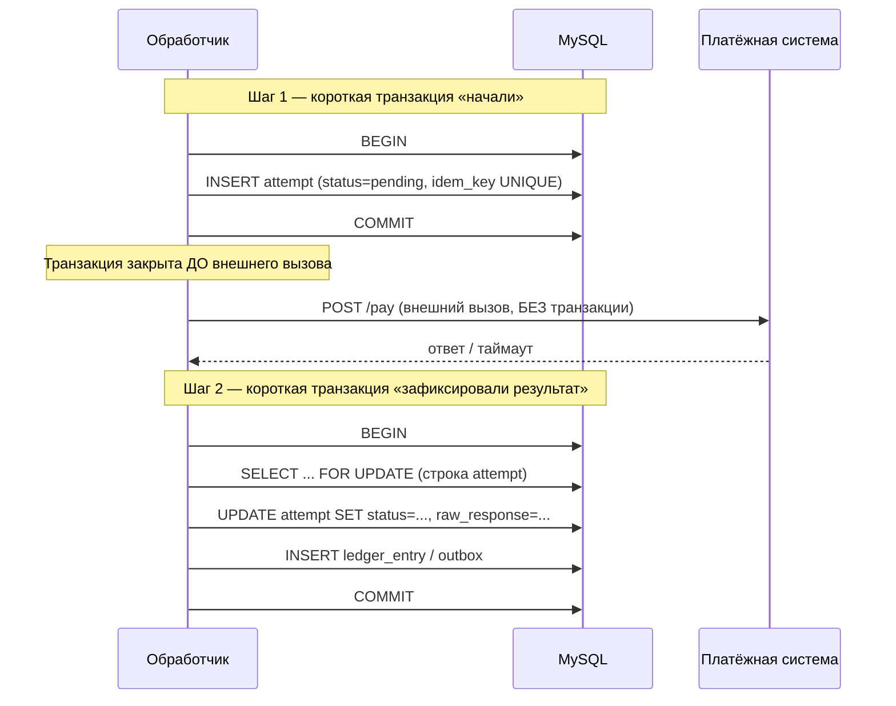
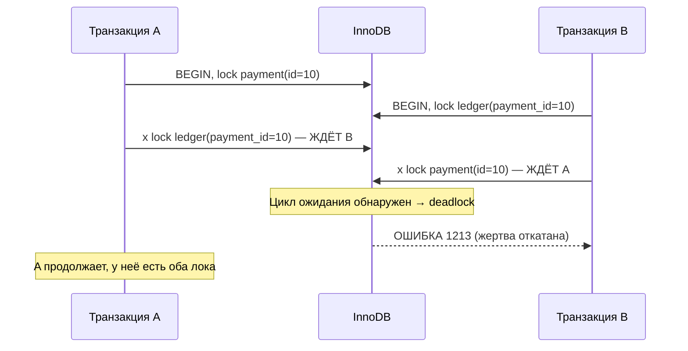
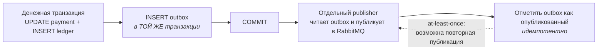

# 02. Транзакции в PHP: PDO, блокировки, дедлоки, идемпотентность

> **Что проверяют.** Вакансия буквально: «особенно важно хорошо разбираться в транзакциях».
> Проверяют не «знаю слово ACID», а: умеешь ли ты **ограничить область транзакции**,
> **не держать локи на внешних вызовах**, **ловить и переигрывать дедлоки** и
> **делать повторную обработку безопасной**.
>
> Здесь: конфигурация PDO, паттерны транзакций, блокировочные чтения, дедлоки и retry,
> идемпотентная вставка через UNIQUE, outbox в транзакции, тестирование. В конце —
> рабочий код обработчика вебхука и задачи с разбором.

---

## 1. Конфигурация PDO, которая обязательна для денег

```php
<?php
declare(strict_types=1);

$pdo = new PDO(
    'mysql:host=mysql;port=3306;dbname=billing;charset=utf8mb4',
    $user,
    $pass,
    [
        // 1. Ошибки — исключения. Без этого проверять результат каждого вызова руками = пропущенные ошибки.
        PDO::ATTR_ERRMODE => PDO::ERRMODE_EXCEPTION,

        // 2. Настоящие подготовленные запросы, а не подстановка строк PDO у себя в клиенте.
        //    С эмуляцией: типы не проверяются, `LIMIT ?` ведёт себя странно, и есть
        //    исторические риски инъекции через кодировку.
        PDO::ATTR_EMULATE_PREPARES => false,

        // 3. Не приводить всё к строкам: BIGINT должен прийти int, а DECIMAL — строкой.
        PDO::ATTR_STRINGIFY_FETCHES => false,

        // 4. Явный режим изоляции на сессию — чтобы не зависеть от глобальных настроек сервера.
        //    Для денежных операций обычно READ-COMMITTED + явные FOR UPDATE.
        PDO::MYSQL_ATTR_INIT_COMMAND => "SET SESSION TRANSACTION ISOLATION LEVEL READ COMMITTED",

        // 5. Таймауты: без них «залипший» запрос держит локи и превращается в инцидент.
        PDO::ATTR_TIMEOUT => 5,
    ]
);
```

**Почему каждое из этого важно для биллинга:**

| Настройка | Что будет без неё |
|---|---|
| `ERRMODE_EXCEPTION` | проверка `if ($stmt === false)` забывается → операция «прошла», а данные не записались |
| `EMULATE_PREPARES = false` | типы приводятся неточно, `LIMIT ?` подставляется строкой, риск предсказуемости поведения |
| `STRINGIFY_FETCHES = false` | `int` приходит строкой, сравнение `===` ломается, `SUM` ведёт себя сюрпризом |
| явный уровень изоляции | сервер может стоять на `REPEATABLE-READ` → внезапные gap-локи и дедлоки на INSERT |
| таймаут | один запрос держит локи → очередь ожиданий → каскадный инцидент |

> **Готовый тезис:** «Уровень изоляции я задаю явно на сессию, а не надеюсь на дефолт
> сервера. В MySQL дефолт — `REPEATABLE READ`, и он даёт gap-локи на диапазонных
> запросах; для денежных операций мне нужно контролируемое поведение, поэтому
> `READ COMMITTED` + явный `SELECT ... FOR UPDATE` по строке.»

---

## 2. Область транзакции: главное правило биллинга

### Правило первое: транзакция = только БД, никаких внешних вызовов

```php
// ❌ ПЛОХО: внешний вызов внутри транзакции
$pdo->beginTransaction();
$pdo->exec("UPDATE payment SET status='processing' WHERE id={$id}");   // лок взят!
$pspResponse = $http->post('https://psp/pay', $payload);               // 3 секунды, а то и 30!
$pdo->exec("UPDATE payment SET status='paid' WHERE id={$id}");
$pdo->commit();
```

Что здесь не так (это готовый ответ на «расскажи, как не надо»):

1. **Лок держится всё время сетевого вызова.** Если PSP отвечает 30 секунд — 30 секунд
   заблокирована строка, а при `REPEATABLE READ` и диапазонном апдейте — диапазон.
   Параллельные вебхуки встают в очередь, `innodb_lock_wait_timeout` истекает, посыпались 500.
2. **Внешний вызов нельзя откатить.** Если после вызова транзакция откатится (например, из-за
   дедлока), деньги в PSP уже списаны, а у нас нет следа. Получили «деньги есть, записи нет».
3. **Транзакция становится длинной** → растёт undo-лог, MVCC не может убрать версии строк,
   буферный пул забивается.

### Правило второе: «внешний вызов → запись» делается в два шага с состоянием



**Вывод вслух:** «Транзакция должна быть короткой: она защищает **изменение состояния в БД**,
а не «всю операцию целиком». Внешний вызов живёт между двумя транзакциями, а связность
обеспечивается статусом и идемпотентным ключом, а не долгим локом.»

### Правило третье: транзакция не «размазывается» по слоям

Плохо: контроллер делает `beginTransaction`, потом вызывает три сервиса, один из которых
тоже логирует и коммитит. Хорошо: **транзакцией владеет прикладной слой (use case)**, и
все репозитории принимают уже готовое соединение.

```php
final class AcceptPaymentUseCase
{
    public function __construct(
        private readonly PDO $pdo,
        private readonly PaymentRepository $payments,
        private readonly LedgerRepository $ledger,
        private readonly OutboxRepository $outbox,
    ) {}

    public function __invoke(AcceptPayment $cmd): void
    {
        $this->pdo->beginTransaction();
        try {
            $payment = $this->payments->findForUpdate($cmd->paymentId); // SELECT ... FOR UPDATE
            $payment->markPaid(new \DateTimeImmutable(), $cmd->pspTxnId);
            $this->payments->save($payment);
            $this->ledger->postBalancedEntries($payment);               // проводки
            $this->outbox->enqueue('receipt.requested', $payment->id()); // событие в той же транзакции
            $this->pdo->commit();
        } catch (\Throwable $e) {
            $this->pdo->rollBack();
            throw $e;
        }
    }
}
```

---

## 3. Блокирующие чтения: `FOR UPDATE`, `FOR SHARE`, `NOWAIT`, `SKIP LOCKED`

В биллинге почти всегда есть «проверить и изменить», а это гонка. Решается блокировкой чтения.

```sql
BEGIN;

-- Основной инструмент: блокируем ИМЕННО эту строку до конца транзакции
SELECT id, status, amount_minor
  FROM payment
 WHERE id = 12345
   FOR UPDATE;
-- Проверяем status в PHP, затем UPDATE. Никто другой не сможет влезть между.

UPDATE payment SET status = 'paid' WHERE id = 12345;
COMMIT;
```

| Конструкция | Что берёт | Зачем в биллинге |
|---|---|---|
| `FOR UPDATE` | эксклюзивный лок на строки (+ gap при RR) | «проверил статус → изменил» без гонки. Основной инструмент |
| `FOR SHARE` (бывший `LOCK IN SHARE MODE`) | shared-лок | Читать, не давая изменить другим (например, проверка баланса перед списанием). Применять осторожно: дедлоки с `FOR UPDATE` |
| `FOR UPDATE NOWAIT` | эксклюзивный, **ошибка вместо ожидания** | Когда ждать нельзя: второй параллельный обработчик должен быстро отвалиться, а не стоять в очереди |
| `FOR UPDATE SKIP LOCKED` | эксклюзивный, **пропускает занятые строки** | Идеально для **очереди в БД**: несколько воркеров разбирают разные строки. MySQL 8+ |
| `LOCK TABLES` | табличный | ❌ не использовать. Это старый инструмент, он ломает конкурентность и не нужен в InnoDB |

**Классическая задача-очередь на `SKIP LOCKED`** (спросят почти наверняка, потому что это
ствол обработки вебхуков/чеков):

```sql
-- Воркер: взять одну задачу, которую ещё никто не взял
BEGIN;
SELECT id, payload
  FROM job
 WHERE status = 'new'
 ORDER BY id
 LIMIT 1
   FOR UPDATE SKIP LOCKED;

-- если строка получена:
UPDATE job SET status = 'processing', locked_by = :worker, locked_at = NOW() WHERE id = :id;
COMMIT;
```

Отличие от «просто занять задачу»: без `SKIP LOCKED` воркеры стоят в очереди на первой
занятой строке и не могут разобрать остальные — очередь обрабатывается последовательно,
хотя воркеров десять. С `SKIP LOCKED` каждый берёт свою.

**Ловушка, о которой обязательно сказать:** `NOWAIT`/`SKIP LOCKED` — про **конкурентность**,
но не про порядок. Если порядок важен (обработка событий одного платежа строго по порядку),
нужен ключ партиции / один воркер на ключ, а не MySQL-локи.

---

## 4. Дедлоки: откуда берутся, как разбирать, как переигрывать

### Как дедлок возникает (и почему его нельзя «убрать навсегда»)

Дедлок — это **не баг БД**, а нормальный результат конкурентного доступа. InnoDB его
обнаруживает и **откатывает одну из транзакций** (жертву), чтобы система продолжала работать.
Значит: система обязана **уметь переигрывать** транзакцию. Именно это, а не «победить
дедлоки навсегда», — правильный ответ.



### Как разбирать на живом инциденте

```sql
-- 1. Кто ждёт кого прямо сейчас
SELECT * FROM performance_schema.data_lock_waits;
SELECT * FROM performance_schema.data_locks;

-- 2. Настройки, влияющие на поведение
SHOW VARIABLES LIKE 'innodb_lock_wait_timeout';    -- по умолчанию 50 сек — слишком много
SHOW VARIABLES LIKE 'transaction_isolation';
SHOW ENGINE INNODB STATUS\G   -- раздел LATEST DETECTED DEADLOCK: два запроса, локи, порядок
```

**Алгоритм разбора (готовый ответ):**

1. Найти в `SHOW ENGINE INNODB STATUS` `LATEST DETECTED DEADLOCK`. Там видно **два** запроса
   и что каждый из них лочил.
2. Понять, **что общего**: обычно одинаковые строки, взятые **в разном порядке** — и почти
   всегда из-за неиндексированного `UPDATE`/`SELECT ... WHERE`, который вместо строки лочит
   **диапазон**.
3. Исправления по приоритету:
   * **Индекс** под `WHERE` — чтобы лок был точечный, а не диапазонный (самая частая и самая
     полезная правка).
   * **Единый порядок захвата** локи во всём коде: например, всегда сначала `payment`,
     потом `ledger_entry`. Это правило уровня команды, а не одного запроса.
   * **Короткие транзакции** (см. §2) — меньше окно для пересечения.
   * **`SKIP LOCKED`/`NOWAIT`** там, где конкуренция ожидаема (очереди).
   * И только после этого — переигрывание как страховка.

### Retry на дедлоки — обязательная часть денежного кода

```php
<?php
declare(strict_types=1);

/**
 * Выполняет денежную операцию с переигровкой на временных ошибках InnoDB.
 *
 * 1213 / SQLSTATE 40001 — deadlock
 * 1205 / SQLSTATE 40001 — lock wait timeout
 *
 * ВАЖНО: переигрывать можно ТОЛЬКО идемпотентную операцию. Если с побочными эффектами
 * (отправка письма, вызов PSP) — они должны быть вынесены наружу через outbox.
 */
function withDeadlockRetry(PDO $pdo, callable $operation, int $maxAttempts = 5): mixed
{
    $attempt = 0;

    while (true) {
        $attempt++;
        try {
            return $operation();
        } catch (PDOException $e) {
            $isRetryable = $e->errorInfo[1] === 1213        // Deadlock
                || $e->errorInfo[1] === 1205                // Lock wait timeout
                || $e->getCode() === '40001';               // serialization failure

            if (!$isRetryable || $attempt >= $maxAttempts) {
                throw $e;
            }

            // Экспоненциальный backoff с джиттером: без джиттера повторы синхронизируются
            // и снова попадают в дедлок ("thundering herd").
            $sleepMs = (int) min(1000, (2 ** $attempt) * 10 + random_int(0, 25));
            usleep($sleepMs * 1000);

            // Если драйвер уже в транзакции — её надо снять, иначе следующий BEGIN упадёт
            if ($pdo->inTransaction()) {
                $pdo->rollBack();
            }
        }
    }
}

// Использование:
withDeadlockRetry($pdo, function () use ($pdo, $useCase, $cmd) {
    $pdo->beginTransaction();
    try {
        $result = $useCase->run($cmd);   // вся логика внутри — идемпотентна
        $pdo->commit();
        return $result;
    } catch (\Throwable $e) {
        if ($pdo->inTransaction()) {
            $pdo->rollBack();
        }
        throw $e;
    }
});
```

**Что тут важно проговорить вслух:**

* Дедлок — **временная** ошибка, а не «ошибка логики». Правильная реакция — повторить.
* Retry должен применяться **на всю транзакцию**, а не на отдельный запрос (иначе получишь
  частично применённые изменения).
* Backoff с **джиттером** обязателен, иначе десять повторов снова столкнутся.
* Retry безопасен только для **идемпотентной** операции — иначе повтор создаст дубль.
* Побочные эффекты наружу — только через **outbox**: их нельзя переигрывать вместе с транзакцией.

---

## 5. Идемпотентность в базе: UNIQUE вместо `if`

Это фундамент повторной обработки. Правило: **идемпотентность обеспечивает ограничение БД,
а не проверка в коде.**

```sql
-- Таблица попыток/событий: уникальный внешний идентификатор
CREATE TABLE processed_event (
  id          BIGINT UNSIGNED NOT NULL AUTO_INCREMENT,
  source      VARCHAR(32)     NOT NULL COMMENT 'psp|ofd|internal',
  event_id    VARCHAR(128)    NOT NULL COMMENT 'ID события от внешней системы',
  payload_hash CHAR(64)       NOT NULL,
  processed_at DATETIME(6)    NOT NULL,
  PRIMARY KEY (id),
  UNIQUE KEY uq_source_event (source, event_id)   -- ← вот здесь идемпотентность
) ENGINE=InnoDB;
```

Два способа безопасно «съесть» событие ровно один раз:

```php
// Вариант A: собственный ключ идемпотентности от клиента/ПС
$pdo->beginTransaction();
try {
    $stmt = $pdo->prepare(
        'INSERT INTO payment (idempotency_key, amount_minor, currency, status, created_at)
         VALUES (:key, :amount, :cur, "pending", NOW(6))'
    );
    $stmt->execute(['key' => $key, 'amount' => $amount, 'cur' => $cur]);
} catch (PDOException $e) {
    if ($e->errorInfo[1] !== 1062) {     // 1062 = Duplicate entry
        throw $e;
    }
    // Повтор! Ничего не создаём, читаем существующий платёж и возвращаем его же ответ.
    // ВАЖНО: повторный запрос должен вернуть ТОТ ЖЕ результат, что и первый,
    // иначе клиент увидит разные ответы на одинаковые запросы.
}
$pdo->commit();
```

```sql
-- Вариант B: "займи место" одной командой (атомарно, без гонки)
INSERT INTO processed_event (source, event_id, payload_hash, processed_at)
VALUES ('psp', :event_id, :hash, NOW(6))
ON DUPLICATE KEY UPDATE id = id;         -- ничего не делаем, но узнаём о дубле

-- Проверяем affected_rows:
--   1 → вставилось (первый раз) → обрабатываем
--   0 → было (дубль)            → пропускаем
--   2 → было и "обновилось"     → (в этом варианте не бывает, т.к. UPDATE id=id)
```

| Способ | Плюс | Минус |
|---|---|---|
| `INSERT` + ловить 1062 | явно, сразу видно | исключение как поток управления (спорно, но практично) |
| `INSERT ... ON DUPLICATE KEY UPDATE id=id` + `rowCount()` | одна команда, без исключений | надо помнить про семантику `rowCount()` (1 = insert, 0 = дубль) |
| `INSERT IGNORE` | просто | **глотает ВСЕ ошибки**, включая несовпадение типов и NOT NULL — опасно для денег |
| `SELECT` + `INSERT` | «читаемо» | **гонка**: два запроса пройдут проверку одновременно. Нельзя для денег |

> **Тезис:** «Проверка `SELECT` + `INSERT` — это классическая гонка. Идемпотентность держится
> уникальным ключом: либо вставка падает с дублем, либо `ON DUPLICATE KEY`. `INSERT IGNORE`
> в денежных таблицах не использую, потому что он скрывает ошибки, а не только дубли.»

### А что, если вебхук пришёл, а платёж уже `paid`, но с другим `event_id`?

Внешняя система может прислать два разных события про один и тот же факт («paid» и «captured»).
Тогда уникального `event_id` мало. Нужен второй уровень — **машина состояний**: обработчик
смотрит текущий статус и решает, является ли переход допустимым.

```php
enum PaymentStatus: string {
    case Pending = 'pending';
    case Paid    = 'paid';
    case Refunded = 'refunded';
    case Failed  = 'failed';

    /** Переход допустим? Идемпотентность на уровне модели, а не только на уровне event_id. */
    public function canTransitionTo(self $next): bool
    {
        return match ($this) {
            self::Pending  => in_array($next, [self::Paid, self::Failed], true),
            self::Paid     => $next === self::Refunded,
            self::Refunded, self::Failed => false,
        };
    }
}
```

Полная модель — в `06-reliability/01-idempotency-state-machines.md`.

---

## 6. Outbox: как не «потерять» событие и не «отправить» дважды

Проблема: нужно одновременно (а) изменить данные и (б) отправить сообщение/событие.
Двухфазно это не сделать атомарно (RabbitMQ и MySQL — разные системы).



Почему это правильно:

* Нет окна «данные изменили, а событие потеряли» — они в одной транзакции.
* Если публикация упала — outbox содержит запись и publisher повторит.
* Может быть **повторная** публикация (после сбоя между «опубликовал» и «отметил») — это
  штатно, консьюмер идемпотентен (см. §5).

```sql
CREATE TABLE outbox (
  id           BIGINT UNSIGNED NOT NULL AUTO_INCREMENT,
  event_type   VARCHAR(64)     NOT NULL,
  aggregate_id BIGINT UNSIGNED NOT NULL,
  payload      JSON            NOT NULL,
  created_at   DATETIME(6)     NOT NULL,
  published_at DATETIME(6)     NULL,
  attempts     SMALLINT UNSIGNED NOT NULL DEFAULT 0,
  PRIMARY KEY (id),
  KEY idx_unpublished (published_at, id)   -- publisher выбирает "не опубликованные" через этот индекс
) ENGINE=InnoDB;
```

Вариант чтения publisher-ом — через `SKIP LOCKED`, чтобы несколько publisher-ов не мешали друг другу:

```sql
BEGIN;
SELECT id, event_type, payload
  FROM outbox
 WHERE published_at IS NULL
 ORDER BY id
 LIMIT 100
   FOR UPDATE SKIP LOCKED;
-- ... публикуем, UPDATE ... SET published_at = NOW(6); COMMIT;
```

---

## 7. Транзакции и тесты

Три приёма, которые стоит упомянуть (это признак, что ты писал тесты на денежный код):

### 7.1. Обёртка теста в транзакцию с откатом

```php
protected function setUp(): void
{
    $this->pdo->beginTransaction();      // тест работает внутри транзакции
}

protected function tearDown(): void
{
    $this->pdo->rollBack();              // данные не остаются в БД
}
```

**Ограничения, о которых надо знать:** DDL в MySQL вызывает неявный commit — то есть миграции
в такой тест не влезут. И тест **не увидит** часть поведения, связанного с реальными коммитами
(например, дедлоки между двумя соединениями: внутри одного соединения дедлока не будет).

### 7.2. Тест идемпотентности — то, что реально проверяют

```php
public function testWebhookProcessedTwiceCreditsOnlyOnce(): void
{
    $this->payments->create(paymentId: 1, amountMinor: 10000, status: 'pending');
    $event = new PspWebhook(eventId: 'evt-777', paymentId: 1, status: 'paid');

    $this->handler->handle($event);
    $this->handler->handle($event);      // тот же вебхук второй раз

    self::assertSame('paid', $this->payments->status(1));
    self::assertSame(10000, $this->ledger->totalCreditMinor(1));   // НЕ 20000
    self::assertSame(1, $this->outbox->countByType('receipt.requested')); // чек один
}
```

### 7.3. Тест гонки (два соединения)

```php
public function testTwoParallelHandlersDoNotDoubleCredit(): void
{
    $connA = $this->newConnection();
    $connB = $this->newConnection();

    // Обе "одновременно" пытаются обработать один платёж.
    // Ожидаем: одна проходит, вторая получает блокировку/дубль и не меняет баланс.
    ...
}
```

Это тяжело и требует двух реальных соединений к БД — но именно такие тесты ловят «двойное
зачисление», а не юнит-тесты с моками.

---

## 8. Полный пример: обработчик вебхука платёжной системы

Соберём всё вместе — это тот код, который стоит показать/рассказать на собеседовании.

```php
<?php
declare(strict_types=1);

final class PspWebhookHandler
{
    public function __construct(
        private readonly PDO $pdo,
        private readonly SignatureVerifier $verifier,
        private readonly PspStatusMapper $mapper,
    ) {}

    /**
     * Требования:
     *  1. Проверить подпись (иначе любой может «оплатить» себе что угодно).
     *  2. Обработать событие РОВНО один раз (event_id + UNIQUE).
     *  3. Короткая транзакция, без внешних вызовов внутри.
     *  4. Событие для чека — в outbox, в той же транзакции.
     *  5. Ответить быстро и не падать на неизвестном статусе.
     */
    public function handle(array $rawPayload, string $signatureHeader): void
    {
        // 1. Подпись — ДО любой работы с БД.
        if (!$this->verifier->isValid($rawPayload, $signatureHeader)) {
            throw new UnauthorizedWebhookException();
        }

        $event = PspWebhook::fromArray($rawPayload);

        withDeadlockRetry($this->pdo, function () use ($event) {
            $this->pdo->beginTransaction();
            try {
                // 2. Отмечаем событие как увиденное. Дубль → выходим молча с 200.
                $stmt = $this->pdo->prepare(
                    'INSERT INTO processed_event (source, event_id, payload_hash, processed_at)
                     VALUES ("psp", :eid, :hash, NOW(6))
                     ON DUPLICATE KEY UPDATE id = id'
                );
                $stmt->execute(['eid' => $event->eventId, 'hash' => $event->hash()]);
                if ($stmt->rowCount() === 0) {
                    $this->pdo->commit();      // дубль — считаем обработанным
                    return;
                }

                // 3. Блокируем строку платёжа; ждать не больше 3 секунд.
                $stmt = $this->pdo->prepare(
                    'SELECT id, status, amount_minor, currency
                       FROM payment
                      WHERE id = :id
                        FOR UPDATE'
                    // Вариант для «не ждать»: добавь NOWAIT и обрабатывай исключение как 409/retry-later
                );
                $stmt->execute(['id' => $event->paymentId]);
                $payment = $stmt->fetch() ?: throw new PaymentNotFoundException($event->paymentId);

                $next = $this->mapper->map($event->pspStatus);   // маппинг статусов ПС → наши

                // 4. Идемпотентность на уровне состояния: повторный "paid" ничего не делает.
                if ($payment['status'] === 'paid' && $next === PaymentStatus::Paid) {
                    $this->pdo->commit();
                    return;
                }
                if (!$this->isAllowedTransition($payment['status'], $next)) {
                    // Неизвестный или недопустимый переход — не падаем, а фиксируем для разбора.
                    $this->logUnknownTransition($payment['id'], $payment['status'], $event->pspStatus);
                    $this->pdo->commit();
                    return;
                }

                // 5. Меняем состояние денег и пишем проводки.
                $this->pdo->prepare(
                    'UPDATE payment SET status = :s, psp_txn_id = :t, paid_at = NOW(6) WHERE id = :id'
                )->execute(['s' => $next->value, 't' => $event->pspTxnId, 'id' => $payment['id']]);

                // Двойная запись: дебет/кредит внутренних счетов (см. 05-billing-domain/01-domain-map.md)
                $this->postLedgerEntries($payment, $event);

                // 6. Событие для фискализации — в ТОЙ ЖЕ транзакции (outbox).
                $this->pdo->prepare(
                    'INSERT INTO outbox (event_type, aggregate_id, payload, created_at)
                     VALUES ("receipt.requested", :id, :payload, NOW(6))'
                )->execute(['id' => $payment['id'], 'payload' => json_encode([...])]);

                $this->pdo->commit();
            } catch (\Throwable $e) {
                if ($this->pdo->inTransaction()) {
                    $this->pdo->rollBack();
                }
                throw $e;
            }
        });
    }
}
```

**Разбор этого кода вслух — готовый блок (2 минуты):**

> «Здесь пять решений, каждое осознанное.
> **Первое:** подпись проверяется до БД. Без неё эндпоинт, принимающий „платёж прошёл“,
> это дыра размером с кассу.
> **Второе:** идемпотентность на `processed_event.event_id` — уникальный ключ. Дубль вебхука
> просто выходит с 200 и ничего не делает. Это ограничение БД, а не проверка в коде, поэтому
> гонка невозможна.
> **Третье:** `SELECT ... FOR UPDATE` по строке платежа — чтобы два параллельных события
> по одному платежу не решили одновременно, что можно перевести в `paid`. Лок точечный,
> по первичному ключу.
> **Четвёртое:** состояние проверяется по машине переходов, а не по одному «if status != paid».
> Внешняя система может прислать события в другом порядке или повторно — это
> штатная ситуация, а не исключение.
> **Пятое:** событие для чека уходит в `outbox` в той же транзакции. То есть невозможно
> состояние „деньги зачислены, а задача на чек не поставлена“. Фискализация — внешний
> вызов, поэтому она не может жить внутри этой транзакции.
>
> И сверху — `withDeadlockRetry`: дедлок это временная ошибка, транзакцию надо переиграть
> с backoff и джиттером, а не отдавать 500 клиенту.»

---

## 9. Задачи с разбором

### Задача 1. «Два вебхука об одном платеже пришли одновременно. Что произойдёт?»

**Разбор:** без защиты — оба прочитают `status='pending'`, оба переведут в `paid`, оба создадут
проводки → двойное зачисление. С `FOR UPDATE` — второй ждёт, потом видит `paid` и по машине
состояний ничего не делает. **Ответ должен прозвучать так:** «гонка решается локом на строку
плюс проверкой допустимости перехода, а не проверкой перед вставкой.»

### Задача 2. «Дедлок раз в час ночью. Что делать?»

**Разбор (по приоритету):** (1) `SHOW ENGINE INNODB STATUS` → найти два запроса; (2) почти
наверняка один из них делает `UPDATE ... WHERE status = 'new'` без индекса → диапазонный лок;
(3) добавить композитный индекс, чтобы лок был точечный; (4) зафиксировать единый порядок
захвата локи в коде; (5) retry на 1213 как страховка. **Обязательно** сказать, что retry —
это страховка, а не решение: если дедлоки ежечасные, значит есть структурная проблема.

### Задача 3. «`innodb_lock_wait_timeout` истёк на обработке платежа. Что вернуть клиенту?»

**Разбор:** это `unknown`-ish ситуация: мы не знаем, применилась ли транзакция — но в InnoDB
timeout означает **откат нашей транзакции**, значит изменений нет. Правильный ответ:
вернуть серверу/ПС «повторите» (в терминах HTTP — 5xx с ретраем, для вебхука — 500, чтобы
ПС повторил; для клиента — «попробуйте позже» и статус `pending`). Никогда не отвечать
«успех» на неизвестный результат. И наоборот — не отвечать ПС «успех», если не применили.

### Задача 4. «Нужно 30 000 операций досчитать за ночь. Как?»

**Разбор:** batch-обработка с `SKIP LOCKED`, короткие транзакции по N строк, идемпотентность,
метрика прогресса, ограничение параллелизма. Нельзя: одна транзакция на 30 000 строк
(undo-лог, локи, блокировки репликации) и нельзя «просто `while` без батча» — будет
долгая блокировка и деградация для онлайн-трафика.

### Задача 5. «Как безопасно выполнить миграцию, пока идёт трафик?»

**Разбор:** это `02-mysql/03-migrations-and-partitioning.md`. Короткий ответ: expand/contract —
добавляем новое, пишем в оба места, бэкфилл батчами, переключаем чтение, удаляем старое
отдельным релизом. Плюс: не менять тип колонки большой таблицы «в один DDL».

---

## 10. Красные флаги в этой теме

* ❌ «Начинаю транзакцию и внутри делаю HTTP-запрос к ПС» (самое частое и самое плохое).
* ❌ «Проверяю, что записи нет, и если нет — вставляю» (гонка).
* ❌ «Оборачиваю всё в транзакцию, включая отправку сообщений» (нельзя, разные системы).
* ❌ «Дедлок — значит база плохая». Дедлок — нормальный сигнал конкуренции, нужен retry.
* ❌ «`INSERT IGNORE` для идемпотентности» (скрывает все ошибки).
* ❌ Не знать, что `SELECT` внутри `REPEATABLE READ` в MySQL **не блокирует**, а вот
  `FOR UPDATE` блокирует, и что без индекса лок становится диапазонным.
* ❌ Retry без джиттера и без ограничения количества попыток.

## Чек-лист по этому файлу

- [ ] Знаю полный набор настроек PDO для денежного кода (4 ключевые).
- [ ] Могу объяснить, почему внешние вызовы не живут внутри транзакции, и как это обойти.
- [ ] Помню разницу `FOR UPDATE` / `NOWAIT` / `SKIP LOCKED` и где какой нужен.
- [ ] Могу назвать 4 причины дедлока и порядок их устранения.
- [ ] Пишу retry с backoff + джиттер и объясняю, почему он безопасен только для идемпотентных операций.
- [ ] Объясняю outbox и почему событие пишется в той же транзакции.
- [ ] Могу написать тест, который доказывает отсутствие двойного зачисления.
