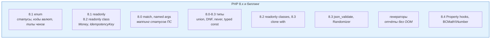

# 03. PHP 8 для биллинга: enum, readonly, match, типы, генераторы

> **Что проверяют.** Вакансия — «основной биллинг написан на PHP 8». Значит, от тебя ждут
> современный PHP, а не PHP 5.6 в обёртке из фреймворка. Но спрашивать будут **не фичи ради фич**,
> а: умеешь ли ты выразить доменные инварианты средствами языка, чтобы деньги нельзя было
> испортить по невнимательности.
>
> Здесь: что реально нужно биллингу из 8.0–8.4, готовые паттерны (статусы, валюты, VO,
> строковые ID), генераторы для отчётов, и подборка подводных камней с задачами.

---

## 1. Карта: что из PHP 8 реально нужно биллингу



---

## 2. `enum` — базовая единица биллинга

Статус платежа, тип чека, код валюты, способ расчёта — это **не строки**, а перечисления.
Смысл: компилятор/PHP-анализатор ловит опечатку, а IDE подсказывает варианты.

```php
<?php
declare(strict_types=1);

enum PaymentStatus: string
{
    case Created  = 'created';
    case Pending  = 'pending';
    case Paid     = 'paid';
    case Refunded = 'refunded';
    case Failed   = 'failed';

    /** Терминальные статусы: из них перехода нет */
    public function isFinal(): bool
    {
        return match ($this) {
            self::Paid, self::Refunded, self::Failed => true,
            self::Created, self::Pending             => false,
        };
    }

    /** Переход вперёд: единственный источник правды о том, что допустимо */
    public function canTransitionTo(self $next): bool
    {
        return match ($this) {
            self::Created  => $next === self::Pending || $next === self::Failed,
            self::Pending  => $next === self::Paid    || $next === self::Failed,
            self::Paid     => $next === self::Refunded,
            self::Refunded, self::Failed => false,
        };
    }

    /** Для отображения пользователю — не в БД, а в интерфейсе */
    public function label(): string
    {
        return match ($this) {
            self::Created  => 'Создан',
            self::Pending  => 'Ожидает оплаты',
            self::Paid     => 'Оплачен',
            self::Refunded => 'Возврат',
            self::Failed   => 'Не прошёл',
        };
    }
}
```

**Что важно проговорить:**

* **Backed enum** (`: string`) хранится в БД как строка — читаемо в консоли и устойчиво
  к перестановке case-ов (в отличие от `int`).
* **Восстановление из БД — только через `tryFrom()`**, никогда через `from()`, если значение
  приходит из внешней системы:

```php
// ❌ from() бросит ValueError на любом новом статусе от ПС → обработка вебхука упадёт
$status = PaymentStatus::from($pspPayload['status']);

// ✅ tryFrom() → null → обрабатываем как "неизвестный статус" и не теряем событие
$status = PaymentStatus::tryFrom($pspPayload['status']);
if ($status === null) {
    $this->logger->warning('Unknown psp status', ['raw' => $pspPayload['status']]);
    return;  // событие фиксируем, платёж не трогаем, алерт на разбор
}
```

Это **не придирка**: новые статусы у платёжных систем появляются без предупреждения, и
вебхук, падающий на незнакомом статусе, роняет весь канал обработки.

* Enum-ы с методами = «умное перечисление». Плохо: `switch` по строкам в четырёх местах
  проекта. Хорошо: правила перехода живут в одном месте.
* Нельзя наследовать enum; для «расширяемых справочников» (виды услуг, предметы расчёта)
  нужна **таблица в БД**, а не enum — это важное различие, часто спрашивают:
  «что ты сделаешь enum-ом, а что таблицей?». Ответ: **фиксированный набор технических
  значений — enum; бизнес-справочник, который меняется без релиза — таблица.**

```php
enum Currency: string
{
    case RUB = 'RUB';
    case USD = 'USD';
    case EUR = 'EUR';
    case KZT = 'KZT';

    /** Экспонента минорных единиц (ISO 4217). См. 01-php/01-money-precision-php.md */
    public function exponent(): int
    {
        return match ($this) {
            self::RUB, self::USD, self::EUR, self::KZT => 2,
        };
    }
}
```

---

## 3. `readonly`, promoted constructor, `clone with` — язык для Value Object

```php
// PHP 8.0: promoted properties (короче, меньше опечаток в конструкторе)
// PHP 8.1: readonly (нельзя переприсвоить после инициализации)
// PHP 8.2: readonly class (все свойства readonly — идеально для VO)
// PHP 8.3: clone with (новый объект с одним изменённым свойством)

final readonly class PaymentId
{
    public function __construct(public string $value)
    {
        if (!preg_match('/^pay_[0-9a-f]{32}$/', $value)) {
            throw new InvalidArgumentException("Bad payment id: {$value}");
        }
    }

    public static function generate(): self
    {
        return new self('pay_' . bin2hex(random_bytes(16)));
    }

    public function equals(self $other): bool
    {
        return $this->value === $other->value;
    }
}

/** Иммутабельная сущность: любое изменение — новый объект */
final readonly class PaymentState
{
    public function __construct(
        public PaymentId $id,
        public PaymentStatus $status,
        public Money $amount,
        public ?string $pspTxnId = null,
    ) {}

    /** "Изменение" = возврат НОВОГО объекта: никто не сможет поменять состояние "на месте" */
    public function markPaid(string $pspTxnId): self
    {
        if (!$this->status->canTransitionTo(PaymentStatus::Paid)) {
            throw new IllegalStateTransition($this->status, PaymentStatus::Paid);
        }
        return clone($this, ['status' => PaymentStatus::Paid, 'pspTxnId' => $pspTxnId]); // PHP 8.3
        // В PHP < 8.3: return new self($this->id, PaymentStatus::Paid, $this->amount, $pspTxnId);
    }
}
```

**Почему это не «синтаксический сахар», а техника безопасности:**

| Механизм | Что предотвращает в биллинге |
|---|---|
| `readonly` | «кто-то по пути поменял сумму платежа» — это уже было причиной инцидентов в реальных системах |
| `final` класс | наследование VO с переопределением поведения → неожиданные деньги |
| Валидация в конструкторе | сумма/ID в «недопустимом» состоянии не может существовать вообще |
| `clone($obj, ['field' => ...])` (8.3) | изменение без ручного перечисления всех полей (меньше шанс забыть поле) |
| Возврат нового объекта вместо мутации | «состояние до» и «состояние после» можно сравнить, залогировать, показать в аудите |

---

## 4. `match`, named arguments, `never` — читаемость в маппингах

Биллинг — это на 40% **маппинги**: статусы ПС → наши, коды ошибок → наши, виды услуг →
параметры фискализации. Здесь `match` строго лучше `switch` (строгое сравнение `===`,
обязательное покрытие через `UnhandledMatchError`).

```php
final class PspStatusMapper
{
    /** Строгое сопоставление без "проваливания" (fallthrough) и без loose === */
    public function map(string $pspStatus): ?PaymentStatus
    {
        return match (strtolower($pspStatus)) {
            'success', 'paid', 'captured', 'completed' => PaymentStatus::Paid,
            'pending', 'processing', 'authorized'      => PaymentStatus::Pending,
            'declined', 'error', 'canceled'            => PaymentStatus::Failed,
            'refunded', 'reversed'                     => PaymentStatus::Refunded,
            default                                    => null,   // ← НЕ бросаем: неизвестный статус это норма
        };
    }
}
```

**Не используй `match` без `default`** в маппинге внешних данных — иначе новый статус от ПС
даст `UnhandledMatchError` и уронит обработку. `match` без `default` хорош там, где набор
**закрыт** (например, `match ($currency)` по enum).

```php
// named arguments: полезно для «флагов с неясным смыслом»
$refund = $this->refundService->create(
    paymentId: $id,
    amount: $money,
    reason: RefundReason::CustomerRequest,
    notifyCustomer: true,        // видно на месте вызова, что это значит
);
```

```php
// never (8.1): гарантирует, что функция не возвращает управление — только бросает
function fail(string $message): never
{
    throw new BillingException($message);
}

// Полезно, чтобы PHPStan/Psalm не ругался и чтобы явно выразить "здесь поток заканчивается"
```

---

## 5. Типы, которые нужны в денежном коде

| Возможность | Версия | Где в биллинге |
|---|---|---|
| Union types (`int\|string`) | 8.0 | парсинг сумм на границе (вход из JSON) |
| `?Type` вместо `Type = null` | 8.0 | «курс может отсутствовать» (не мультивалютная операция) |
| `mixed`/`never` | 8.0/8.1 | явная неопределённость вместо «нетипизированно» |
| `DNF`-типы (`(A&B)\|null`) | 8.2 | редко; в примерах интерфейсов |
| `readonly class` | 8.2 | Value Objects (`Money`, `PaymentId`, `IdempotencyKey`) |
| Typed class constants (`const string X = ...`) | 8.3 | константы лимитов/кодов |
| `json_validate()` | 8.3 | до сохранения raw-ответа ПС проверять, что это вообще JSON |
| `Randomizer` (`\Random\Randomizer`) | 8.2 | генерация nonce/idempotency-ключей, устойчивая случайность |
| Override-атрибут `#[\Override]` | 8.3 | гарантия, что ты реально переопределяешь метод интерфейса |
| Property hooks | 8.4 | «вычисляемые» поля без геттеров; **не** для персистентных сущностей |
| `BCMath\Number`, `bcround()` | 8.4 | объектный API для точной арифметики, нативная функция округления |

**Про `declare(strict_types=1)`** — в денежном коде обязательна:

```php
<?php
declare(strict_types=1);   // без него '150' превратится в 150 молча, а 150.7 в 150 с предупреждением
```

И сравнения:

```php
$amount = '15000';                  // из БД строка
if ($amount == $expected) { }       // ❌ loose: '15000' == '15000abc'? исторические сюрпризы
if ((int) $amount === $expected) {} // ✅ явное приведение + строгое сравнение
```

**Важное правило:** приводить типы **на границе** (при чтении из БД, из JSON, из HTTP),
а внутри домена работать уже с правильными типами (`int` минорные единицы, enum, VO).
Не «размазывать» `(int)`-касты по бизнес-логике.

---

## 6. Генераторы: отчёты без OOM

Биллинг регулярно строит выгрузки: за день, за месяц, реестр для бухгалтерии. `fetchAll()`
на миллионе строк = падение по памяти. Генератор решает.

```php
/**
 * Потоковая выгрузка операций за период: память O(1) от размера выборки.
 */
function streamLedgerEntries(PDO $pdo, string $from, string $to): \Generator
{
    // Важно: НЕ буферизуем. С mysqlnd unbuffered query + батчи по 1000.
    $pdo->setAttribute(PDO::MYSQL_ATTR_USE_BUFFERED_QUERY, false);

    $stmt = $pdo->prepare(
        'SELECT id, payment_id, account_id, amount_minor, currency, created_at
           FROM ledger_entry
          WHERE created_at >= :from AND created_at < :to
          ORDER BY id
          LIMIT 100000'
    );
    $stmt->execute(['from' => $from, 'to' => $to]);

    while ($row = $stmt->fetch(PDO::FETCH_ASSOC)) {
        yield $row;
    }
}

// Использование: пишем CSV, не держа всё в памяти
foreach (streamLedgerEntries($pdo, '2025-01-01', '2025-02-01') as $row) {
    fputcsv($out, $row);
}
```

**Правило для больших выгрузок:** не `fetchAll()`, а генератор + **keyset-пагинация** по `id`
(`WHERE id > :lastId ORDER BY id LIMIT 1000`). Почему не `OFFSET`: на больших смещениях MySQL
просматривает и отбрасывает все предыдущие строки — выгрузка становится квадратичной.

---

## 7. Атрибуты: метаданные вместо рефлексии руками

```php
/** Параметры фискализации для вида услуги — привязка правила к классу, а не if-рассылка */
#[\Attribute(\Attribute::TARGET_CLASS)]
final readonly class FiscalRules
{
    public function __construct(
        public int $paymentSubjectType,   // тег ФФД (предмет расчёта), см. 05-billing-domain/03-receipts-54fz.md
        public int $paymentMethodType,    // признак способа расчёта
        public int $vatRate,              // ставка НДС
        public bool $agent,               // агентский признак
    ) {}
}

#[FiscalRules(paymentSubjectType: 4, paymentMethodType: 4, vatRate: 20, agent: false)]
final class ContactAccessService {}   // "доступ к контактам"
```

Атрибуты полезны там, где метаданные **не меняются без релиза**. Если меняются — в таблицу БД
(см. §2 про enum vs справочник). Это тоже готовый тезис для собеседования.

---

## 8. Подводные камни PHP, о которых спрашивают на биллинге

| Тема | Проблема | Правильно |
|---|---|---|
| Числовые строки в массивах | PHP 8 изменил сравнение `0 == 'abc'`, но `in_array` без `true` всё ещё loose | Всегда `in_array($x, $list, true)` |
| `switch` | loose-сравнение (`case '0'`) | `match` или `strict`-проверки |
| `array_key_exists` vs `isset` | `isset` вернёт `false` для `null`, что важно в маппингах | Знать разницу; для «ключа нет» — `array_key_exists` |
| `sort`/`asort` на деньгах | сортировка строковых сумм даёт `'100' < '99'` | сортировать числа, а не строки; или `SORT_NUMERIC` |
| `json_decode(..., true)` | большие целые → float (нужен `JSON_BIGINT_AS_STRING`) | Для сумм: `json_decode($j, true, flags: JSON_BIGINT_AS_STRING)` |
| `float` из `DECIMAL` | `(float)'150.05'` может дать `150.04999999` | Не конвертировать; работать строкой/Bcmath |
| `str_pad`/форматирование | нули и знак теряются | Единый форматтер в `Money` |
| `date`/`DateTime` | `NOW()` в БД и `new DateTime()` в PHP в разных TZ | Всегда UTC в БД, единая функция «теперь» |
| `microtime` в логах | невозможно сопоставить с БД `NOW(6)` | Использовать `DATETIME(6)` и UTC, писать и туда, и туда |
| `mysqli`/`PDO` автокоммит | «случайно не в транзакции» → частичные записи | Явный `inTransaction()`-контроль в денежных use case-ах |
| `error_reporting`/`display_errors` | предупреждение «float to int» проглочено | Логировать все предупреждения; в проде они должны быть видны |

---

## 9. Задачи с разбором

### Задача 1. «Платёжная система добавила новый статус `partially_captured`. Обработка упала. Что не так в коде?»

**Разбор:** почти наверняка `PaymentStatus::from($pspStatus)` (бросает `ValueError`) или
`match` без `default` (бросает `UnhandledMatchError`). Правильно: `tryFrom()` + `null` +
логирование + алерт + **не ронять обработку**. Дополнительно: событие надо сохранить
как «неизвестное» для разбора, а не выбросить — иначе потеряешь факт оплаты.

### Задача 2. «Нужно отдать выгрузку за год — миллион строк. Как не упасть?»

**Разбор:** генератор + keyset-пагинация (`WHERE id > :last`), unbuffered query, стрим в файл,
никакого `fetchAll()`. Плюс: генерировать выгрузку в фоне (не в HTTP-запросе), отдавать
ссылку по готовности, ограничить параллелизм.

### Задача 3. «Что сделаешь enum-ом, а что таблицей в БД?»

**Разбор:** enum — только **закрытые технические** наборы: статус платежа, статус чека,
код валюты, тип события. Таблица — всё, что может меняться без релиза: виды услуг, тарифы,
ставки НДС, предметы расчёта, юрлица, ККТ. Критерий: **если маркетинг/бухгалтерия может
попросить «добавьте вариант» — это таблица.** Если ответ «только разработчик с релизом» — enum.
Это ровно тот принцип, из которого следует вывод «правила фискализации — в данные, а не в `if`»
(см. `00-vacancy/02-profiru-billing-domain.md` §4).

### Задача 4. «Как гарантировать, что сумму нельзя случайно изменить?»

**Разбор:** `Money` как `readonly` VO с валидацией в конструкторе, только фабрики, никаких
публичных мутаторов; изменение — новый объект; плюс `declare(strict_types=1)` и статический
анализ (PHPStan/Psalm на уровне 8+), чтобы «тихое» приведение типов не прошло.

### Задача 5. «Данные из `json_decode` — `150.05` превратилось в `150.05` (float). Что делать?»

**Разбор:** деньги в JSON передаются **строкой или минорными единицами**, это контракт.
Если мы получаем float от внешней системы, то: (а) немедленно переводим в строку с
фиксированной точностью (`number_format($f, 2, '.', '')` — но помним, что float мог быть
изначально неточен), (б) сверяем с суммой в отчёте ПС, (в) в своём API отдаём минорные единицы.

---

## 10. Ответ вслух (90 секунд)

> «PHP 8 в биллинге я использую не ради синтаксиса, а чтобы инварианты держались типами.
> Статусы, валюты, типы чеков — это `enum` с методами: правила переходов живут в одном месте,
> а не размазаны `switch`-ами. Распознавание статусов от внешней системы — **только через
> `tryFrom`**, потому что новый статус от ПС не должен ронять обработку вебхука; неизвестное
> логируем и разбираем, но не теряем событие.
>
> Денежные объекты — `readonly` Value Objects с валидацией в конструкторе: сумму нельзя
> «случайно поменять», изменение — это новый объект, а значит состояние можно сравнить
> и залогировать.
>
> Маппинги статусов — `match` со `default`, потому что набор внешних статусов не закрыт.
> Строгие типы включены везде, приведение — на границе, а не в бизнес-логике.
>
> И отдельно про большие данные: выгрузки на миллион строк я делаю генераторами с
> keyset-пагинацией, а не `fetchAll` — иначе OOM.»

---

## Красные флаги в этой теме

* ❌ `PaymentStatus::from($externalStatus)` — падает на новом статусе.
* ❌ `switch` со строками для статусов вместо enum/match.
* ❌ «`readonly` — это просто модно» (без связи с инвариантами и аудитом).
* ❌ `in_array` без `true`, `==` для денег.
* ❌ `fetchAll()` для отчётов.
* ❌ Предлагать enum для видов услуг (бизнес-справочник должен быть в БД).

## Чек-лист по этому файлу

- [ ] Могу показать enum со статусами и методом `canTransitionTo`.
- [ ] Знаю, что внешний статус читается через `tryFrom`, и объясняю почему.
- [ ] Могу написать `Money` как `readonly` VO с валидацией и фабриками.
- [ ] Помню критерий «enum или таблица».
- [ ] Умею отдать выгрузку генератором с keyset-пагинацией.
- [ ] Готов ответ про приведение типов на границе + `strict_types`.
