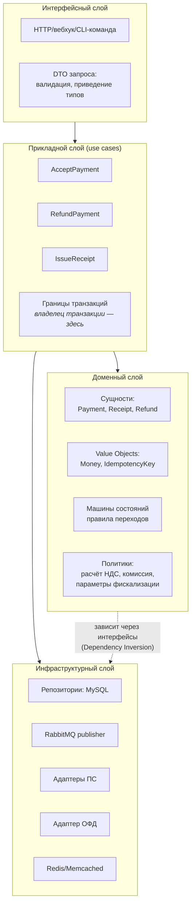
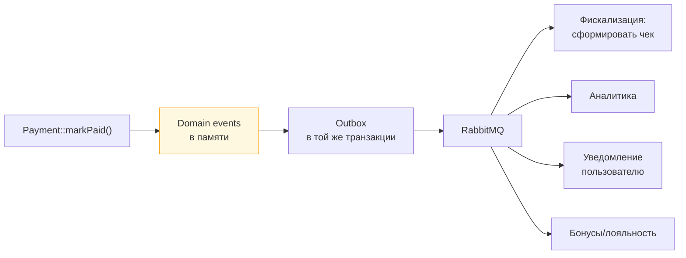

# 04. ООП, SOLID и слои биллинга: где что живёт

> **Что проверяют.** Не «знаешь ли ты буквы SOLID», а: умеешь ли ты **разложить биллинг на слои
> так, чтобы новый вид услуги или новый платёжный провайдер добавлялся без правки ядра**.
> Вакансия прямо говорит: «готовить платформу к новым продуктам, чтобы новую логику чеков,
> налоговой отчётности и платёжных сценариев можно было добавлять быстрее и проще».
>
> Здесь: схема слоёв, паттерны под конкретные расширения (провайдеры, чеки, статусы),
> примеры кода «до и после», и как про это говорить без догматизма.

---

## 1. Слои биллинга: кто за что отвечает



**Правила, которые стоит проговорить:**

| Слой | Что можно | Что нельзя |
|---|---|---|
| Интерфейсный | валидация входа, приведение типов, аутентификация вебхука, формирование ответа | бизнес-логика, обращение к БД напрямую |
| Прикладной | оркестрация: «сначала проверить, потом зачислить, потом поставить чек»; **границы транзакций** | знать про SQL/HTTP-детали; правила переходов |
| Доменный | инварианты, расчёты, правила; **чистый PHP** | зависимости от PDO, HTTP, логгеров, фреймворка |
| Инфраструктурный | SQL, HTTP-клиенты, маппинг внешних форматов | бизнес-правила («если сумма > X, то…») |

> **Зачем это биллингу, а не «красиво»:** доменный слой без инфраструктуры **тестируется
> мгновенно** — можно проверить «НДС считается правильно» и «частичный возврат невозможен
> для неподтверждённого платежа» без БД и без моков HTTP. В денежном коде скорость тестов —
> это возможность закрывать много кейсов, а не роскошь.

---

## 2. Strategy + Adapter: новые платёжные системы

Вакансия обещает «подключение новых платёжных систем». Это ровно задача на оба паттерна.

```php
/** Наш внутренний контракт. Ни один ПС-специфичный тип здесь не появляется. */
interface PaymentProvider
{
    public function code(): PaymentProviderCode;               // enum: Sbp, Card, Wallet...
    public function supports(PaymentMethodCode $method): bool;

    /** Создать платёж; вернуть НАШУ модель, а не ответ провайдера */
    public function createPayment(CreatePaymentRequest $request): ProviderPaymentResult;

    /** Спросить фактический статус — обязательно для сверки и для таймаутов */
    public function getStatus(ProviderPaymentId $id): ProviderPaymentState;

    /** Возврат. Может быть полный или частичный. */
    public function refund(ProviderRefundRequest $request): ProviderRefundResult;

    /** Разобрать и проверить вебхук: подпись + приведение к нашей модели.
     *  Возвращает null, если подпись невалидна. */
    public function parseWebhook(RawWebhook $raw): ?ProviderWebhook;
}
```

Затем — **адаптер** на каждый ПС. Он делает три вещи: преобразование формата, подпись,
маппинг статусов и ошибок.

```php
final class SbpProviderAdapter implements PaymentProvider
{
    public function __construct(
        private readonly HttpClient $http,
        private readonly SbpSignature $signature,
        private readonly SbpStatusMapper $mapper,       // внешние статусы → наш enum
    ) {}

    public function code(): PaymentProviderCode { return PaymentProviderCode::Sbp; }

    public function createPayment(CreatePaymentRequest $r): ProviderPaymentResult
    {
        $response = $this->http->post('/payments', [
            'amount'     => $r->amount->amountMinor,     // минорные единицы, как требует СБП
            'currency'   => $r->amount->currency->value,
            'order'      => $r->paymentId->value,        // наш id как ключ идемпотентности
            'return_url' => $r->returnUrl,
        ], headers: $this->signature->headers($r));

        // ВАЖНО: наружу отдаём НАШУ модель — код наверху не должен знать про 'qrId', 'state' и т.д.
        return new ProviderPaymentResult(
            providerPaymentId: new ProviderPaymentId($response['qrId']),
            state: $this->mapper->map($response['state']),
            payloadForUser: $response['payload'],
        );
    }
    // ...
}
```

**Сборка нужного провайдера — фабрика/реестр, а не `if`:**

```php
final class PaymentProviderRegistry
{
    /** @param PaymentProvider[] $providers */
    public function __construct(private readonly array $providers) {}

    public function forCode(PaymentProviderCode $code): PaymentProvider
    {
        foreach ($this->providers as $p) {
            if ($p->code() === $code) {
                return $p;
            }
        }
        throw new UnsupportedProviderException($code);
    }

    public function forMethod(PaymentMethodCode $method): PaymentProvider
    {
        foreach ($this->providers as $p) {
            if ($p->supports($method)) {
                return $p;
            }
        }
        throw new UnsupportedMethodException($method);
    }
}
```

**Что это даёт (и что сказать вслух):**

* Новый провайдер = **новый класс** + регистрация. Ядро обработки платежа не меняется вообще.
* Все `if ($provider === 'sbp')` исчезают.
* Каждый адаптер тестируется **контрактным тестом**: один и тот же набор кейсов (таймаут,
  дубликат, «неизвестный статус», кривая подпись) прогоняется по всем провайдерам.
  Это самый убедительный ответ на вопрос «как вы гарантируете, что новый ПС не сломает логику».

```php
/** Контрактный тест: применяется ко ВСЕМ реализациям PaymentProvider */
abstract class PaymentProviderContractTest extends TestCase
{
    abstract protected function provider(): PaymentProvider;

    public function testGetStatusNeverThrowsOnUnknownStatus(): void
    {
        $state = $this->provider()->getStatus(new ProviderPaymentId('xxx'));
        self::assertInstanceOf(ProviderPaymentState::class, $state);   // а не исключение
    }

    public function testRefundTwiceIsIdempotent(): void { /* ... */ }
    public function testWebhookWithBadSignatureReturnsNull(): void { /* ... */ }
}
```

---

## 3. Strategy: правила фискализации как данные + полиморфизм

Здесь ключевая мысль из `00-vacancy/02-profiru-billing-domain.md` §4: правила чеков не должны
быть `if` в создании платежа.

### «До» (как обычно бывает в легаси)

```php
// ❌ Разрастается с каждым новым видом услуги
if ($serviceType === 'contact_access') {
    $receipt = ['subject' => 4, 'method' => 4, 'vat' => 20];
} elseif ($serviceType === 'promotion') {
    $receipt = ['subject' => 4, 'method' => 4, 'vat' => 0, 'agent' => false];
} elseif ($serviceType === 'subscription') {
    // аванс! нужен отдельный чек на зачёт...
} elseif ($serviceType === 'partner_service') {
    // агентская схема...
}
```

### «После»: две стратегии и справочник

```php
/** Что нужно знать, чтобы сформировать чек по конкретной операции */
final readonly class FiscalPolicy
{
    public function __construct(
        public PaymentSubjectType $subject,        // предмет расчёта (ФФД)
        public PaymentMethodType $method,          // признак способа расчёта
        public VatRate $vatRate,                   // ставка НДС
        public AgentInfo $agent,                   // агентский признак
        public SettlementMoment $moment,           // сразу / при оказании услуги (аванс → зачёт)
    ) {}
}

/** Где взять политику для операции */
interface FiscalPolicyResolver
{
    public function resolve(ServiceCode $service, LegalEntityId $entity, \DateTimeImmutable $at): FiscalPolicy;
}

final class ConfigurableFiscalPolicyResolver implements FiscalPolicyResolver
{
    public function __construct(
        private readonly ServiceFiscalConfigRepository $configs,   // ← справочник в БД
        private readonly LegalEntityRoutes $routes,                // какое юрлицо/ККТ обслуживает услугу
    ) {}

    public function resolve(ServiceCode $service, LegalEntityId $entity, \DateTimeImmutable $at): FiscalPolicy
    {
        $config = $this->configs->findEffective($service, $entity, $at)   // версионируемая настройка
            ?? throw new FiscalConfigMissing($service, $entity);

        return new FiscalPolicy(
            subject: $config->subjectType,
            method:  $config->methodType,
            vatRate: $config->vatRate,
            agent:   $config->agent,
            moment:  $config->moment,
        );
    }
}

/** А вот полиморфизм — там, где РАЗНАЯ МЕХАНИКА, а не разные параметры */
interface ReceiptBuilder
{
    public function supports(FiscalPolicy $policy): bool;
    public function build(ReceiptRequest $request, FiscalPolicy $policy): ReceiptDraft;
}

final class SimplePaymentReceiptBuilder implements ReceiptBuilder { /* приход за услугу */ }
final class AdvancePaymentReceiptBuilder implements ReceiptBuilder { /* аванс (предоплата) */ }
final class AdvanceOffsetReceiptBuilder implements ReceiptBuilder { /* зачёт аванса */ }
final class AgentCommissionReceiptBuilder implements ReceiptBuilder { /* агентское вознаграждение */ }
final class RefundReceiptBuilder implements ReceiptBuilder { /* возврат прихода */ }
```

**Разница, которую надо объяснить** (это профессиональный уровень):

* **Разные параметры одного документа** → стратегия через **данные/конфиг** (`FiscalPolicy`).
  Добавить новый вид услуги = добавить запись в справочник. Ретест ядра не нужен.
* **Разные виды документов с разной механикой** → полиморфизм (`ReceiptBuilder`).
  Добавить новую механику = новый класс, старые не трогаются.

> **Готовая формулировка:** «Я разделяю два случая. Если отличие — в параметрах фискализации,
> я не пишу `if`, а храню параметры как данные и версионирую их: тогда новый вид услуги —
> это конфигурация плюс тест, а не релиз ядра. Если отличие — в механике (аванс против
> зачёта аванса, агентская схема), это уже разные билдеры и полиморфизм. Смешивать эти
> два случая — как раз путь к неприподдерживаемому легаси.»

---

## 4. State: машина состояний вместо россыпи `if`

Платёж, чек и возврат — это объекты с жизненным циклом. Правила переходов должны жить в
одном месте (см. `06-reliability/01-idempotency-state-machines.md`), но реализованы могут быть
по-разному.

```php
// Вариант, который я рекомендую в биллинге: таблица переходов в модели, без "объектов-состояний".
// Причина: переходов мало, они стабильны, а State-классы на каждый статус добавляют
// церемонию без пользы на этом масштабе.
final class PaymentStateMachine
{
    private const TRANSITIONS = [
        'created'  => ['pending', 'failed'],
        'pending'  => ['paid', 'failed'],
        'paid'     => ['refunded'],
        'refunded' => [],
        'failed'   => [],
    ];

    public function apply(Payment $payment, PaymentStatus $next, \DateTimeImmutable $at): Payment
    {
        $allowed = self::TRANSITIONS[$payment->status()->value] ?? [];
        if (!in_array($next->value, $allowed, true)) {
            throw new IllegalStateTransition($payment->status(), $next);
        }
        return $payment->withStatus($next, $at);
    }
}
```

**Когда стоит усложнить до классов-состояний:** если в статусе появляется поведение
(например, «в статусе `disputed` можно принимать частичные возвраты, а в `paid` — нельзя,
и правила различаются по видам услуг»). Тогда — полиморфизм. До этого — таблица.

**Отдельно: почему НЕ «State» на каждый чих.** Это и есть «обсуждать решения без упора
в правоту»: признать, что паттерн уместен не всегда, и аргументировать цену:

| Вариант | Плюс | Цена |
|---|---|---|
| Таблица переходов | всё правило в одном экране, легко читать и тестировать | при усложнении логики внутри статуса становится «if-ферма» |
| Классы-состояния | поведение инкапсулировано, легко добавлять правила | 5–10 классов, больше точек навигации, для нового человека сложнее |
| Обе крайности | — | рассадник непоследовательности |

---

## 5. Repository + Unit of Work + Domain Events

```php
interface PaymentRepository
{
    public function find(PaymentId $id): ?Payment;

    /** Блокирующее чтение для «проверил → изменил» */
    public function findForUpdate(PaymentId $id): ?Payment;

    public function save(Payment $payment): void;

    /** Поиск по ключу идемпотентности — для повторных запросов */
    public function findByIdempotencyKey(IdempotencyKey $key): ?Payment;
}
```

**Важные правила для денежного репозитория:**

1. `findForUpdate` — **явный** метод, а не «магический» флаг. Читающий код должен видеть,
   что он берёт лок.
2. `save` — идемпотентный: `INSERT ... ON DUPLICATE KEY UPDATE` или `UPDATE` по id; повтор
   не создаёт дубль.
3. Поиск, который используется в горячем пути (`findByIdempotencyKey`), обязан опираться
   на **уникальный индекс**, а не на `LIKE`/сканирование (см. `02-mysql/01-innodb-indexes.md`).
4. Никаких «репозиториев на всё» с 40 методами. Репозиторий — это доступ к агрегату,
   а отчётные выборки — отдельные read-модели/запросы.

**Domain Events** — способ, чтобы новая логика «встраивалась без правки ядра»:

```php
// Ядро лишь фиксирует факт: "платёж принят". Кто на это реагирует — не его дело.
$payment->recordThat(new PaymentPaid($payment->id()->value, $payment->amount(), $at));
```



**Но осторожно, и это важный тезис:** события — не замена явной логике в денежном пути.
Критичный путь (зачисление) должен быть **явным и читаемым**; события — для **побочных**
реакций (чек, уведомление, аналитика). Если «перевод денег» размазан по пяти обработчикам
событий, реконструировать поведение системы становится невозможно. Формулировка:

> «Явное — для денег, событийное — для следствий. Пользователь должен видеть в одном
> методе, как формируется проводка. А вот чек, письмо и аналитика — подписчики.»

---

## 6. Код «до и после»: мини-кейс целиком

**Задача:** добавили третий вид услуги — «подписка на пакет откликов». В легаси пришлось
править 6 мест: расчёт цены, чек, отчётность, возврат, лимиты, аналитику.

**Что делает «до»:**

```php
class BillingService {
    public function pay(int $userId, int $serviceType, int $amount, string $psp) {
        // 380 строк, из них 6 мест с if ($serviceType === ...)
    }
}
```

**Что делает «после»:**

```php
final class PayForServiceUseCase
{
    public function __construct(
        private readonly PDO $pdo,
        private readonly PaymentRepository $payments,
        private readonly ServiceCatalog $catalog,            // цена и правила по коду услуги
        private readonly FiscalPolicyResolver $fiscal,
        private readonly PaymentProviderRegistry $providers,
        private readonly OutboxRepository $outbox,
    ) {}

    public function __invoke(PayForService $cmd): PaymentId
    {
        $service = $this->catalog->byCode($cmd->serviceCode);          // ← новый вид услуги = запись в каталоге
        $price   = $service->priceFor($cmd->userContext);               // ← правила цены внутри услуги
        $policy  = $this->fiscal->resolve($cmd->serviceCode, ...);      // ← правила чека как данные
        $provider = $this->providers->forMethod($cmd->method);          // ← новый ПС = новый адаптер

        $this->pdo->beginTransaction();
        try {
            $payment = Payment::create($cmd->idempotencyKey, $price, $policy); // домен: инварианты
            $this->payments->save($payment);
            $init = $provider->createPayment(CreatePaymentRequest::fromPayment($payment, $service));
            $payment->attachProvider($init->providerPaymentId);
            $this->payments->save($payment);
            $this->outbox->enqueue(ReceiptRequested::fromPayment($payment, $policy)); // чек — следствие
            $this->pdo->commit();
            return $payment->id();
        } catch (\Throwable $e) {
            if ($this->pdo->inTransaction()) $this->pdo->rollBack();
            throw $e;
        }
    }
}
```

**Что изменилось при добавлении третьего вида услуги:** ничего в этом классе. Добавили
запись в каталог (цена), запись в конфиг фискализации (правила чека), и, если нужна
особая механика, — новый `ReceiptBuilder`. **Это и есть ответ на вопрос «что значит
„добавлять логику быстрее и проще““.**

---

## 7. Как говорить про SOLID на биллинге (без догматизма)

| Принцип | Что он реально значит в биллинге | Пример ложного применения (красный флаг) |
|---|---|---|
| **S** — единственная ответственность | обработка вебхука не считает НДС и не рисует PDF | дробление на 20 классов с одним методом каждый, навигация невозможна |
| **O** — открыт/закрыт | новый ПС = новый класс; правила фискализации = данные | абстракция «на будущее» для вещей, которые никогда не меняются |
| **L** — подстановка | все адаптеры проходят один контрактный тест | `SbpAdapter` бросает исключение там, где другие возвращают результат |
| **I** — разделение интерфейсов | `PaymentProvider` не тянет методы выплат, если умеет только приём | интерфейс из 20 методов, реализованный заглушками |
| **D** — инверсия зависимостей | домен не знает про PDO и HTTP; инфраструктура — за интерфейсом | интерфейс ради интерфейса, когда реализация одна и меняться не будет |

> **Хорошая формулировка для собеседования:** «Я применяю SOLID там, где есть **ожидаемая
> изменчивость**. В биллинге она очевидна в трёх местах: платёжные провайдеры (добавляются),
> виды услуг и правила чеков (меняются внешними требованиями) и налоговые ставки/режимы
> (меняются законом). Всё остальное — простой прямой код. Модный паттерн в месте, которое
> не меняется, — это не архитектура, а стоимость.»

**И перечислять вслух, где абстракция уже НЕ нужна** — это то самое «обсуждать решения без
упора в правоту»: интерфейс с одной реализацией допустим, если это **граница с внешним миром**
(её всё равно будут мокать в тестах), и не нужен, если это внутренний расчёт.

---

## 8. Мини-задачи

### Задача 1. «Класс 2000 строк обрабатывает всё: вебхуки, чеки, возвраты. Что сделаешь?»

**Разбор:** сначала не рефакторить, а **выписать сценарии**: какие use cases внутри, что
общего, где состояние. Затем выделить границы (use case на каждый сценарий), вытащить
правила (фискализация → данные), провайдеров → адаптеры. И обязательный шаг: **тесты-характеристики**
до рефакторинга, чтобы поведение не изменилось незаметно.

### Задача 2. «Как добавить четвёртый вид услуги за один день?»

**Разбор:** если правила фискализации в данных — добавить запись в справочник + тест;
если механика новая — новый билдер + регистрация. Плюс: параметр «момент расчёта»
(сразу / при оказании) уже поддержан, значит новый вид услуги не потребует правок в ядре.
Если это невозможно — значит абстракция построена неправильно, и это и есть «большой рефакторинг».

### Задача 3. «Нужно, чтобы при оплате отправлялось письмо, обновлялась аналитика и учитывались лимиты. Как не превратить платёж в свалку?»

**Разбор:** денежное ядро — явное. Всё остальное — подписчики на событие через outbox.
Но **лимиты** — не подписчик: если лимит может отклонить платёж, он часть денежного
решения и должен проверяться внутри транзакции (иначе гонка: два платежа одновременно
прошли проверку лимита). Письмо и аналитика — точно подписчики.

### Задача 4. «Есть интерфейс с одной реализацией. Оставить?»

**Разбор:** зависит от природы. Граница с внешним миром (платёжный провайдер, ОФД) —
оставить: её будут мокать, и провайдеров станет больше. Внутренняя логика с одной
реализацией и без ожидаемых изменений — убрать интерфейс. Правильный ответ содержит
критерий, а не «всегда оставляю/всегда убираю».

---

## Красные флаги в этой теме

* ❌ «Всё должно быть за интерфейсом» без критерия (признак догматизма).
* ❌ «Domain events решают все проблемы» — а в денежном пути молчаливое поведение.
* ❌ `if ($provider === 'sbp')` внутри ядра расчёта.
* ❌ Отсутствие контрактных тестов при нескольких реализациях.
* ❌ Не отличить «отличие в параметрах» (данные) от «отличие в механике» (полиморфизм).

## Чек-лист по этому файлу

- [ ] Могу нарисовать 4 слоя и объяснить, что в каждом можно и что нельзя.
- [ ] Могу написать `PaymentProvider` + адаптер + реестр и объяснить, что ядро не меняется.
- [ ] Объясняю, когда правило → данные, а когда → полиморфизм (ФФД-параметры vs механика аванса).
- [ ] Готов ответ «таблица переходов vs классы-состояния» с ценой каждого варианта.
- [ ] Могу объяснить, что в денежном пути — явно, а что — событиями (и почему лимиты внутри транзакции).
