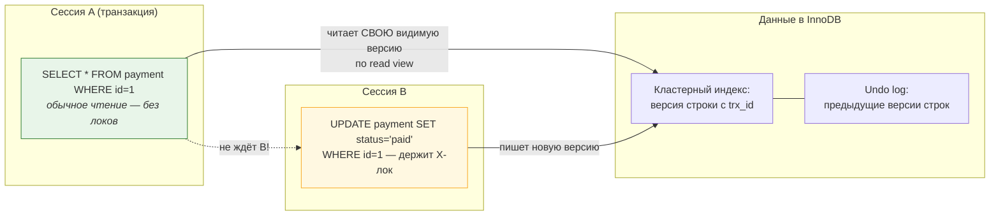
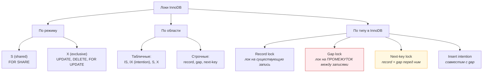
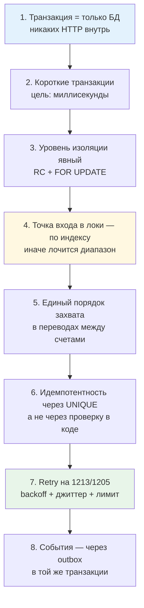

# 02. Транзакции MySQL: изоляция, MVCC, локи, дедлоки

> **Что проверяют.** Это второй «особенно важно» пункт вакансии. Проверяют: знаешь ли ты, что
> MySQL по умолчанию работает на `REPEATABLE READ` **с gap-локами**, что обычный `SELECT`
> не блокирует, а `SELECT ... FOR UPDATE` блокирует, что **дедлок — не баг, а состояние,
> которое надо переигрывать**, и что уровень изоляции влияет на корректность денег.
>
> Здесь: ACID в терминах InnoDB (redo/undo, MVCC), все 4 уровня изоляции с примерами, все
> типы локов InnoDB, воспроизведение дедлока руками, диагностика и правила для биллинга.

---

## 1. ACID в терминах InnoDB (а не в терминах учебника)

| Свойство | Как InnoDB его обеспечивает | Что из этого следует на практике |
|---|---|---|
| **Atomicity** | undo log: до изменения в undo пишется «как было»; при откате применяется обратно | незакоммиченные изменения откатываются при rollback/ошибке/разрыве соединения |
| **Consistency** | ограничения БД (`UNIQUE`, `FOREIGN KEY`, `NOT NULL`, `CHECK`) | **здесь ключ к идемпотентности**: UNIQUE-ключ — механизм консистентности, а не удобство |
| **Isolation** | MVCC (undo-версии + read view) + локи | «читатель не блокирует писателя, писатель не блокирует читателя» — кроме блокирующих чтений |
| **Durability** | redo log + `innodb_flush_log_at_trx_commit` | скорость коммита = f(настройки диска и flush-политики) |

**Про durability и производительность (любят спрашивать):**

```sql
SHOW VARIABLES LIKE 'innodb_flush_log_at_trx_commit';
-- 1 (по умолчанию) = fsync на каждый COMMIT → максимально надёжно, но дорого
-- 2 = запись в ОС-кэш на каждом COMMIT, fsync раз в секунду → быстро, но потеря последней
--     секунды транзакций при падении ОС
-- 0 = fsync раз в секунду → быстро, но можно потерять секунду при краше mysqld
```

> **Готовый ответ:** «Для денег я оставляю `innodb_flush_log_at_trx_commit = 1`. Экономия на
> `fsync` даёт скорость, но теряет подтверждённые транзакции при сбое — а подтверждённый
> платёж потерять нельзя. Если нужна скорость — я лучше уменьшу число транзакций или
> применю пакетную обработку, но не буду ослаблять durability.»

Смежная настройка: `innodb_flush_method=O_DIRECT` (уменьшить двойное буферизование),
`sync_binlog=1` (бинарий синхронно — нужно для точки восстановления без потерь).

---

## 2. MVCC: почему читатель не блокирует писателя



**Как это работает:**

1. При `UPDATE` создаётся **новая версия** строки; старая уходит в `undo log` с пометкой
   «какая транзакция её заменила».
2. Обычный `SELECT` (не `FOR UPDATE`) строит **read view**: набор активных транзакций на
   момент чтения. Дальше он читает ту версию строки, которая была видна **его снапшоту**.
3. Поэтому обычный `SELECT` **ничего не ждёт** и не блокирует.

**И здесь главная ловушка, которую надо произнести вслух:**

> «Обычное чтение в MySQL может отдать **устаревшую** версию строки — ту, что видна снапшоту
> транзакции. Если я проверяю статус платежа обычным `SELECT` и потом делаю `UPDATE`,
> я получаю классическую гонку: два процесса прочитали „pending“, оба решили, что можно
> двигать в „paid“. Поэтому в денежном коде я **не проверяю перед изменением обычным
> чтением** — я использую `SELECT ... FOR UPDATE` или перевожу решение в атомарный
> `UPDATE` с условием.»

### Атомарный UPDATE вместо «прочитал-подумал-записал» — очень сильный приём

```sql
-- ❌ Гонка: между SELECT и UPDATE другой процесс уже перевёл платёж в paid
BEGIN;
SELECT status FROM payment WHERE id = 1;                 -- 'pending'
-- ... логика на стороне PHP ...
UPDATE payment SET status = 'paid', paid_at = NOW(6) WHERE id = 1;
COMMIT;

-- ✅ Переход "условный" и атомарный: если кто-то успел, changes = 0 → мы узнаём об этом
BEGIN;
UPDATE payment
   SET status = 'paid', paid_at = NOW(6)
 WHERE id = 1
   AND status = 'pending';        -- ← условие перехода прямо в UPDATE
-- rowCount(): 1 = применили, 0 = перехода не было (уже paid / не тот статус)
COMMIT;
```

Второй вариант лучше, потому что: (а) нет окна гонки, (б) строка блокируется ровно на время
одного запроса, (в) «кто первый» решает сама БД. А `rowCount() == 0` — это **не ошибка**,
а «событие уже обработано», то есть ответ на повторный вебхук.

**Оговорка, которую ценят:** этот приём подходит, когда решение зависит только от данных
в БД. Если нужно принять решение по данным, которые надо сначала прочитать и посчитать
(например, «хватает ли баланса»), нужен `SELECT ... FOR UPDATE`, — но не обычный `SELECT`.

---

## 3. Уровни изоляции: что реально происходит в MySQL

| Уровень | Грязное чтение | Неповторяющееся чтение | Фантомы | Как реализован в InnoDB |
|---|---|---|---|---|
| `READ UNCOMMITTED` | да | да | да | читает незакоммиченные версии |
| `READ COMMITTED` | нет | да | **нет** (в InnoDB!) | новый read view на **каждый** запрос; блокирующие чтения берут только record-локи (без gap) |
| `REPEATABLE READ` (по умолчанию) | нет | нет | нет | один read view на транзакцию; **next-key locks** (record + gap) → защита от фантомов |
| `SERIALIZABLE` | нет | нет | нет | обычные `SELECT` превращаются в `SELECT ... FOR SHARE` |

**Три важных отличия MySQL от «книжного» поведения:**

1. **`REPEATABLE READ` в InnoDB не допускает фантомов** — в отличие от стандарта SQL. Потому что
   он берёт **next-key locks**. Обратная сторона: **больше локов** и больше дедлоков.
2. **`READ COMMITTED` в InnoDB тоже не допускает фантомов** для обычного чтения, но не из-за
   локов, а потому что... а вот блокирующие чтения в RC берут только record-локи, **без gap**,
   поэтому «прочитать диапазон с блокировкой» в RC не защищает от вставки новой строки в
   диапазон. Это классический вопрос.
3. **`READ COMMITTED` при `UPDATE`/`DELETE` всё равно берёт локи на прочитанные строки**
   (это называется «полу-консистентное чтение» для DML). То есть RC не означает «UPDATE без локов».

### Что выбирать в биллинге

```sql
-- Явно на сессию, чтобы не зависеть от дефолта сервера:
SET SESSION TRANSACTION ISOLATION LEVEL READ COMMITTED;

SET TRANSACTION ISOLATION LEVEL READ COMMITTED;   -- только для следующей транзакции
```

**Аргументация (это и есть ответ «какой уровень изоляции и почему»):**

| Критерий | RC | RR |
|---|---|---|
| Количество локов | меньше (нет gap-локов) | больше (next-key) |
| Дедлоки | реже | чаще |
| Фантомы в обычном чтении | нет | нет |
| «Прочитал-решил-записал» | **небезопасно** обычным чтением | «безопаснее», но только внутри транзакции и с оговорками MVCC |
| Предсказуемость для разработчика | выше: вижу актуальные закоммиченные данные | ниже: могу читать снапшот |
| Кому рекомендуют | большинству веб-приложений и биллингу **с явными локами** | где действительно нужен снапшот на всю транзакцию (отчёты) |

> **Формулировка вслух (держи её готовой):**
> «В биллинге я предпочитаю `READ COMMITTED` плюс **явные** блокирующие чтения там, где я
> принимаю решение о деньгах. Причина: в `REPEATABLE READ` InnoDB добавляет gap-локи, и
> неиндексированный диапазонный `UPDATE` может заблокировать куда больше, чем я думаю.
> А цена явного `FOR UPDATE` по первичному ключу — точечный лок на одну строку. То есть
> я обмениваю „неявную защиту со побочными эффектами“ на „явную и предсказуемую“.
> Но если у меня есть отчётный запрос, которому нужен **один и тот же снапшот** на несколько
> выборок, я сделаю его в `REPEATABLE READ` или вынесу на реплику.»

---

## 4. Локи InnoDB: полная карта



### Табличные локи-намерения

`IS`/`IX` (intention shared/exclusive) ставятся автоматически, когда берётся строчный лок.
Смысл: «в таблице есть строчные локи такого типа». Это позволяет быстро понять, совместим
ли `LOCK TABLES`. В биллинг-коде ты их не ставишь руками, но увидишь в `data_locks`.

### Строчные локи — самое важное

| Тип | Что лочит | Когда берётся | Как влияет |
|---|---|---|---|
| **Record lock** | конкретную запись индекса | `WHERE id = 5 FOR UPDATE`, `UPDATE ... WHERE id=5` | блокирует изменение ровно этой строки |
| **Gap lock** | промежуток между записями (или до первой / после последней) | запрос по диапазону в RR; **в RC не берётся** (кроме случая проверки UNIQUE при INSERT) | **блокирует вставку новых строк в промежуток** — источник неожиданных ожиданий и дедлоков |
| **Next-key lock** | запись + предшествующий gap | по умолчанию в RR при диапазонных условиях | то, что чаще всего даёт дедлоки |
| **Insert intention** | намерение вставить в gap | `INSERT` | совместим с gap-локом (иначе вставки были бы невозможны) |

**Критически важное правило для биллинга:**

```
Если условие запроса не покрыто индексом — InnoDB вынужден лочить ВСЕ прочитанные записи
(и промежутки). То есть «UPDATE payment SET status='x' WHERE status='new'» без индекса по
status в RR лочит ЗНАЧИТЕЛЬНУЮ ЧАСТЬ ТАБЛИЦЫ.
```

Это одновременно: (1) причина дедлоков, (2) причина «всё встало на 30 секунд», (3) ответ на
вопрос «почему в биллинге индекс — это не про скорость, а про корректность и доступность».

### Блокирующие чтения — шпаргалка

```sql
-- 1. Точечный эксклюзивный лок (основной инструмент денежного кода)
SELECT * FROM payment WHERE id = 1 FOR UPDATE;

-- 2. Не ждать: сразу ошибка, если строка занята (для «второй обработчик должен отвалиться»)
SELECT * FROM payment WHERE id = 1 FOR UPDATE NOWAIT;
-- Ошибка: ERROR 3572 (ER_LOCK_NOWAIT) → обрабатываем как «повторить позже»

-- 3. Пропускать занятые строки — идеально для очередей
SELECT id FROM job WHERE status = 'new' ORDER BY id LIMIT 1 FOR UPDATE SKIP LOCKED;

-- 4. Разделяемый лок: читать и запрещать изменение
SELECT * FROM payment WHERE id = 1 FOR SHARE;

-- 5. Готовое «занять строку, если свободна»
--    (в MySQL нет ON CONFLICT DO NOTHING для SELECT, но есть этот приём)
BEGIN;
SELECT id FROM job WHERE status='new' ORDER BY id LIMIT 1 FOR UPDATE SKIP LOCKED;
-- если строка получена → обрабатываем и UPDATE; если нет → все заняты, выход
```

**Про `SKIP LOCKED` и порядок:** `SKIP LOCKED` — про пропускную способность, не про порядок.
Если события одного платежа должны обрабатываться строго последовательно, `SKIP LOCKED`
может переставить их. Для «по порядку на ключ» нужно партиционировать по ключу (один воркер
на ключ) или использовать версионирование/`seq`.

---

## 5. Дедлок: воспроизводим и разбираем руками

### Воспроизведение (сделай это в `12-labs/`, чтобы «почувствовать»)

Сессия A:

```sql
SET SESSION TRANSACTION ISOLATION LEVEL REPEATABLE READ;
BEGIN;
UPDATE account SET balance_minor = balance_minor - 1000 WHERE id = 1;   -- ждёт/держит X(1)
UPDATE account SET balance_minor = balance_minor + 1000 WHERE id = 2;   -- ждёт X(2)
```

Сессия B (в другом соединении):

```sql
SET SESSION TRANSACTION ISOLATION LEVEL REPEATABLE READ;
BEGIN;
UPDATE account SET balance_minor = balance_minor - 500 WHERE id = 2;   -- держит X(2)
UPDATE account SET balance_minor = balance_minor + 500 WHERE id = 1;   -- ЖДЁТ X(1)
```

Обе сессии дадут: `ERROR 1213 (40001): Deadlock found when trying to get lock; try restarting transaction`.

Это **перевод между двумя счетами** — самый частый биллинговый сценарий! И именно поэтому
в банковских системах принято правило: **все переводы выполняются в одном порядке ID**
(например, всегда сначала меньший `account_id`). Это классический ответ на «как избежать
дедлоков при переводах».

```php
// Правильный перевод: единый порядок захвата лока
$first  = min($fromId, $toId);
$second = max($fromId, $toId);

$stmt = $pdo->prepare(
    'SELECT id, balance_minor FROM account WHERE id IN (?, ?) ORDER BY id FOR UPDATE'
);
$stmt->execute([$first, $second]);
// дальше обновляем в любом порядке — локи уже взяты упорядоченно
```

### Диагностика на живом проде

```sql
-- 1. Кто ждёт кого прямо сейчас (MySQL 8)
SELECT
    r.trx_id            AS waiting_trx,
    r.trx_mysql_thread_id AS waiting_thread,
    SUBSTRING(r.trx_query, 1, 80) AS waiting_query,
    b.trx_id            AS blocking_trx,
    b.trx_mysql_thread_id AS blocking_thread,
    SUBSTRING(b.trx_query, 1, 80) AS blocking_query
FROM performance_schema.data_lock_waits w
JOIN information_schema.innodb_trx b ON b.trx_id = w.blocking_engine_transaction_id
JOIN information_schema.innodb_trx r ON r.trx_id = w.requesting_engine_transaction_id;

-- 2. Все локи и что они лочат
SELECT ENGINE_TRANSACTION_ID, OBJECT_NAME, INDEX_NAME, LOCK_TYPE, LOCK_MODE, LOCK_STATUS, LOCK_DATA
  FROM performance_schema.data_locks
 ORDER BY ENGINE_TRANSACTION_ID, LOCK_STATUS DESC;

-- 3. Долгие и подозрительные транзакции
SELECT trx_id, trx_state, trx_started,
       TIMESTAMPDIFF(SECOND, trx_started, NOW()) AS age_sec,
       trx_rows_locked, trx_rows_modified, trx_mysql_thread_id
  FROM information_schema.innodb_trx
 ORDER BY trx_started;

-- 4. Последний дедлок: два запроса, их локи и «жертва»
SHOW ENGINE INNODB STATUS\G     -- секция LATEST DETECTED DEADLOCK

-- 5. Кто кого ждёт и сколько: последний ожидающий запрос
SELECT * FROM sys.innodb_lock_waits;   -- удобное представление (если включён sys schema)
```

**Алгоритм разбора дедлока (готовый ответ на 2 минуты):**

```
1. SHOW ENGINE INNODB STATUS → LATEST DETECTED DEADLOCK
   → вижу ДВА запроса и что каждый лочил (таблица, индекс, данные).
2. Ищу закономерность:
   a. Разные ли ПОРЯДОК обхода строк?  → правило единого порядка захвата.
   b. Есть ли UPDATE/SELECT без подходящего ИНДЕКСА?
      → "LOCK_MODE: X, lock on INDEX: PRIMARY, LOCK_DATA: supremum pseudo-record"
        или множество записей = диапазонный лок = вот причина.
3. Правки ПРО ПОРИТЕТУ:
   1) индекс под условие → лок становится точечным;
   2) единый порядок захвата локи во всём коде;
   3) укоротить транзакцию (убрать из неё внешние вызовы и тяжёлые расчёты);
   4) SKIP LOCKED там, где конкуренция ожидаема (очереди);
   5) retry на 1213 с backoff+джиттер как СТРАХОВКА, а не как решение.
4. Метрика: логировать каждый 1213 с контекстом (какие запросы, какие id),
   сделать дашборд "дедлоков в час". Цель — 0, но система обязана уметь переигрывать.
```

**Обязательная оговорка, которую ценят:** «Дедлок — это механизм защиты InnoDB, а не
авария. Откатать выбранную транзакцию — правильное поведение. Авария — это отсутствие
retry и то, что дедлоки ежечасные.»

### Настройки, влияющие на поведение

```sql
SHOW VARIABLES LIKE 'innodb_lock_wait_timeout';      -- 50 сек по умолчанию — СЛИШКОМ много
SHOW VARIABLES LIKE 'innodb_deadlock_detect';        -- ON: активное обнаружение
SHOW VARIABLES LIKE 'innodb_print_all_deadlocks';    -- ON: писать ВСЕ дедлоки в error log
SHOW VARIABLES LIKE 'transaction_isolation';
SHOW VARIABLES LIKE 'innodb_autoinc_lock_mode';      -- 2 (interleaved) в MySQL 8 — хорошо
```

> **Практика:** `innodb_lock_wait_timeout` для веб-запроса 50 секунд бессмысленен —
> пользователь давно ушёл, а воркер занят. Разумно снизить на уровне приложения/сессии
> (`SET SESSION innodb_lock_wait_timeout = 5`) и обрабатывать 1205 как «повторить позже».
> И включить `innodb_print_all_deadlocks=ON`, чтобы дедлоки не терялись после рестарта.

---

## 6. Транзакции и «долгие» транзакции: почему это опаснее, чем кажется

| Проблема долгой транзакции | Механизм |
|---|---|
| Дикие локи | держит строчные локи всю транзакцию → очереди ожиданий → таймауты |
| Раздувание undo log | MVCC не может удалить старые версии, пока жив read view → undo растёт |
| Раздувание истории/буферного пула | старые версии держат страницы, полезный рабочий набор уменьшается |
| Отставание реплик | большая транзакция применяется на реплике «всё-или-ничего» → лag |
| Невозможность переименовать/изменить | DDL ждёт открытые транзакции |

Диагностика:

```sql
-- Самая старая активная транзакция — сколько живёт?
SELECT trx_id, trx_started, TIMESTAMPDIFF(SECOND, trx_started, NOW()) AS age_sec,
       trx_state, trx_rows_locked, trx_rows_modified, trx_mysql_thread_id
  FROM information_schema.innodb_trx ORDER BY trx_started LIMIT 5;
-- > 60 сек для OLTP-транзакции — уже сигнал; > 300 сек — инцидент

-- Проблемные «спящие в транзакции» соединения: транзакция открыта, а запросов нет
SELECT * FROM sys.innodb_lock_waits;
-- Классика: приложение упало/залипло после BEGIN и не сделало rollback
-- → строка залочена навсегда. Лечится: wait_timeout, killer-скрипт, healthcheck.
```

**И обязательный пункт — «забытая транзакция»:**

```
Сессия: BEGIN; UPDATE payment SET ...;
PHP-процесс упал / завис → транзакция висит, строка залочена.
Пользователь не может оплатить этот заказ; воркер не может обработать платёж.
```

Меры: держать транзакции короткими, оборачивать в try/finally с `rollBack()` (см.
`01-php/02-pdo-transactions.md`), следить за `trx_age`, иметь алерт на транзакции старше
N секунд.

---

## 7. Правила транзакций для биллинга (итоговая карта)



**Расшифровка правила 4 — почему оно важнее всех:** точка входа в локи должна быть
**точечной**. Практические приёмы:

1. Лочить по PK: `WHERE id = ? FOR UPDATE`.
2. Для диапазона — сначала прочитать только id (`SELECT id ... FOR UPDATE` по узкому условию
   с индексом), потом работать по id.
3. Никогда не делать `UPDATE` по неиндексированному полю в транзакции с другими запросами.
4. Для вставки — полагаться на UNIQUE (он блокирует по ключу, то есть точечно).

---

## 8. Задачи с разбором (это ровно то, что спросят)

### Задача 1. «Два обработчика одного вебхука запустились одновременно. Как гарантировать, что зачислится один раз?»

**Разбор (по слоям):**

1. **Уровень уникальности:** `processed_event.event_id UNIQUE` → второй `INSERT` падает с 1062
   или `rowCount()=0` при `ON DUPLICATE KEY`. Это первая линия.
2. **Уровень состояния:** `UPDATE payment SET status='paid' WHERE id=? AND status='pending'`
   → `rowCount()=0` у второго. Это вторая линия (разные `event_id` при одном факте).
3. **Уровень лока:** если нужны сложные проверки (например, лимиты), `SELECT ... FOR UPDATE`
   по строке платежа, потом решение и запись. Третья линия.
4. **И сверху — retry на дедлок**, потому что при такой гонке дедлок возможен.
   **И идемпотентность обязательна, потому что retry может случиться после частичного
   применения? Нет** — откат транзакции отменяет всё. Идемпотентность нужна, потому что
   событие может прийти повторно и потому что retry может выполниться после **успешного**
   применения (если ошибка случилась на этапе ответа).

### Задача 2. «Мы перешли на READ COMMITTED, и теперь в логах появились «неприятные» кейсы: два процесса видят разные данные внутри одной транзакции. Это проблема?»

**Разбор:** Да, это **правильное** поведение RC: снапшот обновляется на каждый запрос.
Опасность — если код полагается на «прочитал один раз, уверен, что не изменится».
Решение: **не полагаться на изоляцию, а явно лочить** то, по данным чего принимается
денежное решение (`FOR UPDATE`). Тогда RC не мешает. Если же нужен стабильный снапшот
для отчёта из нескольких запросов — сделать отчёт в RR или на реплике.

### Задача 3. «`SELECT ... FOR UPDATE` по диапазону дат блокирует вставку новых платежей. Что делать?»

**Разбор:** это gap-локи в RR. Варианты: (1) перейти на `READ COMMITTED` — gap-локи исчезнут;
(2) не блокировать диапазон вообще: взять список id, потом лочить по id; (3) сузить диапазон
индексом, чтобы gap был маленьким; (4) если это «выбор пачки задач» — использовать
`SKIP LOCKED`, чтобы не блокировать друг друга; (5) для отчётов — не использовать
блокирующее чтение вообще.

### Задача 4. «Что произойдёт с параллельными `INSERT` другого платежа, если я сделал `SELECT ... FOR UPDATE` по диапазону?»

**Разбор:** вставляемая строка попадает в **gap**, на который взят next-key lock →
вставка **будет ждать** до конца транзакции. То есть наш «читающий для отчёта» запрос
стопорит приём платежей. Классическая авария. Отсюда правило: **никогда не делать
блокирующее чтение по широкому диапазону на горячей таблице платежей.**

### Задача 5. «Почему `INSERT ... SELECT` может заблокировать таблицу?»

**Разбор:** `INSERT ... SELECT` берёт S-локи на читаемые строки источника (в RC это ослабляется
при определённых условиях). В RR конвертировать легко в широкие локи. Безопаснее:
(1) читать в одно соединение/сессию, вставлять пачками по id; (2) использовать
`READ COMMITTED`; (3) делать бэкфилл батчами через внешний скрипт.

### Задача 6. «Транзакция `UPDATE ... SET balance = balance - 100 WHERE user_id = 42` — сколько строк заблокировано?»

**Разбор:** все строки, подходящие под `user_id = 42`, **при условии что есть индекс по
`user_id`** (тогда — record-локи по этим строкам, и в RR gap-локи вокруг, что может
блокировать вставки новых строк этого пользователя). Без индекса — фактически вся таблица.
**Ключевой вывод:** «баланс» надо хранить в отдельной строке на пользователя, обновлять
точечно по PK (`WHERE id = <account_id>`), а не агрегировать по таблице операций.
Это мостик к дизайну схемы (`08-system-design/02-db-design-walkthrough.md`).

---

## 9. Ответ вслух (2 минуты)

> «В MySQL дефолтный уровень — `REPEATABLE READ`, и в InnoDB он реализован через MVCC плюс
> next-key locks. Значит, обычное чтение не блокирует и может отдать снапшот, а вот
> неиндексированный диапазонный `UPDATE` заблокирует всё, что прочитал, вместе с промежутками.
>
> Для биллинга я задаю уровень изоляции **явно** — обычно `READ COMMITTED` — и не полагаюсь
> на изоляцию как на защиту. Вместо этого я явно беру точечные локи: `SELECT ... FOR UPDATE`
> по первичному ключу, либо вообще переношу решение в атомарный `UPDATE` с условием
> `AND status = 'pending'`. Тогда `rowCount() = 0` означает „событие уже обработано“ —
> это и есть идемпотентность без гонки.
>
> Для очередей, которые в биллинге есть всегда — обработка чеков, повторная обработка, —
> использую `FOR UPDATE SKIP LOCKED`, чтобы несколько воркеров разбирали разные задачи,
> а не стояли в очереди на первой.
>
> Дедлоки я воспринимаю как штатное явление: InnoDB откатывает одну транзакцию, и приложение
> обязано переиграть с backoff и джиттером. Разбираю по `SHOW ENGINE INNODB STATUS`, раздел
> LATEST DETECTED DEADLOCK, и почти всегда причина одна — запрос без индекса, который взял
> диапазонный лок, или разный порядок захвата в переводах между счетами.
>
> И отдельно: транзакция у меня никогда не содержит внешних вызовов. Долгая транзакция
> держит локи и undo log, останавливает DDL и заставляет отставать реплику — в биллинге это
> прямой путь к недоступности приёма платежей.»

---

## Красные флаги в этой теме

* ❌ «Использую REPEATABLE READ, он надёжнее» — без понимания gap-локов.
* ❌ «Проверяю статус обычным SELECT и потом обновляю» — гонка.
* ❌ «Дедлоки надо устранить полностью» — не понимание природы явления.
* ❌ Retry без джиттера, без ограничения попыток, или на неидемпотентной операции.
* ❌ Не знать про `SKIP LOCKED`.
* ❌ «Транзакция может быть длинной, ничего страшного».
* ❌ Утверждать, что в RC возможны фантомы в обычном чтении (в InnoDB — нет).

## Чек-лист по этому файлу

- [ ] Объясняю ACID через redo/undo и знаю про `innodb_flush_log_at_trx_commit`.
- [ ] Могу объяснить MVCC и почему обычное чтение не блокирует, но может быть устаревшим.
- [ ] Знаю таблицу уровней изоляции и аргумент за RC + явные локи.
- [ ] Различаю record / gap / next-key / insert-intention лок.
- [ ] Могу воспроизвести дедлок на переводах между счетами и объяснить правило единого порядка.
- [ ] Знаю, что смотреть в `SHOW ENGINE INNODB STATUS` и `performance_schema.data_lock_waits`.
- [ ] Помню про долгие транзакции и их четыре последствия.
