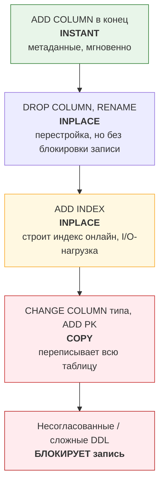
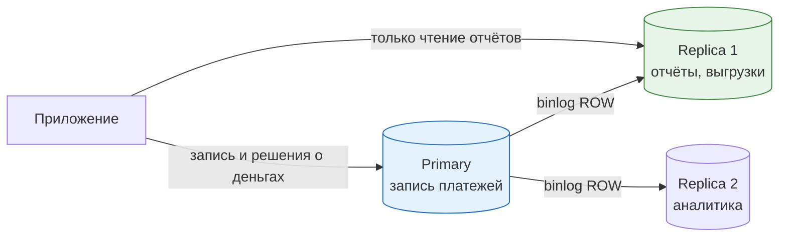

# 03. Безопасные миграции, партиционирование и архивация

> **Что проверяют.** В вакансии: «много работы с консистентностью данных, безопасными
> миграциями» и «крупный рефакторинг». Проверяют: умеешь ли ты **менять схему живой
> денежной системы без простоя и без потери данных**, и понимаешь ли, почему
> «откатить релиз» для DDL не работает.
>
> Здесь: online DDL, паттерн expand/contract, бэкфилл батчами, партиционирование денежных
> таблиц, архивация, работа с репликами, и готовые сценарии миграций с рисками.

---

## 1. Почему миграция в биллинге — это отдельный жанр

| Особенность | Следствие |
|---|---|
| Данные — деньги, пересчитать нельзя | Бэкфилл должен быть **точным** и проверяемым, а не «примерно так же» |
| Данные читаются бухгалтерией и отчётностью | Смена формата **ломает закрытые периоды**, если не согласована |
| Есть уже выпущенные документы (чеки, акты) | Их нельзя «пересоздать»: изменения только через корректирующие документы |
| Период может быть «закрыт» | Нельзя дописывать в закрытый месяц без процедуры |
| Высокая нагрузка на таблицу | DDL может заблокировать приём платежей |
| Есть реплики и отчётность на них | Долгий DDL = отставание реплик; в отчётах расхождение |

**Формулировка вслух:** «Миграция в биллинге — это не только DDL. Это изменение контракта
данных, у которого есть три потребителя: код (две версии одновременно во время выката),
отчётность и бухгалтерия. Поэтому любая миграция планируется как „две версии кода живут
одновременно“ — а это и есть expand/contract.»

---

## 2. Пять уровней риска DDL в MySQL 8



| DDL | Алгоритм в MySQL 8 | Блокирует запись? | Что важно |
|---|---|---|---|
| `ADD COLUMN` (в конец, с default) | `INSTANT` | нет | почти бесплатно, метаданные |
| `ADD COLUMN` с явной позицией (`AFTER`) | `INSTANT` в 8.0.29+ | нет | в старых версиях — копирование |
| `ADD INDEX` | `INPLACE` | нет (но запись чуть дороже) | требует места; нагрузка на I/O; следить за репликами |
| `DROP INDEX` | `INPLACE` | нет | быстро |
| `DROP COLUMN` | `INPLACE` | нет | **⚠️ необратимо: данные потеряны** |
| `MODIFY/CHANGE COLUMN` (смена типа) | обычно `COPY` | **да, в конце** | на большой таблице — простой |
| Расширение `VARCHAR(64)→VARCHAR(128)` (в пределах длины префикса) | `INPLACE` | нет | `utf8mb4` и длины префикса важны: 255→256 ломает INPLACE для индекса |
| Смена типа `INT → BIGINT` | `COPY` | да | переписывание всей таблицы |
| `ADD PRIMARY KEY` | `COPY` | да | на горячей таблице = инцидент |
| `ALTER TABLE ... CONVERT TO CHARACTER SET` | `COPY` | да | классическая авария |

**Проверка перед запуском (обязательный шаг, который стоит назвать):**

```sql
-- Спросить у MySQL, поддерживает ли он желаемый алгоритм и не будет ли блокировки:
ALTER TABLE payment
  ADD INDEX idx_new (legal_entity_id, created_day),
  ALGORITHM=INPLACE, LOCK=NONE;         -- ← если нельзя, MySQL ответит ОШИБКОЙ, а не сделает молча

-- Ожидаем "Query OK, 0 rows affected" (для нового индекса может быть долго)
-- Если MySQL скажет: ERROR 1846 (0A000): ALGORITHM=INPLACE is not supported. Reason: ...,
-- то мы узнали это ДО прода.
```

Это лучший ответ на «как ты проверяешь, что миграция безопасна»: **явно указать
`ALGORITHM` и `LOCK` и дать БД отказать**, если она это сделать не может. Тогда
случайной блокировки таблицы не будет.

---

## 3. Паттерн expand/contract (по-русски: «добавить → переключить → удалить»)

Это главный паттерн для изменений в биллинге. Идея: **никогда не менять существующее
во время работы двух версий кода** — сначала добавить новое, потом научить код писать в оба
места, потом переключить чтение, потом удалить старое.


**Ключевое условие:** шаги 1–4 происходят **без остановки системы**, и в любой момент можно
откатить код (потому что оба варианта данных валидны). Шаг 5 — только после того, как новая
схема доказала работоспособность на проде (обычно N дней).

### Пример: разделить `payment.status` на два поля (технический + бизнес-статус)

Реальный биллинг-кейс: нужен отдельный «внешний» статус от ПС и наш «внутренний», потому
что один внешний статус отображается в разные внутренние в зависимости от вида услуги.

```sql
-- Шаг 1: EXPAND — добавить колонки со значением по умолчанию (INSTANT, без блокировки)
ALTER TABLE payment
  ADD COLUMN external_status VARCHAR(32) NULL AFTER status,
  ADD COLUMN status_version TINYINT UNSIGNED NOT NULL DEFAULT 1,
  ALGORITHM=INSTANT;
```

```php
// Шаг 2: DUAL WRITE — новый код пишет и старое, и новое.
// Старый код продолжает работать: он читает и пишет status, и это всё ещё корректно.
$this->pdo->prepare(
    'UPDATE payment
        SET status = :mapped_status,         -- как раньше (совместимость)
            external_status = :raw_status,   -- новое
            status_version = 2
      WHERE id = :id'
)->execute([...]);
```

```sql
-- Шаг 3: BACKFILL — батчами, чтобы не держать длинную транзакцию и не отставать от реплик
-- ОБЯЗАТЕЛЬНО: курсор по PK, маленькие батчи, паузы, мониторинг replication lag.
UPDATE payment
   SET external_status = status,
       status_version  = 1
 WHERE id > :lastId
   AND external_status IS NULL
 ORDER BY id
 LIMIT 1000;
-- повторять по циклу из приложения/skripta, пока affected_rows > 0
```

```sql
-- Шаг 4: SWITCH READ — код читает новое поле. Запись пока в оба.
-- (релиз кода, DDL не требуется)

-- Шаг 5: CONTRACT — отдельный релиз через N дней
UPDATE payment SET status = external_status WHERE external_status IS NOT NULL;  -- при необходимости денормализации
ALTER TABLE payment DROP COLUMN external_status;   -- ⚠️ необратимо, только после проверки
```

**Почему это правильный ответ, а не «сделал ALTER и всё»:**

| Риск | Как expand/contract его снимает |
|---|---|
| Выкат не удался / надо откатить | откат = деплой старого кода; данные валидны для обеих версий |
| Долгая блокировка таблицы | DDL — только `INSTANT`/`INPLACE`; тяжёлое — батчами |
| Отставание реплик | бэкфилл маленькими батчами с паузами, не одной транзакцией |
| Расхождение данных | после бэкфилла — проверка «суммы и количества совпадают» |
| Нужно согласование с бухгалтерией | новое поле не меняет старое, отчёты не ломаются до шага 4 |

### Обязательная проверка после бэкфилла

```sql
-- Инвариант: новое поле полностью соответствует старому (или объяснимо отличается)
SELECT COUNT(*) AS mismatches
  FROM payment
 WHERE status_version = 1
   AND (external_status IS NULL OR external_status <> status);
-- Должно быть 0. Если не 0 — разбираемся, а не «продолжаем».

-- И денежный инвариант: сумма проводок совпадает
SELECT COUNT(*) FROM (
  SELECT p.id FROM payment p
   JOIN (SELECT payment_id, SUM(amount_minor) s FROM ledger_entry GROUP BY payment_id) l
     ON l.payment_id = p.id
  WHERE p.status = 'paid' AND l.s <> p.amount_minor
) x;
```

> **Фраза-маркер:** «После бэкфилла я делаю проверку-инвариант на **расхождения**, а не
> „посмотрел глазами, вроде похоже“. В биллинге бэкфилл без проверки — это просто отсроченный
> инцидент.»

---

## 4. Бэкфилл на миллионы строк: как делать правильно

```php
<?php
declare(strict_types=1);

/**
 * Бэкфилл батчами: короткие транзакции, курсор по PK, паузы, контроль отставания реплик,
 * идемпотентность (можно перезапустить с любого места), метрики.
 */
final class Backfiller
{
    public function __construct(
        private readonly PDO $pdo,
        private readonly ReplicaLagChecker $lag,
        private readonly Metrics $metrics,
    ) {}

    public function run(int $batchSize = 1000, int $sleepMs = 50): void
    {
        $lastId = 0;

        while (true) {
            // 1. Не мешать репликации: если реплика отстала — ждём.
            while ($this->lag->seconds() > 5) {
                usleep(1_000_000);
            }

            $this->pdo->beginTransaction();
            try {
                // 2. Keyset-пагинация: WHERE id > :last — быстрая и стабильная.
                //    Не OFFSET: он читает и отбрасывает всё предыдущее (квадратично).
                $stmt = $this->pdo->prepare(
                    'SELECT id, status FROM payment
                      WHERE id > :last AND external_status IS NULL
                      ORDER BY id
                      LIMIT :limit'
                );
                $stmt->bindValue('last', $lastId, PDO::PARAM_INT);
                $stmt->bindValue('limit', $batchSize, PDO::PARAM_INT);
                $stmt->execute();
                $rows = $stmt->fetchAll(PDO::FETCH_ASSOC);

                if ($rows === []) {
                    $this->pdo->commit();
                    return;                            // закончили
                }

                // 3. Обновляем пачкой в одной короткой транзакции.
                $ids = array_column($rows, 'id');
                $in  = implode(',', array_fill(0, count($ids), '?'));
                $this->pdo->prepare(
                    "UPDATE payment
                        SET external_status = status, status_version = 1
                      WHERE id IN ($in)"
                )->execute($ids);

                $this->pdo->commit();
                $lastId = (int) end($ids);
                $this->metrics->gauge('backfill.last_id', $lastId);
            } catch (\Throwable $e) {
                if ($this->pdo->inTransaction()) {
                    $this->pdo->rollBack();
                }
                throw $e;
            }

            // 4. Пауза: дать место онлайн-трафику и репликам.
            usleep($sleepMs * 1000);
        }
    }
}
```

**Правила бэкфилла (готовый список):**

```
1. Курсор по PK (keyset), НЕ OFFSET.
2. Маленькие батчи (500–5000), короткие транзакции.
3. Пауза между батчами (троттлинг) — защита от «сожрали весь I/O».
4. Идемпотентность: можно перезапустить с любого места (WHERE ... IS NULL).
5. Контроль отставания реплик; остановка при превышении порога.
6. Метрика прогресса (last_id, обработано, осталось оценить).
7. Проверка-инвариант после завершения.
8. Возможность остановки (kill switch) без повреждения данных.
9. Не делать DDL и бэкфилл в один релиз.
10. Начать с небольшой доли (например, 1% данных), проверить, потом на всё.
```

**Про `INSERT ... SELECT` как «быстрый бэкфилл»:** в RR он берёт S-локи на источник и может
конвертироваться в широкие локи; плюс одна огромная транзакция → undo, отставание реплик.
Можно использовать, но осознанно: в RC, с разбивкой по диапазонам id, вне пиковых часов.

---

## 5. Партиционирование денежных таблиц

Зачем: таблицы операций/проводок/чеков растут линейно и становятся самыми большими.
Партиционирование по времени даёт: (1) быстрый поиск по периоду (partition pruning),
(2) дешёвое удаление старых данных (`DROP PARTITION` вместо `DELETE`).

**Важно:** в MySQL **партиционирование по диапазону должно быть по колонке, входящей в PK
и во все UNIQUE-индексы**. Это ограничение часто убивает план. Отсюда типовой дизайн:

```sql
-- Партиционирование по ДНЮ, при этом день входит в PK и в UNIQUE
CREATE TABLE ledger_entry (
  id           BIGINT UNSIGNED NOT NULL AUTO_INCREMENT,
  created_day  DATE            NOT NULL,          -- входит в PK!
  created_at   DATETIME(6)     NOT NULL,
  account_id   BIGINT UNSIGNED NOT NULL,
  payment_id   BIGINT UNSIGNED NULL,
  amount_minor BIGINT          NOT NULL,          -- знак = сторона проводки (дебет/кредит)
  currency     CHAR(3)         NOT NULL,
  operation_id VARCHAR(64)     NOT NULL,          -- ключ идемпотентности проводки
  PRIMARY KEY (id, created_day),                  -- PK включает партиционирующую колонку
  UNIQUE KEY uq_op (operation_id, created_day),   -- и UNIQUE тоже
  KEY idx_account_created (account_id, created_day),
  KEY idx_payment (payment_id, created_day)
) ENGINE=InnoDB
PARTITION BY RANGE COLUMNS(created_day) (
  PARTITION p2025_04 VALUES LESS THAN ('2025-05-01'),
  PARTITION p2025_05 VALUES LESS THAN ('2025-06-01'),
  PARTITION p2025_06 VALUES LESS THAN ('2025-07-01'),
  PARTITION p_max    VALUES LESS THAN (MAXVALUE)
);
```

**Что нужно понимать про партиционирование (это и есть ответ):**

| Свойство | Что даёт | Ограничения/цена |
|---|---|---|
| Partition pruning | запрос за май читает только p2025_05 | **только если условие по партиционирующей колонке напрямую** (`DATE(created_day) >= …` убивает pruning) |
| `DROP PARTITION` | мгновенно убрать старый месяц вместо долгого `DELETE` | данные исчезают — нужна архивация заранее |
| `EXCHANGE PARTITION` | быстро вынести партицию в отдельную таблицу (для архива) | таблица-приёмник должна иметь идентичную структуру |
| Локи | DDL партиции менее «тяжёл» | `ADD PARTITION` — быстро, но `REORGANIZE` перекладывает данные |
| UNIQUE-индексы | — | обязаны содержать партиционирующую колонку |
| Запросы без даты | `WHERE operation_id = ?` (без дня) | **сканирует все партиции** — это важная ловушка! Идемпотентность по одному `operation_id` становится дорогой |

**Пятая строка — самая важная и самая частая ошибка.** Если у тебя UNIQUE по
`operation_id` и партиционирование по дню, то `INSERT` проверит уникальность **во всех
партициях** (или упадёт по локальному ключу), а поиск по `operation_id` без даты ударит
по всем партициям. Выводы, которые надо проговорить:

```
1. Идемпотентность для партиционированной таблицы лучше держать в ОТДЕЛЬНОЙ НЕПАРТИЦИОНИРОВАННОЙ
   таблице (processed_event / idempotency_key) — она маленькая и не растёт как логи.
2. Либо включать дату в ключ идемпотентности, если она известна всегда.
3. Логи/проводки партиционируем, а «защиту от дублей» и «состояния» — нет.
```

Это отличный ответ: показывает, что ты понимаешь границы инструмента, а не просто «надо
партиционировать».

### Автоматизация: добавлять партиции заранее

```sql
-- Партиции за следующий месяц надо создать ДО того, как в них начнут писать.
-- При наличии p_max (MAXVALUE) вставка не упадёт, но всё уйдёт в одну "бездонную" партицию.
ALTER TABLE ledger_entry REORGANIZE PARTITION p_max INTO (
  PARTITION p2025_07 VALUES LESS THAN ('2025-08-01'),
  PARTITION p_max    VALUES LESS THAN (MAXVALUE)
);

-- Типовой процесс:
--   cron 1-го числа: создать партицию на +2 месяца вперёд
--   cron: мониторить размер партиций и общий размер таблицы
--   runbook: что делать, если создание партиции не прошло
```

### Архивация вместо удаления

```sql
-- 1. Вынести старую партицию в отдельную таблицу (быстро, метаданные)
CREATE TABLE ledger_entry_2024_01 LIKE ledger_entry;
ALTER TABLE ledger_entry EXCHANGE PARTITION p2024_01 WITH TABLE ledger_entry_2024_01;

-- 2. Отдать в архив: дамп/выгрузка в файловое хранилище или отдельную БД
--    mysqldump / SELECT INTO OUTFILE / ETL в S3

-- 3. После подтверждения архива — освободить место
ALTER TABLE ledger_entry DROP PARTITION p2024_01;
```

**Правило биллинга:** документы (чеки, проводки) имеют **срок хранения** (по закону и по
внутренним требованиям). Нельзя «удалить потому что старое» — сначала архивируем, потом
храним, потом, если срок истёк и это согласовано, удаляем. Это тоже часть «новых требований
налоговой».

---

## 6. Таблицы-агрегаты: спасение для отчётности

Когда таблица операций огромна, а отчёты нужны быстро — считаем заранее (или инкрементально).

```sql
CREATE TABLE billing_daily_agg (
  legal_entity_id BIGINT UNSIGNED NOT NULL,
  day             DATE            NOT NULL,
  service_code    VARCHAR(32)     NOT NULL,
  status          VARCHAR(16)     NOT NULL,
  operations_cnt  BIGINT UNSIGNED NOT NULL,
  amount_minor    BIGINT          NOT NULL,       -- сумма в минорных единицах
  updated_at      DATETIME(6)     NOT NULL,
  PRIMARY KEY (legal_entity_id, day, service_code, status)
) ENGINE=InnoDB;
```

Три способа поддерживать:

| Способ | Как | Плюсы/минусы |
|---|---|---|
| Инкрементальный при записи | в той же транзакции `INSERT ... ON DUPLICATE KEY UPDATE operations_cnt = operations_cnt + 1` | точно и сразу; добавляет точку конфликта (лок на строку агрегата — при высокой частоте это узкое место) |
| Периодический пересчёт | раз в N минут пересчитывать «сегодня» | проще, но с задержкой; нужно решить вопрос «догоняющего» пересчёта прошлых дней |
| Пересчёт из леджера (as-of) | ночью пересчитать прошлый день и сверить с инкрементальной | дороже, но это **сверка агрегата** — рекомендую держать как правило |

**Рекомендуемая схема (и ответ на собеседовании):** агрегаты обновляются инкрементально в
той же транзакции (данные всегда готовы), а раз в сутки **полностью пересчитываются из
леджера и сверяются** — расхождения ищутся автоматически. Это ровно принцип бухгалтерии:
сальдо + сверка оборотов.

---

## 7. Репликация и чтение с реплик



**Правила, которые обязательно проговорить:**

1. **Решения о деньгах — только на primary.** Идемпотентность, статусы, балансы: читать с
   реплики нельзя (реплика может отставать на секунды → решение по устаревшим данным).
2. На реплику — отчёты, выгрузки, аналитика, тяжёлые сверки.
3. `binlog_format = ROW` — обязательный формат для репликации без расхождений. Со `STATEMENT`
   есть недетерминированные запросы (`NOW()`, `RAND()`, `LIMIT без ORDER BY`) → расхождения.
4. Следить за лагом: `Seconds_Behind_Master` / `performance_schema.replication_applier_status`.
   В биллинге «отставание реплики» — это про отчётность, а не только про производительность.
5. `sync_binlog=1`, `gtid_mode=ON`, `innodb_flush_log_at_trx_commit=1` — для надёжной точки
   восстановления и простого failover.
6. Большая транзакция применяется на реплике «целиком» → длинный лаг. Отсюда правило
   «батчи для бэкфилла и массовых обновлений».

```sql
-- Диагностика отставания
SHOW REPLICA STATUS\G
--   Replica_IO_Running: Yes
--   Replica_SQL_Running: Yes
--   Seconds_Behind_Source: 0..N
--   Retrieved_Gtid_Set / Executed_Gtid_Set — полезно для проверки «дошло ли»
```

**Готовый тезис про «расхождение с репликой»:** «Если в отчёте из реплики цифра не сходится
с primary, первая гипотеза — отставание или незакоммиченная транзакция, а не „баг отчёта“.
Поэтому в денежных отчётах я всегда фиксирую as-of timestamp и включаю в отчёт время, на
которое данные актуальны.»

---

## 8. Сценарии миграций с разбором

### Сценарий 1. «Добавить обязательное поле `legal_entity_id` в таблицу платежей»

**Разбор (expand/contract):**

```sql
-- Шаг 1: добавить NULL (INSTANT, без блокировки) — обязательное сразу нельзя:
--         существующие строки не имеют значения.
ALTER TABLE payment ADD COLUMN legal_entity_id BIGINT UNSIGNED NULL, ALGORITHM=INSTANT;

-- Шаг 2: заполнить бэкфилл батчами. Логика: юрлицо определяется видом услуги/настройкой,
--         поэтому нужна детерминированная функция, а не «на глазок».
--         ВАЖНО: правило определения надо согласовать с бухгалтерией и зафиксировать.

-- Шаг 3: после проверки (0 строк с NULL) — применить ограничения:
ALTER TABLE payment
  MODIFY COLUMN legal_entity_id BIGINT UNSIGNED NOT NULL,   -- ⚠️ COPY: нужен час низкой нагрузки
  ADD INDEX idx_entity_day (legal_entity_id, created_day);
-- Или лучше: NOT NULL добавить через отдельный релиз, заранее увидев, что NULL нет.
```

**Ловушка:** `MODIFY ... NOT NULL` — это `COPY` (перезапись таблицы). На большой таблице
это блокировка. Правильный ход: заранее проверить, что NULL-строк нет, и делать это в окно,
либо (если MySQL позволяет) обойтись `CHECK`-ограничением вместо `NOT NULL` при добавлении
новых строк через код/триггер — с обязательной валидацией данных.

### Сценарий 2. «Переименовать таблицу `txn` в `payment` без простоя»

**Разбор:** код не может одновременно использовать два имени... но может, если это
**view**:

```sql
-- 1. Создать view с новым именем
CREATE VIEW payment AS SELECT * FROM txn;

-- 2. Перевести код на новое имя (без DDL, обычный релиз)
-- 3. Убрать view и переименовать таблицу в отдельном коротком релизе
DROP VIEW payment;
RENAME TABLE txn TO payment;      -- быстрая метаданные-операция
```

### Сценарий 3. «Разделить слишком часто обновляемую агрегатную строку»

**Разбор:** проблема — «горячая строка»: все транзакции обновляют одну строку
`total_count`. Решения: (1) шардировать счётчики (N строк, `INCR` по random/hash,
сумма при чтении); (2) считать агрегат периодически, а не в реальном времени;
(3) для счётчиков использовать Redis с последующей фиксацией в БД (с оговоркой про
консистентность: фиксация в БД — источник правды, Redis — ускоритель).

### Сценарий 4. «Смена типа `amount DECIMAL(10,2)` → `amount_minor BIGINT`»

**Разбор:** самый денежный вариант миграции.

```sql
-- Шаг 1: EXPAND — новая колонка рядом (INSTANT)
--   ⚠️ Расширять размер PK? Нет. Просто добавить BIGINT-колонку.
ALTER TABLE payment ADD COLUMN amount_minor BIGINT NULL, ALGORITHM=INSTANT;

-- Шаг 2: DUAL WRITE — код пишет и старую, и новую.

-- Шаг 3: BACKFILL — пересчёт в минорные единицы СТРОГО через DECIMAL, без float:
UPDATE payment
   SET amount_minor = CAST(ROUND(amount * 100, 0) AS SIGNED)   -- ← опасно, см. ниже!
 WHERE id > ? AND amount_minor IS NULL ORDER BY id LIMIT 1000;
```

**Стоп. Здесь ловушка, которую надо назвать вслух:** в MySQL `amount * 100` для `DECIMAL`
считается точно (DECIMAL — точный тип), поэтому `ROUND(amount*100,0)` **корректен**.
Но если колонка вдруг `FLOAT` или `DOUBLE` — пересчёт даст ошибки. Поэтому:

```sql
-- Правильно и безопасно: пересчёт в десятичной арифметике на стороне БД,
-- с проверкой на выход исторических значений.
UPDATE payment
   SET amount_minor = CAST(amount * 100 AS SIGNED)
 WHERE id BETWEEN ? AND ?;
-- И обязательная сверка:
SELECT COUNT(*) FROM payment
 WHERE amount_minor IS NOT NULL
   AND CAST(amount_minor / 100 AS DECIMAL(15,2)) <> amount;   -- ожидаем 0
```

### Сценарий 5. «Индекс, который уже есть, надо сделать другим (пересоздать)»

**Разбор:** `DROP INDEX` + `ADD INDEX` = окно, когда индекс отсутствует → деградация запросов.
Лучше:

```sql
-- 1. Создать новый индекс под другим именем (INPLACE, не блокирует запись)
ALTER TABLE payment ADD INDEX idx_new (a, b, c), ALGORITHM=INPLACE, LOCK=NONE;
-- 2. Убедиться, что оптимизатор его использует (EXPLAIN, метрики)
-- 3. Только потом удалить старый
ALTER TABLE payment DROP INDEX idx_old, ALGORITHM=INPLACE, LOCK=NONE;
```

---

## 9. Внешние инструменты (упомяни — это признак продакшн-опыта)

| Инструмент | Зачем | Цена |
|---|---|---|
| `gh-ost` | онлайн-миграции через репликацию, троттлинг, возможность pause/resume | нужны настройки, переключение через `RENAME TABLE` |
| `pt-online-schema-change` | то же, через триггеры | триггеры усложняют, есть риски с локалью/типами |
| native `INPLACE`/`INSTANT` | если задача позволяет — лучший вариант (меньше движущихся частей) | не для всех DDL |
| `pt-archiver` | архивация и удаление старых строк пачками | нужен контроль |
| `mysqlbinlog` | восстановление из binlog, разбор «что произошло» | нужно уметь читать |

> **Правильная последовательность ответа:** «Сначала проверяю, поддерживает ли native DDL
> нужный алгоритм (`ALGORITHM=INPLACE, LOCK=NONE`). Если да — делаю нативным в окно низкой
> нагрузки, следя за репликами. Если нет (например, смена типа на 400-миллионной таблице) —
> `gh-ost` с троттлингом. Внешний инструмент — это не „круто“, а способ сделать то, что
> native не умеет.»

---

## 10. Красные флаги в этой теме

* ❌ «Добавлю колонку `NOT NULL` без default на большую таблицу одним ALTER».
* ❌ «Откачу миграцию, если что-то пойдёт не так» (DDL не откатывается; `DROP COLUMN` теряет данные).
* ❌ «`DELETE FROM ledger_entry WHERE created_at < ...`» — долгая транзакция и раздутый undo; правильнее партиции + архив.
* ❌ Не знать про `ALGORITHM`/`LOCK` в DDL.
* ❌ Читать решение о деньгах с реплики.
* ❌ Партиционировать таблицу идемпотентности (или забыть, что UNIQUE обязан включать партиционирующую колонку).
* ❌ Бэкфилл одной транзакцией.

## Чек-лист по этому файлу

- [ ] Могу назвать 3 алгоритма DDL и когда какой применяется.
- [ ] Объясняю expand/contract по 5 шагам и почему в любой момент можно откатить код.
- [ ] Могу написать бэкфилл батчами с keyset-пагинацией и троттлингом.
- [ ] Знаю ограничение партиционирования по UNIQUE и почему идемпотентность держу отдельно.
- [ ] Могу объяснить, почему решения о деньгах не читаются с реплики.
- [ ] Готов разбор сценария «DECIMAL → BIGINT минорные единицы» с проверкой-инвариантом.
