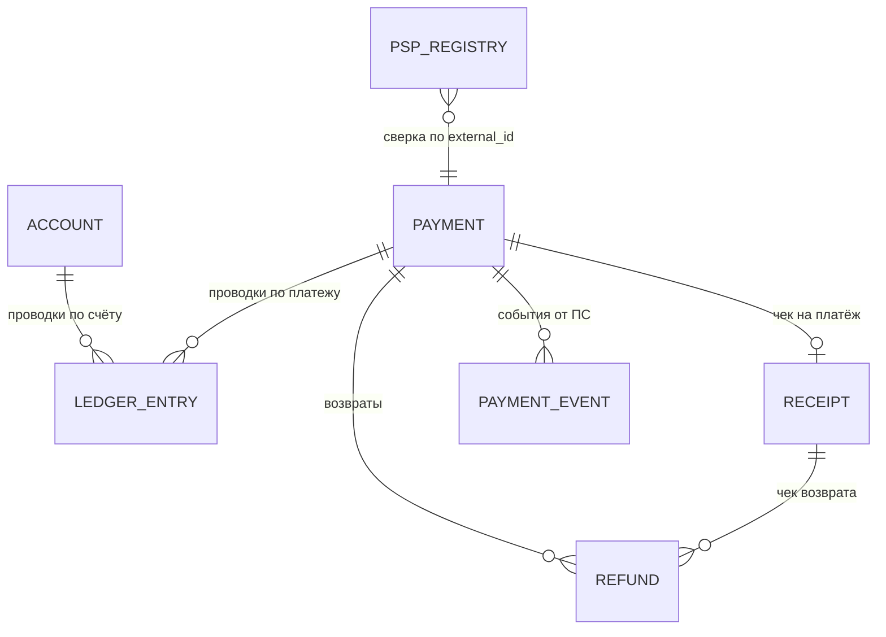

# 04. EXPLAIN на практике + 12 SQL-задач биллинга с разбором

> **Что проверяют.** Практическую способность: посмотреть на запрос, прочитать `EXPLAIN`,
> понять, почему медленно, и починить. А также — умеешь ли ты **находить расхождения в деньгах
> запросом**, потому что именно так работают сверки и ночные разборы.
>
> Схема, на которой всё построено, — в `12-labs/sql/01-schema.sql`. Подними лабораторию и
> прогони запросы руками: на собеседовании это будет видно по формулировкам.

---

## Разделы

1. [Схема, о которой говорим](#1-схема-о-которой-говорим)
2. [Четыре живых EXPLAIN-разбора](#2-четыре-живых-explain-разбора)
3. [Задачи на поиск расхождений (это и есть сверка)](#3-задачи-на-поиск-расхождений-это-и-есть-сверка)
4. [Отчётные задачи](#4-отчётные-задачи)
5. [Задачи на идемпотентность и повторную обработку](#5-задачи-на-идемпотентность-и-повторную-обработку)
6. [Проверки-инварианты, которые должны быть в CI](#6-проверки-инварианты-которые-должны-быть-в-ci)

---

## 1. Схема, о которой говорим



| Таблица | Роль | Ключи/индексы (существенные) |
|---|---|---|
| `payment` | платежи: суммы, статусы, ключ идемпотентности | PK `id`; UNIQUE `(provider_code, provider_payment_id)`; UNIQUE `idempotency_key`; `(user_id, status, created_at)`; `(legal_entity_id, created_day, status)` |
| `ledger_entry` | проводки (двойная запись), знак = сторона | PK `(id, created_day)`; UNIQUE `(operation_id, created_day)`; `(account_id, created_day)`; `(payment_id, created_day)` |
| `account` | лицевые счета и баланс | PK `id`; UNIQUE `(owner_type, owner_id, currency)` |
| `receipt` | фискальные чеки | PK `id`; UNIQUE `payment_id` (один чек на платёж); `(status, created_at)` |
| `refund` | возвраты | PK `id`; `(payment_id, status)`; `(created_day, status)` |
| `processed_event` | идемпотентность вебхуков | UNIQUE `(source, event_id)` |
| `psp_registry` | реестр от ПС для сверки | `(provider_code, created_day)`, `provider_payment_id` |
| `billing_daily_agg` | агрегаты для отчётов и сверки | PK `(legal_entity_id, day, service_code, status)` |
| `outbox` | события для RabbitMQ | `(published_at, id)` |

---

## 2. Четыре живых EXPLAIN-разбора

### Разбор 1. «Мои платежи» — убираем full scan и filesort

```sql
SELECT id, amount_minor, currency, status, created_at
  FROM payment
 WHERE user_id = 42
   AND status IN ('paid', 'refunded')
 ORDER BY created_at DESC
 LIMIT 20;
```

**EXPLAIN «до» (индексов нет):**

```
+----+-------+---------+------+---------------+------+---------+------+----------+-----------------------------+
| id | table | type    | key  | possible_keys | rows | Extra                                   |
+----+-------+---------+------+---------------+------+---------+------+-----------------------------+
|  1 | payment | ALL   | NULL | NULL          | 80000000 | Using where; Using filesort          |
+----+-------+---------+------+---------------+------+---------+------+-----------------------------+
```

**Диагноз:**

* `type: ALL`, `rows: 80 000 000` — читает всю таблицу.
* `possible_keys: NULL` — нет ни одного индекса под это условие.
* `Using filesort` — сортировка после чтения (то есть состояние `LIMIT 20` не спасает,
  сортировать нужно всё).

**Решение:**

```sql
ALTER TABLE payment ADD INDEX idx_user_status_created (user_id, status, created_at),
  ALGORITHM=INPLACE, LOCK=NONE;
```

Почему такой порядок: `user_id` и `status` — равенства (при `IN` MySQL использует индекс как
range по нескольким значениям — это нормально управляется), `created_at` — и сортировка,
и хвост для `LIMIT`. После индексного чтения строки уже упорядочены → `filesort` исчезает.

**EXPLAIN «после»:**

```
+----+-------+------+--------------------------+---------+---------+-------+------+------------------------------+
| id | table | type | key                      | key_len | ref     | rows  | Extra                       |
+----+-------+------+--------------------------+---------+---------+-------+------+------------------------------+
|  1 | payment | range | idx_user_status_created | 74     | NULL    | 128   | Using index condition; ...  |
+----+-------+------+--------------------------+---------+---------+-------+------+------------------------------+
```

**Что изменилось:** `type: range` (или `ref` при одном значении статуса), `rows` в сотни,
filesort исчез. **Ключевой вывод:** порядок `равенства → сортировка` — вот что убило filesort.

> **Дополнительный балл на собеседовании:** если бы нужны были только `id, status, created_at`,
> индекс стал бы покрывающим (`Using index`), а `amount_minor` и `currency` потребуют похода
> в кластерный индекс. Тогда есть выбор: добавить их в индекс (индекс «толще», но lookup'ов нет)
> или смириться с lookup'ом на 20 строках. На 20 строках второе лучше.

### Разбор 2. Классика: функция на колонке

```sql
-- Отчёт: сколько платежей за день
SELECT COUNT(*), SUM(amount_minor)
  FROM payment
 WHERE DATE(created_at) = '2025-05-15'
   AND legal_entity_id = 1;

-- EXPLAIN:
-- type: ALL, rows: 80000000, Extra: Using where     ← индекс (legal_entity_id, created_at) НЕ используется
```

**Диагноз:** `DATE(created_at)` — вычисление на колонке. Индекс построен по `created_at`,
а не по `DATE(created_at)`. MySQL обязан вычислить функцию для каждой строки.

**Три решения (с ценой каждого — это ценится):**

```sql
-- Решение A (быстрое, без DDL): переписать условие диапазоном
SELECT COUNT(*), SUM(amount_minor)
  FROM payment
 WHERE created_at >= '2025-05-15 00:00:00'
   AND created_at <  '2025-05-16 00:00:00'
   AND legal_entity_id = 1;
-- Индекс (legal_entity_id, created_at) теперь работает: equality + range. ✅
-- Минус: нужно помнить про часовой пояс. См. A2.

-- Решение B: отдельная денормализованная колонка дня (лучше для отчётов)
ALTER TABLE payment ADD COLUMN created_day DATE AS (DATE(created_at)) STORED;
ALTER TABLE payment ADD INDEX idx_entity_day (legal_entity_id, created_day), ALGORITHM=INPLACE;
-- Плюс: GROUP BY created_day тоже будет работать по индексу. Минус: место + поддержка.

-- Решение C: функциональный индекс (MySQL 8.0.13+, через генерируемую колонку внутри)
ALTER TABLE payment ADD INDEX idx_date_expr ((DATE(created_at)));
-- Плюс: работает без переписывания запроса. Минус: тонкость — индекс по выражению,
--        оптимизатор должен найти совпадение выражения; использовать аккуратно.
```

**И обязательная оговорка для биллинга (это настоящая тема, не «придирка»):**

> «Отчёт „за день“ зависит от того, **какой день** — UTC или Москва, и что такое „день“ для
> бухгалтерии. Для отчётности и для закрытия смены/периода день обычно не UTC. Поэтому
> в биллинге `created_day` — это не просто `DATE(created_at)`, а **отдельное бизнес-понятие**,
> которое вычисляется по правилу (например, по московскому времени и с учётом границы
> операционного дня). Это надо согласовать с бухгалтерией, иначе отчёты будут расходиться
> на границах суток.»

### Разбор 3. Агрегат для отчёта: temporary + filesort

```sql
SELECT service_code, COUNT(*) AS cnt, SUM(amount_minor) AS sum_minor
  FROM payment
 WHERE legal_entity_id = 1
   AND created_day BETWEEN '2025-05-01' AND '2025-05-31'
   AND status = 'paid'
 GROUP BY service_code
 ORDER BY sum_minor DESC;

-- EXPLAIN:
-- type: range, key: idx_entity_day_status, rows: 2400000,
-- Extra: Using index condition; Using temporary; Using filesort   ← ⚠️
```

**Диагноз:** `rows` = 2.4 млн — читаем все оплаченные операции юрлица за месяц. Это
не «ошибка индекса» — это **правильный** доступ, но объём работы велик, а `GROUP BY` требует
временной таблицы (индекс не в порядке группировки).

**Что делать (по возрастанию усилий):**

| Решение | Эффект | Цена |
|---|---|---|
| Добавить `service_code` и `amount_minor` в индекс `(legal_entity_id, created_day, status, service_code)` | покрывающий доступ, меньше I/O; temporary остаётся (порядок группировки не совпадает) | индекс крупный |
| Покрывающий индекс с правильным порядком группировки `(legal_entity_id, created_day, status, service_code, amount_minor)` | появляется шанс на index-based aggregation (без temporary) при удачном порядке | ещё крупнее |
| Считать по `billing_daily_agg` (предварительные агрегаты) | в разы быстрее, `rows` = дни × услуги | нужно поддерживать агрегаты + сверять их (см. §6) |
| Вынести на реплику | не мешает онлайну | данные чуть отстают (надо указывать as-of) |

**Правильный ответ на собеседовании:** «Я не буду бороться с индексом за отчёт, который
нужен раз в день. Я сделаю агрегатную таблицу, а отчёт по ней. Индекс важен для онлайна,
для отчётов работает предрассчёт.»

### Разбор 4. Ловушка: «индекс есть, но не используется» из-за типа

```sql
-- payment.provider_payment_id объявлен VARCHAR(128)
SELECT * FROM payment WHERE provider_payment_id = 1000500071234;   -- ← число

-- EXPLAIN: type: ALL, rows: 80000000
-- SHOW WARNINGS: "Cannot use ref access on index 'uq_provider_payment' due to type or collation conversion"
-- Плюс скрытая логическая ошибка: сравнение строки с числом может совпасть не так, как ожидается.
```

**Диагноз и лечение:**

```sql
SELECT * FROM payment WHERE provider_payment_id = '1000500071234';  -- ← строка: индекс работает
-- В приложении: bind как строку (PDO::PARAM_STR), не полагаться на приведение.
-- В API: приводить входящее значение к строке на границе, а не в SQL.
```

Это **номер один** по «внезапным» full scan'ам в таблицах с внешними ID. Похожая ситуация —
разные коллации у связываемых колонок при `JOIN` (видно в `SHOW WARNINGS` после `EXPLAIN`).

---

## 3. Задачи на поиск расхождений (это и есть сверка)

> Это ровно то, что делает ночной реконсилер. Умение написать такой запрос — сильный сигнал.

### Задача 1. Найти платежи, где сумма не совпадает с суммой проводок

```sql
SELECT p.id,
       p.amount_minor        AS payment_amount,
       COALESCE(SUM(l.amount_minor), 0) AS ledger_amount
  FROM payment p
  LEFT JOIN ledger_entry l
    ON l.payment_id = p.id
  WHERE p.status = 'paid'
    AND p.created_day >= CURDATE() - INTERVAL 7 DAY              -- ограничить период: иначе full scan
  GROUP BY p.id, p.amount_minor
 HAVING COALESCE(SUM(l.amount_minor), 0) <> p.amount_minor;
```

**Разбор:** `LEFT JOIN` нужен, чтобы поймать и «нет проводок вообще» (это тоже расхождение —
деньги есть, следа нет). `GROUP BY` по `p.id` + `HAVING` — это correct, но на больших объёмах
дорого; поэтому период обязателен и индекс `(payment_id, created_day)` на `ledger_entry`.
**Дописать вслух:** «Если `ledger_entry` партиционирована по дню, добавлю в условие
`l.created_day` того же периода — иначе запрос пойдёт по всем партициям.»

### Задача 2. Сверка с реестром ПС: чего не хватает с каждой стороны

```sql
-- (a) Мы считаем платёж оплаченным, а в реестре ПС его нет → риск: деньги не придут
SELECT p.id, p.provider_code, p.provider_payment_id, p.amount_minor, p.paid_at
  FROM payment p
  LEFT JOIN psp_registry r
    ON  r.provider_code       = p.provider_code
    AND r.provider_payment_id = p.provider_payment_id
    AND r.created_day         = p.created_day
 WHERE p.status = 'paid'
   AND p.created_day = CURDATE() - INTERVAL 1 DAY
   AND r.id IS NULL;

-- (b) У ПС есть платёж, у нас нет записи → риск: потеряли платёж
SELECT r.provider_code, r.provider_payment_id, r.amount_minor, r.status
  FROM psp_registry r
  LEFT JOIN payment p
    ON  p.provider_code       = r.provider_code
    AND p.provider_payment_id = r.provider_payment_id
 WHERE r.created_day = CURDATE() - INTERVAL 1 DAY
   AND p.id IS NULL;

-- (c) Сумма совпала, а статус/сумма расходятся
SELECT p.id, p.amount_minor AS ours, r.amount_minor AS theirs, p.status AS our_status, r.status AS their_status
  FROM payment p
  JOIN psp_registry r
    ON r.provider_code = p.provider_code
   AND r.provider_payment_id = p.provider_payment_id
 WHERE r.created_day = CURDATE() - INTERVAL 1 DAY
   AND (p.amount_minor <> r.amount_minor OR p.status <> r.status);
```

**Разбор — и это важный ответ в части «как ты устроишь сверку»:**

| Случай | Что значит | Действие |
|---|---|---|
| есть у нас, нет у ПС | платёж «оплачен» без подтверждения ПС (или ошибка id) | 🔴 приоритет 1: возможна потеря денег; дожать `getStatus` вручную |
| есть у ПС, нет у нас | потеряли платёж (сбой приёма вебхука) | 🔴 приоритет 1: доначислить через тот же идемпотентный обработчик |
| расходится сумма | ошибка маппинга/валюты/частичный платёж | 🟠 разбор: сверить с реестром построчно |
| расходится статус | «у нас paid, у них refunded» | 🟠 либо не обработали вебхук возврата, либо ложный статус |
| всё совпало | ✅ | автоматический отчёт «сверка сошлась» |

> «И отдельная вещь: сверка должна **не только находить, но и уметь повторно применять
> недостающее**, — то есть вызывать тот же идемпотентный обработчик, а не делать ручные
> `INSERT`. Иначе расхождения копятся как ручной долг.»

### Задача 3. Оплаченные платежи без чека (отставание фискализации)

```sql
SELECT p.id, p.paid_at, p.amount_minor, r.status AS receipt_status,
       TIMESTAMPDIFF(MINUTE, p.paid_at, NOW()) AS minutes_without_receipt
  FROM payment p
  LEFT JOIN receipt r ON r.payment_id = p.id
 WHERE p.status = 'paid'
   AND p.paid_at >= NOW() - INTERVAL 2 DAY
   AND (r.id IS NULL OR r.status NOT IN ('printed', 'sent'))
 ORDER BY p.paid_at
 LIMIT 100;
```

**Разбор:** это **главная метрика фискализации** — «отставание чеков». В идеале должно быть
пусто. Если строки есть — цепочка порвалась (outbox не опубликовался, ОФД недоступен,
обработчик упал). Запрос должен быть дешёвым и крутиться каждые 5 минут:

* индекс `(status, paid_at)` на `payment` — чтобы выборка была узкой;
* `receipt.payment_id` — UNIQUE индекс.

И проверка «не более N минут» должна быть **алертом**, а не только запросом в ночном отчёте.

### Задача 4. Возвраты больше платежа (пере-возврат) — нарушенный инвариант

```sql
SELECT p.id,
       p.amount_minor               AS paid,
       COALESCE(SUM(r.amount_minor), 0) AS refunded
  FROM payment p
  JOIN refund r ON r.payment_id = p.id
 WHERE p.status IN ('paid', 'refunded')
   AND p.created_day >= CURDATE() - INTERVAL 90 DAY
 GROUP BY p.id, p.amount_minor
HAVING SUM(r.amount_minor) > p.amount_minor;
```

Учитывать статусы возвратов: считаем только успешные:

```sql
SELECT p.id, p.amount_minor AS paid, SUM(r.amount_minor) AS refunded
  FROM payment p
  JOIN refund r ON r.payment_id = p.id AND r.status = 'completed'   -- ← важно!
 WHERE p.created_day >= CURDATE() - INTERVAL 90 DAY
 GROUP BY p.id, p.amount_minor
HAVING SUM(r.amount_minor) > p.amount_minor;
```

**Разбор:** пере-возврат — это прямые потери. Инвариант должен держаться **в БД и/или в
транзакции**: например, при создании возврата брать `SELECT ... FOR UPDATE` по платежу и
проверять «оплачено − уже возвращено ≥ запрашиваемого». Уникальным ключом это не решается
(разные суммы), поэтому — лок + проверка в транзакции, плюс этот запрос как контроль.

### Задача 5. Дубли платежей по одному ключу идемпотентности

```sql
-- Если бы UNIQUE не было, дубли выглядели бы так:
SELECT idempotency_key, COUNT(*) AS cnt, GROUP_CONCAT(id ORDER BY id) AS ids
  FROM payment
 GROUP BY idempotency_key
HAVING COUNT(*) > 1;
```

**Разбор и правильный вывод:** «Такой запрос нужен только для исторических данных, где
ограничение добавляли позже. В нормальном состоянии он всегда пуст, потому что дубли
физически невозможны — UNIQUE. Если он не пуст, значит: (а) ограничение отсутствует или
(б) ключ идемпотентности формируется неверно (например, включает `now()`). Это надо
проверять при разборе, а не только ловить постфактум.»

### Задача 6. Двойная обработка события (защита от дублей вебхука)

```sql
-- Сколько раз приходило одно и то же событие (полезно, чтобы понять, насколько шумят вебхуки)
SELECT source, event_id, COUNT(*) AS times
  FROM processed_event
 WHERE processed_at >= NOW() - INTERVAL 1 DAY
 GROUP BY source, event_id
HAVING COUNT(*) > 1;   -- ⚠️ в норме тоже пусто из-за UNIQUE... но при ON DUPLICATE KEY
                       -- строки не дублируются, поэтому проверим иначе — см. ниже
```

Так как UNIQUE не даёт дублей, «частоту дублей» надо мерить иначе — счётчиком попыток:

```sql
-- Счётчик попыток в processed_event (duplicates_count), обновляемый при ON DUPLICATE KEY
ALTER TABLE processed_event
  ADD COLUMN seen_count INT UNSIGNED NOT NULL DEFAULT 1;

INSERT INTO processed_event (source, event_id, payload_hash, processed_at, seen_count)
VALUES ('psp', :id, :hash, NOW(6), 1)
ON DUPLICATE KEY UPDATE seen_count = seen_count + 1, payload_hash = VALUES(payload_hash);
-- Важно: VALUES() устарел в 8.0.20+ — используй алиасы:
--   INSERT ... AS new ON DUPLICATE KEY UPDATE seen_count = seen_count + 1, payload_hash = new.payload_hash

-- Аналитика шума от ПС:
SELECT source, COUNT(*) AS events, SUM(seen_count) - COUNT(*) AS duplicates
  FROM processed_event
 WHERE processed_at >= NOW() - INTERVAL 1 DAY
 GROUP BY source;
```

**Разбор:** это полезная вещь: если ПС дублирует вебхуки массово, это влияет на нагрузку и
на выбор стратегии (может, добавить `NOWAIT` и быстрее отдавать 200). Плюс — метрика
«дубликатов в день» хорошо ловится алертом.

---

## 4. Отчётные задачи

### Задача 7. Выручка по дням и услугам для сверки с бухгалтерией

```sql
SELECT legal_entity_id,
       created_day,
       service_code,
       COUNT(*)         AS operations,
       SUM(amount_minor) AS revenue_minor
  FROM payment
 WHERE status = 'paid'
   AND created_day >= '2025-05-01' AND created_day < '2025-06-01'
 GROUP BY legal_entity_id, created_day, service_code
 ORDER BY legal_entity_id, created_day, service_code;
```

**Разбор:** это тот самый запрос, который должен совпадать с агрегатом `billing_daily_agg`.
Задача не в запросе, а в том, чтобы **два независимых пути давали одну цифру**:

```sql
-- Сверка агрегата с исходными данными (обязательный ночной шаг)
SELECT a.legal_entity_id, a.day, a.service_code, a.status,
       a.amount_minor AS agg_amount, x.amount_minor AS raw_amount
  FROM billing_daily_agg a
  JOIN (
        SELECT legal_entity_id, created_day AS day, service_code, status, SUM(amount_minor) AS amount_minor
          FROM payment
         WHERE created_day = CURDATE() - INTERVAL 1 DAY
         GROUP BY legal_entity_id, created_day, service_code, status
       ) x
    ON  x.legal_entity_id = a.legal_entity_id
    AND x.day             = a.day
    AND x.service_code    = a.service_code
    AND x.status          = a.status
 WHERE a.day = CURDATE() - INTERVAL 1 DAY
   AND a.amount_minor <> x.amount_minor;
-- Ожидаем 0 строк. Не ноль — алерт, а не "поправим руками".
```

### Задача 8. Топ услуг по выручке с накопительным итогом (оконная функция)

```sql
WITH daily AS (
  SELECT service_code,
         created_day,
         SUM(amount_minor) AS revenue_minor
    FROM payment
   WHERE status = 'paid'
     AND created_day >= '2025-05-01' AND created_day < '2025-06-01'
   GROUP BY service_code, created_day
)
SELECT service_code,
       created_day,
       revenue_minor,
       SUM(revenue_minor) OVER (PARTITION BY service_code ORDER BY created_day) AS cumulative_minor,
       ROUND(100 * revenue_minor / NULLIF(SUM(revenue_minor) OVER (PARTITION BY created_day), 0), 2) AS share_pct
  FROM daily
 ORDER BY created_day, revenue_minor DESC;
```

**Разбор:** оконная функция вместо self-join (self-join дал бы O(n²)). Обрати внимание
на `NULLIF(..., 0)` — защита от деления на ноль, если день пуст. И на `ROUND(..., 2)` для
процентов — но **не** для денег.

### Задача 9. Пользователи, у которых есть непогашенные обязательства

```sql
SELECT a.owner_id, a.currency, a.balance_minor, a.updated_at
  FROM account a
 WHERE a.owner_type = 'specialist'
   AND a.balance_minor < 0        -- отрицательный баланс = должны нам (или мы дали кредит)
 ORDER BY a.balance_minor
 LIMIT 100;
```

**Разбор:** здесь важно объяснить **что значит отрицательный баланс** в вашей модели: если
пользователю разрешён «кредит» (например, оплата постфактум), отрицательный баланс — норма;
если нет — это инвариант, который должен быть невозможен. Правильный ответ начинается с
вопроса «а у нас вообще разрешён отрицательный баланс?» — это и есть уточнение перед решением.

---

## 5. Задачи на идемпотентность и повторную обработку

### Задача 10. Взять пачку задач на обработку несколькими воркерами

```sql
BEGIN;
SELECT id, payload
  FROM outbox
 WHERE published_at IS NULL
   AND attempts < 5
 ORDER BY id
 LIMIT 100
   FOR UPDATE SKIP LOCKED;
-- ... публикуем в RabbitMQ, затем:
UPDATE outbox
   SET published_at = NOW(6)
 WHERE id IN (...);
COMMIT;
```

**Разбор:** без `SKIP LOCKED` два воркера будут «толочься» на первых строках и обрабатывать
одно и то же последовательно. С `SKIP LOCKED` каждый берёт свои. Индекс `(published_at, id)`
делает выборку мгновенной. **Оговорка:** `SKIP LOCKED` не гарантирует порядок между
воркерами — если порядок нужен, нужен один воркер на поток или ключ-партиционирование.

### Задача 11. Идемпотентная вставка платежа (upsert) с «верни существующий»

```sql
INSERT INTO payment
  (public_id, user_id, legal_entity_id, service_code, amount_minor, currency,
   status, idempotency_key, provider_code, created_at, created_day)
VALUES
  (UNHEX(:publicIdHex), :userId, :entityId, :service, :amountMinor, :currency,
   'pending', :idemKey, :provider, NOW(6), CURDATE())
AS new
ON DUPLICATE KEY UPDATE id = LAST_INSERT_ID(id);   -- трюк: получить id существующей строки

-- В PHP:
--   insertId() вернёт id НОВОЙ строки (при вставке) ИЛИ id СУЩЕСТВУЮЩЕЙ (при дубле).
--   Дальше читаем строку по этому id и возвращаем тот же ответ, что и в первый раз.
--   rowCount(): 1 = вставили, 2 = был дубль и мы «обновили» id=LAST_INSERT_ID(id),
--               0 = дубль и мы ничего не меняли.
```

**Разбор по шагам:**

| Что происходит | `insertId()` | `rowCount()` |
|---|---|---|
| Первый запрос | id новой строки | 1 |
| Повторный запрос (дубль по `idempotency_key`) | id существующей строки | 2 |
| Конфликт, но `ON DUPLICATE KEY UPDATE` не меняет данных | id существующей | 0 |

**Правило идемпотентных API:** повторный запрос с тем же ключом должен вернуть **тот же ответ**
(в том числе тот же `payment_id` и тот же статус), а не создать второй платёж. Тогда клиенту
безопасно ретраить при таймауте — а это главный сценарий в приёме платежей.

### Задача 12. Найти «зависшие» платежи, которые надо дожать запросом статуса

```sql
SELECT id, provider_code, provider_payment_id, status, created_at,
       TIMESTAMPDIFF(MINUTE, created_at, NOW()) AS age_min
  FROM payment
 WHERE status = 'pending'
   AND created_at < NOW() - INTERVAL 10 MINUTE
   AND created_at > NOW() - INTERVAL 3 DAY
 ORDER BY created_at
 LIMIT 500;
```

**Разбор:** это вход в процесс **reconciliation по таймауту**. Ключевые моменты:

1. Верхняя граница (`> NOW() - INTERVAL 3 DAY`) обязательна: старее — уже не разум
   опрашивать ПС, это отдельная процедура (сверка + возможный возврат/корректировка).
2. `LIMIT` + `ORDER BY created_at` — чтобы обрабатывать самые старые первыми.
3. Индекс: `(status, created_at)` — **и он же нужен, чтобы лок был точечным** (см.
   `02-transactions-isolation-locks.md`).
4. После опроса — обработка через **тот же** идемпотентный путь, что и вебхук (иначе
   расхождение между «вебхуком» и «опросом»).
5. Метрика: сколько таких платежей, как долго висят, сколько из них не удалось добить.

**Готовый тезис:** «Не полагаться на вебхуки — обязательное правило. Вебхук может не прийти
(таймаут, деплой, закрытый порт). Поэтому есть расписание, которое дожимает `pending`-платежи
через `getStatus`, и оно использует **тот же** идемпотентный обработчик. Это главная страховка
от „деньги списаны, а заказ не активирован“.»

---

## 6. Проверки-инварианты, которые должны быть в CI

Это то, что отличает «мы работаем аккуратно» от «мы говорим, что аккуратно». Покажи этот
список — это сильный сигнал.

```sql
-- ИНВАРИАНТ 1. Сумма проводок по платежу = сумма платежа (для оплаченных)
-- ИНВАРИАНТ 2. Сумма проводок по счёту = balance_minor счёта
SELECT a.id, a.balance_minor, COALESCE(SUM(l.amount_minor), 0) AS ledger_sum
  FROM account a
  LEFT JOIN ledger_entry l ON l.account_id = a.id
 GROUP BY a.id, a.balance_minor
HAVING COALESCE(SUM(l.amount_minor), 0) <> a.balance_minor;

-- ИНВАРИАНТ 3. Двойная запись: на каждый operation_id сумма проводок = 0
SELECT operation_id, SUM(amount_minor) AS s
  FROM ledger_entry
 WHERE created_day >= CURDATE() - INTERVAL 1 DAY
 GROUP BY operation_id
HAVING SUM(amount_minor) <> 0;

-- ИНВАРИАНТ 4. Возвраты не превышают платёж
-- (см. Задача 4)

-- ИНВАРИАНТ 5. Чек существует для каждого оплаченного платежа старше N минут
-- (см. Задача 3)

-- ИНВАРИАНТ 6. Нет платежей без idempotency_key
SELECT COUNT(*) FROM payment WHERE idempotency_key = '' OR idempotency_key IS NULL;

-- ИНВАРИАНТ 7. Нет отрицательного баланса там, где он запрещён
SELECT COUNT(*) FROM account WHERE balance_minor < 0 AND owner_type = 'specialist';
```

**Как это использовать на собеседовании:** «Инварианты денег я держу не только в коде, но и
как **SQL-проверки в CI и в ночном мониторинге**. Потому что единственная надёжная проверка
„мы не потеряли деньги“ — это двойная запись, которая сходится: сумма проводок равна сумме
платежа, а сальдо счёта равно сумме его проводок. Это принцип бухгалтерии, и в биллинге
он работает лучше любых юнит-тестов.»

---

## 7. Красные флаги в этой теме

* ❌ «Медленный запрос — добавлю индекс» без `EXPLAIN` и без понимания, что индексировать.
* ❌ Не замечать `Using filesort` / `Using temporary` в плане.
* ❌ Писать `WHERE DATE(col) = ...` и не знать, что индекс не работает.
* ❌ `SELECT *` в отчётных запросах с `JOIN` на больших таблицах.
* ❌ Не ограничивать период в сверочных запросах (full scan по всей истории).
* ❌ Считать агрегат и не сверять его с источником.
* ❌ Проверять инварианты «в коде» и не иметь SQL-проверок.

## Чек-лист по этому файлу

- [ ] Могу прочитать `EXPLAIN` и назвать, что исправить, по каждому разбору выше.
- [ ] Помню, что порядок `равенства → диапазон → сортировка` убирает `filesort`.
- [ ] Могу написать двусторонний сверочный запрос (`LEFT JOIN` + `IS NULL`).
- [ ] Знаю трюк `ON DUPLICATE KEY UPDATE id = LAST_INSERT_ID(id)`.
- [ ] Могу написать upsert, возвращающий тот же ответ при повторе.
- [ ] Помню про `SKIP LOCKED` для очереди в БД.
- [ ] Могу назвать 7 денежных инвариантов и написать к ним запросы.
- [ ] Готов аргумент «для отчётов — агрегаты, а не индексы».
