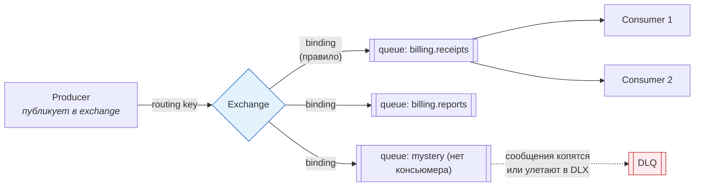
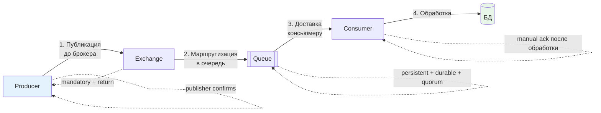
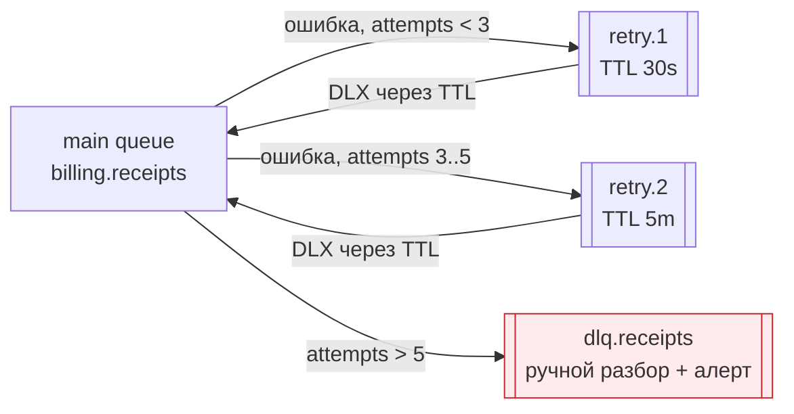
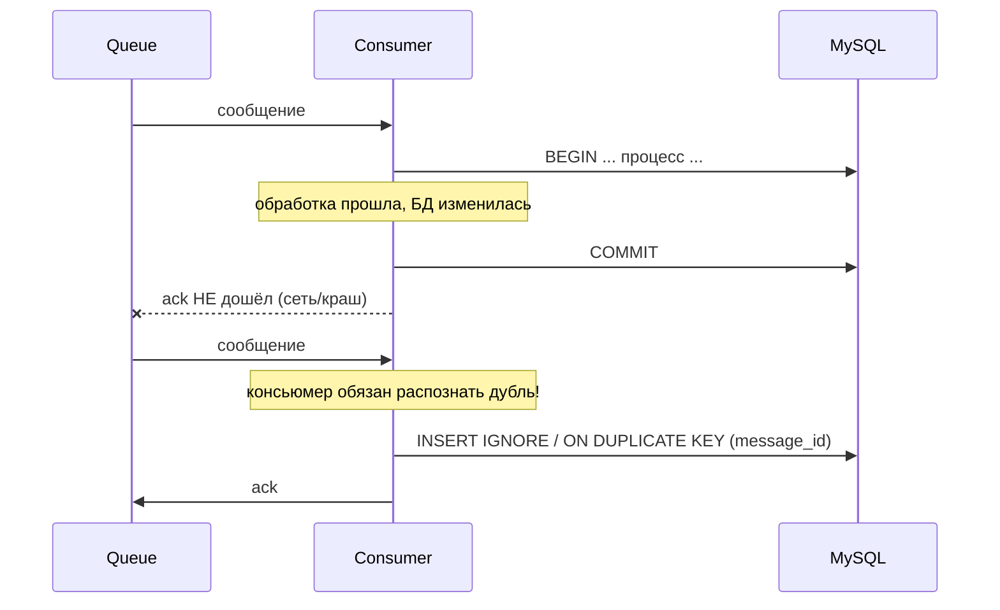

# 01. RabbitMQ: модель, надёжность, очереди, DLQ

> **Что проверяют.** Требование: «Опыт работы с RabbitMQ». Проверяют три вещи:
> **(1)** понимаешь ли, что доставка **не гарантирована** по умолчанию и что нужно
> настроить с обеих сторон; **(2)** знаешь ли, что значит **at-least-once** и почему
> из этого следует идемпотентный консьюмер; **(3)** умеешь ли сделать так, чтобы сообщение
> не потерялось, не зациклилось и не утонуло в retry-шторме.
>
> Здесь: AMQP-модель, маршрутизация, подтверждения, ретраи, DLQ, порядок, приоритеты,
> quorum-очереди, и готовые ответы на «а если».

---

## 1. Модель AMQP: exchange, queue, binding



**Ключевая мысль, которая отличает понимание от заучивания:**

> «Producer **не знает** про очереди. Он публикует в exchange с routing key. Exchange по
> bindings решает, куда положить. Если ни одно binding не подошло — сообщение **молча
> выбросится**, если не включён флаг `mandatory`. Это частая причина „мы точно отправили,
> а ничего не произошло“.»

### Типы exchange

| Тип | Как маршрутизирует | Где применять в биллинге |
|---|---|---|
| `direct` | точное совпадение routing key (`receipt.requested`) | команды: «сформировать чек», «опубликовать реестр» |
| `topic` | шаблон с `*` (одно слово) и `#` (много) | события: `payment.*.paid`, `receipt.#` — подписка гибкая |
| `fanout` | всем очередям, ключ игнорируется | «оповестить всех»: аудит, аналитика, шина инвалидации кэша |
| `headers` | по заголовкам, не по ключу | редко; когда ключ неудобен. Медленнее |
| `default` (`""`) | по имени очереди = routing key | простые случаи; ❌ не рекомендую для биллинга (неявная зависимость) |

**Практическое правило для биллинга:** события — `topic` (гибкая подписка, новым сервисам
не нужно менять producer), команды — `direct`. Ключи: `domain.entity.event`
(`billing.payment.paid`, `billing.receipt.requested`).

### Свойства сообщения, которые надо знать

| Свойство | Смысл | Зачем в биллинге |
|---|---|---|
| `delivery_mode = 2` | персистентное сообщение | иначе переживёт не перезапуск брокера |
| `message_id` | идентификатор сообщения | **durable-идемпотентность у консьюмера** (уникальный ключ в БД) |
| `correlation_id` | связать запрос/ответ или цепочку событий | трейсинг: «где же мой чек» |
| `content_type` / `type` | формат и тип события | версионирование событий |
| `headers` | произвольные метаданные (например, `retry_count`) | **ретраи без создания бесконечных очередей** |
| `timestamp` / `expiration` | время / TTL сообщения | «не обрабатывать вчерашнее» |
| `priority` | приоритет | приоритетные очереди (`x-max-priority`) — с оговорками |

Практический совет из опыта: **всегда заполняй `message_id`** (UUID) и `correlation_id`
(например, `payment_id`). Это даёт: идемпотентность на стороне консьюмера и возможность
найти сообщение в трейсах.

---

## 2. Надёжность: где сообщения теряются

Сообщение может потеряться в **четырёх** местах. Это готовый каркас ответа.



| Точка потери | Причина | Защита |
|---|---|---|
| **1. Публикация** | сеть упала, брокер недоступен, буфер переполнен | `publisher confirms` (ждём подтверждение) + `mandatory` (вернуть несообщённые) + `publisher returns` |
| **2. Маршрутизация** | нет очереди/привязки, очередь удалена | `mandatory=true` + alternate exchange (`x-alternate-exchange`) для «некуда положить» |
| **3. Хранение** | не персистентное сообщение, один узел упал | `delivery_mode=2` + `durable` queue + **quorum queue** (Raft, копии на узлах) |
| **4. Обработка** | консьюмер упал до завершения работы / после `ack` но до сохранения | `manual ack` **после** успешной обработки; идемпотентность; `prefetch` |

### Publisher confirms — как это выглядит в коде

```php
<?php
declare(strict_types=1);

$channel->confirm_select();                     // включить режим подтверждений
$channel->set_ack_handler(fn ($msg) => $this->log->debug('published', ['id' => $msg->getDeliveryTag()]));
$channel->set_nack_handler(fn ($msg) => $this->log->error('NOT published', [...]));

$channel->set_return_listener(function (
    int $replyCode, string $replyText, string $exchange, string $routingKey, $properties, string $body
) {
    // Сообщение НЕ попало ни в одну очередь — это не "ничего не случилось", это инцидент.
    $this->log->error('Message returned by broker (unroutable)', [
        'routing_key' => $routingKey, 'body' => $body, 'reply' => $replyText,
    ]);
    // Нужно алертить и не считать, что событие доставлено.
});

$msg = new AMQPMessage($payload, [
    'delivery_mode' => AMQPMessage::DELIVERY_MODE_PERSISTENT,   // 2
    'message_id'    => $eventId,
    'correlation_id'=> $paymentId,
    'content_type'  => 'application/json',
    'type'          => 'receipt.requested',
    'mandatory'     => true,                                    // вернуть, если некуда положить
]);

$channel->basic_publish($msg, 'billing.events', 'receipt.requested');
$channel->wait_for_pending_acks(timeout: 5.0);   // дождаться подтверждения (или использовать wait_for_pending_acks_returns)
```

**Тезис, который надо произнести:** «Публикацию я считаю успешной только после подтверждения
брокера. Но даже тогда есть окно „опубликовано, а обработки нет“ — поэтому источник истины
всё равно в БД, в таблице `outbox`. Именно поэтому мы не „публикуем из бизнес-логики“, а
пишем событие в outbox в транзакции и публикуем отдельным процессом.»

### Consumer: `ack` только после обработки, `prefetch` для контроля нагрузки

```php
$channel->basic_qos(prefetch_size: 0, prefetch_count: 10, a_global: false);

$channel->basic_consume('billing.receipts', '', false, false, false, false,
    function (AMQPMessage $msg) use ($channel) {
        try {
            $this->handler->handle($msg->body, $msg->get('message_id'));   // идемпотентно!
            $channel->basic_ack($msg->getDeliveryTag());                   // ack ПОСЛЕ обработки
        } catch (TransientError $e) {
            // временная ошибка (ОФД недоступен, дедлок в БД) → вернуть в очередь с задержкой
            $channel->basic_nack($msg->getDeliveryTag(), false, requeue: true);  // см. осторожность ниже
        } catch (\Throwable $e) {
            // логическая/неисправимая ошибка → в DLQ, не крутить вечно
            $channel->basic_nack($msg->getDeliveryTag(), false, requeue: false); // → DLX/DLQ
        }
    });
```

**Критически важная оговорка, которую ценят:** `basic_nack(..., requeue: true)` **не даёт
задержки** — сообщение немедленно возвращается в начало очереди и будет тут же снова
доставлено. При постоянной ошибке это **петля, которая сжигает CPU** и не даёт обработать
остальное. Правильный паттерн — retry с задержкой через отдельную очередь (см. §4).

---

## 3. `prefetch`, конкурентность и «медленный консьюмер»

| Настройка | Что делает | Как выбирать |
|---|---|---|
| `prefetch_count = 1` | по одному сообщению за раз | честная равномерность, но низкая пропускная способность |
| `prefetch_count = 10..100` | держит пачку «в работе» | баланс: throughput vs «размазывание» | 
| `prefetch_count = 0` (unlimited) | забирает всё, что видит | ❌ опасно: один консьюмер забирает всю очередь и падает от памяти; остальные простаивают |

**Как объяснить на собеседовании:** «`prefetch` — это сколько сообщений консьюмер держит
неподтверждёнными. Он управляет одновременно и throughput, и справедливостью распределения.
Слишком большой — консьюмер может захватить всю очередь и упасть; слишком маленький —
простой на сетевых задержках. Я начинаю с 10–50 и настрою по метрикам.»

---

## 4. Ретраи: правильные, а не «nack и по кругу»

### Антипаттерн

```
Сообщение падает → nack(requeue=true) → снова в голову очереди → снова падает → ...
Результат: CPU горит, логи растут, остальные сообщения не обрабатываются, нужен ручной
вмешательство (purge очереди).
```

### Правильный паттерн: retry-очереди с TTL + DLQ



```bash
# Очередь ретраев: сообщение лежит, пока не истечёт TTL, потом через DLX возвращается в основную
rabbitmqadmin declare queue name=billing.receipts.retry.30s durable=true \
  arguments='{"x-message-ttl":30000,"x-dead-letter-exchange":"billing.events","x-dead-letter-routing-key":"receipt.requested"}'

# Основная очередь: при ошибке (nack без requeue) отдаёт в DLQ
rabbitmqadmin declare queue name=billing.receipts durable=true \
  arguments='{"x-dead-letter-exchange":"billing.dlx","x-dead-letter-routing-key":"receipt.dlq"}'

# DLQ: без TTL, без автоматической обработки — её читают глазами/скриптом разбора
rabbitmqadmin declare queue name=billing.receipts.dlq durable=true
```

```php
// Увеличение счётчика попыток в заголовке — стандартный приём
$headers = $msg->get('application_headers');
$attempts = (int) ($headers['x-retry-count'] ?? 0) + 1;

$target = match (true) {
    $attempts <= 3  => 'billing.receipts.retry.30s',
    $attempts <= 5  => 'billing.receipts.retry.5m',
    default         => 'billing.receipts.dlq',
};

$channel->basic_publish(new AMQPMessage($msg->body, [
    'delivery_mode' => 2,
    'headers'       => ['x-retry-count' => $attempts, 'x-first-failed-at' => $firstFailedAt],
]), 'billing.dlx', $target);

$channel->basic_ack($msg->getDeliveryTag());   // ← оригинал подтверждаем: мы его "переложили"
```

**Почему это правильно (готовый аргумент):**

* Задержка между попытками есть → временные сбои (ОФД недоступен 2 минуты) лечатся сами.
* Количество попыток ограничено → нет бесконечной петли.
* После исчерпания — DLQ + **алерт**, а не тишина.
* Заголовок с историей попыток сохраняется → при разборе видно, что и когда ломалось.

**Что отвечать на «а почему не RabbitMQ Delayed Message Plugin?»** — потому что он не
входит в стандартный набор и требует установки; TTL+DLX работает на любом брокере. Если
плагин есть — он удобнее (`x-delay`), но принцип тот же. Хороший ответ показывает, что
ты знаешь оба варианта и знаешь цену.

---

## 5. Порядок и дубли: две разные проблемы

### at-least-once — неизбежность, из которой следует идемпотентность



**Правило:** `message_id` сообщения → уникальный ключ в таблице обработки. Тогда повтор —
безопасен. Тезис: **«Доставка at-least-once, поэтому консьюмер at-most-once-по-эффекту:
изменения применяются ровно один раз.»**

### Порядок

RabbitMQ **не гарантирует** порядок между разными консьюмерами и при `requeue`. Внутри одной
очереди с одним консьюмером — сохраняется.

| Нужен порядок? | Решение |
|---|---|
| Порядок не критичен (уведомления, аналитика) | ничего не делаем |
| Порядок в рамках одного платежа | **шардирование по ключу**: N очередей + выбор очереди по `hash(payment_id)`, один консьюмер на очередь |
| Строгий глобальный порядок | вообще не RabbitMQ — single-writer + версионирование/`seq` в БД |
| «Событие устарело, обрабатывать не надо» | проверять версию/`seq` в БД и игнорировать старые (проще, чем гарантировать порядок) |

**Тезис:** «В биллинге строгий порядок обычно заменяют на „состояние в БД решает“: событие
несёт версию или время, консьюмер сравнивает с текущим состоянием и игнорирует устаревшее.
Это надёжнее любых попыток гарантировать порядок доставки.»

---

## 6. Durable queues, quorum queues, кластеры

| Тип очереди | Что это | Когда |
|---|---|---|
| Classic durable | одна копия на узле + зеркалирование (устаревшее) | не критично; устаревающий формат |
| **Quorum queue** (`x-queue-type=quorum`) | Raft-консенсус, данные на большинстве узлов | **для биллинга** — деньги не должны исчезнуть при падении узла |
| Stream queue (`x-queue-type=stream`) | лог с повторным чтением | «событийная лента», воспроизведение истории, много консьюмеров с offset'ами |

```bash
# Quorum-очередь: надёжнее, но чуть дешевле по throughput
rabbitmqadmin declare queue name=billing.receipts durable=true \
  arguments='{"x-queue-type":"quorum","x-delivery-limit":5}'
```

**Про `x-delivery-limit`** (quorum queues): встроенное ограничение числа доставок — сообщение
автоматически уходит в DLX после N попыток. Это **лучше** самодельных счётчиков в заголовках:
меньше кода, надёжнее. Если кластер поддерживает quorum — используй это.

**Кластеры и сети раздела:** RabbitMQ требует, чтобы кворум узлов был доступен; при разрыве
сети часть нод становится недоступной (partition handling). Правильный ответ: «кластер
RabbitMQ — не замена распределённой консистентности. При разрыве сети лучше **отказать в
записи**, чем принять и потерять. Именно поэтому источник истины — БД с её гарантиями,
а брокер — транспорт.»

---

## 7. RabbitMQ vs Kafka (частый вопрос, раз у тебя в резюме оба)

| Критерий | RabbitMQ | Kafka |
|---|---|---|
| Модель | очередь, сообщение исчезает после обработки | лог, сообщения хранятся по retention |
| Подходит для | задачи, команды, RPC-подобная маршрутизация, приоритеты, TTL, сложная маршрутизация | потоки событий, воспроизведение, аналитика, много потребителей с независимыми offset'ами |
| Порядок | на очередь/консьюмера | строгий в пределах партиции |
| Повторное чтение | нет (нужен повтор) | **да**, offset можно отмотать |
| Микросервисы: «одно событие — много потребителей» | fanout/topic exchange, копия каждому | consumer groups, лог один |
| Операционная сложность | ниже | выше |
| Управление потоком | `prefetch`, lizenze | consumer offset, retention |

> **Формулировка:** «В биллинге транспорт я выбираю по задаче. Команды и задачи — RabbitMQ:
> мне нужна маршрутизация, приоритеты, DLQ, задержки, и сообщение не должно храниться
> вечно. Событийную ленту для воспроизведения и аналитики — Kafka: там нужны retention и
> возможность отмотать offset. Оба варианта работают только при идемпотентных консьюмерах,
> поэтому конкретный брокер на корректность денег не влияет — влияет ключ идемпотентности.»

---

## 8. Мониторинг RabbitMQ: что смотреть дежурному

| Метрика | Порог/сигнал | Что значит |
|---|---|---|
| `messages_ready` (длина очереди) | растёт стабильно N минут | консьюмеры не справляются/упали |
| `messages_unacknowledged` | растёт | консьюмеры «зависли» с неподтверждёнными |
| `consumers` | 0 при непустой очереди | **алерт уровня p1**: никто не читает |
| `message_stats.publish_rate` vs `deliver_rate` | расхождение | либо заторы, либо потери |
| Размер DLQ | > 0 | ручной разбор, алерт |
| `disk_free` / memory alarms | близко к лимиту | блокировка публикации, деградация |
| `connection/channel` count | аномальный рост | утечка соединений |

```bash
# Быстрая проверка руками (то, что делает дежурный)
rabbitmqctl list_queues name messages_ready messages_unacknowledged consumers
rabbitmqctl list_queues name messages messages_ready message_stats.publish_details.rate
rabbitmqctl list_connections user peer_host state
rabbitmqctl list_bindings
rabbitmqctl eval 'rabbit_amqqueue:list().'   # диагностика очередей
```

**Runbook-фраза:** «Если очередь растёт — я смотрю в порядке: (1) есть ли консьюмеры;
(2) не зависли ли они (`unacked`); (3) не упал ли внешний сервис, который они вызывают;
(4) не появились ли сообщения, которые стабильно падают (тогда они в retry/DLQ, а не в
очереди). Без этого „просто увеличить число консьюмеров“ лечит симптом: если ошибка
логическая, реплики только ускорят рост DLQ.»

---

## 9. Готовый ответ вслух (2 минуты)

> «RabbitMQ в биллинге — это транспорт между синхронным приёмом денег и асинхронными
> следствиями: фискализация, отчётность, уведомления, вебхуки наружу.
>
> Три принципа, на которых всё держится. Первый: доставка **at-least-once**, потому что
> подтверждение может потеряться после обработки. Значит, консьюмер обязан быть
> идемпотентным — у меня в БД есть уникальный ключ по `message_id` события, а не проверка
> в коде.
>
> Второй: публикация — только с `publisher confirms` и `mandatory`, чтобы не было молчаливой
> потери «некуда положить». Но даже этого недостаточно, поэтому источник истины — таблица
> `outbox` в той же транзакции, что и изменение денег: событие записано тогда и только
> тогда, когда деньги изменены.
>
> Третий: ретраи — с задержкой и с границей. `nack с requeue` без задержки даёт петлю и
> сжигает CPU, поэтому retry идёт через очереди с TTL и DLX, попытки ограничены, и после
> исчерпания — DLQ и алерт. Ещё лучше — quorum-очереди со встроенным `x-delivery-limit`.
>
> Про порядок: я не пытаюсь гарантировать порядок доставки, а делаю так, чтобы состояние
> решало в БД: событие несёт версию, консьюмер игнорирует устаревшее. Это надёжнее и проще,
> чем бороться за FIFO между консьюмерами.»

---

## 10. Красные флаги в этой теме

* ❌ «RabbitMQ гарантирует доставку» — без подтверждений и идемпотентности не гарантирует.
* ❌ `ack` **до** обработки (или auto-ack для денег).
* ❌ `nack(requeue=true)` как retry-стратегия.
* ❌ `prefetch = 0` при тяжёлой обработке.
* ❌ Не знать про `mandatory`/`publisher returns`.
* ❌ Считать, что отдельный брокер избавляет от необходимости хранить состояние в БД.
* ❌ Не иметь DLQ и алерта на неё.

## Чек-лист по этому файлу

- [ ] Объясняю модель exchange/queue/binding и что будет без привязки.
- [ ] Могу назвать 4 точки потери сообщения и защиту от каждой.
- [ ] Знаю, что `nack+requeue` — не retry, и умею сделать retry через TTL+DLX.
- [ ] Могу объяснить, почему at-least-once требует идемпотентного консьюмера.
- [ ] Знаю, как решать проблему порядка (версия/состояние в БД, шардирование).
- [ ] Знаю про quorum queues и `x-delivery-limit`.
- [ ] Могу ответить, когда Kafka, а когда RabbitMQ.
- [ ] Помню метрики очереди, которыми пользуюсь в дежурстве.
