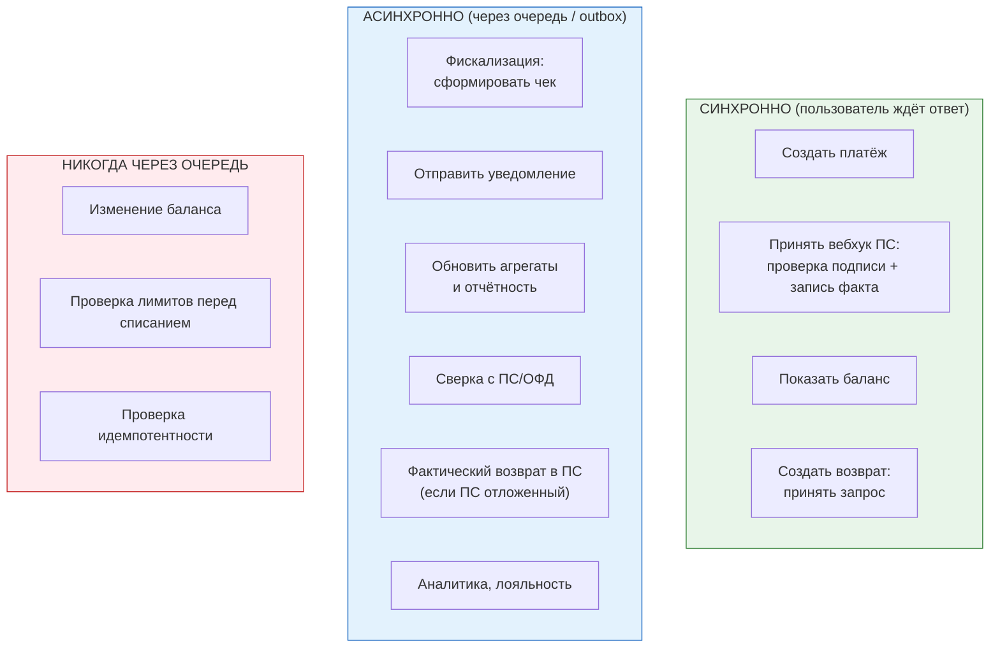
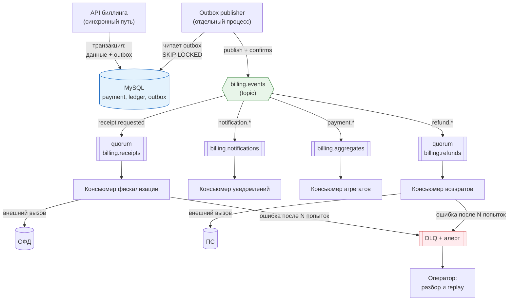

# 02. Очереди в биллинге: где именно и зачем

> **Что проверяют.** Умеешь ли ты **выбрать**, что должно быть синхронным, а что
> асинхронным — и объяснить цену. Это вопрос архитектурного вкуса: в биллинге нельзя
> «отправить в очередь всё», потому что пользователь должен видеть результат, а деньги —
> быть консистентными.
>
> Здесь: карта «синхронно / асинхронно» по операциям биллинга, конкретные очереди с их
> гарантиями, идемпотентный консьюмер целиком, outbox-publisher и порядок разбора
> «событие не обработалось».

---

## 1. Карта: что синхронно, а что через очередь



**Правило, которое надо произнести:**

> «Через очередь можно отправить **следствие**, но не **решение**. Деньги, лимиты и
> идемпотентность — это решения, они внутри транзакции. Чек, письмо, агрегат — следствия,
> они асинхронны. Если я отправлю в очередь „списать деньги“, я потеряю возможность
> ответить клиенту „нельзя, недостаточно средств“.»

**Второе правило** — «почему чек не может быть в синхронном ответе ПС»:

> «Вебхук от ПС — критичный по времени. Если я внутри него вызову ОФД, я завишу от чужого
> сервиса: он ответит за 8 секунд, ПС решит, что таймаут, и повторит вебхук. Плюс
> `publisher confirms` и внешние вызовы в одной транзакции — то, чего делать нельзя.
> Поэтому: записал факт оплаты + положил событие в outbox → ответил 200 за миллисекунды.
> Чек — отдельно.»

---

## 2. Конкретные очереди биллинга (с гарантиями)

| Очередь | Тип | Producer | Consumer | Что если не обработать |
|---|---|---|---|---|
| `billing.receipts` | quorum, `direct` | `outbox-publisher` | сервис фискализации | деньги есть, документа нет → юридический риск, алерт |
| `billing.notifications` | classic | outbox | сервис уведомлений | клиент не узнал → тикет в поддержку |
| `billing.aggregates` | classic | outbox | сервис агрегатов/отчётности | отчёты отстают, сверка ручная |
| `billing.refunds` | quorum, `direct` | API возвратов | воркер возвратов в ПС | возврат «завис» → претензия клиента |
| `billing.reconciliation` | classic (по расписанию) | планировщик | реконсилер | расхождения копятся |
| `billing.webhooks.out` | classic, **retry-очереди** | outbox | воркер исходящих вебхуков | наш партнёр не знает о событии |

**Почему фискализация — quorum-очередь:** потеря сообщения «сделать чек» означает, что
чек не выпущен. Это не «потом доделаем» — это нарушение 54-ФЗ. Поэтому: quorum (репликация),
durable, persistent, DLQ + **алерт по отставанию** (см. `05-billing-domain/03-receipts-54fz.md`).

**Почему исходящие вебхуки требуют особого отношения:** наш партнёр тоже может быть недоступен.
Значит: retry с backoff, ограничение попыток, «мертвая» очередь для ручного разбора,
и **идемпотентный ключ в заголовке** (чтобы партнёр мог распознать дубль). Обязательно
подписывать вебхук (HMAC) и передавать `event_id`.

---

## 3. Идемпотентный консьюмер целиком (код, который стоит рассказать)

```php
<?php
declare(strict_types=1);

/**
 * Консьюмер фискализации.
 *
 * Гарантии, которые он обеспечивает:
 *  1. Событие обрабатывается ровно один раз (по message_id в БД), даже если доставлено N раз.
 *  2. Внешний вызов (ОФД) не живёт внутри транзакции БД.
 *  3. Неуспех классифицирован: временный (retry с задержкой) vs постоянный (DLQ + алерт).
 *  4. ack ставится только после успешного применения результата.
 */
final class IssueReceiptConsumer
{
    public function __construct(
        private readonly PDO $pdo,
        private readonly OfdClient $ofd,             // внешний сервис
        private readonly ReceiptBuilderRegistry $builders,
        private readonly LoggerInterface $log,
        private readonly Metrics $metrics,
    ) {}

    public function consume(AMQPMessage $msg): void
    {
        $messageId = $msg->get('message_id') ?? throw new InvalidArgumentException('message_id required');
        $payload   = json_decode($msg->body, true, flags: JSON_THROW_ON_ERROR);

        // ШАГ 1 (короткая транзакция): "занять" событие. Дубль → выходим.
        $this->pdo->beginTransaction();
        try {
            $stmt = $this->pdo->prepare(
                'INSERT INTO processed_event (source, event_id, payload_hash, processed_at)
                 VALUES ("receipt", :id, :hash, NOW(6))
                 ON DUPLICATE KEY UPDATE id = id'
            );
            $stmt->execute(['id' => $messageId, 'hash' => hash('sha256', $msg->body)]);

            if ($stmt->rowCount() === 0) {
                $this->pdo->commit();
                $this->metrics->increment('receipt.event.duplicate');
                return;                       // уже обработано (или обрабатывается) — ack будет снаружи
            }

            $receipt = $this->createReceiptRow($payload);   // status = 'pending'
            $this->pdo->commit();
        } catch (\Throwable $e) {
            if ($this->pdo->inTransaction()) $this->pdo->rollBack();
            throw $e;
        }

        // ШАГ 2 (вне транзакции): внешний вызов ОФД. Идемпотентность на стороне ОФД —
        // по нашему operation_id внутри запроса (иначе повтор создаст второй чек!)
        try {
            $registered = $this->ofd->register(
                operationId: $receipt->operationId,        // ← наш ключ идемпотентности для ОФД
                fiscalData: $this->builders->for($payload['service_code'])->build($payload),
            );
        } catch (OfdTransientError $e) {
            // ОФД недоступен → помечаем "не зарегистрирован" и бросаем, чтобы сообщение ушло в retry
            $this->markPending($receipt->id, $e->getMessage());
            throw $e;
        } catch (OfdRejectedError $e) {
            // ОФД отклонил (неверные теги, неверная сумма) — это ЛОГИЧЕСКАЯ ошибка,
            // автоповтор не поможет: нужен разбор.
            $this->markRejected($receipt->id, $e->getErrorCode(), $e->getMessage());
            $this->metrics->increment('receipt.rejected');
            throw new PermanentProcessingError($e->getMessage(), previous: $e);
        }

        // ШАГ 3 (короткая транзакция): сохраняем фискальные признаки
        $this->pdo->beginTransaction();
        try {
            $this->pdo->prepare(
                'UPDATE receipt
                    SET status = "printed", fiscal_doc_number = :fd, fiscal_sign = :fs,
                        fiscal_doc_attribute = :fpd, registered_at = NOW(6)
                  WHERE id = :id'
            )->execute([
                'fd' => $registered->docNumber, 'fs' => $registered->sign,
                'fpd' => $registered->fiscalDocAttribute, 'id' => $receipt->id,
            ]);
            $this->pdo->commit();
            $this->metrics->increment('receipt.printed');
        } catch (\Throwable $e) {
            if ($this->pdo->inTransaction()) $this->pdo->rollBack();
            throw $e;
        }
        // ack ставит вызывающий код (или воркер) — только после успешного прохода всех шагов.
    }
}
```

**Что здесь важно (готовый разбор на 90 секунд):**

| Шаг | Почему так |
|---|---|
| 1. `processed_event` с `message_id` | идемпотентность на уровне БД, а не «проверим в коде» |
| 1. Короткая транзакция | не держим лок во время внешнего вызова |
| 2. Внешний вызов вне транзакции | ОФД может ответить за 10 секунд — нельзя держать лок |
| 2. `operationId` для ОФД | **если ОФД поддерживает идемпотентность — используем её**; иначе повтор создаст второй чек, и это уже проблема с налоговой |
| 2. Разделение transient/permanent | временное → retry; логическое → DLQ и алерт. Без этого кода мы получим либо бесконечную петлю, либо молчаливую потерю |
| 3. Отдельная короткая транзакция | состояние меняется только когда внешний факт известен |
| `ack` после всего | иначе сообщение потеряется при краше между `ack` и работой |

**И обязательный тезис про «двойной чек»:**

> «Повторный чек — не косметическая проблема. В 54-ФЗ это лишний документ в ОФД, из-за
> которого данные для налоговой расходятся с фактом расчёта. Поэтому фискальная операция
> обязана быть идемпотентной **на стороне получателя** тоже: мы передаём ОФД наш
> `operation_id`, и повтор возвращает тот же фискальный признак, а не создаёт новый чек.
> Если у провайдера нет идемпотентности — она делается у себя: сначала „намерение
> зарегистрировать“ со статусом pending, потом подтверждение, и перед повтором проверяем,
> не создан ли уже документ.»

---

## 4. Outbox-publisher: как событие попадает в RabbitMQ

```php
<?php
declare(strict_types=1);

/**
 * Публикует события из outbox. Работает отдельным процессом/кроном.
 * Свойства:
 *  - идемпотентность: повторная публикация допустима (консьюмер идемпотентен)
 *  - порядок: по id (ORDER BY id)
 *  - батчи + SKIP LOCKED: несколько publisher-ов не мешают друг другу
 *  - троттлинг: не устроить шторм после недоступности брокера
 */
final class OutboxPublisher
{
    public function __construct(
        private readonly PDO $pdo,
        private readonly ExchangePublisher $rabbit,   // publisher confirms включены
        private readonly Metrics $metrics,
    ) {}

    public function publishBatch(int $limit = 200): int
    {
        $this->pdo->beginTransaction();
        try {
            // ORDER BY id + SKIP LOCKED: сохраняем порядок и не мешаем другим publisher-ам
            $stmt = $this->pdo->prepare(
                'SELECT id, event_type, payload, attempts
                   FROM outbox
                  WHERE published_at IS NULL AND attempts < 10
                  ORDER BY id
                  LIMIT :lim
                    FOR UPDATE SKIP LOCKED'
            );
            $stmt->bindValue('lim', $limit, PDO::PARAM_INT);
            $stmt->execute();
            $rows = $stmt->fetchAll(PDO::FETCH_ASSOC);

            $published = [];
            foreach ($rows as $row) {
                try {
                    $this->rabbit->publish(
                        exchange: 'billing.events',
                        routingKey: $row['event_type'],           // 'receipt.requested'
                        payload: $row['payload'],
                        messageId: "outbox-{$row['id']}",         // ← ключ идемпотентности у консьюмера
                        correlationId: json_decode($row['payload'], true)['payment_id'] ?? null,
                    );
                    $published[] = $row['id'];
                } catch (\Throwable $e) {
                    // брокер недоступен: увеличим attempts и оставим на следующий проход
                    $this->pdo->prepare('UPDATE outbox SET attempts = attempts + 1 WHERE id = :id')
                              ->execute(['id' => $row['id']]);
                    $this->metrics->increment('outbox.publish_failed');
                    // Прерываем батч: если брокер лежит, нет смысла перебирать остальные
                    throw $e;
                }
            }

            if ($published !== []) {
                $in = implode(',', array_fill(0, count($published), '?'));
                $this->pdo->prepare("UPDATE outbox SET published_at = NOW(6) WHERE id IN ($in)")
                          ->execute($published);
            }

            $this->pdo->commit();
            return count($published);
        } catch (\Throwable $e) {
            if ($this->pdo->inTransaction()) $this->pdo->rollBack();
            throw $e;
        }
    }
}
```

**Тонкие места, которые стоит назвать вслух:**

| Место | Почему так |
|---|---|
| `FOR UPDATE SKIP LOCKED` | несколько publisher-ов (или запущенных копий) не мешают друг другу |
| Публикация **внутри** транзакции, но с `published_at` в конце | допустимо: если упадёт между публикацией и `UPDATE`, событие опубликуется повторно — и это **штатно** (консьюмер идемпотентен). Альтернатива — публиковать вне транзакции с двухфазным «забрал → опубликовал → отметил» |
| `attempts < 10` | защита от «вечного» события, которое никогда не опубликуется → алерт на `attempts >= 10` |
| Прерывание батча при ошибке брокера | иначе будем молотить 200 раз в недоступный брокер |
| `messageId = outbox-{id}` | стабильный идентификатор сообщения даже при повторной публикации (ключ идемпотентности у консьюмера) |
| Метрика `outbox.publish_failed` | видно, что брокер/сеть деградирует, до того как очередь опустеет |

**Фраза-маркер:** «Outbox решает главную проблему распределённой системы: нельзя атомарно
записать в БД и отправить в брокер. Мы делаем так, что **событие существует тогда и только
тогда, когда применились данные**, а доставка становится at-least-once и лечится
идемпотентностью консьюмера.»

---

## 5. Разбор: «событие не обработалось». Полный ход мыслей

Это вопрос, который задают почти всегда. Вот готовый «разбор инцидента».

### Ситуация

> «В 03:00 алерт: очередь `billing.receipts` выросла до 40 000. В DLQ 120 сообщений по 40 ₽. Бухгалтерия утром увидит расхождение.»

### Ход разбора (именно в таком порядке)

```
1. МАСШТАБ. Сколько сообщений и на какую сумму? Какие операции затронуты (период, юрлицо,
   вид услуги)? Есть ли это отставание по всем или по одному типу? → это определяет
   приоритет и объём компенсации.

2. ЧТО УПАЛО. Есть ли консьюмеры (metrics: consumers > 0)? Работают ли они (unacked растёт)?
   Не упал ли сервис фискализации (решён ли релиз/деплой)?
   → Если консьюмеров нет — это p1: поднять.

3. ПОЧЕМУ. Смотрим логи консьюмера и DLQ:
   - ОФД недоступен (таймауты) → временное: retry сам разгребёт.
   - ОФД отклоняет (неверные теги) → логическое: автоповтор не поможет, нужен фикс + повтор.
   - Дедлок/ошибка БД → временное, retry.
   - Изменился формат события/схема БД → логическое: сообщения в DLQ, нужен маппинг.

4. НЕ ДЕГРАДИРОВАТЬ. Не «увеличить консьюмеров», если ошибка логическая — будет больше DLQ.
   Не purge-ить очереди. Не править данные руками в БД.

5. ВОССТАНОВЛЕНИЕ. DLQ не «читаем глазами», а:
   - отфиксировать причину (код/настройка),
   - повторить из DLQ тем же идемпотентным обработчиком (replay),
   - проверить, что двойных чеков не создалось (идемпотентность на стороне ОФД!),
   - сверить количество чеков за период с количеством оплат.

6. СВЕРКА. После дожима — обязательно сверить: "оплачено за период" = "чеков выпущено".
   Если не сходится — построчный разбор по конкретным операциям.

7. ЧТО ДОБАВИТЬ, ЧТОБЫ НЕ ПОВТОРИЛОСЬ.
   - алерт на «чеки отстают больше N минут» (а не только на длину очереди!);
   - алерт на непустой DLQ;
   - healthcheck консьюмера;
   - если ОФД отваливается регулярно — circuit breaker + «режим накопления»;
   - runbook в Confluence/README.
```

> **Главный акцент в ответе:** «Самое опасное здесь — не отставание, а **незаметное**
> отставание. Поэтому метрика „чеки отстают“ должна быть отдельной, доменной, а не
> технической „длина очереди“: очередь может быть пустой, а 500 платежей без чека —
> потому что события вообще не были созданы (ошибка до outbox). Идеально, если это
> проверяется SQL-инвариантом каждые 5 минут (см. `02-mysql/04-explain-and-sql-tasks.md`,
> Задача 3).»

---

## 6. Псевдо-архитектура очередей биллинга (то, что можно нарисовать на доске)



---

## 7. Задачи и вопросы с разбором

### Вопрос 1. «Будет ли событие обработано ровно один раз?»

**Разбор:** нет и не нужно. Доставка — at-least-once. Эффект — ровно один раз, потому что
консьюмер идемпотентен (уникальный `message_id` в `processed_event`, плюс идемпотентность
на стороне внешней системы). **Правильный ответ всегда содержит обе части.**

### Вопрос 2. «Что делать, если консьюмер обработал, но `ack` не отправился?»

**Разбор:** сообщение придёт снова, консьюмер увидит дубль по `message_id` и ответит
«уже обработано» → `ack`. Данные не изменятся. Это нормальный сценарий, а не ошибка.

### Вопрос 3. «Сообщение всегда падает. Что произойдёт?»

**Разбор (без правильного ответа это провал):** если `nack(requeue=true)` — **бесконечная
петля**, сообщение немедленно вернётся и снова упадёт; очередь встанет, CPU горит.
Правильно: лимит попыток (в заголовке или `x-delivery-limit` для quorum) → DLQ → **алерт**.
Плюс классификация ошибок: логическая ошибка не должна идти в retry вообще.

### Вопрос 4. «Нужно, чтобы чек формировался через 15 минут после оплаты (услуга оказывается позже). Как?»

**Разработка:** хранение «когда фискализировать» вместе с событием (поле `process_after`),
а delayed-выборка либо через TTL-очереди/плагин задержки, либо (надёжнее) через **таблицу
расписания в БД** + опрос. Объяснить: «Задержка внутри брокера — это удобно, но
дополнительное состояние вне БД. Если срок юридически значимый (чек должен быть ровно тогда,
когда оказана услуга), я предпочту хранить „когда“ в БД, потому что это факт учёта,
а не транспортная деталь.»

### Вопрос 5. «Событие пришло устаревшее (платёж уже возвращён). Что делать?»

**Разбор:** не полагаться на порядок. В событии есть версия/время. Консьюмер читает текущее
состояние (с `FOR UPDATE`), сравнивает и **игнорирует устаревшее**, логируя факт. Никаких
«откатов назад в состоянии» по устаревшему событию.

### Вопрос 6. «Хотим отправить вебхук партнёру. Какие гарантии?»

**Разбор:** at-least-once с retry и идемпотентным `event_id` в заголовке; HMAC-подпись;
таймаут и ограничение попыток; DLQ для разбора; **накопление и повторная отправка**
(партнёр может вернуться). И обязательное: не блокировать денежный путь ожиданием партнёра.

---

## 8. Красные флаги в этой теме

* ❌ «Отправим списание в очередь» (решение не может быть асинхронным).
* ❌ Фискализация внутри синхронного обработчика вебхука.
* ❌ «Порядок гарантирует RabbitMQ» без оговорок.
* ❌ Нет DLQ, нет алерта на отставание чеков.
* ❌ Replay из DLQ «тем же обработчиком» без проверки идемпотентности на стороне ОФД/ПС.
* ❌ Отправка вебхука партнёру внутри денежной транзакции.

## Чек-лист по этому файлу

- [ ] Могу нарисовать карту «синхронно / асинхронно / никогда через очередь».
- [ ] Помню, почему фискализация — quorum + DLQ + алерт по отставанию.
- [ ] Могу рассказать идемпотентный консьюмер по трём шагам.
- [ ] Объясняю outbox-publisher и почему повторная публикация — это нормально.
- [ ] Готов разбор «событие не обработалось» по 7 шагам.
- [ ] Знаю, что для «через 15 минут» я предпочту расписание в БД, а не задержку в брокере.
