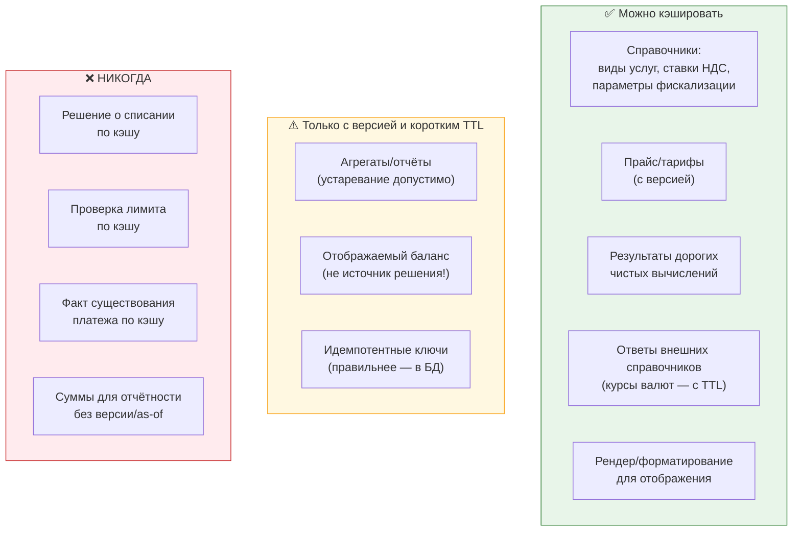

# 01. Redis и Memcached: где что применять в биллинге

> **Что проверяют.** Требование вакансии: «Memcached или Redis». Прямой вопрос-разделитель:
> понимаешь ли ты, что Memcached — это **только KV-кэш**, а Redis — больше и **опаснее**
> (структуры, TTL, атомарные операции, персистентность, кластер с оговорками).
> И, что важнее для биллинга: **что вообще можно кэшировать**, а что категорически нельзя.
>
> Здесь: честное сравнение, стратегии кэширования с инвалидацией, локи, идемпотентность,
> rate limiting, защита от «горячих ключей» и «лавины», и правила «что не кэшируем никогда».

---

## 1. Сравнение: таблица, которую надо знать

| Критерий | Memcached | Redis |
|---|---|---|
| Модель данных | только строки/блоб по ключу | строки, хеши, списки, множества, sorted sets, streams, bitmaps, Geo, HyperLogLog |
| Атомарные операции | только `incr/decr`, `cas` | `INCR`, `SETNX`, транзакции `MULTI/EXEC`, Lua-скрипты |
| TTL | на ключ | на ключ (и `EXPIRE`/`PEXPIRE`), плюс TTL элемента в некоторых структурах |
| Персистентность | ❌ нет (только кэш) | ✅ RDB-снапшоты и/или AOF-лог |
| Репликация | ❌ (только клиентский шардинг) | ✅ реплики, Sentinel (failover), Cluster (шардирование) |
| Память | очень эффективна, multi-thread | одно-поточный (до 6.0; сейчас I/O-потоки + шардинг на процесс), больше накладных расходов |
| Кластер | клиентский шардинг (consistent hashing) | Redis Cluster (16384 слота), либо Sentinel + клиентский шардинг |
| Локи/расписания | нельзя | `SET NX PX`, Lua (осторожно с Redlock — см. §4) |
| Pub/Sub | ❌ | ✅ (`PUBLISH`/`SUBSCRIBE`), Redis Streams как лог |
| Кэш больших количеств мелких объектов | ✅ лучше | хорошо, но чуть дороже по памяти |
| Типичная роль | «кэш ответов и справочников» | «кэш + структуры + локи + счётчики + rate limit» |

**Готовый ответ:** «Memcached — это очень быстрый и простой KV-кэш с минимумом накладных
расходов. Redis — больше, чем кэш: структуры, атомарные операции, TTL, персистентность,
репликация, кластер. В биллинге я использую Memcached (или Redis в режиме простого KV)
для справочников и «дорогих чистых функций», а Redis — там, где нужны структуры и
атомарность: счётчики, локи, rate limiting, идемпотентные ключи. И держу границу:
**по кэшу нельзя принимать денежное решение** — только ускорять чтение.»

---

## 2. Что можно и что нельзя кэшировать в биллинге



**Формулировка, которая работает:** «Кэш — это **оптимизация чтения**, а не источник правды.
Правило простое: если на основании данных принимается решение о деньгах, эти данные нельзя
брать из кэша. Баланс можно показать из кэша — но списание считать по БД.»

**Почему это не «теория», а реальные аварии:**

| Что сделали | Что случилось |
|---|---|
| Кэшировали баланс на 60 секунд | пользователь пополнил, увидел старый баланс, пополнил ещё; саппорт разбирался |
| Кэшировали «уже обработанные idempotency-ключи» | при падении Redis — повторная обработка и двойное зачисление |
| Кэшировали лимит | два платежа одновременно прошли «проверку» — лимит превышен |
| Кэшировали список платежей без версии | в кабинете «пропал» только что совершённый платёж |

---

## 3. Стратегии кэширования и инвалидация

### Cache-Aside (основная стратегия)

```php
final class ServiceCatalogCache
{
    public function __construct(
        private readonly Cache $cache,          // Memcached или Redis
        private readonly ServiceCatalog $db,
        private readonly int $ttl = 300,
    ) {}

    public function byCode(ServiceCode $code): ServiceConfig
    {
        $key = "catalog:v3:service:{$code->value}";     // ← версия в ключе (см. ниже)

        $cached = $this->cache->get($key);
        if ($cached !== null) {
            return ServiceConfig::fromArray($cached);
        }

        $config = $this->db->byCode($code);              // источник правды
        $this->cache->set($key, $config->toArray(), $this->ttl);
        return $config;
    }
}
```

### Три механизма инвалидации (все три нужны)

| Механизм | Как | Плюс/минус |
|---|---|---|
| **TTL** | сам протухает | никогда не «залипнет» навсегда; но до TTL данные могут быть старые |
| **Явная инвалидация** | `DELETE key` при изменении справочника (в админке) | свежесть сразу; но надо не забыть во всех путях изменения |
| **Версия в ключе** | `catalog:v3:...`, при изменении → `v4` | просто и надёжно: старое само «исчезает» из обращения; минус — мусор до TTL |
| **Событие** | publisher публикует `catalog.updated`, все инстансы чистят локально | распределённая инвалидация; сложнее |

**Рекомендация для биллинга:** TTL + версия в ключе + явная инвалидация на изменениях из
админки. Событие — если инстансов много и нужна мгновенность. **Почему версия в ключе
хороша:** никогда не бывает «наполовину инвалидированного» состояния; вместо `DEL` по
паттерну (который в Memcached невозможен, а в Redis опасен на проде) мы просто меняем
версию ключа.

### Инвалидация по паттерну: почему это плохо

```bash
# Redis: удалить все ключи каталога
redis-cli --scan --pattern 'catalog:v3:*' | xargs redis-cli DEL   # ❌ блокирует и опасен на проде
# ПРАВИЛЬНЕЕ: SCAN в цикле маленькими порциями ИЛИ (лучше) версия в имени ключа
redis-cli SCAN 0 MATCH 'catalog:v3:*' COUNT 100
```

`KEYS *` на проде — известная авария: команда блокирует однопоточный Redis на всё время
перебора. Всегда `SCAN`. И лучше вообще не нуждаться в этом — использовать версию в ключе.

---

## 4. Локи на Redis: где уместны и где опасны

### Простой распределённый лок

```php
final class RedisLock
{
    public function __construct(private readonly \Redis $redis) {}

    /** Захватить лок. $token — уникальный, чтобы освободил только владелец. */
    public function acquire(string $resource, int $ttlMs, string $token): bool
    {
        // SET NX PX — атомарная операция: и "проверить отсутствие", и "поставить с TTL"
        return (bool) $this->redis->set(
            "lock:{$resource}", $token, ['nx', 'px' => $ttlMs]
        );
    }

    /** Освободить — ТОЛЬКО если владелец наш (иначе снимем чужой лок) */
    public function release(string $resource, string $token): bool
    {
        // Lua: проверка и удаление одной атомарной операцией (без гонки between GET и DEL)
        $script = <<<'LUA'
            if redis.call('get', KEYS[1]) == ARGV[1] then
                return redis.call('del', KEYS[1])
            else
                return 0
            end
        LUA;
        return (bool) $this->redis->eval($script, ["lock:{$resource}", $token], 1);
    }
}
```

**Три обязательных момента, которые надо назвать (иначе разговор о локах провален):**

1. **`SET NX PX` атомарен.** Отдельные `SETNX` + `EXPIRE` — гонка: процесс упал между ними →
   лок без TTL → **вечный лок** → система встала. Это классическая ошибка.
2. **TTL обязателен** — он защищает от «упавшего владельца». Без TTL лок вечен.
3. **Освобождать только свой лок** (сравнение токена через Lua). Иначе: наш процесс завис
   дольше TTL, лок протух, его взял другой, а мы «освобождаем» — и снимаем **чужой** лок.

### Где локи на Redis **уместны** в биллинге

| Задача | Подходит ли Redis-лок |
|---|---|
| Не запускать два раза одну и ту же cron-задачу | ✅ классическое применение |
| «Только один воркер обрабатывает партицию» | ✅, но лучше `SKIP LOCKED` в БД |
| Защита от повторного нажатия кнопки | ✅ (плюс идемпотентный ключ в БД) |
| **Замена транзакции при списании денег** | ❌ **нет** |
| **Гарантия «ровно один раз»** | ❌ нет — гарантию даёт БД |

**Ключевой тезис (это и есть правильный ответ):**

> «Redis-лок я использую как **оптимизацию** — чтобы не делать лишнюю работу параллельно.
> Но корректность денег он не обеспечивает: если Redis недоступен, лок просто не работает,
> и это не должно приводить к двойному зачислению. Поэтому идемпотентность у меня
> гарантируется **уникальным ключом в БД**, а лок — вспомогательный. Иначе говоря,
> если убрать Redis — система станет медленнее, но не сломается.»

### Redlock: честный ответ

Выражение «Redlock безопасен для распределённых локов» — спорное (Мартин Клеппман
аргументированно критиковал его для случаев, где требуется строгая корректность: при
несинхронизированных часах/GC-паузах возможны нарушения). Правильный ответ на собеседовании:

> «Для задач вида „не запускай две cron-копии“ Redlock-подхода достаточно. Для „гарантировать,
> что списание произойдёт ровно один раз“ — никакой распределённый лок не является
> правильным инструментом, потому что он не даёт корректность при сбое сети и паузах
> процесса. Правильный инструмент — уникальный ключ и транзакция в БД. То есть я выбираю
> по инварианту: „не делать лишнюю работу“ → лок; „не испортить деньги“ → ключ и БД.»

---

## 5. Идемпотентность: Redis или БД?

Частое искушение: «положу идемпотентный ключ в Redis с TTL на сутки — и всё».

| Вариант | Плюс | Проблема |
|---|---|---|
| Redis `SET NX` по ключу идемпотентности | очень быстро, TTL бесплатно | если Redis упал/сброшен → дубли; нет истории; нет связи с транзакцией |
| БД `UNIQUE(idempotency_key)` | гарантия железная, в одной транзакции с изменениями | чуть медленнее (но это одно дерево, мелочь на фоне денег) |
| Оба: Redis как быстрый фильтр, БД как гарантия | скорость + корректность | нужно понимать, что Redis только «ускоряет отказ», а не гарантирует |

**Правильный ответ:** «Гарантия — в БД. Redis может быть быстрым предварительным фильтром
(чтобы отсеять заведомые дубли не доходя до БД), но решение принимает уникальный ключ.
И `processed_event` в БД даёт ещё одно преимущество: **историю** — видно, какие события
приходили и когда, а Redis с TTL всё забывает.»

---

## 6. Защита от «лавины», «горячего ключа» и «снежного кома»

| Проблема | Что происходит | Решение |
|---|---|---|
| **Cache stampede / dogpile** | популярный ключ протух, 500 процессов одновременно идут в БД | (а) single-flight лок на пересчёт; (б) «мягкий TTL»: храним `expires_at` внутри значения, отдаём старое, пока один обновляет; (в) вероятностный ранний пересчёт (XFetch) |
| **Thundering herd после рестарта** | пустой кэш → все запросы в БД | прогревать кэш после деплоя; ограничить конкурентность (connection pool, ограничение запросов) |
| **Hot key** | один ключ читается всеми 10 000 rps | локальный кэш в процессе (APCu) с коротким TTL; реплики на чтение; репликация ключа в N копий с рандомным суффиксом |
| **Кэш «снежный ком»** | кэшируем null/ошибку и потом «всё сломано» | не кэшировать ошибки (или кэшировать с очень коротким TTL + негативный кэш с явной политикой) |
| **Кэш отстал от БД** | в интерфейсе и в БД разные цифры | версия в ключе + инвалидация по событию; для денег — не кэшировать |
| **Память кончилась** | вытеснение горячих ключей (LRU) | лимит памяти и политика вытеснения; отслеживать hit rate и evictions |

```php
/** Single-flight: только один процесс пересчитывает ключ, остальные ждут результат */
final class SingleFlightCache
{
    public function remember(string $key, int $ttl, callable $compute): mixed
    {
        $cached = $this->cache->get($key);
        if ($cached !== null) return $cached;

        $lockKey = "sf:{$key}";
        $token = bin2hex(random_bytes(8));

        if ($this->lock->acquire($lockKey, 5_000, $token)) {
            try {
                $value = $compute();
                $this->cache->set($key, $value, $ttl);
                return $value;
            } finally {
                $this->lock->release($lockKey, $token);
            }
        }

        // Кто-то уже считает: короткая пауза и попытка взять из кэша ещё раз
        usleep(50_000);
        return $this->cache->get($key) ?? $compute();   // фолбэк: посчитать самому
    }
}
```

---

## 7. Счётчики, rate limiting, агрегация

```php
/** Rate limit: не больше N операций на пользователя в окне */
final class RateLimiter
{
    public function __construct(private readonly \Redis $redis) {}

    public function allow(string $userId, int $limit, int $windowSec): bool
    {
        $key = "rl:pay:{$userId}:" . floor(time() / $windowSec);   // окно в ключе
        // INCR атомарен; EXPIRE ставим только при первом инкременте
        $count = $this->redis->incr($key);
        if ($count === 1) {
            $this->redis->expire($key, $windowSec + 1);
        }
        return $count <= $limit;
    }
}
```

**Оговорки, которые надо произнести:**

* Фиксированное окно даёт эффект «двойного лимита на границе» — если это критично, нужен
  скользящий лог (sorted set с `ZADD` + `ZREMRANGEBYSCORE`) или token bucket на Lua.
* Счётчики «числа операций» в Redis могут разойтись с БД при сбое — они для защиты, а не для
  отчётности. **Деньги в счётчиках Redis не живут.**
* `INCR` + `EXPIRE` двумя командами = гонка (процесс упал между ними → ключ без TTL).
  Правильно — Lua-скрипт или `SET` с TTL при первом инкременте.

**Про Redis-транзакции:** `MULTI/EXEC` даёт «всё или ничего по отправке», но **не** откатывает
при ошибке выполнения команды (в отличие от SQL-транзакции). Для денег это принципиально:
**Redis не заменяет транзакцию БД** ни при каких настройках.

---

## 8. Эксплуатация: что смотреть и что настроить

```bash
redis-cli INFO memory            # used_memory, maxmemory, maxmemory_policy
redis-cli INFO stats             # keyspace_hits / keyspace_misses → hit rate
redis-cli INFO replication       # отставание реплик
redis-cli INFO persistence       # rdb_last_save_time, aof_last_bgrewrite_status
redis-cli --bigkeys              # искать большие ключи (плохо для производительности и памяти)
redis-cli --hotkeys              # если включена статистика LFU — найти горячие ключи
redis-cli --latency-history      # всплески задержек (важно: Redis однопоточный)
redis-cli SLOWLOG GET 20         # медленные команды
redis-cli MEMORY USAGE key       # размер конкретного ключа
redis-cli CONFIG GET maxmemory-policy   # noeviction | allkeys-lru | volatile-lru ...
```

| Что настроить | Почему |
|---|---|
| `maxmemory` + `maxmemory-policy` | без лимита Redis съест всю память; `noeviction` = ошибки записи, `allkeys-lru` = вытеснит и «нужные» ключи |
| Разделять инстансы по назначению | кэш (можно вытеснять) отдельно от локов/счётчиков (терять нельзя) — **важно** |
| `appendonly` или RDB | решить, что переживает рестарт (локи — нет, кэш — можно потерять) |
| Таймауты и пул соединений на клиенте | один «залипший» клиент не должен ронять всё |
| Мониторинг hit rate и evictions | деградация кэша = рост нагрузки на MySQL, невидимая пока не поздно |

**Отдельно важное правило для биллинга:** **инстансы разделять.** Кэш справочников и
промежуточные значения могут вытесняться — им это нормально. Счётчики, локи и
rate-limit-ключи вытеснять нельзя (иначе, например, лимит перестанет работать). Обычно это
два разных Redis (или разные логические БД/префиксы и политики, но лучше — разные инстансы).

---

## 9. Ответ вслух (90 секунд)

> «Memcached — простой KV-кэш: очень быстрый, очень экономный по памяти, без структур,
> без персистентности, без репликации; шардинг — на клиенте. Redis — больше: структуры,
> атомарные операции, TTL, репликация, Sentinel/Cluster, Lua-скрипты. Поэтому я их
> различаю по задаче.
>
> Справочники, «горячие» чистые вычисления, курсы — кэширую в любом из них, с TTL и версией
> в ключе. Структуры, счётчики, rate limiting, распределённые локи — Redis.
>
> Но принципиальная граница: **по кэшу нельзя принимать решение о деньгах.** Баланс можно
> показать из кэша на секунду, но списание считать по БД с блокировкой. Идемпотентность
> держится уникальным ключом в БД, а Redis может быть лишь быстрым фильтром сверху.
> Локи на Redis — только как оптимизация: если Redis упадёт, система обязана просто стать
> медленнее, а не потерять деньги.
>
> Из практики: `SET NX PX` вместо `SETNX` + `EXPIRE`, освобождение лока только своим токеном
> через Lua, TTL обязателен, и `SCAN` никогда не заменяю на `KEYS *` на проде.»

---

## 10. Красные флаги в этой теме

* ❌ «Кэширую баланс, чтобы не ходить в базу» — и списываю по кэшу.
* ❌ `SETNX` + `EXPIRE` отдельными командами.
* ❌ `DEL` без сравнения токена при освобождении лока.
* ❌ «Redis гарантирует выполнение ровно один раз» / «Redis-транзакция откатит изменения».
* ❌ `KEYS *` на проде.
* ❌ Не различать Memcached и Redis (ответ «ну, они примерно одно и то же»).
* ❌ Один инстанс для кэша и для локов/счётчиков без политики вытеснения.

## Чек-лист по этому файлу

- [ ] Могу сравнить Memcached и Redis по 6+ критериям.
- [ ] Могу назвать, что кэшировать нельзя (денежные решения, лимиты, факт существования платежа).
- [ ] Знаю три механизма инвалидации и почему версия в ключе удобнее `DEL` по паттерну.
- [ ] Могу написать лок на `SET NX PX` + release через Lua и объяснить, зачем токен.
- [ ] Готов аргумент «лок — оптимизация, гарантия — уникальный ключ в БД».
- [ ] Знаю про stampede / hot key / thundering herd и умею про них рассказать.
- [ ] Помню про `SCAN` вместо `KEYS`, `maxmemory-policy` и разделение инстансов.
