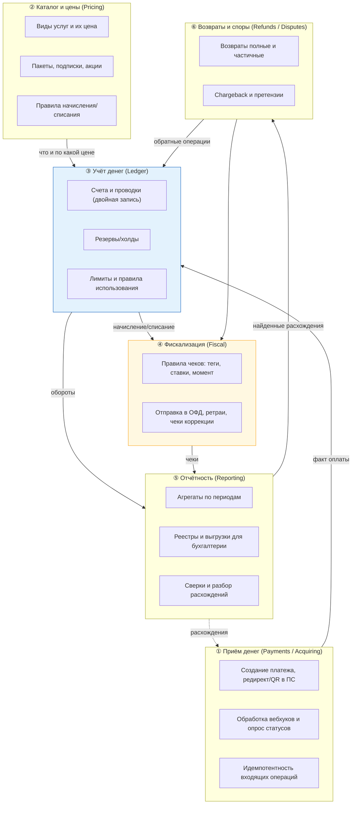
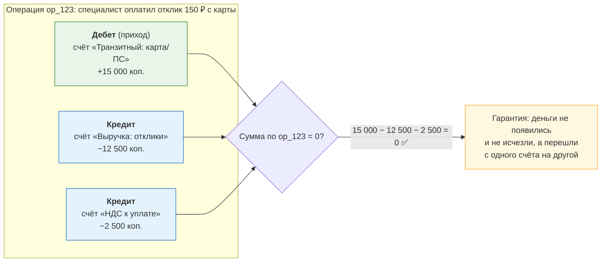

# 01. Карта домена биллинга: сущности, деньги, границы

> **Что проверяют.** Хорошо ли ты понимаешь, что такое биллинг **как домен**, а не как
> набор таблиц. В вакансии: «Разобраться, как устроен текущий биллинг: из каких частей
> состоит, за что они отвечают и как связаны между собой». То есть первое задание —
> буквально составить эту карту.
>
> Здесь: словарь домена, карта контекстов, модель денег (двойная запись — на человеческом
> языке и на примерах «отклик куплен»), инварианты, и разбор «кто владеет какими данными».

---

## 1. Словарь: говори как биллинговый разработчик

| Термин | Что значит | Почему важно |
|---|---|---|
| **Плательщик** | тот, с кого списываются деньги (специалист; в новой модели — клиент) | определяет оферту, чеки, НДС-режим |
| **Продукт / услуга** | то, за что платят (отклик, пакет откликов, продвижение, подписка) | определяет правила фискализации (см. `03-receipts-54fz.md`) |
| **Платёж** (`payment`) | попытка перевода денег от плательщика нам через ПС | «попытка» — важно: платёж может не состояться |
| **Транзакция ПС** (`psp_txn_id`) | идентификатор операции на стороне платёжной системы | ключ для сверки и для разбора |
| **Проводка** (`ledger_entry`) | запись «дебет счёта X, кредит счёта Y на сумму Z» | **это и есть учёт денег**, а не «поле balance» |
| **Счёт / лицевой счёт** (`account`) | место, где учитываются деньги: счёт пользователя, счёт доходов, счёт НДС, транзитный счёт | позволяет видеть «где чьи деньги» |
| **Сальдо / баланс** | сумма проводок по счёту | производная величина, не источник правды |
| **Холд / резерв** | зарезервированная сумма (не списана, но и не доступна) | нужно для предоплаты/авторизации с задержкой |
| **Начисление** | мы должны клиенту (появилось обязательство) | сторона возврата/задолженности |
| **Чек** (`receipt`) | фискальный документ по расчёту (54-ФЗ) | юридический факт, не «уведомление» |
| **Аванс / предоплата** | деньги получены до оказания услуги | требует отдельного чека на зачёт аванса |
| **Зачёт аванса** | момент, когда услуга оказана и аванс «закрыт» | ключевое различие «оплатил» vs «получил услугу» |
| **Возврат** (`refund`) | обратный перевод денег плательщику | отдельная сущность с состоянием и чеком |
| **Сверка / реконсиляция** | сопоставление наших данных с внешними (ПС, банк, ОФД) | способ поймать расхождения |
| **Расхождение** (`discrepancy`) | несоответствие между системами | предмет разбора, а не «мелкий баг» |
| **ОФД** | оператор фискальных данных (получает чеки) | третья сторона в цепочке чеков |
| **СНО** | система налогообложения (ОСНО, УСН и т.д.) | влияет на ставки и на состав чека |
| **НДС** | налог на добавленную стоимость | ставка входит в расчёт и в чек |
| **Юрлицо** | юридическое лицо, от которого/на которое идут деньги | определяет, куда фискализировать и как отчитываться |
| **Chargeback** | оспаривание платежа держателем карты | отдельный процесс со сроками |
| **Период закрыт** | отчётный период сдан, изменения запрещены | корректировки только специальным документом |

**Совет:** на собеседовании используй эти слова так, будто ты в них живёшь. Особенно
`аванс`, `зачёт аванса`, `проводка`, `сальдо`, `реконсиляция`, `расхождение` — они
мгновенно меняют восприятие.

---

## 2. Карта контекстов биллинга (и что с чем не надо смешивать)



**Ключевая мысль о границах (готовый ответ):**

> «Здесь шесть контекстов, и главная ошибка легаси — их смешивать. Если логика чеков
> размазана по коду платежа, а расчёт количества откликов лежит внутри проводок, то любое
> изменение затрагивает всё сразу. Я бы разделял так: **деньги учитываются в одном месте**
> (леджер с двойной записью), **правила чеков — в фискальном контексте как данные**,
> **цены и виды услуг — в прайсе**, а отчётность только читает. Тогда новый вид услуги —
> это прайс + правила чеков, а не правка денежного кода.»

---

## 3. Двойная запись: объяснение «на пальцах» (и зачем она в биллинге)

### Проблема наивной модели

Наивно: у пользователя есть `balance`, при оплате делаем `balance = balance + 1000`.
Проблемы:

* Не видно, **откуда** деньги и **куда** — нет истории и трассировки.
* Непонятно, кто кому должен; невозможно сверить с банком.
* Один `UPDATE` — и непонятно, «мы получили 1000» или «мы начислили кредит».
* Ошибку нельзя «отменить» — нет компенсирующей записи.
* Сальдо нельзя пересчитать из истории (нет истории).

### Решение: проводки с двойной записью

Каждая операция — это **две и более проводок, сумма которых по операции равна нулю**.



**Что это даёт конкретно:**

| Свойство | Как проявляется |
|---|---|
| Деньги не «возникают» | сумма проводок по операции = 0; если не 0 — это баг, который **видно запросом** |
| Прослеживаемость | видно, откуда пришли деньги и куда ушли |
| Сверка с банком | «транзитный счёт ПС» должен соответствовать движениям по банку |
| Корректировки | ошибка не «правится», а компенсируется новой проводкой — история сохраняется |
| Сальдо пересчитывается | `SUM(amount_minor)` по счёту = сальдо; можно сверить в любой момент |
| Аудит | у каждой проводки есть основание (операция, платеж, документ) |

### Правила учётной модели (то, что стоит произнести)

```
1. Проводки только добавляются (append-only). UPDATE и DELETE запрещены.
   Исправление = новая компенсирующая проводка.
2. Сумма проводок одной операции = 0. Это инвариант, проверяемый SQL.
3. Сальдо счёта = сумма его проводок. Никакого отдельного "поля balance"
   в качестве первичного источника (допустимо как денормализованный кэш + сверка).
4. У проводки есть: operation_id, account_id, amount_minor (со знаком), currency,
   created_at, basis (payment_id/refund_id/...), и она не меняется никогда.
5. Валюта: в одной операции не смешиваем валюты; конвертация — отдельная операция
   с явным курсом (иначе нельзя свести балансы).
6. Периоды: проводки нельзя "вписать" в закрытый период без процедуры.
```

**Инварианты SQL (это стоит показать, потому что это и есть «инженерная» часть учёта):**

```sql
-- И1: по каждой операции сумма проводок = 0
SELECT operation_id, SUM(amount_minor) AS s
  FROM ledger_entry
 WHERE created_day >= CURDATE() - INTERVAL 1 DAY
 GROUP BY operation_id
HAVING SUM(amount_minor) <> 0;

-- И2: сальдо счёта = сумма проводок (если сальдо хранится денормализованно)
SELECT a.id, a.balance_minor, SUM(l.amount_minor) AS ledger_sum
  FROM account a LEFT JOIN ledger_entry l ON l.account_id = a.id
 GROUP BY a.id, a.balance_minor
HAVING SUM(l.amount_minor) <> a.balance_minor;

-- И3: по каждому платежу сумма проводок = сумме платежа (для завершённых)
-- И4: сумма по "транзитному" счёту ПС = обороты по реестру ПС (сверка с внешним миром)
```

---

## 4. Как бизнес-событие превращается в проводки (таблица соответствий)

Это тот самый «мостик» между бизнесом и учётом. Держи её в голове — на ней строится
половина практических задач.

| Бизнес-событие | Проводки | Чек | Комментарий |
|---|---|---|---|
| Специалист оплатил отклик картой | Дт «Транзит: эквайринг» ← +150 ₽<br/>Кт «Выручка: отклики» → −125 ₽<br/>Кт «НДС» → −25 ₽ | Чек прихода на 150 ₽ (полный расчёт) | Если деньги поступают с задержкой — транзитный счёт «висит», пока банк не подтвердит |
| Специалист оплатил из **баланса** (внутренний перевод) | Дт «Счёт специалиста» ← +150 ₽<br/>Кт «Выручка» → −125 ₽<br/>Кт «НДС» → −25 ₽ | Чек **на момент оказания** услуги (не на момент пополнения баланса!) | Вот почему баланс — это аванс: чек на пополнение = чек на аванс |
| Специалист пополнил баланс на 1000 ₽ | Дт «Транзит: эквайринг» +1000 ₽<br/>Кт «Авансы полученные» −1000 ₽ | Чек **на аванс** (приход, признак «аванс») | Чек на зачёт — позже, когда услуга оказана |
| Услуга оказана (отклик использован из аванса) | Дт «Авансы полученные» +150 ₽<br/>Кт «Выручка» −125 ₽<br/>Кт «НДС» −25 ₽ | Чек **на зачёт аванса** (признак «зачёт аванса») | Двухэтапная фискализация: аванс → зачёт |
| Возврат специалисту за неоказанную услугу | Дт «Выручка»/«Авансы» …<br/>Кт «Транзит: эквайринг» … | Чек **возврата прихода** | Возврат аванса и возврат выручки — разные предметы расчёта |
| Мы удерживаем комиссию из суммы, оплаченной клиентом | Дт «Транзит» +100%<br/>Кт «Обязательство перед специалистом» −X<br/>Кт «Выручка: комиссия» −Y<br/>Кт «НДС с комиссии» −Z | Чек на наше **вознаграждение** (признак агента) | Агентская схема. Ключевой вопрос: чей это доход |
| Выплата специалисту | Дт «Обязательство перед специалистом» +сумма<br/>Кт «Транзит: выплаты» −сумма | Может быть свой чек/уведомление | Выплатной реестр, отдельная сверка |
| Chargeback (оспорили платёж) | Дт «Потери/споры» …<br/>Кт «Транзит: эквайринг» … | Чек возврата/корректировки по правилам | Плюс блокировка/пересчёт баланса |

**Готовый тезис:** «Бизнес-событие — это „пользователь нажал оплатить“. Учётное событие —
это набор проводок. Между ними есть **маппинг**, и он должен быть явным и тестируемым.
Именно здесь лежит 80% ошибок биллинга: разработчик меняет состояние платежа, но забывает
проводку, или путает „получили деньги“ и „оказали услугу“.»

**И отдельно — самая частая ошибка легаси, которую стоит назвать:** «Оплата прошла» и
«услуга оказана» — разные события, а чек по закону привязывается к **оказанию услуги**, а
не к списанию денег. Если в системе есть только одно событие «оплачено», то либо чеки
формируются неправильно, либо авансы и зачёты не учитываются. Это и есть суть «новых
требований налоговой» — нужно разделить эти два события в модели.

---

## 5. Источник правды и владельцы данных

| Данные | Источник правды | Кто читает | Правило |
|---|---|---|---|
| Факт оплаты | `payment` + проводки | продукты, поддержка, отчётность | не редактируется; только переходы состояния |
| Баланс | **сумма проводок** | продукт (показ), леджер (решения) | денормализованный `balance_minor` — только кэш с обязательной сверкой |
| Чек | `receipt` + данные ОФД | бухгалтерия, ОФД | не перевыпускается; только чек коррекции |
| Цена услуги | прайс (владелец — продукт/финмодель) | биллинг, витрина | не хардкодить в биллинге |
| Правила фискализации | справочник (владелец — биллинг + бухгалтерия) | фискальный сервис | версионируется (со временем!) |
| Отчётность | агрегаты, собираемые биллингом | бухгалтерия | формат согласуется; изменения — как изменение контракта |
| Права на услугу (сколько откликов осталось) | баланс/лимиты продукта | продукт | не должно быть двух владельцев |

**Фраза-маркер:** «Деньги и налоговая отчётность — это данные, где **владелец не
разработчик**: бухгалтерия владеет смыслом, мы владеем корректностью. Поэтому изменения
здесь согласуются, версионируются и покрываются тестами на конкретных кейсах. Правила
фискализации обязательно **версионируются по времени** — потому что ставка или признак
расчёта меняется не для всех сразу и не „задним числом“ для уже выпущенных чеков.»

---

## 6. Разбор: «разберись, из каких частей состоит биллинг» — что говорить

Это может быть **буквально первое задание**. Готовый ответ (структура + порядок):

> «Я бы сделал три шага.
>
> **Первый — карта данных.** Смотрю схему: какие таблицы есть, какая самая большая, какие
> связи. Мне сразу интересны: платежи, проводки/учёт, чеки, справочник услуг, и таблицы
> сверки. По размерам и по количеству индексов видно, что является «горячим», а что
> справочником.
>
> **Второй — карта потоков.** От самой критичной цепочки: „пользователь платит“ → от какого
> момента зависит активация услуги → когда формируется чек → как данные уходят в отчётность.
> Здесь меня интересует, где точки согласованности: между оплатой и активацией, между
> оплатой и чеком, между чеком и отчётностью. Это места, где появляются расхождения.
>
> **Третий — карта ответственности.** Кто владеет каждой сущностью: где код, где админка,
> где ручные правки. Мне важно понять, какие данные меняются вне основного пути — потому
> что именно там живут незаметные проблемы, и именно туда нужен аудит.
>
> Практический результат первого месяца: **актуальная ER-схема** и документ по флоу платежа
> с точками согласованности и расхождений. Это полезно и мне, и команде — и снижает риск,
> что знание о системе живёт в одной голове.»

---

## 7. Задачи

### Задача 1. «Пользователь дважды нажал „Оплатить“, у него списалось дважды. Где в модели ошибка?»

**Разбор:** модель не разрешает идемпотентность на уровне данных. Правильно: у платежа есть
`idempotency_key`, сформированный клиентом/сервером один раз на «намерение заплатить»;
UNIQUE-ключ в БД; повторный запрос возвращает **тот же** платёж и тот же ответ. Второй уровень
защиты — на стороне ПС (передаём наш ключ) и в проводках (UNIQUE по `operation_id`).
**И ни в коем случае нельзя** решать это «флагом в UI».

### Задача 2. «Как понять, сходится ли учёт?»

**Разбор (это и есть ответ «как проверяешь биллинг»):** четыре инварианта из §3 +
сверка с внешним миром: (1) сумма проводок по операции = 0; (2) сальдо = сумма проводок;
(3) суммы по платежу сходятся; (4) оборот по транзитному счёту ПС = реестр ПС; (5) количество
чеков = количеству оплат, по которым чек полагается. Всё это должно быть автоматическими
проверками с алертами, а не «раз в квартал посчитаем».

### Задача 3. «Откуда в системе появилась „задолженность“ пользователя, если у нас оплата вперёд?»

**Разбор:** возможные источники: (а) возврат привёл к отрицательному балансу
(«вернули больше, чем внесли»); (б) постоплата (оказали услугу, потом списали, а денег нет);
(в) chargeback отозвал уже потраченные деньги; (г) ошибка ручной правки.
Правильный ответ начинается с разделения: «то, что мы учли, что пользователь внесёт» и
«то, что фактически получено». И с вопроса «а у нас вообще разрешена постоплата?» — потому
что от этого зависит, ошибка это или нормальная модель.

### Задача 4. «Как бы ты хранил баланс: полем или суммой проводок?»

**Разбор:** источник правды — проводки. Поле `balance_minor` — денормализованный кэш для
быстрого чтения, обновляемый **в той же транзакции** что и проводка, с обязательной сверкой
(sum = баланс) и алертом на расхождение. Причина: сумма проводок по счёту с миллионами
записей — дорогой запрос; но баланс без сверки — это второй, независимый источник правды,
который со временем обязательно разойдётся.

---

## Чек-лист по этому файлу

- [ ] Могу рассказать про 6 контекстов и почему их нельзя смешивать.
- [ ] Объясняю двойную запись на примере «купил отклик» и знаю 6 правил учётной модели.
- [ ] Могу назвать 4 SQL-инварианта учёта.
- [ ] Помню разницу «получили деньги» / «оказали услугу» и как это влияет на чеки.
- [ ] Готов ответ «как разберёшься в биллинге» по трём картам (данные, потоки, ответственность).
- [ ] Могу объяснить, почему баланс — не источник правды.
