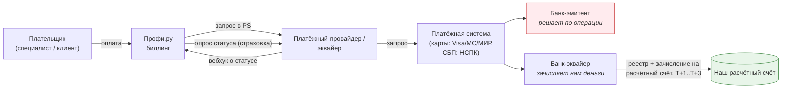
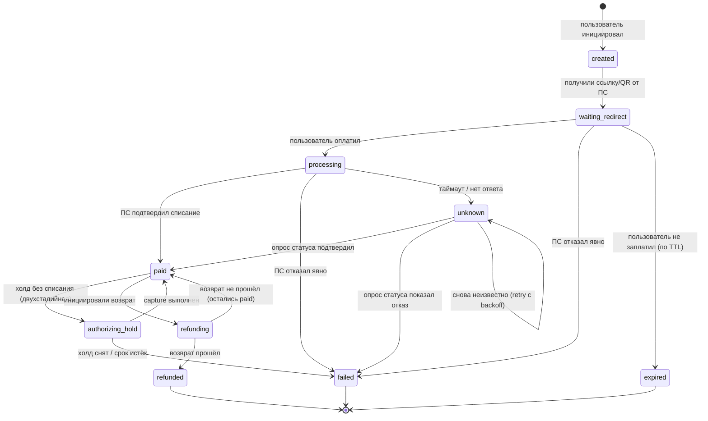
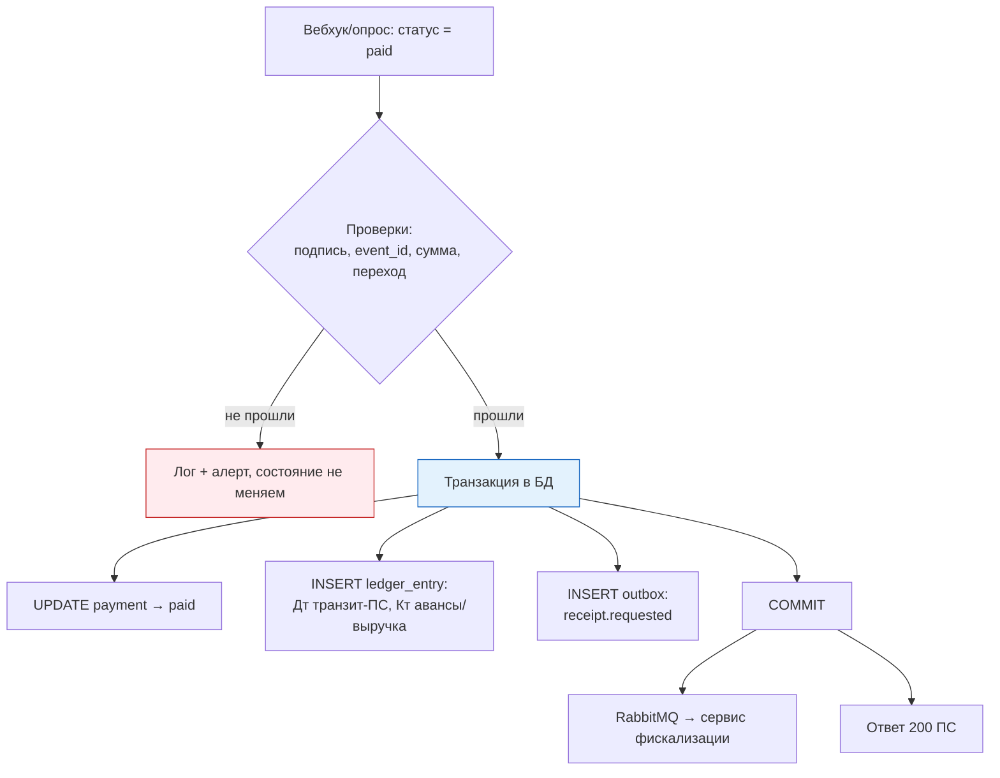

# 02. Приём платежей и эквайринг: полный путь денег

> **Что проверяют.** Это описано в вакансии как «приём и обработка платежей». Проверяют:
> понимаешь ли ты **разницу между авторизацией и списанием**, **что вебхук не гарантирован**,
> как выглядит **неизвестный статус**, и умеешь ли ты объяснить путь денег от нажатия кнопки
> до денег на нашем расчётном счёте.
>
> Твой бэкграунд в процессинге — прямой козырь. Здесь — система координат, чтобы рассказывать
> про это структурно и в терминах, которые ждёт команда биллинга.

---

## 1. Участники и роли



| Роль | Кто | Что важно понимать |
|---|---|---|
| **Эмитент** | банк, выпустивший карту/счёт | **он принимает решение** по авторизации; большинство отказов — от него |
| **Эквайер / PSP** | обслуживает нас, принимает деньги | отвечает за авторизацию, реестры, зачисление |
| **Платёжная система (СБП/карты)** | НСПК, Visa/MC | правила, сроки, клиринг, споры |
| **Наш процессинг/биллинг** | мы | маршрутизация, статусы, идемпотентность, сверка, фискализация |
| **Расчётный банк** | где лежат наши деньги | здесь появляется «фактические деньги», а не «статус» |

**Ключевая мысль:** между «мы получили статус успех» и «деньги на нашем счёте» лежат
**сутки-двое**. Значит, в учёте есть промежуточный счёт («транзит: эквайринг»), и «оплата
прошла» ≠ «деньги у нас». Это важный доменный факт, который редко знают кандидаты без
платёжного опыта: он показывает понимание, что биллинг — это не только статусы.

---

## 2. Сценарии приёма: карта, СБП, кошелёк

| Способ | Как идёт оплата | Особенности для биллинга |
|---|---|---|
| **Карта: одностадийная (single-message)** | авторизация и списание одним запросом | просто; возврат — отдельная операция; нельзя изменить сумму |
| **Карта: двухстадийная (auth → capture)** | сначала **холд** (auth, блокирует сумму на карте), потом **capture** (списание) | нужно хранить холд и его срок; если не capture — холд снимется сам; для предоплаты/проверки полезно |
| **СБП (по QR / по номеру)** | плательщик подтверждает в своём банке; мы получаем вебхук | асинхронно: результат может прийти через 1–60 секунд; **обязателен опрос статуса** |
| **Кошелёк / баланс** | внутренний перевод | нет внешней системы; но нужны проводки и (при оказании услуги) чек |
| **Рекуррентный платёж** | списание по сохранённому токену с согласия | согласие (мандат), уведомление, возможность отзыва (см. `06-subscriptions-new-products.md`) |
| **Рассрочка / BNPL** | третья сторона платит нам, клиент платит ей | мы получаем полную сумму; юридически — иные чеки (плательщик — третья сторона) |

**Формулировка, показывающая опыт:** «Способ оплаты влияет не только на интеграцию, но и на
модель денег: при двухстадийной схеме у меня появляется холд — а это уже учётная сущность,
которая живёт по своим правилам (срок, снятие, повторное списание). При СБП у меня не
синхронный результат, а отложенный, и значит обязательный опрос статуса. При рассрочке у
меня меняется плательщик — а это уже чеки другого вида.»

---

## 3. Полный жизненный цикл платежа (машина состояний)



**Что важно в этой схеме (и что обязательно проговорить):**

1. **`unknown` — это не `failed`.** Таймаут означает «мы не знаем», а не «не оплачено».
   Если записать `failed` и отдать пользователю «ошибка», а деньги списались — это инцидент
   с реальными последствиями. Правильно: `unknown` + опрос статуса.
2. **`expired` ≠ `failed`.** Пользователь мог просто не заплатить. Это разные метрики
   (конверсия, причины отказов).
3. **`refunding → paid`** — откат возврата при неуспехе. Возврат может не пройти, и тогда
   платёж **остаётся оплаченным**.
4. **Холд** — отдельное состояние, потому что деньги ещё «в процессе», и это влияет на чек.
5. **Никаких переходов «назад»** (нельзя `paid → pending`) — только вперёд по разрешённым
   дугам. Устаревшее событие от ПС должно игнорироваться.

---

## 4. Приём результата: вебхук + опрос статуса (две линии защиты)

### Принцип: вебхук — ускорение, опрос — гарантия

```mermaid
sequenceDiagram
    autonumber
    participant PS as Платёжная система
    participant API as Биллинг: /webhook
    participant DB as MySQL
    participant SCH as Планировщик (reconciler)
    participant PSP as API ПС

    Note over PS,API: Линия 1: вебхук (быстро, но не гарантирован)
    PS->>API: POST /psp/webhook (подпись + event_id)
    API->>API: проверить подпись (до БД!)
    API->>DB: BEGIN: INSERT processed_event(event_id UNIQUE)
    API->>DB: SELECT payment FOR UPDATE
    alt переход допустим
        API->>DB: UPDATE payment=paid; INSERT ledger; INSERT outbox
    else дубль/устаревшее
        API->>DB: ничего не меняем
    end
    API->>DB: COMMIT
    API-->>PS: 200 OK (быстро)

    Note over SCH,PSP: Линия 2: опрос (гарантия, каждые N минут)
    SCH->>DB: SELECT платежи в status IN (pending, unknown)
    SCH->>PSP: getStatus(provider_payment_id)
    PSP-->>SCH: фактический статус
    SCH->>DB: тот же идемпотентный обработчик
```

**Почему именно так (готовый аргумент):**

| Почему вебхук не гарантирован | Что делать |
|---|---|
| ПС не получил наш 200 (таймаут, деплой, сеть) | ПС повторит — но мы должны быть идемпотентны; плюс наша страховка — опрос |
| Наш сервис был недоступен 5 минут | опрос догонит |
| Вебхук пришёл, но упал наш обработчик (ошибка) | мы вернули не-200 → ПС повторит; плюс опрос |
| «Затерялись» вебхуки из-за ошибки конфигурации | опрос обнаружит |
| Статус изменился без вебхука (ПС не присылает все переходы) | опрос — единственный способ узнать |

**Тезис:** «Я не считаю вебхук источником правды. Вебхук — это оптимизация, чтобы узнать
быстрее. Источник правды — запрос статуса у ПС, а в нашей БД — состояние, которое я довожу
до терминального. Именно поэтому в биллинге всегда есть „дожим“: расписание, которое
опрашивает всё, что висит в `pending`/`unknown` дольше N минут.»

### Обязательные проверки при приёме вебхука

| Проверка | Что будет без неё |
|---|---|
| **Подпись/секрет** (`HMAC`, IP-allowlist, mutual TLS) | любой может «оплатить» себе что угодно |
| **Идемпотентность по `event_id`** | двойное зачисление |
| **Сверка суммы и валюты** с нашим платежом | подмена суммы (атака или баг ПС) |
| **Сверка `provider_payment_id`** с нашим платежом | обработка чужого платежа |
| **Проверка допустимости перехода** (машина состояний) | устаревшее/неверное событие испортит состояние |
| **Отдельно: «неизвестный статус»** | падение обработчика на новом статусе ПС (см. ниже) |
| **Быстрый ответ 200** | ПС сочтёт, что мы не приняли, и будет ретраить, а мы — копить долги |

### Обработка «неизвестного статуса» — вопрос, на котором валятся

```php
// ПС прислал статус, которого мы не знаем. Что делать?
$mapped = $this->mapper->map($pspStatus);      // null, если неизвестно
if ($mapped === null) {
    // ВАРИАНТ ПЛОХОЙ: бросить исключение → вебхук не обработан, ПС будет ретраить вечно,
    // а мы никогда не узнаем, что вообще происходило.
    // throw new UnknownStatusException($pspStatus);

    // ВАРИАНТ ХОРОШИЙ: зафиксировать факт, не менять состояние денег, алерт и разбор.
    $this->rawEvents->store($paymentId, $pspStatus, $rawPayload);   // сохранить сырое событие
    $this->metrics->increment('psp.unknown_status');
    $this->alerting->warn('unknown_psp_status', ['status' => $pspStatus, 'payment' => $paymentId]);
    return;   // и всё равно ответить 200 — событие мы приняли
}
```

**Почему так:** событие обработано (200), но **деньги не тронуты** — потому что мы не знаем,
что делать. Ночной разбор/алерт разрулит. Если бы мы упали, мы бы получили бесконечные
ретраи и «слепое пятно»: неизвестно, что произошло и сколько раз.

---

## 5. От статуса к деньгам: где происходит зачисление



**Три вещи, которые важно проговорить:**

1. **Проводки создаются в той же транзакции, что и изменение статуса.** Иначе возможно
   состояние «оплачено без проводок» — то есть деньги без учёта.
2. **Чек — не в этой транзакции, а через outbox.** Внешний вызов (ОФД) не может жить в
   транзакции БД. Правильный принцип: **«оплачено» и «чек выпущен» — разные состояния**,
   между ними разрыв, который измеряется и алертится.
3. **Ответ ПС — 200 только после COMMIT.** Если ответить до коммита, а коммит упадёт,
   мы «подтвердили», а денег в учёте нет.

**Дополнительно про «транзит»:** счет «транзит: эквайринг» показывает деньги, которые ПС уже
списал с плательщика, но которые ещё не пришли на наш расчётный счёт. Реестр от ПС и выписка
по расчётному счёту должны «закрыть» этот транзит. Это и есть предмет ежедневной сверки
(см. `07-reconciliation.md`).

---

## 6. Типовые сбои приёма платежей и что делать

| Сбой | Что видит пользователь | Что в системе | Что делать |
|---|---|---|---|
| ПС отвечает таймаутом при создании платежа | «что-то пошло не так» | платежа нет либо есть с неясным результатом | **не ретраить слепо**; сначала `getStatus` по нашему `order_id`; ключ идемпотентности обязателен |
| Вебхук не пришёл | «деньги списались, а услуга не активна» | платёж `pending`/`unknown` | опрос статуса по расписанию + **поддержка видит состояние и метрику**, а не «непонятно» |
| Вебхук пришёл дважды | нормально | дубль отсекается по `event_id` | идемпотентность |
| Пришёл вебхук на неизвестный платёж | ничего | `payment_id` не найден | сохранить событие, алерт; частая причина — не тот `order_id` в ПС |
| Оплата прошла, но не активировали | «оплатил, а не работает» | деньги есть, продукт не знает | публикация события через outbox; продукт должен быть идемпотентен тоже |
| Двойное списание с карты (ПС повторил) | «списали дважды» | два платежа или дубль у ПС | наш `idempotency_key` → в ПС; второй уровень — сверка и возврат |
| Пользователь ушёл на страницу оплаты и вернулся | «проверяю оплату» | платёж `pending` | опрос + фронт показывает реальный статус, не «успех» по факту возврата |

---

## 7. Ответ вслух (2 минуты)

> «Путь денег у меня выглядит так. Пользователь инициирует оплату — я создаю у себя
> платёж в состоянии „создан“ с ключом идемпотентности и отправляю запрос в ПС, передавая
> этот ключ, чтобы повтор не создал вторую операцию. Транзакция с внешним вызовом внутри
> не живёт: сначала коротко фиксирую попытку, потом (вне транзакции) вызываю ПС,
> потом коротко фиксирую результат.
>
> Дальше результат приходит вебхуком. Я считаю вебхук **оптимизацией, а не источником правды**.
> Перед обработкой — подпись; потом — идемпотентность по `event_id` в базе, а не в коде;
> потом блокировка строки платежа и проверка **допустимости перехода**. Если статус от ПС
> неизвестен — я фиксирую сырое событие, не меняю деньги и алертю, но всё равно отвечаю 200,
> чтобы не получить бесконечные ретраи и слепое пятно.
>
> Зачисление — это не только статус. В той же транзакции я пишу проводки: деньги уходят на
> транзитный счёт эквайринга, оттуда на авансы или выручку, в зависимости от того, оказана
> ли услуга. Именно поэтому „оплачено“ и „чек выпущен“ — это разные состояния, и второе
> уезжает через outbox в отдельный сервис фискализации.
>
> И я обязательно держу третью линию: расписание, которое опрашивает всё, что висит в
> `pending` и `unknown`, и дожимает через `getStatus`. Без этого вебхук, потерявшийся
> в сети или в деплое, становится инцидентом с живыми деньгами.
>
> Отдельно я различаю „оплата прошла“ и „деньги на нашем расчётном счёте“: между ними
> сутки-двое и транзитный счёт, который закрывается реестром ПС и выпиской банка. Это
> ежедневная сверка.»

---

## 8. Красные флаги в этой теме

* ❌ «Статус берём из вебхука» — без опроса и без идемпотентности.
* ❌ `unknown`/таймаут трактуется как `failed`.
* ❌ Обработка вебхука без проверки подписи.
* ❌ Падение обработчика на новом (неизвестном) статусе ПС.
* ❌ Чек формируется внутри обработки вебхука синхронно.
* ❌ «Оплата прошла — значит деньги у нас».
* ❌ Идемпотентность реализована проверкой перед вставкой вместо UNIQUE-ключа.

## Чек-лист по этому файлу

- [ ] Могу назвать участников и объяснить, кто решает по операции.
- [ ] Помню разницу одностадийной и двухстадийной схемы (холд).
- [ ] Могу нарисовать машину состояний платежа и объяснить `unknown` vs `failed`.
- [ ] Знаю обязательные проверки вебхука (6 штук).
- [ ] Готов ответ про неизвестный статус от ПС.
- [ ] Объясняю, почему «оплачено» ≠ «деньги у нас» и что такое транзитный счёт.
- [ ] Могу рассказать про дожим через `getStatus` и почему это обязательная часть.
