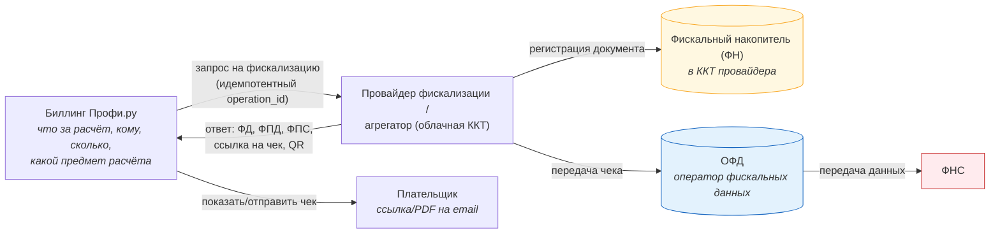
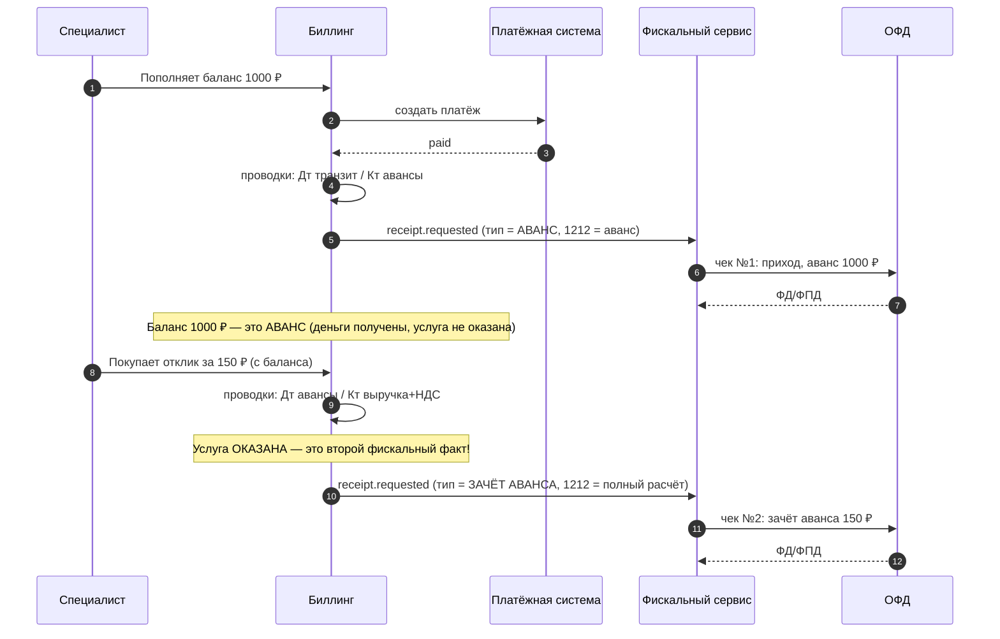
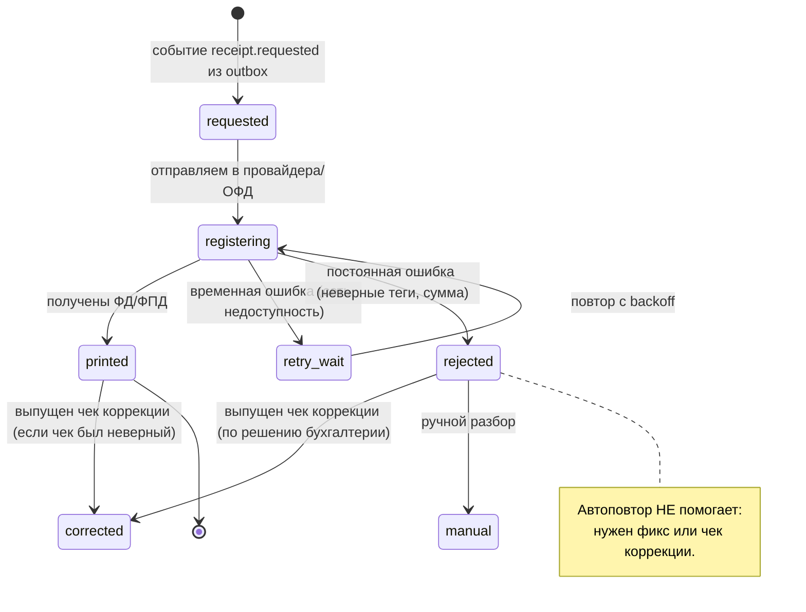

# 03. Чеки и фискализация: 54-ФЗ с точки зрения разработчика

> ⚠️ **Важно про этот файл.** Юридические детали (состав тегов, версия ФФД, сроки выдачи
> чека, ответственность) зависят от актуальной редакции закона и от вашей СНО/схемы работы.
> Их **владелец — бухгалтерия**, а не разработчик. Ниже — **инженерная** модель: что откуда
> берётся, где живёт состояние, как делать идемпотентно, как сверять. Номера тегов приведены
> как ориентир: **перед реализацией их надо сверять с актуальной версией ФФД у вашего
> ОФД/провайдера** — состав и номера тегов меняются между версиями. Не выдавай их
> на собеседовании как «я точно знаю» без оговорки.

---

## 1. Зачем это биллингу (и почему «просто вызов API» — неправильная рамка)

Чек — это **юридический документ**, а не уведомление. Последствия ошибки — не «баг в
интерфейсе», а:

* штрафы для компании (по КоАП, размеры привязаны к сумме расчёта и повторности);
* расхождение данных для налоговой: сумма расчётов по чекам «не бьётся» с выручкой;
* проблемы у клиента: у него нет документа на оплату (для B2B-расходов это критично);
* невозможность «откатить»: выпущенный чек **нельзя удалить** — только выдать чек коррекции
  или чек возврата.

**Следствие для архитектуры (это главная мысль файла):**

> «Правила фискализации — это **данные и версионируемые настройки**, а не `if` в коде платежа.
> У вида услуги есть параметры: предмет расчёта, признак способа расчёта, ставка НДС,
> признак агента, момент оказания. Код читает эти параметры. Тогда новый вид услуги — это
> запись в справочнике плюс тест, а не релиз денежного ядра.»

---

## 2. Цепочка участников и устройств



| Элемент | Что это | Что важно для инженера |
|---|---|---|
| **ККТ** | контрольно-кассовая техника (обычно физическая или облачная у провайдера) | обычно **не наша** — у провайдера; важно, что регистрация «где-то» и не мгновенна |
| **ФН** | фискальный накопитель — защищённый модуль с подписью | требование подписи означает: **повторный запрос создаст второй документ**, если нет идемпотентности |
| **ОФД** | получает чеки от ККТ и передаёт в ФНС | источник для сверки: «сколько чеков мы отправили и на сколько» |
| **Смена** | рабочий день ККТ; должен «закрываться» | смена — это состояние; ночные операции и закрытие смены — отдельный процесс |
| **ФД / ФПД** | номер фискального документа и его фискальный признак | **это доказательство выпуска чека**; хранится у нас в `receipt` |
| **Чек коррекции** | документ «чек должен был быть, но не был» | требуется по правилам, если чек не выдали; не то же самое, что возврат |

**Инженерный вывод:** фискализация — это **внешний асинхронный процесс с ненулевым временем
отклика и возможностью отказа**. Значит: отдельное состояние, отдельная очередь, отдельные
метрики, ретраи с классификацией ошибок, и **никогда — внутри транзакции списания денег**.

---

## 3. Виды чеков (таблица, которую надо знать)

| Вид чека (признак расчёта) | Когда выдаётся | Типовой случай в биллинге |
|---|---|---|
| **Приход** | мы получаем деньги за услугу | оплата отклика, пополнение баланса (если это аванс) |
| **Возврат прихода** | мы возвращаем деньги, ранее полученные | возврат за неоказанную услугу |
| **Расход** | мы выдаём деньги (выплата) | выплата специалисту, если это оформляется как расчёт |
| **Возврат расхода** | нам возвращают выданные деньги | откат выплаты |
| **Чек на аванс** (предоплата/аванс) | деньги получены, услуга ещё не оказана | пополнение баланса, покупка пакета «на будущее» |
| **Чек на зачёт аванса** | услуга оказана, аванс «закрыт» | списание с баланса за отклик |
| **Агентский чек** | мы выступаем агентом, есть признак агента и данные поставщика | комиссия с платежа клиента за услугу специалиста |
| **Чек коррекции** | расчёт был, чек не выдали вовремя / выдали с ошибкой | «мы забыли фискализировать 40 оплат» |
| **Чек при возврате с рассрочкой/кредитом** | особые схемы | редко; состав тегов иной |

**Готовый тезис:** «Разница между „пополнением баланса“ и „оплатой отклика“ — это не разница
в UX, это разница **двух фискальных документов**: на пополнение мы выдаём чек на аванс,
а в момент оказания услуги — чек на зачёт аванса. Если система этого не различает, значит
она либо не фискализирует оказание, либо фискализирует не то. Именно поэтому вакансия
говорит про рефакторинг из-за новых требований.»

---

## 4. Теги: что реально уходит в чек

Ориентировочный набор (сверить с актуальным ФФД у провайдера):

| Тег (ориентир) | Что значит | Как заполняется в биллинге |
|---|---|---|
| **1054** «признак расчёта» | приход / возврат прихода / расход / возврат расхода | определяется типом операции |
| **1059** «предмет расчёта» (наименование) | текстовая позиция чека | из справочника услуг + параметры (например, «Отклик на заказ №…», «Продвижение профиля») |
| **1212** «признак способа расчёта» | предоплата 100% / частичная предоплата / аванс / полный расчёт / передача в кредит / оплата кредита | из политики фискализации, по виду услуги и моменту |
| **1214** «признак предмета расчёта» | товар / подакцизный товар / работа / **услуга** / иное | по виду услуги (обычно «услуга») |
| **1125** «признак агента» | агентское вознаграждение / расчёт от имени поставщика и т.п. | только для агентских схем |
| **1226** «мера количества предмета расчёта» | количество/единица | если позиция продаётся в количестве (например, пакет из 10 откликов) |
| Сумма, ставка НДС, сумма НДС, сумма без НДС | сумма и налог | ставка из справочника (зависит от СНО и вида услуги) |
| Реквизиты покупателя (телефон/email) | куда отправить электронный чек | обязательны, если чек электронный; надо получать и хранить с согласием |
| Номер смены, дата/время, № ФД, ФПД, ФПС | выдаёт ККТ/ОФД в ответе | **сохраняем у себя** как доказательство |

**Таблица «вид услуги → параметры» — это и есть сердце рефакторинга:**

```
service_fiscal_config
  service_code        -- 'contact_access', 'promotion', 'package_10', 'partner_service'
  legal_entity_id     -- на какое юрлицо фискализируем
  subject_name_tpl    -- шаблон наименования предмета расчёта
  subject_type        -- 1 товар | 3 работа | 4 услуга (тег 1214)
  method_type         -- полный расчёт / аванс / зачёт аванса (тег 1212)
  vat_rate            -- 0 / 10 / 20 / без НДС (по СНО)
  agent_flag          -- агентский признак (тег 1125)
  settlement_moment   -- 'immediate' | 'on_service_provided'
  valid_from, valid_to  -- ← ВЕРСИОНИРОВАНИЕ ПО ВРЕМЕНИ (обязательно!)
```

> **Почему `valid_from/valid_to` обязательны:** ставка НДС или признак расчёта меняются не
> одновременно со всеми операциями, и **нельзя применять новое правило к уже выпущенным
> чекам**. Значит, правила читаются на дату операции, а не «текущая настройка». Без
> версионирования вы не сможете ответить на вопрос «а почему в чеке за 30 апреля стоит
> старая ставка» — а этот вопрос зададут бухгалтерия и налоговая.

---

## 5. Двухэтапная фискализация: аванс и зачёт (главная тема рефакторинга)



**Что это значит практически (и что стоит проговорить):**

| Аспект | Наивная реализация | Правильная |
|---|---|---|
| Событие фискализации | одно: «оплата прошла» | **два**: «деньги получены» и «услуга оказана» |
| Что если услуга не оказана никогда | чек всё равно выдан (неверно) | чек на аванс выдан, зачёта нет; при возврате — чек возврата аванса |
| Связь чеков | нет | чек зачёта ссылается на чек аванса (в нашей модели) |
| Момент | момент оплаты | аванс — момент оплаты; зачёт — момент оказания (событие из продукта!) |
| Кто «скажет», что услуга оказана | — | **продуктовый сервис** (использование отклика) — это событие между контекстами |

> **Ключевой вывод вслух:** «Как только у нас появляется „деньги вперёд, услуга потом“,
> фискализация становится двухэтапной, а значит у нас появляется **зависимость от события
> „услуга оказана“**, которое рождается не в биллинге, а в продукте. Значит, на границе
> продукт→биллинг нужно надёжное событие: идемпотентное, с ключом, повторяемое. Иначе
> мы получим либо отсутствие чеков на зачёт, либо их дубли.»

---

## 6. Состояние чека: у чека есть своя машина состояний



**Обязательные свойства:**

| Свойство | Как реализуется |
|---|---|
| Идемпотентность | `operation_id` (наш ключ) передаётся провайдеру, если он поддерживает; плюс `UNIQUE(payment_id)` в `receipt` — один чек на платёж |
| Ровно один чек на расчёт | UNIQUE-ограничение, а не проверка в коде |
| Различение ошибок | временная (retry) vs постоянная (DLQ/manual) — иначе либо петля, либо потеря |
| Аудит | храним сырые запросы/ответы, ФД/ФПД/ФПС, timestamps (иначе нечего показать бухгалтерии) |
| Догон | метрика «отставание чеков» и алерт (см. ниже) |

**Метрика, которую надо назвать:** не «длина очереди», а **доменная метрика**:
`количество оплаченных расчётов без чека старше N минут`. Она ловит и сбой очереди,
и сбой **до** очереди (событие вообще не создалось) — что очередь никогда не покажет.

```sql
-- Прямая проверка (см. также 02-mysql/04-explain-and-sql-tasks.md, Задача 3)
SELECT COUNT(*) AS paids_without_receipt
  FROM payment p
  LEFT JOIN receipt r ON r.payment_id = p.id
 WHERE p.status = 'paid'
   AND p.paid_at < NOW() - INTERVAL 10 MINUTE
   AND p.paid_at > NOW() - INTERVAL 2 DAY
   AND (r.id IS NULL OR r.status NOT IN ('printed'));
```

---

## 7. Агентские чеки (это будет в новых продуктах)

Ситуация: клиент платит за услугу специалиста, а мы — посредник. Тогда в чеке:

* признак агента (мы выступаем агентом / комиссионером и т.п.);
* реквизиты поставщика (кто фактически оказывает услугу) — те самые «данные поставщика»;
* наша выручка — только **вознаграждение**, а не вся сумма.

**Что это значит для денежного учёта:**

| Сумма | Куда в учёте | В чеке |
|---|---|---|
| Вся сумма от клиента 1000 ₽ | Дт транзит; Кт **обязательство перед специалистом** 900 ₽; Кт выручка-комиссия 83,33 ₽; Кт НДС 16,67 ₽ | признак агента + данные поставщика; наша часть — вознаграждение |
| Выплата специалисту 900 ₽ | Дт обязательство; Кт транзит выплат | может быть свой документ/реестр |

**Тезис:** «В агентской схеме появляется „деньги, которые нам не принадлежат“. Это отдельный
счёт обязательств, отдельная сверка и отдельный чек. Если этого не сделать, мы получим
„нашу выручку“ в размере полной суммы платежа — то есть завышенную налоговую базу.
Именно такие вещи бухгалтерия и просит учесть в рефакторинге.»

**И обязательный вопрос:** «Чей это доход: наш или специалиста? Есть ли у нас договор с
клиентом напрямую или мы агент?» — это вопрос к финюру/бухгалтерии, а не к разработчику.
Задать его на собеседовании — плюс.

---

## 8. Чеки при возвратах

| Ситуация | Что нужно |
|---|---|
| Возврат за услугу, которая была оказана и отфискалирована | **чек возврата прихода** на сумму возврата; связь с исходным чеком |
| Возврат аванса (услуга не оказана) | чек возврата прихода по авансу (предмет расчёта и признак способа — **как в исходном чеке**) |
| Частичный возврат | чек на сумму возврата; нужно решить вопрос с авансом/выручкой в тех же пропорциях |
| Возврат не прошёл в ПС | **чек возврата не выпускается** (или выпускается и компенсируется) — порядок согласовать с бухгалтерией; в учёте платёж остаётся оплаченным |
| Возврат при агентской схеме | возврат по «нашей» части и «чужой» части — различается |

**Правило, которое стоит произнести:** «Возврат — это не „минус к платежу“. Это **отдельный
фискальный факт с собственной последовательностью**: сначала деньги фактически возвращаются
(или принимается решение), потом формируется чек возврата, и связка „чек возврата → исходный
чек“ должна храниться. И надо обязательно согласовать порядок: если чек возврата выпущен,
а деньги не ушли — получим расхождение с ОФД и с банком.»

---

## 9. Ошибки фискализации: что бывает и что делать

| Ошибка | Тип | Что делать |
|---|---|---|
| Таймаут/5xx провайдера | временная | retry с backoff; статус чека `retry_wait`; метрика |
| Провайдер недоступен N минут | временная | накопить в очереди, догнать; следить за сроком (если по закону чек нужен «в момент расчёта» — задержка = риск чека коррекции!) |
| «Неверные теги» / «неверная сумма» | постоянная | DLQ, алерт, разбор; **автоповтор не поможет** |
| Дубликат документа у провайдера | — | идемпотентность по `operation_id`; если провайдер не поддерживает — свой «журнал намерений» |
| Смена закрыта / смена не открыта | инфраструктурная | открыть смену; следить за границами суток и часовым поясом |
| Проведено «задним числом» | юридическая | чек коррекции — только по решению бухгалтерии |
| Оказалось, что чек должен был быть другим (не тот предмет расчёта) | юридическая | чек коррекции с верным составом; документооборот |

**Очень важная развилка, которую надо назвать:** задержка фискализации может быть **сама по
себе нарушением**. Поэтому «отставание чеков» — это не только техническая метрика, а
**срок**, с которым связан риск чека коррекции. Значит:

> «Если провайдер недоступен долго, у нас два пути: продолжать копить и потом выпустить
> пакетом (и, возможно, получить необходимость чеков коррекции), либо принять решение
> «не можем фискализировать сейчас» — но это решение уже про бизнес-риск, его принимает
> бухгалтерия/финблок, а не разработчик. Наша задача — сделать так, чтобы **этот выбор был
> видимым**: метрика, алерт, список конкретных операций. То есть разработчик отвечает за
> прозрачность, а не за юридическое решение.»

---

## 10. Сверка с ОФД

Что сверяем и как:

| Сверка | С чем | Признак проблемы |
|---|---|---|
| Количество чеков | с количеством расчётов, по которым чек полагается | чеков меньше → недofiscalized (риск чеков коррекции) |
| Сумма чеков за период | с суммой оплат за период | расхождение → ошибка маппинга сумм/валюты/предмета |
| Номера ФД | с реестром провайдера/ОФД | пропуски в нумерации → потерянный документ |
| Чеки возвратов | с фактическими возвратами | чек возврата без возврата денег → расхождение с банком |

**Готовый тезис:** «Фискализация — третья система после ПС и банка, с которой нужна сверка.
И она самая неприятная: расхождение с ПС — это деньги, расхождение с ОФД — это ещё и
юридический риск. Поэтому я бы сделал ежедневный отчёт „чеков выпущено / расчётов было“
и алерт при расхождении, а не ждал вопроса от бухгалтерии в конце месяца.»

---

## 11. Ответ вслух (2 минуты)

> «Фискализация в моём понимании — это отдельный асинхронный процесс со своим состоянием,
> а не вызов API внутри оплаты. Цепочка: наша система решает, что за расчёт и какие
> параметры, передаёт это провайдеру/облачной ККТ, тот регистрирует документ в ФН и отдаёт
> в ОФД, а нам возвращает номер ФД и фискальный признак — это и есть наше доказательство,
> что чек выпущен.
>
> Ключевых решений три. Первое: **параметры фискализации — данные, а не код**. Вид услуги
> определяет предмет расчёта, признак способа расчёта, ставку НДС и признак агента, и всё
> это **версионируется по времени**, потому что правила меняются не одномоментно и не
> задним числом для уже выпущенных чеков.
>
> Второе: **аванс и зачёт — два разных чека**. Если у нас деньги приходят вперёд, мы выдаём
> чек на аванс в момент получения денег и чек на зачёт в момент оказания услуги. Значит,
> у нас появляется зависимость от продуктового события „услуга оказана“, и на этой границе
> нужна идемпотентная доставка.
>
> Третье: **чек — это идемпотентная операция с запретом дублей**. Два фискальных документа
> по одному расчёту — это расхождение с налоговой, а не «лишний вызов». Поэтому один чек
> на платёж держится уникальным ограничением, а провайдеру мы передаём наш ключ операции.
> Ошибки делю на временные (retry с backoff) и постоянные (DLQ, разбор, возможно чек
> коррекции).
>
> И отдельно — прозрачность: доменная метрика „оплачено, но чека нет дольше N минут“ плюс
> ежедневная сверка „чеков выпущено против расчётов“, потому что отставание фискализации —
> это не только баг, но и юридический срок.»

---

## 12. Красные флаги в этой теме

* ❌ «Чек формируется в той же транзакции, что и зачисление».
* ❌ «Если чек не получился — просто повторим» (без классификации ошибок и без риска дубля).
* ❌ Не различать «приход» и «зачёт аванса».
* ❌ Не знать, что чек — юридический документ и его нельзя «удалить».
* ❌ Делать агентскую схему «как обычную» — то есть фискализировать всю сумму как свою выручку.
* ❌ Хардкодить ставку НДС и предмет расчёта в коде.
* ❌ Уверенно называть номера тегов без оговорки «сверить с версией ФФД» (лучше сказать «предмет расчёта, признак способа расчёта — теги ФФД, номера уточню у вашего ОФД»).

## Чек-лист по этому файлу

- [ ] Могу описать цепочку ККТ → ФН → ОФД → ФНС и объяснить, где чей «след».
- [ ] Могу перечислить виды чеков (приход, возврат, расход, аванс, зачёт, коррекция).
- [ ] Объясняю, почему параметры фискализации — данные и обязаны версионироваться.
- [ ] Могу нарисовать двухэтапную фискализацию (аванс → зачёт) и назвать зависимость от продукта.
- [ ] Знаю про агентские чеки и почему «вся сумма как выручка» — ошибка.
- [ ] Могу назвать метрику «оплачено без чека дольше N минут».
- [ ] Знаю, что чек возврата — отдельный документ и связывается с исходным чеком.
- [ ] Помню про чек коррекции как единственный путь «исправить» и что решает бухгалтерия.
