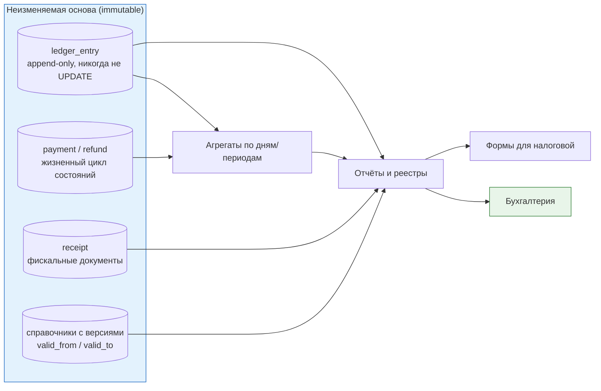

# 04. Налоговая отчётность: данные, реестры, закрытие периода

> **Что проверяют.** В вакансии прямо: «формирование чеков и данных для налоговой отчётности»,
> «крупный рефакторинг из-за новых требований налоговой», «поддержка новых видов услуг, для
> которых иначе формируются чеки и считается отчётность». Проверяют: понимаешь ли ты, что
> отчётность — это **отдельный контракт данных**, а не «ещё один отчёт на дашборде», и что
> у неё свои свойства: воспроизводимость, неизменяемость, привязка к периоду.
>
> ⚠️ Юридические детали (ставки, пороги, сроки, состав форм) — компетенция бухгалтерии.
> Здесь — инженерная модель: как устроить данные, чтобы любые требования налоговой можно
> было закрыть, не переписывая биллинг заново.

---

## 1. Главная мысль: отчётность должна быть **воспроизводимой функцией**, а не текущим состоянием



**Формулировка, которую надо произнести (это ключ ко всей теме):**

> «Отчёт для налоговой — это **функция от неизменяемых данных на конкретную дату**, а не
> дэшборд по текущему состоянию. Из этого следуют три требования к биллингу. Первое: первичные
> данные (проводки, платежи, чеки) **никогда не изменяются и не удаляются** — только
> добавляются компенсирующие записи. Второе: справочники (ставки, правила, привязки к
> юрлицам) **версионируются по времени**, потому что отчёт за апрель должен считаться по
> апрельским правилам, а не по текущим. Третье: любой отчёт можно пересчитать и получить
> **тот же результат** — иначе невозможно ответить на запрос налоговой „покажите, как
> получилась эта цифра“.»

Это и есть техническое содержание фразы «крупный рефакторинг из-за новых требований
налоговой»: **не „добавить новое поле“, а „сделать отчётность воспроизводимой и
версионируемой“**.

---

## 2. Что именно меняется, когда приходят «новые требования» (инженерный взгляд)

Разные юридические изменения дают разные инженерные последствия. Вот карта — она поможет
на собеседовании не растеряться, что бы ни сказали:

| Что меняется в требованиях | Что нужно в системе | Что придётся рефакторить |
|---|---|---|
| Новый **состав тега** в чеке (ФФД) | хранить больше атрибутов на операцию; новые поля в конфиге фискализации | схему `receipt` и справочник правил; тесты на состав чека |
| Новая **ставка/правило НДС** | версионирование ставок по времени; отчёт считает по дате операции | справочник, а не хардкод; пересчёт только для будущих периодов |
| **Разделение по юрлицам / ККТ / СНО** | привязка услуги к юрлицу; маршрутизация чеков; отдельные реестры и сверки | модель «услуга → юрлицо → ККТ»; отчётность разрезается по юрлицу |
| **Новый вид услуги** с другим предметом/способом расчёта | параметризация правил (данные, не код) | справочник услуг + правила фискализации |
| **Новый режим расчёта** (аванс/зачёт, агентский) | разделение событий «деньги получены» и «услуга оказана» | модель событий; двухэтапная фискализация |
| **Новый платёжный способ** (например, СБП) | адаптер + сверка с новым источником | транспорт+сверка, а не деньги |
| **Требование к сроку** выдачи чека | метрика отставания, быстрые ретраи, эскалация | очереди, мониторинг, дежурство |
| **Хранение** дольше | партиционирование + архивация, а не рост одной таблицы | схема, ретеншен-политика |

> **Готовый тезис:** «Меняются не „деньги“, а **правила вокруг денег**. Поэтому я строю
> систему так, чтобы правила жили в данных с историей: тогда требование налоговой — это
> новая запись в справочнике и новый тест, а не переписывание биллинга. Если же правила
> размазаны по `if` в денежном коде, каждое изменение закона — это рефакторинг, и именно
> поэтому сейчас нужен большой рефакторинг.»

---

## 3. Контракт данных для отчётности: что должно быть в записи

Минимальный набор, без которого отчёт не построить «задним числом»:

| Поле | Зачем отчётности |
|---|---|
| `operation_id` / `payment_id` / `refund_id` | трассировка: «покажите документ по этой цифре» |
| Дата/время операции **и** «операционный день» | отчёт за период; границы дня не UTC (важно!) |
| Юрлицо | разрезы и разные формы |
| Вид услуги / предмет расчёта | разрезы выручки, состав чека |
| Сумма **в минорных единицах** и валюта | точность, мультивалюта |
| НДС: ставка, сумма налога, сумма без налога | налоговые формы; **ставка на дату операции** |
| СНО / режим | разные формы и правила |
| Статус (и история статусов) | отчёт «по факту» vs «по начислению» |
| Ссылка на фискальный документ (ФД/ФПД) | доказательство, сверка с ОФД |
| Контрагент/плательщик (тип: физлицо/юрлицо, ИНН если есть) | формы, чеки, требования |
| Признак агента и данные поставщика | агентские схемы |
| Версия правил, применённых к операции | воспроизводимость: «почему именно так» |

**Важный инженерный приём — «снимок применённых правил»:**

```sql
-- Вместо того чтобы при отчёте "восстанавливать" правила по дате, сохраняем применённые
-- параметры прямо в операции. Тогда отчёт тривиально воспроизводим, а изменение справочника
-- никогда не "переписывает историю".
CREATE TABLE payment (
  id                BIGINT UNSIGNED NOT NULL AUTO_INCREMENT,
  -- ... деньги/статусы ...
  vat_rate          DECIMAL(5,2)   NOT NULL,   -- применённая ставка (снимок!)
  vat_amount_minor  BIGINT         NOT NULL,   -- применённый НДС (снимок!)
  vat_base_minor    BIGINT         NOT NULL,   -- база (снимок)
  service_code      VARCHAR(32)    NOT NULL,
  legal_entity_id   BIGINT UNSIGNED NOT NULL,
  fiscal_rule_ver   INT UNSIGNED   NOT NULL,   -- версия правила
  operation_day     DATE           NOT NULL,   -- "операционный день" по правилам учёта
  PRIMARY KEY (id)
) ENGINE=InnoDB;
```

> **Почему снимок, а не «считать при отчёте»:** потому что справочник меняется. Если считать
> «на момент отчёта», отчёт за март изменится, когда в апреле поменяют ставку — и это
> катастрофа для закрытого периода. Снимок + версия = воспроизводимость.
> **И контр-аргумент, который стоит назвать:** снимок может «устареть» относительно
> справочника. Поэтому его надо держать согласованным (миграция при изменении правила **в
> пределах открытого периода**), и это — предмет явного решения, а не «само получится».

---

## 4. Полный цикл отчётности (помесячно+ежедневно)

```mermaid
flowchart TB
    D["ЕЖЕДНЕВНО"]
    D --> D1["Сверка с ПС: обороты по транзитному счёту = реестр ПС"]
    D --> D2["Сверка с ОФД: чеки выпущены = расчёты, по которым чек полагается"]
    D --> D3["Пересчёт агрегатов за прошедший день<br/>и сверка с инкрементальными"]
    D --> D4["Алерт при любом расхождении"]

    M["ЕЖЕМЕСЯЧНО (или по требованию)"]
    M --> M1["Закрытие операционного дня/периода (cutoff)"]
    M --> M2["Формирование реестров и выгрузок для бухгалтерии"]
    M --> M3["Выгрузка с as-of timestamp, идемпотентная и версионируемая"]
    M --> M4["Фиксация: период помечается закрытым"]

    C["КОРРЕКТИРОВКИ"]
    C --> C1["Только новыми документами (компенсирующие проводки)"]
    C --> C2["Если чек неверный — чек коррекции"]
    C --> C3["Если период закрыт — процедура согласования, а не тихая правка"]

    style D fill:#e8f5e9,stroke:#2e7d32
    style M fill:#e3f2fd,stroke:#1565c0
    style C fill:#fff8e1,stroke:#f9a825
```



**Ключевая практика — «cutoff» (граница периода):**

| Вопрос | Решение |
|---|---|
| Что считать «операционным днём» | отдельное бизнес-правило (не UTC!), согласованное с бухгалтерией |
| Что делать с операцией на границе | операция попадает в день по правилу (например, по времени Москвы), это хранится в `operation_day` |
| Что если операция «опоздала» (поздний вебхук за прошлый день) | она приходит в текущий день или в свой день — но это **решение**, и оно должно быть однозначным и одинаковым для всех подсистем |
| Что если период уже закрыт | никаких изменений; корректировка отдельным документом |
| Как проверить, что период «сходится» | сверка: агрегаты = сумма проводок; чеки = расчёты; ПС = транзит |

**Тезис:** «Про границу дня и про опоздавшие события договориться с бухгалтерией нужно **до**
того, как писать код — иначе отчёт за месяц никогда не сойдётся, потому что каждый понимает
„день“ по-своему. В базе я храню явный `operation_day`, а не „время в UTC, из которого потом
что-то выведем“.»

---

## 5. Реестры и выгрузки: как отдать данные бухгалтерии

| Свойство выгрузки | Как реализуется |
|---|---|
| Воспроизводимость | выгрузка содержит `as_of` timestamp, диапазон, правила, и версионируется (файл неизменяем) |
| Идемпотентность | повторный запрос за тот же период даёт тот же файл (или явно помечен как новая версия) |
| Формат | CSV/Excel/1С-совместимый — **то, что реально удобно бухгалтерии**, а не «наш красивый JSON» |
| Размер | стриминг/генератор, а не `fetchAll` (см. `01-php/03-php8-for-billing.md`), при больших объёмах — файл в хранилище + ссылка |
| Трассировка | в реестре есть `operation_id`/`payment_id`, чтобы бухгалтер мог открыть конкретную операцию |
| Разрезы | по юрлицу, по виду услуги, по ставке НДС, по дню — то, что нужно для форм |
| Сверка | рядом с реестром — «контрольные суммы» (итоги), чтобы бухгалтерия сразу видела расхождение |
| Безопасность | персональные данные минимизированы; доступ по правам; аудит выгрузок |

```sql
-- Типовой реестр: выручка по дням/услугам/ставкам для бухгалтерии
SELECT p.operation_day,
       p.legal_entity_id,
       p.service_code,
       p.vat_rate,
       COUNT(*)                        AS operations,
       SUM(p.vat_base_minor)           AS base_minor,      -- база (без НДС)
       SUM(p.vat_amount_minor)         AS vat_minor,        -- НДС
       SUM(p.amount_minor)             AS gross_minor       -- с НДС
  FROM payment p
 WHERE p.status = 'paid'
   AND p.operation_day >= :from_day AND p.operation_day < :to_day
   AND p.legal_entity_id = :entity
 GROUP BY p.operation_day, p.legal_entity_id, p.service_code, p.vat_rate
 ORDER BY p.operation_day, p.service_code;
```

**И рядом — обязательный «контрольный итог» для бухгалтерии:**

```sql
-- Итог по дням + количество операций — чтобы бухгалтерия могла сверить с чеками и с банком
SELECT p.operation_day,
       COUNT(*)                AS operations,
       SUM(p.amount_minor)     AS gross_minor,
       SUM(p.vat_amount_minor) AS vat_minor
  FROM payment p
 WHERE p.status = 'paid' AND p.operation_day = :day
 GROUP BY p.operation_day;
```

**Фраза-маркер:** «Бухгалтерии нужен не красивый API, а **понятный реестр с итогами**,
который можно сверить с чеками и с банком. Поэтому любая выгрузка у меня идёт с контрольными
суммами, и я заранее знаю, что скажет бухгалтер: „а почему итог расходится с банком?“ — и
у меня уже есть ответ: это транзит, закрытие произойдёт завтра.»

---

## 6. Как взаимодействовать с бухгалтерией и финюром (это в вакансии прямо)

| Что нужно от них | Что нужно от тебя |
|---|---|
| Правила: что за расчёт, какая ставка, чей доход | Показать, где в системе это применяется; не решать самому |
| Требования к формам и срокам | Сделать выгрузку с этими разрезами и итогами; версионировать формат |
| Решение по спорным случаям (агентская схема, аванс/зачёт) | Описать варианты и цену каждого варианта в коде |
| Подтверждение, что период сходится | Дать инструмент сверки и объяснить расхождения |
| Что делать с «опоздавшими» операциями | Зафиксировать правило в одном месте и применить везде |

**Как говорить об этом на собеседовании (сильный ответ):**

> «С бухгалтерией я работаю так: они владеют смыслом и правилами, я владею корректностью
> и трассируемостью. Моя задача — не угадывать, а (1) перевести их требование в проверяемое
> правило данных, (2) показать, где оно применяется, (3) дать им реестр с итогами, чтобы они
> могли сверить сами. И я стараюсь заранее приносить не вопрос „как правильно?“, а два-три
> варианта с последствиями: „если мы считаем агентское вознаграждение так, то налоговая
> база будет X, а если так — Y. Какой вариант правильный с вашей точки зрения?“»

---

## 7. Хранение, сроки, архивация, аудит

| Требование | Техническое решение |
|---|---|
| Данные нужны годами | партиционирование по времени + архивация (см. `02-mysql/03-migrations-and-partitioning.md`) |
| Нельзя «потерять» факт расчёта | append-only, никаких `DELETE`; удаление только по процедуре с архивированием |
| Нужно показать, кто менял | аудит: журнал изменений (что, когда, кто, из какой админки) |
| Нужно доказать снимок на дату | версии справочников + снимки применённых правил в операции |
| Персональные данные | минимизация в выгрузках, шифрование бэкапов, контроль доступа |
| Данные для спорных случаев | хранить сырые ответы ПС/ОФД (raw payload) — это спасает при разборе |

**Тезис:** «Аудит в биллинге — не формальность: когда приходят с вопросом „почему у клиента
такой счёт“, единственный способ ответить за час — иметь журнал изменений и сырые ответы
внешних систем. Без этого разбор превращается в археологию по логам.»

---

## 8. Типовые ошибки и антипаттерны отчётности

| Антипаттерн | Почему это катастрофа | Правильно |
|---|---|---|
| Отчёт считается по «текущему состоянию» изменяемых таблиц | закрытый период «поехал» после правки | отчёт = функция от immutable-проводок + снимков правил |
| Ставка НДС в коде (`* 1.2`) | изменение ставки = релиз + риск ошибки | ставка из версионируемого справочника + снимок в операции |
| Нет понятия «операционный день» | невозможно закрыть период; споры о границе | явный `operation_day` по правилу |
| Правка проводок `UPDATE`/`DELETE` | нарушены инварианты, невозможно доказать | компенсирующая проводка |
| Выгрузка без as-of и версии | бухгалтерия не понимает, что изменилось | файл версионируется, содержит as-of и итоги |
| Отчёт считается в реальном времени по горячей таблице | нагрузка и таймауты | агрегаты (инкрементальные) + ежедневная сверка с источником |
| Расхождения разбираются руками «на глаз» | копятся, становятся нормой | сверка с алертом + runbook |
| Разные подсистемы по-разному определяют «день»/«период» | ничего не сходится | правило в одном месте (лучше — в справочнике/функции, а не в коде каждого сервиса) |

---

## 9. Ответ вслух (2 минуты)

> «Про отчётность для налоговой у меня простая рамка: это **воспроизводимая функция от
> неизменяемых данных с версионированными правилами**.
>
> Первичные данные — проводки, платежи, чеки — никогда не меняются: только добавление и
> компенсирующие записи. Справочники — ставки, привязки к юрлицам, правила фискализации —
> версионируются по времени, потому что отчёт за апрель должен считаться по апрельским
> правилам. И на каждой операции я держу **снимок применённых правил** и версию: тогда
> изменение справочника физически не может переписать историю.
>
> Второй важный элемент — понятие операционного дня и закрытия периода. „День“ — это
> бизнес-правило, а не UTC-дата, и оно должно быть одинаковым во всех подсистемах. Пока
> период открыт, корректировки возможны; после закрытия — только отдельными документами,
> по согласованию.
>
> Третье — расхождения. Ежедневно сверяю три пары: деньги у ПС против нашего транзитного
> счёта, выпущенные чеки против расчётов, наши агрегаты против суммы проводок. Любое
> расхождение — это алерт и runbook, а не „разберёмся в конце месяца“.
>
> И взаимодействие с бухгалтерией: они владеют смыслом, я — корректностью. Поэтому прихожу
> не с вопросом „как правильно“, а с вариантами и последствиями, и отдаю им реестр с
> контрольными итогами, чтобы они могли сверить сами. Собственно, из этого и состоит
> требование „данные для налоговой отчётности“.»

---

## 10. Красные флаги в этой теме

* ❌ «Отчёт посчитаем по текущим данным» (без версий и снимков).
* ❌ Хардкод ставок/юрлиц/предметов расчёта в коде.
* ❌ `UPDATE`/`DELETE` по проводкам.
* ❌ Не понимать, что «операционный день» ≠ UTC-дата.
* ❌ «Поправим цифру в закрытом периоде».
* ❌ Выгрузка бухгалтерии как «API в JSON» без итогов и без трассировки.
* ❌ Считать отчёты напрямую по горячей таблице платежей в реальном времени.

## Чек-лист по этому файлу

- [ ] Объясняю, почему отчёт = функция от immutable-данных + версии правил.
- [ ] Могу назвать минимум 8 полей, без которых отчёт не построить.
- [ ] Понимаю приём «снимок применённых правил» в операции и его контр-аргумент.
- [ ] Могу описать цикл: ежедневная сверка → закрытие периода → реестры → корректировки.
- [ ] Готов ответ про «операционный день» и опоздавшие операции.
- [ ] Могу назвать 8 антипаттернов отчётности.
- [ ] Готов ответ, как взаимодействую с бухгалтерией (варианты + последствия, а не «как правильно?»).
