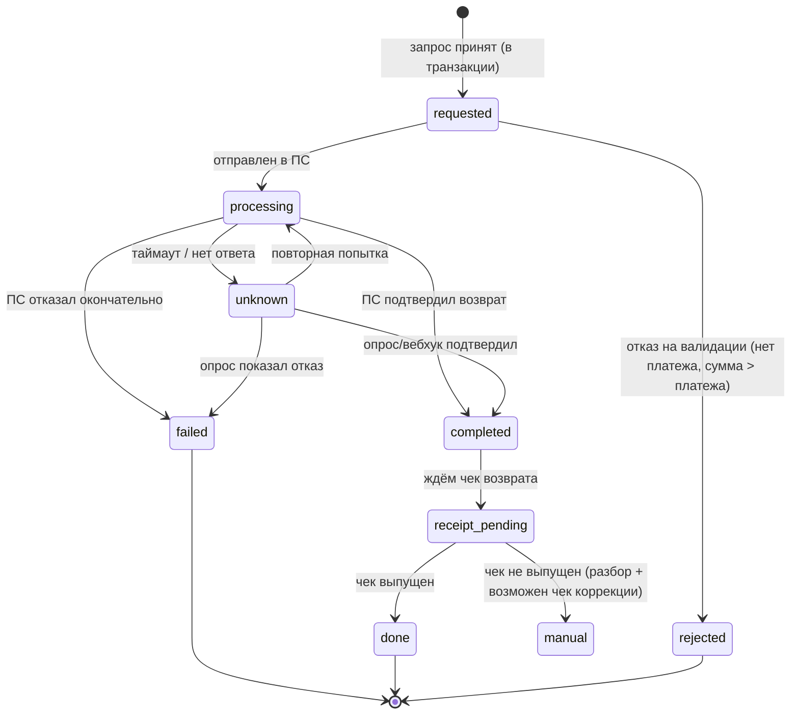

# 05. Возвраты и споры: отдельная машина состояний, а не «минус к платежу»

> **Что проверяют.** В вакансии: «возвраты». Кандидат без опыта говорит «вернули — вычли
> из суммы». Кандидат с опытом говорит: **«возврат — отдельная операция со своим состоянием,
> своим чеком, своими сроками и своими расхождениями»**. Здесь именно это.

---

## 1. Почему возврат — не «минус к платежу»

| Наивно | Реально |
|---|---|
| `payment.amount -= refund` | платёж остаётся фактом; возврат — отдельная сущность со своей историей |
| «одна операция» | возврат идёт **внешним вызовом** в ПС, может занять дни, может не пройти |
| «чек не нужен» | по возврату выпускается **чек возврата прихода**, привязанный к исходному чеку |
| «мгновенно» | у ПС свои сроки (минуты — дни), у карт — до 30 дней на отражение в выписке клиента |
| «не влезает в отчётность» | возврат меняет налоговую базу периода **возврата**, а не периода оплаты |
| «если не прошёл — забыли» | возврат может вернуться в `paid`-состояние платежа; нужен откат состояния |

**Формулировка вслух:** «Возврат — это новая операция, которая ссылается на платёж и на
исходный чек. У неё своя машина состояний, свой внешний вызов, свой фискальный документ и
свои расхождения. Именно поэтому её нельзя делать „минусом“: в учёте минус был бы
изменением истории, а нам нужно дописать факт.»

---

## 2. Полный цикл возврата

```mermaid
sequenceDiagram
    autonumber
    participant U as Пользователь / поддержка
    participant B as Биллинг
    participant DB as MySQL
    participant PS as Платёжная система
    participant F as Фискальный сервис
    participant OFD as ОФД

    U->>B: Запрос возврата (платёж, сумма, причина)
    B->>DB: BEGIN; SELECT payment FOR UPDATE  (блокируем!)
    B->>DB: проверка: сумма возвратов ≤ сумма платежа
    B->>DB: INSERT refund (status=requested)
    B->>DB: INSERT outbox (refund.requested)
    B->>DB: COMMIT
    B-->>U: "Возврат принят, в обработке"

    Note over B,PS: Дальше — асинхронно, внешний вызов
    B->>PS: refund(provider_payment_id, amount)
    PS-->>B: accepted / declined / error
    B->>DB: UPDATE refund SET status=processing, psp_refund_id=...
    PS->>B: вебхук: refund.succeeded
    B->>DB: BEGIN
    B->>DB: UPDATE refund SET status=completed
    B->>DB: INSERT ledger_entry (обратные проводки!)
    B->>DB: UPDATE payment SET status='refunded' (если полный)
    B->>DB: INSERT outbox (receipt.refund.requested)
    B->>DB: COMMIT

    B->>F: receipt.refund.requested
    F->>OFD: чек возврата прихода
    OFD-->>F: ФД/ФПД
```

**Восемь вещей, которые обязательно надо учесть (это и есть «глубина» в теме возвратов):**

| № | Момент | Почему важно |
|---|---|---|
| 1 | возврат **блокирует** платёж при создании | иначе два параллельных запроса вернут больше, чем оплачено |
| 2 | проверка «сумма успешных возвратов ≤ сумма платежа» — **внутри транзакции** | инвариант, который нельзя проверить «примерно» |
| 3 | возврат проходит **внешним вызовом** | не внутри транзакции; асинхронно; с состоянием |
| 4 | обратные **проводки**, а не правка существующих | учёт append-only |
| 5 | **чек возврата** связан с исходным чеком | иначе бухгалтерия не сведёт |
| 6 | статус платежа меняется только при **полном** возврате | частичный возврат не делает платёж «возвращённым» |
| 7 | возврат **может не пройти** | тогда платёж остаётся оплаченным; это не ошибка, а состояние |
| 8 | возврат влияет на **период возврата**, а не оплаты | отчётность: если оплата в марте, возврат в апреле — разные периоды |

---

## 3. Машина состояний возврата



**Обрати внимание на две вещи, которые отличают хороший ответ:**

1. **`completed` и `done` — разные состояния.** Деньги вернули, но чек возврата ещё не
   выпущен. Это реальное и важное различие: бухгалтерия увидит расхождение, если не
   различать.
2. **`unknown`** — обязательное состояние (как в платежах). Таймаут возврата ≠ отказ.

---

## 4. Частичные возвраты и распределение по позициям

### Проблема №1: сколько уже вернули

```sql
-- Инвариант: сумма успешных возвратов не превышает сумму платежа
SELECT p.id, p.amount_minor AS paid,
       COALESCE(SUM(CASE WHEN r.status IN ('completed','done') THEN r.amount_minor END), 0) AS refunded
  FROM payment p
  LEFT JOIN refund r ON r.payment_id = p.id
 WHERE p.id = :paymentId
 GROUP BY p.id, p.amount_minor;
-- В коде (внутри транзакции, под FOR UPDATE): если refunded + requested > paid → отказ
```

Более надёжно — держать на платеже счётчик возвращённого (`refunded_minor`) и обновлять его
в той же транзакции, что и создание/завершение возврата, со сверкой (см. §7).

### Проблема №2: частичный возврат по чеку — что возвращаем и как «поделить» сумму

Если платёж содержал несколько позиций (например, пакет из 10 откликов), а возврат — частичный,
надо решить: какую **часть** чего мы возвращаем. Это ровно задача распределения остатка
(см. `01-php/01-money-precision-php.md` → `allocate()`):

```php
// Пример: платёж 1000 ₽ = 3 позиции 300/300/400. Возвращаем 500 ₽.
// Вариант A: возвращаем пропорционально  -> allocate(50000, [30_000, 30_000, 40_000])
//   => [15000, 15000, 20000]  (сумма ровно 50000 — копейки не теряются)
// Вариант B: возвращаем конкретные позиции (например, одну услугу целиком)
//   Даёт точный предмет расчёта для чека возврата — это важно юридически!
```

**Что тут важно сказать:** «Частичный возврат — это не только арифметика, это вопрос
**предмета расчёта**: в чеке возврата должно быть то же наименование и тот же признак способа
расчёта, что в исходном чеке (аванс — возврат аванса, полный расчёт — возврат расчёта).
Поэтому я храню позиции с их параметрами фискализации, а не только общую сумму. Если бы
платёж был „одной суммой“, частичный возврат по авансу и по оказанной услуге невозможно
было бы отфискализировать правильно.»

Это очень сильный ответ — он показывает связь «деньги → чек → отчётность».

---

## 5. Возврат при разных сценариях

| Сценарий | Особенности |
|---|---|
| **Возврат оплаты картой** | внешний вызов в ПС; сроки отражения у клиента до 30 дней; возможен частичный возврат |
| **Возврат из баланса (внутренний)** | без внешней системы, но нужны проводки и чек возврата; может создать отрицательный баланс, если деньги уже потрачены → это политическое решение (см. ниже) |
| **Возврат аванса** | вернуть можно только «неиспользованную» часть; если часть аванса уже зачтена в услуги — сначала разбираемся с зачётами |
| **Возврат при агентской схеме** | возвращаем и «нашу» часть, и «чужую»; чеки и обязательства разделены |
| **Chargeback (оспаривание)** | **деньги списываются принудительно** — это не наш возврат; нужен процесс: уведомление, сроки на ответ, доказательства, блокировка баланса, возможные потери |
| **Возврат после закрытия периода** | корректировка отдельным документом; меняет базу периода возврата, а не исходного периода |
| **Возврат при частично оказанной услуге** | возвращаем только за неоказанную часть; необходима модель «оказано/неоказано» по позициям |

### Отдельно: отрицательный баланс

Задача: пользователь пополнил 1000 ₽, потратил 800 ₽ на отклики, требует полный возврат 1000 ₽.
Мы уже оказали услуги на 800 ₽. Варианты:

| Вариант | Как работает | Цена |
|---|---|---|
| Вернуть только неиспользованное (200 ₽) | честно юридически, если услуги оказаны | недовольный клиент; юридический риск, если он прав |
| Вернуть всё, баланс —1000/+200 уходит в минус | лояльность | у нас «долг клиента»; взыскивать сложно; **изменяет учёт** |
| Компенсация бонусами (не деньгами) | гибко | бухгалтерский учёт бонусов — отдельная тема |
| Ручное решение поддержки/финблока | универсально | аудит обязателен, иначе хаос |

**Правильная формулировка:** «Это не технический вопрос, а бизнес-решение, и оно должно быть
**явным**: разрешён ли отрицательный баланс как класс, или любой минус — это инцидент.
Технически я могу поддержать любой вариант, но правило должно быть одно и зафиксировано;
иначе в один день минус „нормальный“, а в другой — „баг“. И любая ручная правка баланса
должна оставлять след: кто, когда, почему.»

---

## 6. Связка с чеком: последовательность и «а если»

**Правильная последовательность (важно, и спросят):**

```
1. Деньги фактически вернулись (ПС подтвердил)  → 2. Проводки  → 3. Чек возврата
```

Почему не наоборот: чек возврата фиксирует **состоявшийся** возврат расчёта. Если выпустить
чек раньше, а ПС откажет — получим чек возврата без возврата денег: расхождение с ОФД и с
банком. Но: если по правилам чек должен быть в момент возврата, а ПС отложенный — порядок
и «окно ожидания» надо **согласовывать с бухгалтерией** и фиксировать как правило
(это и есть вариант ответа «а как именно у вас?»).

**Статус, который надо различать:**

```sql
-- Чек возврата выпущен, а деньги не вернулись (или наоборот) → расхождение!
SELECT r.id, r.amount_minor, r.status AS refund_status,
       rc.status AS receipt_status, rc.fiscal_doc_number
  FROM refund r
  LEFT JOIN receipt rc ON rc.refund_id = r.id
 WHERE r.created_day >= CURDATE() - INTERVAL 7 DAY
   AND (
        (r.status IN ('completed','done') AND (rc.id IS NULL OR rc.status <> 'printed'))
     OR (r.status IN ('requested','processing','unknown') AND rc.status = 'printed')
   );
```

> **Тезис:** «Любая пара „деньги/документ“, которая разошлась — это предмет разбора.
> У нас в биллинге таких пар как минимум три: платёж↔проводки, платёж↔чек, возврат↔чек
> возврата. Я бы держал для каждой отдельный сверочный запрос с алертом.»

---

## 7. Charged-back / споры: процесс, а не функция

| Этап | Что происходит | Что делает биллинг |
|---|---|---|
| Уведомление об оспаривании | приходит от ПС/эквайера с суммой и сроком | зафиксировать, связать с платежом, **заблокировать баланс/услугу** |
| Сбор доказательств | логи, подтверждения оказания услуги, IP/подпись | отдать то, что есть; техническая часть — сохранение и выдача данных |
| Решение | в нашу пользу / против | если против — деньги списываются; проводки «потери/споры»; возможен возврат чека |
| Последствия для клиента | блокировка, ограничения | политика — не техническая: решение бизнеса |
| Метрика | количество споров, доля потерь, причины | **обязательно**, иначе не поймём, растёт ли проблема |

**Тезис:** «Chargeback — это не „возврат по нашей инициативе“. Деньги списываются принудительно
и с задержкой, а у нас есть **срок на ответ**. Значит: (1) у нас должны храниться
доказательства расчёта (сырые данные, фискальный документ, лог оказания услуги) и
(2) должен быть процесс с дедлайном, потому что „не ответили вовремя“ = проиграли
автоматически. Это типовая дыра в биллингах: данные есть, но собрать их за 5 дней никто
не может.»

---

## 8. Разбор: «возврат не прошёл в ПС, что делать?»

Это вопрос-проверка. Правильный ответ — по шагам:

```
1. Не менять состояние "наугад": возврат — отказ или unknown?
   - Явный отказ (declined) → refund.status = failed, ПЛАТЁЖ ОСТАЁТСЯ paid.
   - Таймаут (unknown) → опрос статуса; не считать отказом!
2. Уведомить (поддержка/клиент): "возврат не прошёл, вот причина" — не молчать.
   Молчание = клиент ждёт деньги и жалуется.
3. Проверить причину: недостаточно средств на нашем счёте? неверные реквизиты?
   Истёк срок возврата у ПС? Лимиты?
4. Определить путь: повтор, ручной возврат через банк, зачёт балансом, отказ с
   объяснением. Решение — с поддержкой/финблоком; технически — зафиксировать и дать
   инструмент.
5. Не выпускать чек возврата, пока деньги не вернулись (или по правилу бухгалтерии).
6. Обновить баланс/статус, чтобы система отражала реальность: услуга/деньги на месте.
7. Метрика: возвраты в статусе failed > N дней → алерт; иначе они накапливаются тихо.
```

---

## 9. Ответ вслух (90 секунд)

> «Возврат я моделирую как отдельную сущность с собственной машиной состояний, а не как
> минус к платежу. У него есть: ссылка на платёж и на исходный чек, причина, сумма, свои
> состояния и свой внешний вызов в ПС.
>
> Ключевые правила. Первое: сумма успешных возвратов по платежу не может превысить сумму
> платежа, и эта проверка идёт **внутри транзакции под блокировкой платежа** — иначе два
> параллельных возврата „сложатся“ и вернут больше, чем заплатили.
>
> Второе: возврат идёт через внешний вызов и может не пройти. Таймаут — это не отказ,
> поэтому есть `unknown` и опрос статуса. Если возврат окончательно не прошёл, платёж
> **остаётся оплаченным** — и это состояние, а не ошибка.
>
> Третье: порядок такой — деньги фактически вернулись, потом обратные проводки, потом чек
> возврата прихода, связанный с исходным чеком. Проводки только добавляются, ничего не
> правится: учёт append-only.
>
> Четвёртое: частичный возврат — это отдельная работа, потому что в чеке возврата должен
> быть тот же предмет и тот же признак способа расчёта, что в исходном. Значит, позиции
> платежа надо хранить с их параметрами фискализации, а распределение сумм делать с
> распределением остатка, чтобы суммы сходились копейка в копейку.
>
> И пятое: возврат влияет на период **возврата**, а не оплаты, поэтому он попадает в
> отчётность того месяца, когда произошёл. Если исходный период закрыт — это корректировка
> отдельным документом.»

---

## 10. Красные флаги в этой теме

* ❌ «Возврат — это уменьшение суммы платежа».
* ❌ Проверка «уже возвращено» без транзакции и блокировки.
* ❌ Таймаут возврата трактуется как отказ.
* ❌ Чек возврата выпускается до фактического возврата денег (без согласованного правила).
* ❌ Частичный возврат «делим пропорционально» без учёта предмета расчёта.
* ❌ Chargeback обрабатывается как обычный возврат.
* ❌ Возврат, изменивший период оплаты.

## Чек-лист по этому файлу

- [ ] Могу объяснить, почему возврат — отдельная сущность.
- [ ] Помню 8 обязательных моментов из полного цикла возврата.
- [ ] Могу нарисовать машину состояний возврата и объяснить `completed` vs `done` и `unknown`.
- [ ] Знаю, как проверять инвариант «не вернули больше, чем заплатили».
- [ ] Могу рассказать про частичный возврат и связь с предметом расчёта.
- [ ] Готов ответ про «возврат не прошёл».
- [ ] Понимаю, что chargeback — процесс со сроком на ответ и с доказательствами.
