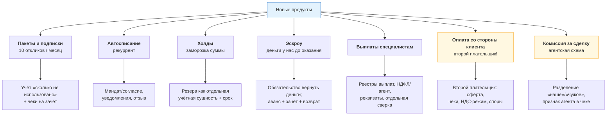
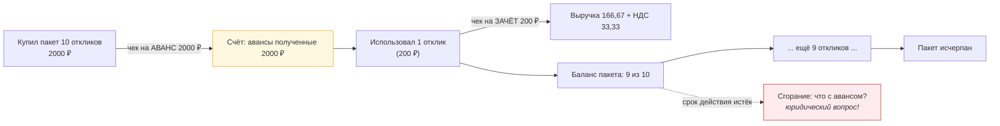
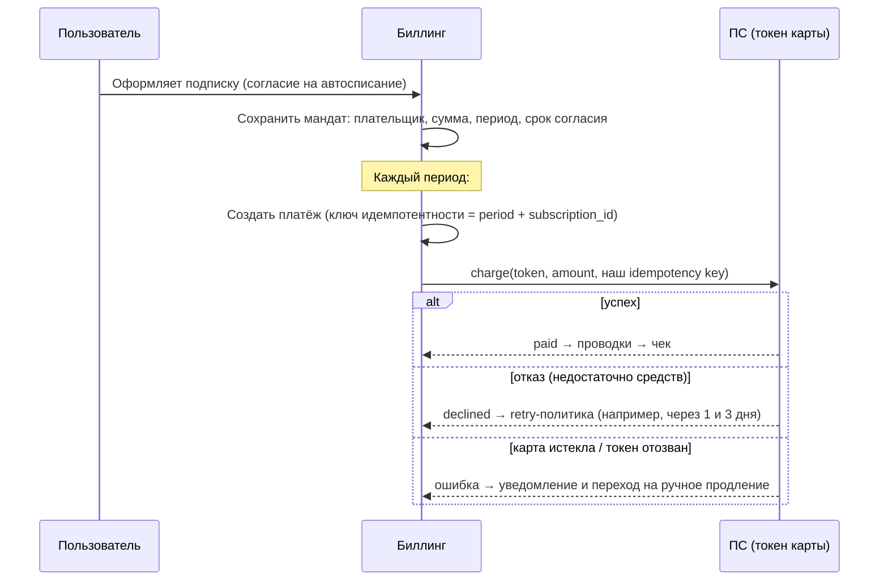
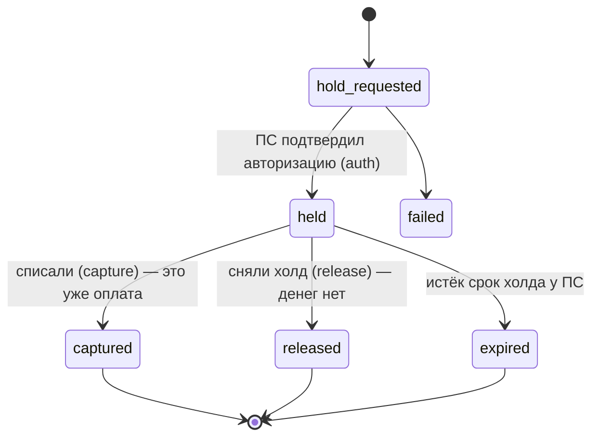
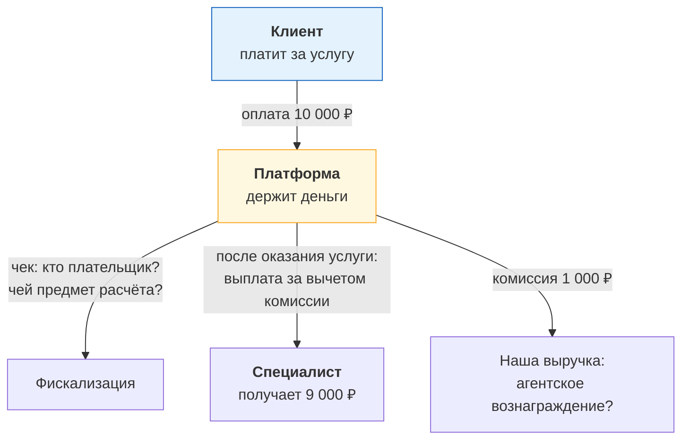
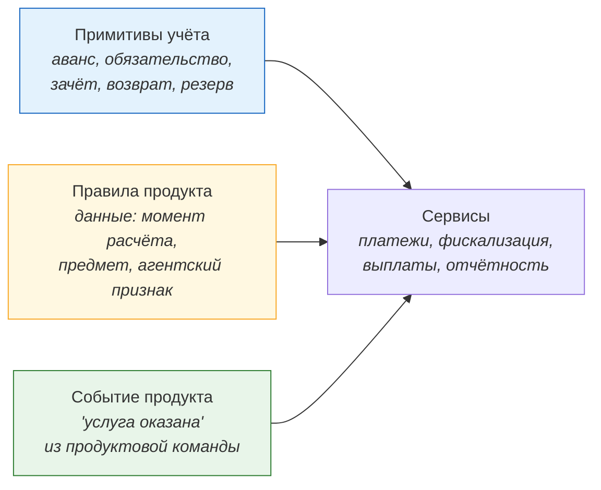

# 06. Подписки, холды, эскроу и новые продукты (оплата со стороны клиентов)

> **Что проверяют.** В вакансии две самые интересные строки: «поддержка новых видов услуг»
> и «готовить систему к новым моделям оплаты, в том числе к сценарию, где деньги будут
> принимать не только со специалистов Профи.ру, но и с клиентов». Это проверка **доменного
> мышления**: умеешь ли ты разложить новый продукт на деньги, чеки и отчётность — и увидеть,
> что там меняется принципиально.
>
> Здесь: рекуррентные платежи, пакеты/подписки с зачётом, холды, эскроу, выплаты, двусторонние
> платежи — и что каждое из этого делает с биллингом.

---

## 1. Карта новых продуктов и их влияние на биллинг



**Готовый тезис:** «Каждый новый продукт — это не новая кнопка, а **новая комбинация уже
существующих примитивов**: аванс, зачёт, обязательство, возврат, агентский признак. Поэтому
я бы сначала проверил, покрывают ли существующие примитивы новый продукт, и только если нет —
добавлял примитив. Это дешевле и безопаснее, чем писать под каждый продукт свою логику.»

---

## 2. Пакеты и подписки: главная сложность — «сколько осталось»

Модель: пользователь купил пакет «10 откликов за 2000 ₽». Пока он не использован — это
**аванс**. По мере использования — зачёт аванса (и чек на зачёт).



**Технические следствия:**

| Что нужно | Как |
|---|---|
| Учёт «остаток пакета» | отдельная сущность (entitlement/подписка) с количеством и/или суммой — **не «просто поле balance»** |
| Идемпотентное списание из пакета | при использовании отклика — операция с `operation_id`, чтобы повтор не съел два |
| Чек на зачёт по каждому использованию | или пакетная фискализация — **это решение бухгалтерии**, и оно сильно влияет на объёмы |
| Срок действия и «сгорание» | ⚠️ юридический вопрос: сгорание аванса по закону может быть невозможно → возможен возврат или пересчёт. **Не решать самому** |
| Возврат неиспользованной части | только «неиспользованное»; нужна история использований |
| Отчётность | «продано пакетов», «использовано», «остаток авансов» — отдельные разрезы |

> **Сильный вопрос на собеседовании (задай его сам):** «А что происходит, когда пакет
> заканчивается по сроку, а отклики не использованы? Это возврат, сгорание или перенос?
> Потому что от этого зависит, доначисляем ли мы аванс в выручку и обязаны ли выпустить
> чек на зачёт — а это уже меняет отчётность.»

**Почему это важно для кода:** «сгорание» — не «удалить строку». Это событие учёта:
списание обязательства, вероятно признание выручки, возможно — чек. Если система этого не
умеет, сгорание станет ручной правкой в базе.

---

## 3. Рекуррентные платежи (автосписание)



**Пять вещей, которые отличают «умею рекуррент» от «понимаю рекуррент»:**

| № | Момент |
|---|---|
| 1 | **Ключ идемпотентности периода**: `subscription_id + period` → повтор списания за тот же период не создаёт второй платёж |
| 2 | **Отказ — норма**: недостаточно средств, истёкшая карта. Нужна политика retry и «что делать дальше» (grace period, ограничение услуги) |
| 3 | **Согласие (мандат) — это данные**: срок, сумма, кто дал, когда, можно ли изменить. Его нужно хранить и уметь показать |
| 4 | **Отзыв согласия** должен останавливать списания; отмена должна быть идемпотентной |
| 5 | **Уведомления**: за N дней до списания, после успеха, при отказе — это часть требований лояльности, но ещё и данные (журнал уведомлений) |

**Тезис:** «Рекуррент — это не „повторяющийся платёж“, это **подписка как сущность** с
мандатом, расписанием, политикой отказов и журналом. Самая частая ошибка — сделать
крон, который раз в месяц „списывает по всем подпискам“ без идемпотентности периода:
после сбоя крон может запуститься дважды и списать второй раз.»

---

## 4. Холды (заморозка суммы)

Когда нужно: проверить карту с реальной суммой, зарезервировать деньги до получения услуги
(например, клиент бронирует специалиста), или отложенный захват суммы.



**Что важно технически:**

| Момент | Почему |
|---|---|
| Холд — **не деньги**, а обязательство «сумма зарезервирована» | в учёте это НЕ проводка в выручку; можно показывать как «зарезервировано» |
| **Срок** холда у ПС ограничен | нужен «хранитель сроков» и решение: capture или release до истечения |
| `capture` может быть **на меньшую** сумму | тогда нужно корректировать и не запутаться: сколько держали, сколько сняли |
| Холд **не подлежит фискализации**, пока не перешёл в списание | чек — на факт расчёта, а холд — не расчёт |
| `release`/`expired` — не ошибка | нормальный исход; его надо уметь обрабатывать и не оставлять «висящих» |
| Отмены и сбои | если процесс упал после `held` — надо уметь «дожать» (опрос статуса или явный release) |

**Отдельный важный момент для биллинга:** холд и «аванс» — разные вещи, и их часто путают.
Холд — деньги **ещё не сняты**. Аванс — деньги **уже сняты**, но услуга не оказана. Для учёта,
для чеков и для отчётности это принципиально разные ситуации. Сказать это вслух — большой плюс.

---

## 5. Эскроу и оплата со стороны клиента (главный новый сценарий)

Это то, что вакансия называет «деньги будут принимать не только со специалистов, но и
с клиентов». Разберём как домен.

### Что появляется



### Шесть принципиальных вопросов (задай их на собеседовании!)

| № | Вопрос | Почему он определяет архитектуру |
|---|---|---|
| 1 | **Кто плательщик и кто получатель услуги?** | от этого зависит оферта и чеки |
| 2 | **Мы агент или исполнитель?** | от этого зависит, чья выручка в чеке и признак агента |
| 3 | **Когда возникает расчёт** (в момент оплаты или в момент оказания)? | определяет момент чека и признак способа расчёта |
| 4 | **Что если услуга не оказана** (специалист не пришёл)? | возврат? спор? автоматическая эскалация? |
| 5 | **Сколько мы держим деньги** (сразу перечисляем или после подтверждения)? | эскроу = обязательство + резерв + срок |
| 6 | **Что видит специалист** — баланс, «ожидаемые выплаты», дату выплаты? | определяет модель обязательств и отчётность по выплатам |

### Что меняется в биллинге (технически)

| Изменение | Что нужно |
|---|---|
| **Второй тип плательщика** | роли, разные оферты, разный состав чека, разные НДС-режимы |
| **Двухэтапный расчёт** | аванс (деньги от клиента) → зачёт (услуга оказана) → выплата специалисту |
| **Обязательство перед специалистом** | отдельный счёт учёта; сумма обязана совпадать с «ожидаемыми выплатами» |
| **Выплаты** | реестр выплат, реквизиты (карта/СБП), НДФЛ/агентские удержания, отдельная сверка с банком |
| **Споры и неоказание** | процесс с SLA: клиент заявляет, мы разбираемся, возвращаем/выплачиваем |
| **Комиссия** | разделение «наше вознаграждение» и «деньги принципала» в чеке (признак агента) |
| **Хранение средств** | если деньги «наши» — это уже финансовая деятельность; если «чужие» — мы держим их на возвратном/номинальном счёте. **Юридическое решение, не техническое** |
| **Отчётность** | новые разрезы: оборот по клиентам, обязательства перед специалистами, комиссия, выплаты |

> **Мощная формулировка для собеседования:**
> «Этот сценарий — не „добавить оплату“, а **появление второй стороны и обязательств**. По сути,
> у нас появляется эскроу-модель: мы получаем деньги, но часть из них — не наша выручка,
> а обязательство перед специалистом. Значит, в учёте появляется счёт обязательств, в чеке —
> признак агента, а в отчётности — новые разрезы по обязательствам и выплатам. И самый
> важный вопрос не технический, а юридический: **чей это доход и что мы делаем, если услуга
> не оказана**. Технически я готов сделать любой вариант, но правило должно быть одно,
> зафиксировано и проверяемо.»

---

## 6. Выплаты специалистам

Если появляются выплаты, то это **второй поток денег наружу**, и он не «зеркальный» приём.

| Аспект | Что нужно |
|---|---|
| Реестр выплат | периодичность (по заявке/по расписанию), минимальная сумма, статусы |
| Реквизиты | карта/счёт/СБП; валидация; хранение **чувствительных** данных (PCI/персонданные) |
| Налоги и удержания | НДФЛ/агентские схемы — правила от бухгалтерии; в чек/документы попадает уже итоговая сумма |
| Идемпотентность выплаты | ключ по `payout_batch_id + recipient_id` — **повтор выплаты = реальные деньги наружу** |
| Отказ выплаты | ошибочный реквизит — деньги вернутся; нужно состояние и повтор |
| Антифрод | выплаты — классическая цель мошенничества; нужны лимиты, проверки, ручное подтверждение крупных |
| Сверка | реестр выплат ↔ движения по банковскому счёту ↔ внутренние обязательства |
| Документы | может потребоваться свой документ/уведомление; юридические детали — бухгалтерия |

**Тезис:** «Выплата — самая опасная операция в биллинге: это единственная операция, где
деньги уходят наружу по нашей инициативе. Значит: жёсткая идемпотентность, ограничение
сумм, ручное подтверждение для крупных, отдельная сверка и отдельный аудит.»

---

## 7. Как проектировать «под новые продукты» (ответ на «готовить платформу»)



**Что я бы сделал, чтобы новые продукты добавлялись дешевле (готовый список):**

```
1. Выделить примитивы учёта и реализовать их один раз: аванс, зачёт, обязательство,
   резерв (холд), возврат, компенсация. Новый продукт = комбинация примитивов.
2. Правила продукта (когда чек, какой предмет/способ расчёта, агентский признак)
   хранить в данных с версионированием по времени.
3. Ввести "событие оказания услуги" как первоклассное событие: идемпотентное,
   с ключом, приходящее из продукта. От него зависят и зачёт аванса, и чек, и выплата.
4. Разделить "деньги" и "права/лимиты": сколько откликов, сколько дней подписки —
   это не деньги, но связано с ними. Отдельная модель + отчётность.
5. Сделать сверку с каждым источником/получателем: ПС, ОФД, банк (приём и выплаты),
   плюс внутреннюю (агрегаты ↔ проводки).
6. Зафиксировать решения по спорным местам (сгорание, отрицательный баланс, неоказание)
   как явные правила, а не как случайное поведение кода.
```

> **Финальная формулировка для собеседования:**
> «Ваша фраза „чтобы новую логику чеков, налоговой отчётности и платёжных сценариев можно
> было добавлять быстрее“ — это про то, что **примитивы учёта и правила фискализации — это
> данные и версии, а не код**. Тогда новый продукт — не рефакторинг биллинга, а справочник
> плюс тест на новый сценарий. Именно так я бы строил этот этап.»

---

## 8. Задачи

### Задача 1. «Клиент оплатил услугу 10 000 ₽. Специалист не явился. Что происходит?»

**Разбор:** это цепочка решений, которую нельзя решить одним `INSERT`:
1. Есть ли у нас обязательство вернуть клиенту? (по оферте/правилам)
2. Мы удерживаем комиссию за срыв или нет?
3. Куда уходят деньги: возврат клиенту, депонирование, штраф?
4. Что с чеком: чек возврата клиенту? Чек на нашу комиссию (если мы её удержали)?
5. Что с обязательством перед специалистом — снимаем?
Правильный ответ: «Это процесс с явными шагами и ручным решением на спорных кейсах.
Технически я должен уметь: вернуть клиенту, удержать/не удержать комиссию (с фискализацией),
снять обязательство, сохранить трассировку „почему“».

### Задача 2. «Пользователь купил пакет 10 откликов, использовал 3. Требует вернуть всё.»

**Разбор:** вернуть можно только неиспользованное — и это надо объяснить, а не «просто посчитать».
Плюс: услуги по 3 откликам **оказаны** и отфискализированы; откатывать их нельзя (юридически
это уже расчёт). Правильный ответ: «мы возвращаем неиспользованный аванс; по оказанным
услугам — отказ (или компенсация бонусами как отдельное управленческое решение)».

### Задача 3. «Надо добавить подписку на продвижение профиля. Сколько работы?»

**Разбор:** если примитивы есть (аванс + периодический зачёт + мандат на автосписание),
работа — новый вид услуги в прайсе, расписание, правила фискализации, уведомления и
метрики. Если примитивов нет — сначала подписка как сущность (мандат, расписание, отказы).
Правильный ответ различает «продукт» и «новый примитив».

### Задача 4. «Как обеспечить, чтобы мы не заплатили специалисту дважды?»

**Разбор:** идемпотентность выплаты: `UNIQUE(payout_batch_id, recipient_id)` в БД, статус
(`requested/processing/sent/failed`), внешний вызов вне транзакции, опрос статуса, плюс
сверка реестра выплат с банковской выпиской. И отдельная проверка: «сумма выплат ≤ сумма
обязательств» (иначе платим больше, чем должны).

---

## 9. Красные флаги в этой теме

* ❌ «Пакет откликов — это просто баланс» (без модели использования и зачёта по каждому факту).
* ❌ «Сгорание — просто обнулим счётчик» (это событие учёта/налогов, решает бухгалтерия).
* ❌ Крон рекуррента без идемпотентности периода.
* ❌ Путать холд и аванс.
* ❌ «Оплата от клиента — это то же самое, просто другой пользователь» (без вопросов об агентстве и обязательствах).
* ❌ Выплаты без уникального ключа и без реестра.
* ❌ «Если услуга не оказана — вернём, решим потом, как именно».

## Чек-лист по этому файлу

- [ ] Могу разложить любой новый продукт на примитивы учёта.
- [ ] Объясняю модель пакетов/подписок и почему нужен учёт «сколько осталось».
- [ ] Знаю 5 обязательных моментов рекуррента (мандат, идемпотентность периода, политика отказов...).
- [ ] Различаю холд и аванс и объясняю разницу для чеков и учёта.
- [ ] Готов задать 6 вопросов про «оплату со стороны клиентов».
- [ ] Могу рассказать про выплаты как самый опасный денежный поток.
- [ ] Готов ответ «как строить платформу под новые продукты» (примитивы + правила = данные).
