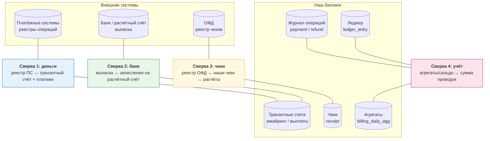
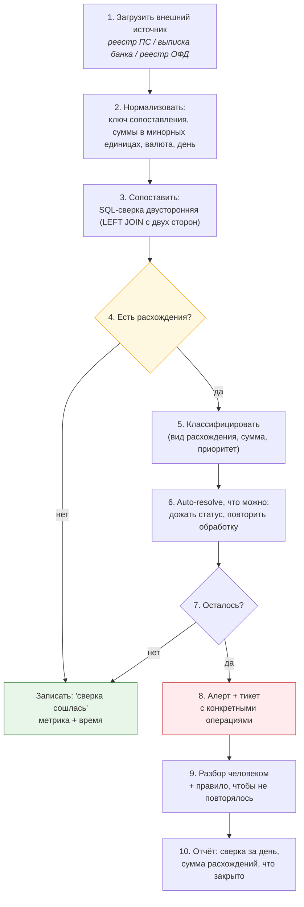

# 07. Сверка (реконсиляция): как ловить расхождения в деньгах

> **Что проверяют.** Сверка — это то, чем биллинг занимается **каждый день**, и это самая
> «биллинговая» тема из всех: она показывает, понимаешь ли ты, что деньги живут в нескольких
> системах и **обязаны периодически сходиться**. Кандидат без опыта говорит «сверим отчёт
> с отчётом». Кандидат с опытом называет 4 сверки, 5 видов расхождений и порядок разбора.
>
> Твой опыт (эквайринг, реестры PSP, банкоматная сеть) — прямой козырь. Здесь — система.

---

## 1. Что с чем сверяется (четыре сверки биллинга)



| Сверка | Что ловит | Частота | Критичность |
|---|---|---|---|
| **1. ПС ↔ мы** | потерянные/лишние платежи, расхождения сумм и статусов | ежедневно (можно чаще — инкрементально) | 🔴 деньги |
| **2. Банк ↔ транзит** | деньги не пришли, пришли не полностью, лишние списания (комиссии, штрафы) | ежедневно (по выписке) | 🔴 деньги |
| **3. ОФД ↔ мы** | невыпущенные/лишние чеки, неверные суммы | ежедневно | 🟠 юридический риск |
| **4.Учёт (внутренняя)** | расхождения между агрегатами, сальдо и проводками | ежедневно + при деплое | 🔴 признак системной проблемы |
| **5. Выплаты** (если появятся) | выплаты: реестр ↔ банк ↔ обязательства | ежедневно | 🔴 деньги наружу |
| **6. Продукт ↔ биллинг** | «услуга оказана» ↔ «зачёт аванса/чек» | ежедневно/инкрементально | 🟠 расхождения отчётности |

**Первое, что надо сказать:** «Сверка — не проверка „сойдётся ли“, а **штатный ежедневный
процесс**, потому что расхождения будут всегда: из-за задержек, из-за границ суток, из-за
сбоев. Задача не „чтобы их не было“, а чтобы они **обнаруживались в тот же день и не копились**.»

---

## 2. Анатомия расхождения: 5 видов

| Вид | Пример | Что означает | Приоритет |
|---|---|---|---|
| **Только у нас** | платёж `paid`, а в реестре ПС его нет | ложная оплата / ошибка id / платёж ещё не в реестре (задержка) | 🔴 нужно разобраться сегодня |
| **Только у них** | у ПС платёж есть, у нас нет | потеряли вебхук, ошибка приёма | 🔴 деньги есть, но не учтены |
| **Расходится сумма** | 1000 ₽ против 999,50 ₽ | комиссия, округление, конвертация, частичный платёж | 🟠 разбор, но обычно объяснимо |
| **Расходится статус** | у нас `paid`, у ПС `refunded` | не обработали возврат/chargeback | 🔴 |
| **Расходится время/день** | платёж в 23:58 «ушёл» в следующий день | границы операционного дня / задержка реестра | 🟡 правило, а не баг |
| **Дутбликат** | у ПС две операции по одному заказу | повторы на стороне ПС, двойное списание | 🔴 |

**Ключевой практический момент — «задержка против расхождения»:**

> «Прежде чем называть расхождение расхождением, надо учесть **окна задержки**: реестр от ПС
> может приходить с лагом, банк — T+1, у частичных операций бывают свои сроки. Поэтому
> сверка делается не „за вчера побайтово“, а с учётом окон: „то, что не сошлось сейчас, должно
> сойтись в течение N часов“. И только то, что не сошлось после окна, — реальное расхождение.
> Иначе мы будем каждый день гоняться за нормальными задержками.»

```sql
-- Пример: сверка с окном. Платежи, "оплаченные" у нас, но отсутствующие в реестре
-- спустя 6 часов после оплаты (то есть окно задержки уже истекло)
SELECT p.id, p.provider_code, p.provider_payment_id, p.amount_minor, p.paid_at
  FROM payment p
  LEFT JOIN psp_registry r
    ON  r.provider_code       = p.provider_code
    AND r.provider_payment_id = p.provider_payment_id
    AND r.created_day         = p.operation_day
 WHERE p.status = 'paid'
   AND p.paid_at < NOW() - INTERVAL 6 HOUR
   AND p.paid_at > NOW() - INTERVAL 3 DAY
   AND r.id IS NULL
 ORDER BY p.paid_at;
```

---

## 3. Как устроена сверка: от поиска до разбора



### Ключ сопоставления — самое важное решение

| Ключ | Когда годится | Ловушки |
|---|---|---|
| `provider_payment_id` | есть у обеих сторон | у некоторых ПС меняется (например, при повторной попытке) |
| Наш `order_id` (переданный в ПС) | обычно самый устойчивый | ПС его хранит не всегда в реестре |
| `RRN`/`auth code` | для карт | не у всех ПС в реестре |
| Комбинация (id + сумма + дата) | когда однозначного id нет | ложные совпадения при одинаковых суммах |

**Фраза-маркер:** «Первое, что я делаю при построении сверки — договариваюсь о **ключе
сопоставления**. Если ключ неустойчив (ПС меняет id при повторе), сверка начинает каждый день
показывать ложные расхождения и теряет доверие — а вместе с ним перестаёт работать.»

### Правило идемпотентности сверки

```php
// Сверка ДОЛЖНА быть идемпотентной: запуск дважды не должен создать две корректировки.
// Поэтому auto-resolve идёт через тот же идемпотентный обработчик, что и вебхук,
// а не через "INSERT вручную".
$handler->handle(new PspStatusResolved($paymentId, $status));  // идемпотентно по (source, event_id)
```

**Важный тезис:** «Автоматическое закрытие расхождений должно идти **тем же путём**, что и
штатная обработка: тот же идемпотентный обработчик, тот же ключ. Иначе мы получим третий путь
изменения денег — и он обязательно разойдётся с двумя другими.»

---

## 4. Что делать с найденными расхождениями

| Расхождение | Автодействие | Ручное действие |
|---|---|---|
| У нас `paid`, у ПС нет | опрос `getStatus` у ПС (авто) | если ПС говорит «нет операции» — ручное решение: отменить/уточнить; возможен возврат |
| У ПС есть, у нас нет | **replay**: прогнать событие через идемпотентный обработчик (авто) | если replay не проходит — разбор |
| Расходится сумма | ничего автоматически! | разбор с финблоком: комиссия? конвертация? частичный платёж? |
| Расходится статус | опрос статуса, затем обработка | если ПС вернул `refunded`, а мы не знали — обработать возврат, сверить с чеком |
| Дубликат | отметить, не трогать деньги | возврат второго списания + обращение в ПС |
| Не сошлась выписка банка | отметить | разбор с бухгалтерией/банком: комиссии, штрафы, возвраты |

**Жёсткое правило, которое надо произнести:** «Автоматически я закрываю только те
расхождения, где **внешний источник даёт однозначный факт** (статус от ПС). Всё, что
касается сумм, — только человек и только с бухгалтерией. Автоматическая „правка суммы, чтобы
сошлось“ — это худшее, что можно сделать в биллинге.»

---

## 5. Разбор: «сверка не сошлась на 1 000 000 ₽»

Это классический вопрос на собеседовании («что ты будешь делать?»). Готовый ход:

```
1. ОЦЕНИТЬ МАСШТАБ. Одна операция на миллион или тысяча операций по тысяче? Разные причины.
   Период: один день или весь месяц? Один провайдер или все?

2. ЛОКАЛИЗОВАТЬ НАПРАВЛЕНИЕ.
   У нас больше, чем у них? Или у них больше? Или суммы?
   Какая сторона "лишняя" — это уже делит гипотезы вдвое.

3. ПРОВЕРИТЬ ОЧЕВИДНОЕ, НО ЧАСТОЕ:
   - окно задержки (реестр за сегодня — ещё не полный);
   - граница операционного дня (наши сутки ≠ сутки ПС);
   - отмены/возвраты (мы считаем "оплачено", ПС уже вернул);
   - комиссии ПС/банка (мы считали полную сумму);
   - валюта/конвертация.

4. ПРОВЕРИТЬ СЕБЯ. Не «кто виноват», а «наши данные верны?».
   Инварианты: сумма проводок = 0; сальдо = сумма проводок; сумма по платежу совпадает.
   Если наши инварианты нарушены — проблема у нас, и она системная.

5. НЕПРЕРЫВНОСТЬ. Проверить границы диапазона: не потеряли ли часть реестра при загрузке
   (неполный файл, обрезанный ответ API, часовой пояс при парсинге).
   Классика: загрузили реестр, но пропустили N строк из-за ошибки парсинга.

6. ТОЧЕЧНЫЙ РАЗБОР. Взять 3-5 конкретных операций из расхождения и пройти по каждой
   вручную: наш платёж → событие → проводки → чек → статус у ПС.
   Часто 5 операций объясняют весь миллион.

7. ПОЧИНИТЬ И ЗАКРЫТЬ. Закрыть тем же идемпотентным путём; то, что нельзя закрыть
   автоматически — в тикет бухгалтерии; отчитаться: причина, что закрыто, что осталось.

8. ПОЧЕМУ НЕ ПОЙМАЛИ РАНЬШЕ. Раз сверка показала расхождение с задержкой — значит
   либо её не было, либо её результаты не читали, либо она не покрывала этот вид операций.
   Это самый важный вывод: добавить вид операции в сверку и алерт.
```

**Тезис, который надо обязательно добавить:** «И я сразу проверяю, **не ли это системная
ошибка** — потому что расхождение на миллион может быть одним багом с одним кодом, который
сработал на 100 000 операций. Тогда главное — остановить источник, а не закрыть цифру.»

---

## 6. Реализация: как это выглядит в коде и в схеме

```sql
-- Реестр от ПС: загружаем «как есть» + нормализованные поля
CREATE TABLE psp_registry_row (
  id                  BIGINT UNSIGNED NOT NULL AUTO_INCREMENT,
  provider_code       VARCHAR(16)     NOT NULL,
  created_day         DATE            NOT NULL,
  provider_payment_id VARCHAR(128)    NULL,
  order_id            VARCHAR(128)    NULL,        -- наш id, если ПС его отдаёт
  amount_minor        BIGINT          NOT NULL,
  currency            CHAR(3)         NOT NULL,
  status              VARCHAR(32)     NOT NULL,    -- как есть у ПС
  created_at          DATETIME(6)     NOT NULL,
  raw                 JSON            NOT NULL,     -- сырая строка реестра (для разбора!)
  matched_payment_id  BIGINT UNSIGNED NULL,         -- результат сопоставления
  match_status        ENUM('matched','ours_only','theirs_only','amount_diff','status_diff') NULL,
  PRIMARY KEY (id),
  KEY idx_provider_day (provider_code, created_day),
  KEY idx_provider_payment (provider_code, provider_payment_id),
  KEY idx_match_status (created_day, match_status)
) ENGINE=InnoDB;
```

```php
final class DailyReconciliation
{
    /** Идемпотентно: повторный запуск за тот же день не портит данные */
    public function run(ProviderCode $provider, string $day): ReconciliationReport
    {
        $this->registryImporter->import($provider, $day);       // 1. загрузить реестр

        $this->pdo->beginTransaction();
        try {
            // 2. сопоставить (одним запросом, двусторонним)
            $this->matcher->match($provider, $day);             // UPDATE match_status, matched_payment_id

            // 3. расхождения — в отчёт (а не "починить молча"!)
            $report = $this->matcher->report($provider, $day);
            $this->pdo->commit();
        } catch (\Throwable $e) {
            if ($this->pdo->inTransaction()) $this->pdo->rollBack();
            throw $e;
        }

        // 4. авторазбор только там, где внешний источник однозначен
        foreach ($report->theirsOnly as $row) {
            $this->idempotentReplay->apply($row);               // тот же обработчик, что для вебхука
        }

        $this->metrics->gauge('reconciliation.mismatch_total', $report->mismatchCount(), ['provider' => $provider->value]);

        // 5. алерт, если расхождения превышают порог (не "если есть")
        if ($report->mismatchCount() > $this->threshold) {
            $this->alerting->critical('reconciliation_mismatch', $report->summary());
        }

        return $report;
    }
}
```

**Четыре правила реализации, которые стоит назвать:**

| Правило | Почему |
|---|---|
| Сырую строку реестра сохраняем целиком (`raw JSON`) | при разборе через месяц вы поймёте причину только из сырых данных |
| Сопоставление — **записью** результата (`match_status`), а не «на лету» | можно переспрашивать статус, строить отчёты, видеть историю |
| Авторазбор только через **идемпотентный штатный путь** | не появляется третий способ менять деньги |
| Порог и алерт вместо «просто отчёт» | расхождение на 50 ₽ в день и на миллион — одна строка в отчёте, но разные приоритеты |

---

## 7. Метрики сверки (что должно быть на дашборде)

| Метрика | Смысл порога |
|---|---|
| `mismatch_amount` за день по провайдеру | деньги под риском; > 0 требует разбора, > порога — алерт |
| `mismatch_count` по видам | динамика: растёт — деградация |
| `age_of_oldest_unresolved` | самое старое незакрытое расхождение; > N дней — 🔴 |
| `ours_only` / `theirs_only` | «мы считаем оплаченным без подтверждения» / «потеряли платёж» |
| `receipt_lag_minutes` (отставание чеков) | доменная метрика фискализации |
| `automatically_resolved` / `manual` | сколько разбирается людьми; рост = проблема в процессе |
| `reconciliation_last_success_ts` | если сверка не запускалась — это **риск слепой зоны**, а не «тишина» |

**Фраза-маркер:** «Самый опасный алерт — не „расхождение“, а **„сверка не запускалась“**.
Потому что молчащая сверка выглядит как отсутствие проблем, а на деле это слепая зона.
Поэтому „время последней успешной сверки“ — обязательная метрика с алертом на устаревание.»

---

## 8. Ответ вслух (2 минуты)

> «Сверка у меня — не проверка „сойдётся ли“, а ежедневный процесс, потому что расхождения
> будут всегда: из-за задержек реестров, из-за границ операционного дня, из-за сбоев.
> Задача — находить их в тот же день, а не копить.
>
> Сверяю четыре пары. Первая — реестр платёжной системы против наших платежей и транзитного
> счёта: это про деньги. Вторая — банковская выписка против зачислений на расчётный счёт:
> это про то, что деньги реально пришли (и про комиссии). Третья — реестр ОФД против наших
> чеков: это про юридический риск. Четвёртая — внутренняя: агрегаты и сальдо против суммы
> проводок, это ловит системные ошибки у нас.
>
> Порядок разбора: сначала масштаб и направление (у нас больше или у них), потом очевидное —
> окна задержки, операционный день, отмены, комиссии, конвертация. Потом проверка себя через
> инварианты учёта: если у нас сумма проводок по операции не ноль или сальдо не равно сумме
> проводок — проблема у нас, и она системная. Дальше — точечный разбор 3-5 операций: обычно
> они объясняют всю картину. И самое важное: я всегда проверяю, не один ли это баг,
> сработавший на сотне тысяч операций — потому что тогда первое действие — остановить источник,
> а не „закрыть цифру“.
>
> Автоматически закрываю только то, где внешний источник даёт однозначный факт — и **тем же
> идемпотентным обработчиком**, что и вебхуки. Суммы вручную не правлю никогда: это разговор
> с бухгалтерией.
>
> И то, что я считаю обязательным: на дашборде должно быть видно **время последней успешной
> сверки**. Молчащая сверка опаснее расхождения.»

---

## 9. Красные флаги в этой теме

* ❌ «Сверим раз в месяц» (расхождения накапливаются и уже неразбираемы).
* ❌ Автоматическая правка сумм, чтобы «сошлось».
* ❌ Не учитывать окна задержки (гоняться за нормальными лагами).
* ❌ Сопоставление по неустойчивому ключу без обсуждения.
* ❌ Сверка без сохранения сырых данных.
* ❌ Не различать «мы насчитали больше» и «у них больше» (это совершенно разные проблемы).
* ❌ Не иметь метрики «сверка не запускалась».

## Чек-лист по этому файлу

- [ ] Могу назвать 4 (и более) сверки и что каждая ловит.
- [ ] Знаю 5-6 видов расхождений и их приоритеты.
- [ ] Объясняю, почему важны окна задержки и операционный день.
- [ ] Готов разбор «не сошлось на миллион» по 8 шагам.
- [ ] Могу назвать 4 правила реализации сверки (raw, match_status, идемпотентный replay, пороги).
- [ ] Помню про метрику «время последней успешной сверки».
- [ ] Готов ответ, что автоматизирую, а что нет.
