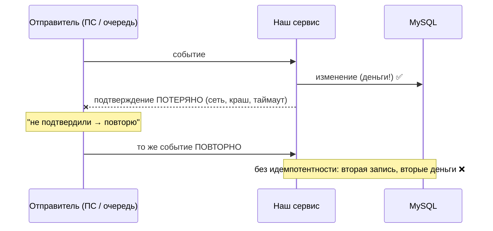
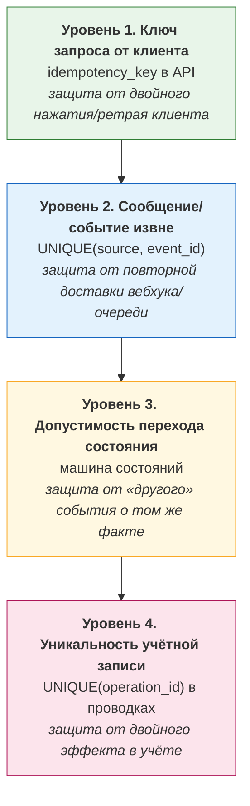
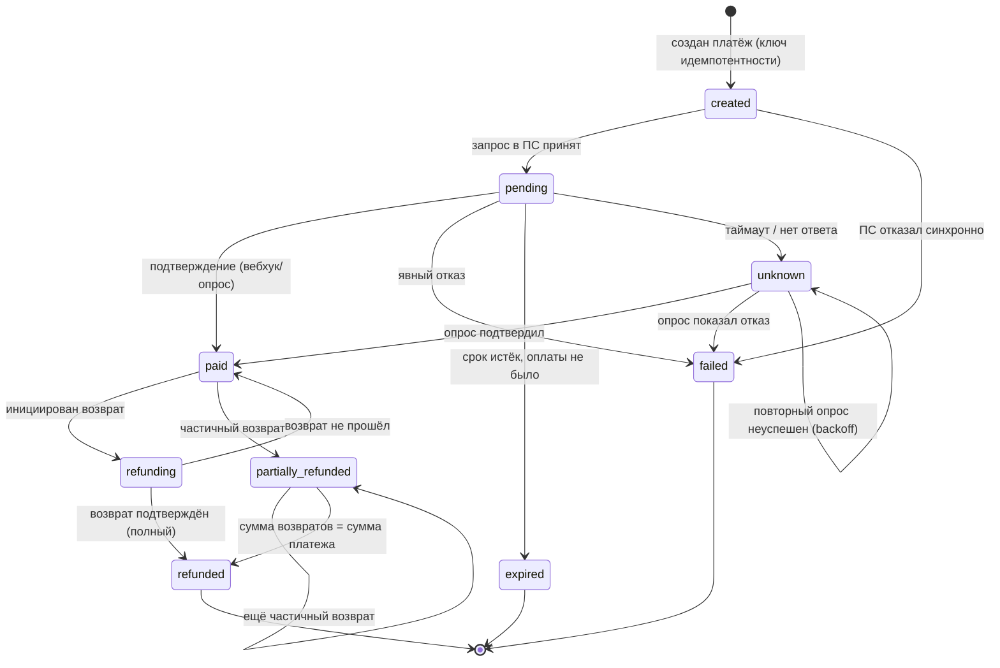
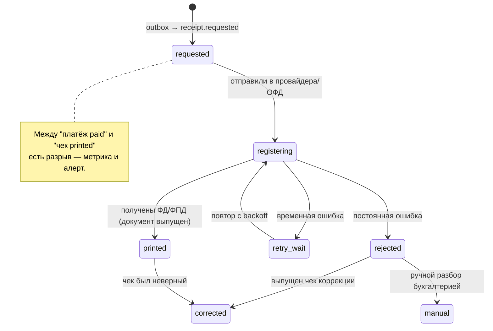
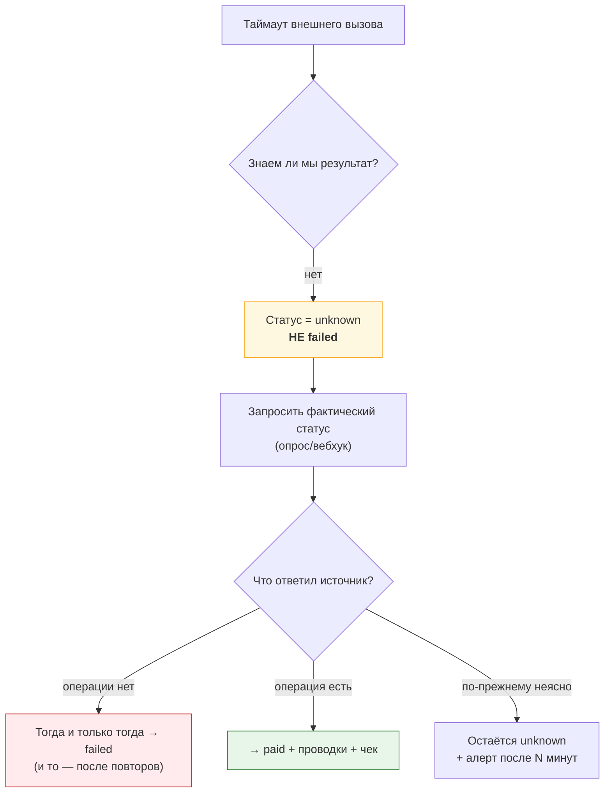

# 01. Идемпотентность и машины состояний: фундамент всех задач

> **Что проверяют.** Это **главный** файл. Почти на любую практическую задачу («приём платежа»,
> «повторная обработка», «поведение при сбое», «возвраты») правильный ответ начинается с
> идемпотентности и машины состояний. Если тут нет глубины — остальное не спасёт.
>
> Здесь: уровни идемпотентности, ключи, идемпотентность в БД (а не в коде), полные машины
> состояний платежа / чека / возврата, и **таблица «сбой → что происходит → что делать»**,
> которая закрывает половину вопросов «а если».

---

## 1. Почему в биллинге без идемпотентности нельзя вообще

В распределённой системе невозможно гарантировать «ровно одну доставку». Причина не в
небрежности, а в физике: подтверждение доставки само может потеряться.



**Формулировка, которую надо произнести:**

> «Гарантировать ровно одну доставку нельзя. Значит, единственный практичный режим —
> at-least-once, и тогда **обработчик обязан быть идемпотентным**: повторное применение
> события не должно менять результат. Причём идемпотентность должна обеспечиваться
> **ограничением в базе данных**, а не проверкой в коде — потому что проверка в коде
> уязвима к гонке.»

---

## 2. Четыре уровня идемпотентности (это и есть «глубокий ответ»)

Кандидаты обычно называют один уровень. Сильный ответ — четыре, потому что они закрывают
разные сценарии.



| Уровень | Что защищает | Как реализуется | Что будет без него |
|---|---|---|---|
| 1 | повторный HTTP-запрос клиента | `idempotency_key` от клиента/нашей платформы, `UNIQUE`, повтор возвращает **тот же** ответ | двойное создание платежа |
| 2 | повторная доставка вебхука/сообщения | `UNIQUE(source, event_id)` + `ON DUPLICATE KEY`/`INSERT ... ON CONFLICT` | двойное зачисление |
| 3 | событие о том же факте с другим id («paid» и «captured») | проверка допустимости перехода + `UPDATE ... WHERE status = :expected` | противоречивые состояния, повторные эффекты |
| 4 | двойной эффект в учёте | `UNIQUE(operation_id)` в `ledger_entry`; сумма проводок по операции = 0 | «деньги в учёте задвоены, хотя платёж один» |

**Ключевая мысль:** «Эти уровни **не заменяют друг друга**. Клиент может повторить запрос
(уровень 1), ПС может прислать другой `event_id` о том же факте (уровень 3), а очередь —
доставить то же сообщение дважды (уровень 2). И даже если всё это отсечено, в учёте нужен
уровень 4 — иначе повторный проход даст вторые проводки. Поэтому в биллинге идемпотентность
— это не одно поле, а набор гарантий на каждом слое.»

### Что такое «правильный ключ идемпотентности»

| Плохой ключ | Почему плохо |
|---|---|
| `md5(время + сумма)` | меняется при повторе → не защищает |
| `md5(user_id)` | один ключ на все операции пользователя → нельзя сделать две разные покупки |
| случайный UUID, генерируемый на каждый вызов | при ретрае будет **новый** ключ → нет защиты |

| Хороший ключ | Когда |
|---|---|
| Клиентский `Idempotency-Key` (генерируется один раз на «намерение») | API, где клиент ретраит |
| `user_id + service_code + business_ref` (например, `order_id`) | защита от двойной покупки одной услуги |
| `subscription_id + period` | рекуррентные списания |
| `provider + provider_event_id` | входящие вебхуки |

**Правило:** ключ должен быть **детерминированным** от бизнес-намерения и **стабильным** при
повторе. И должен храниться с TTL/историей (иначе через год повторится и «склеится» с новым
намерением, если ключ переиспользуют).

---

## 3. Идемпотентность в SQL: три способа и их подводные камни

```sql
-- Способ 1: ловить нарушение уникальности
INSERT INTO processed_event (source, event_id, payload_hash, processed_at)
VALUES ('psp', :event_id, :hash, NOW(6));
-- PDOException: SQLSTATE 23000, MySQL errno 1062 → это дубль, а не ошибка
```

```sql
-- Способ 2: ON DUPLICATE KEY UPDATE — без исключений, узнаём по rowCount()
INSERT INTO processed_event (source, event_id, payload_hash, processed_at)
VALUES ('psp', :event_id, :hash, NOW(6)) AS new
ON DUPLICATE KEY UPDATE
  seen_count   = seen_count + 1,
  payload_hash = new.payload_hash;
-- rowCount(): 1 = вставили,  2 = был дубль (и обновили),  0 = дубль без изменений
-- ВАЖНО: VALUES() устарел в MySQL 8.0.20+ — используй алиас (AS new) и new.<col>
```

```sql
-- Способ 3: upsert с возвратом id существующей строки (для API)
INSERT INTO payment (public_id, user_id, idempotency_key, amount_minor, currency, status, created_at)
VALUES (:pub, :uid, :key, :amount, :cur, 'pending', NOW(6)) AS new
ON DUPLICATE KEY UPDATE id = LAST_INSERT_ID(id);
-- insertId() = id новой ИЛИ существующей строки → дальше читаем и возвращаем тот же ответ
```

| Способ | Плюс | Минус / когда нельзя |
|---|---|---|
| 1. Ловить 1062 | явно, видно в коде | исключение как управление потоком; нужен корректный `catch` по коду ошибки |
| 2. `ON DUPLICATE KEY` | одна команда, без исключений | надо помнить семантику `rowCount()`; в MySQL 8.0.20+ нужен алиас вместо `VALUES()` |
| 3. upsert с `LAST_INSERT_ID(id)` | возвращает стабильный ответ | специфично для MySQL; в Postgres — `ON CONFLICT ... DO UPDATE SET ... RETURNING` |
| ❌ `INSERT IGNORE` | «просто» | **глотает ВСЕ ошибки**, включая несовпадение типов и NOT NULL. В денежных таблицах — нет |
| ❌ `SELECT` + `INSERT` | читаемо | **гонка**: два запроса пройдут проверку одновременно |

**Готовый тезис:** «Идемпотентность я реализую уникальным ограничением и обработкой конфликта
в БД, а `SELECT` + `INSERT` считаю ошибкой проектирования, потому что между двумя запросами
всегда есть окно.»

---

## 4. Машина состояний платежа (полная, с обоснованием каждого перехода)



**Что важно (и что спросят про каждый переход):**

| Переход | Почему именно так |
|---|---|
| `pending → unknown` | таймаут ≠ отказ. Записать `failed` = потерять деньги, которые могли списаться |
| `unknown → paid` | опрос статуса — штатный путь, а не «ручное исправление» |
| `pending → expired` | отдельно от `failed`: «не оплатил» и «отказано» — разные явления и метрики |
| `refunding → paid` | возврат может не пройти. Это **не** «вернуться в начало», а «откатить незавершённую операцию» |
| `partially_refunded` как отдельный статус | если его нет, невозможно ответить на «сколько уже вернули» и «что показывать пользователю» |
| Нет переходов «назад» | устаревшее событие от ПС должно игнорироваться, а не откатывать состояние |

**Реализация — три техники (все три стоит назвать):**

```php
// 1. Проверка в домене — единый источник правил
if (!$status->canTransitionTo($next)) {
    throw new IllegalStateTransition($status, $next);
}

// 2. Атомарный "условный" переход в БД — защита от гонки, без предварительного SELECT
$stmt = $pdo->prepare(
    'UPDATE payment SET status = :next, paid_at = NOW(6)
      WHERE id = :id AND status = :expected'
);
$stmt->execute(['next' => 'paid', 'id' => $id, 'expected' => 'pending']);
if ($stmt->rowCount() === 0) {
    // Перехода не было: либо уже в другом состоянии (дубль/устаревшее событие),
    // либо строки нет. Читаем текущее состояние и решаем, что это: "уже обработано"
    // (не ошибка) или расхождение (алерт).
}

// 3. Блокировка на время сложной проверки (когда решения зависят от нескольких строк)
$payment = $repo->findForUpdate($id);   // SELECT ... FOR UPDATE по PK
```

---

## 5. Машина состояний чека и её стык с платежом



**Правило разрыва (ключевое):**

| Состояние | Что это значит | Что делать |
|---|---|---|
| `paid` без `receipt` | деньги есть, документа нет | это **не ошибка обработки** — это отставание. Метрика + догон |
| `receipt.requested`, но не `printed` > N минут | фискализация отстаёт | алерт (риск чека коррекции), разбор |
| `rejected` | ошибка данных/тегов | ручной разбор, чек коррекции — решение бухгалтерии |
| `printed`, но `payment` не `paid` | **противоречие**: чек без расчёта | 🔴 немедленный разбор (расхождение с ОФД) |

> «Именно поэтому фискализация не может быть частью транзакции платежа: если бы она была
> внутри, мы бы не смогли различить „задержка“ и „ошибка“ — вся транзакция откатывалась бы,
> и мы бы вообще не знали, что чек не выпущен. Отдельное состояние даёт **наблюдаемость**:
> видно, сколько платежей в каком состоянии фискализации.»

---

## 6. Таблица «сбой → что происходит → что делать» (закрывает вопросы «а если»)

Это, пожалуй, самая полезная часть файла. Проговори её до автоматизма.

| Сбой | Что реально произошло | Что видно в системе | Что делать |
|---|---|---|---|
| **Вебхук не пришёл** | ПС не доставил / наш сервис был недоступен / мы не ответили 200 | платёж в `pending`/`unknown` | расписание-дожим: `getStatus` через тот же идемпотентный обработчик |
| **Вебхук пришёл дважды** | повторная доставка ПС | два события с одинаковым/разным `event_id` | `UNIQUE(event_id)` (уровень 2) + проверка перехода (уровень 3) |
| **Ответ ПС потерялся после списания** | деньги списаны, мы не знаем | `unknown` | не ретраить слепо; опрос статуса; идемпотентный ключ у ПС |
| **Мы упали между изменением и ответом** | изменение применилось, ПС повторит | дубль события | идемпотентность (мы это уже умеем) |
| **Очередь доставила сообщение дважды** | at-least-once в действии | два сообщения с тем же `message_id` | `UNIQUE` по `message_id` |
| **Консьюмер упал после ack, но до работы** | — | сообщение подтверждено, работы нет | **никогда не ack до конца работы**; иначе — только сверка найдёт |
| **Дедлок в БД** | InnoDB откатил нашу транзакцию | ошибка 1213 | retry с backoff+джиттер; операция идемпотентна, поэтому безопасно |
| **Таймаут блокировки** | мы ждали слишком долго, транзакция откатана | ошибка 1205 | вернуть 5xx/«повторите», не «успех»; снизить `innodb_lock_wait_timeout` |
| **Чек не сформирован** | ОФД недоступен / ошибка данных | `receipt` в `retry_wait`/`rejected` | retry (временное) / разбор+коррекция (постоянное); метрика отставания |
| **Партиция/лимит диска** | INSERT падает | ошибки записи, лаг | аварийный процесс: не терять приём, накапливать в файле/очереди, алерт |
| **Внешний сервис лежит долго** | ОФД/ПС недоступен | рост очереди, `unknown` | circuit breaker, деградация: приём продолжать, следствия копить |
| **Релиз сломал обработчик** | ошибки на одном типе сообщений | рост DLQ | остановить ретраи (не петля!), классифицировать, фикс, replay из DLQ |
| **Двойное списание у ПС** | ПС выполнил оба запроса | два платежа/два списания | сверка находит; возврат второго; на будущее — идемпотентный ключ ПС |
| **Потеряли событие «услуга оказана»** | продукт не отправил / мы не приняли | услуга оказана, зачёта/чека нет | сверка продукт↔биллинг (обязательная!), алерт, replay |
| **Часы разошлись** | события «в будущем»/«в прошлом» | странный `operation_day` | UTC везде, `DATETIME(6)`; не полагаться на время клиента |

**Фраза-маркер:** «Я стараюсь для каждого сбоя иметь ответ в виде: **что произошло → что
видно в системе → как система себя поведёт → как это обнаруживается автоматически**.
Если на какой-то сбой ответ „заметим глазами“ — значит, там дыра, и это надо закрывать
метрикой или инвариантом.»

---

## 7. Идемпотентность и «неизвестный результат»: самое сложное место

Таймаут при внешнем вызове — это **не** «не получилось». Это «неизвестно». Тут нельзя ни
продолжить, ни откатить безопасно, и именно здесь рождаются деньги «из воздуха».



**Три правила «неизвестного результата»:**

```
1. ВСЕГДА отдельное состояние unknown. Не failed, не paid.
2. Никогда не «дорисовывать» результат: только запрос к источнику даёт ответ.
3. Ставка — на идемпотентный запрос: даже если мы отправим запрос дважды,
   второй раз вернёт тот же результат (наш ключ или ключ ПС).
```

**И важная оговорка про деньги, которую ценят:** «Если внешняя система не поддерживает
идемпотентность запроса (а так часто бывает в старых ПС), то повторный вызов может
выполнить операцию дважды. Тогда перед повтором я обязан **сначала спросить статус**.
То есть порядок: „сначала getStatus, и только если точно нет — отправить“. Это дороже по
времени, но безопаснее по деньгам.»

---

## 8. Как это тестируется (и что сказать про тесты)

```php
// Тест 1: повтор того же события не меняет деньги
public function testDuplicateWebhookCreditsOnlyOnce(): void
{
    $this->handler->handle($event);
    $this->handler->handle($event);
    $this->assertSame(1, $this->ledger->countByOperation($event->operationId));
    $this->assertSame(10_000, $this->accounts->balance($userId));
}

// Тест 2: устаревшее событие игнорируется (не откатывает состояние)
public function testOutOfOrderEventDoesNotRevertState(): void
{
    $this->handler->handle($paidEvent);
    $this->handler->handle($pendingEvent);          // устаревшее
    $this->assertSame('paid', $this->payments->status($id));   // осталось paid
}

// Тест 3: гонка (два соединения одновременно)
public function testConcurrentHandlersDoNotDoubleCredit(): void
{
    // два реальных соединения к MySQL, оба пытаются обработать одно событие
    // ожидаем: баланс изменился ровно один раз
}

// Тест 4: таймаут не превращается в failed
public function testTimeoutLeadsToUnknownNotFailed(): void
{
    $this->psp->willTimeOut();
    $this->useCase->execute($cmd);
    $this->assertSame('unknown', $this->payments->status($id));
}

// Тест 5: инварианты учёта после серии операций
public function testLedgerInvariantsHold(): void
{
    $this->assertSame(0, $this->ledger->sumByOperation());   // sum(op) == 0
    $this->assertSame(0, $this->ledger->balanceMismatches()); // сальдо == сумма проводок
}
```

**Тест 3 и тест 5 — самые ценные:** именно они ловят двойные зачисления. Юнит-тесты с моками
такое не находят, поэтому стоит сказать: «идемпотентность я тестирую на **реальной БД** с
**двумя соединениями**, а не только через моки.»

---

## 9. Ответ вслух (2 минуты)

> «Идемпотентность в биллинге — не «одно поле», а набор гарантий на четырёх уровнях, и они
> не заменяют друг друга.
>
> Первый уровень — ключ от клиента: `Idempotency-Key` на API, и повторный запрос с тем же
> ключом возвращает **тот же** ответ, а не создаёт второй платёж. Ключ должен быть
> детерминированным от бизнес-намерения и стабильным при повторе — поэтому `md5(время+сумма)`
> не подходит, а `user_id + service + order_id` подходит.
>
> Второй уровень — входящее событие: `UNIQUE(source, event_id)`. Обработка конфликта —
> ограничением БД, а не проверкой перед вставкой, потому что проверка уязвима к гонке.
> `INSERT IGNORE` в денежных таблицах я не использую: он скрывает все ошибки, а не только дубли.
>
> Третий уровень — допустимость перехода состояния. Внешняя система может прислать другое
> событие о том же факте, с другим `event_id`. Поэтому у платежа есть машина состояний, и
> решение принимается по текущему состоянию: устаревшее событие не откатывает состояние, а
> логируется. Реализую это либо проверкой в домене, либо атомарным `UPDATE ... WHERE status = :expected`,
> чтобы не было окна между чтением и записью.
>
> Четвёртый уровень — учёт: `UNIQUE(operation_id)` в проводках и инвариант «сумма проводок
> по операции = 0». Это защита от двойного эффекта в деньгах, даже если первые три уровня
> что-то пропустили.
>
> И самое важное про сбои: таймаут внешнего вызова — это **не** отказ, а «неизвестно».
> Поэтому есть отдельное состояние `unknown`, и выход из него — только запрос фактического
> статуса у источника. И порядок при повторе: сначала `getStatus`, только потом повторная
> отправка. Потому что если ПС не поддерживает идемпотентность, повтор может выполнить
> операцию дважды.»

---

## 10. Красные флаги в этой теме

* ❌ «Проверю, что события нет, и если нет — обработаю» (гонка).
* ❌ Один уровень идемпотентности («есть UNIQUE — значит всё защищено»).
* ❌ Ключ идемпотентности с `now()`/`random()` внутри.
* ❌ `INSERT IGNORE` для идемпотентности.
* ❌ Таймаут → `failed`.
* ❌ «Устаревшее событие — просто проигнорируем» без логирования и без метрики (теряем
  видимость проблем).
* ❌ Тесты идемпотентности только на моках.

## Чек-лист по этому файлу

- [ ] Могу назвать и обосновать четыре уровня идемпотентности.
- [ ] Знаю, что такое хороший ключ идемпотентности (3 примера) и плохой (3 примера).
- [ ] Могу написать upsert по-разному и знаю подводные камни каждого варианта.
- [ ] Могу нарисовать машину состояний платежа и объяснить `unknown`, `partial_refund`, `refunding→paid`.
- [ ] Помню правило разрыва «paid без чека — это отставание, а не ошибка».
- [ ] Могу пройти по таблице «сбой → что делать» без подсказок.
- [ ] Готов ответ про «неизвестный результат» и порядок «getStatus, затем повтор».
- [ ] Умею назвать 5 тестов, которыми это проверяется (включая гонку на реальной БД).
