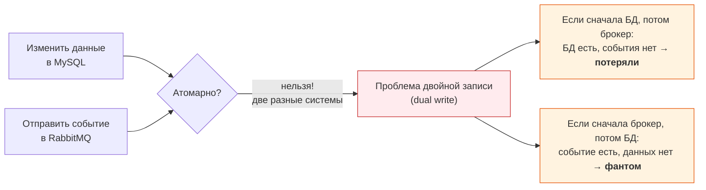
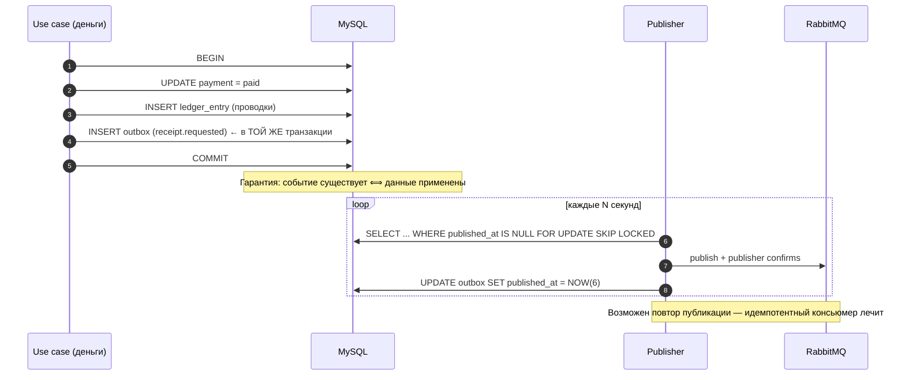
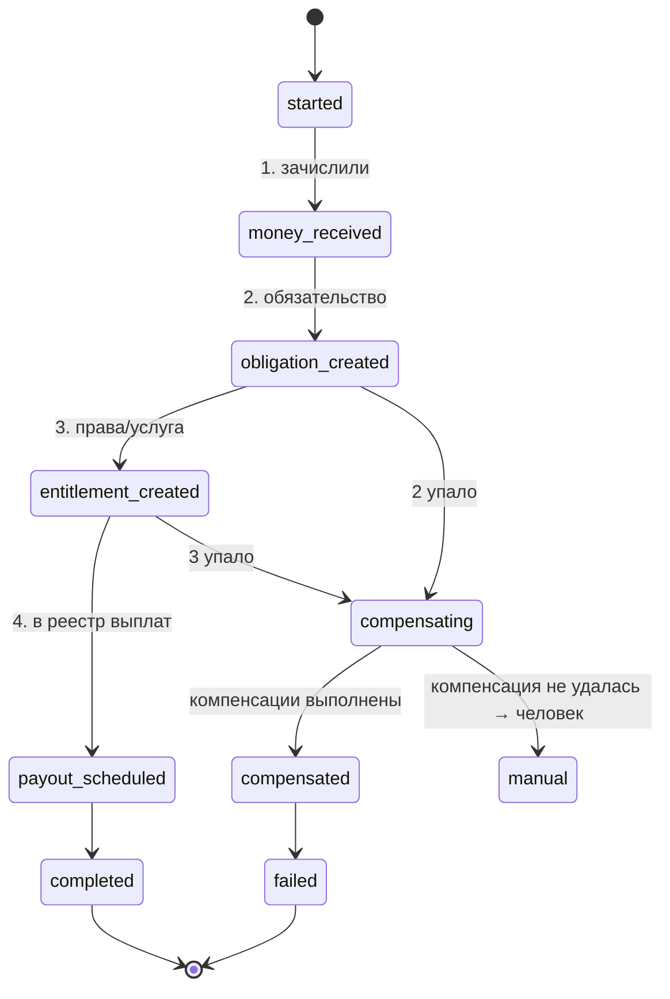
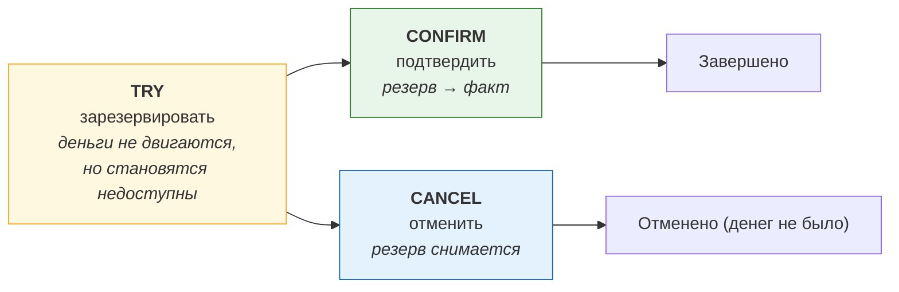
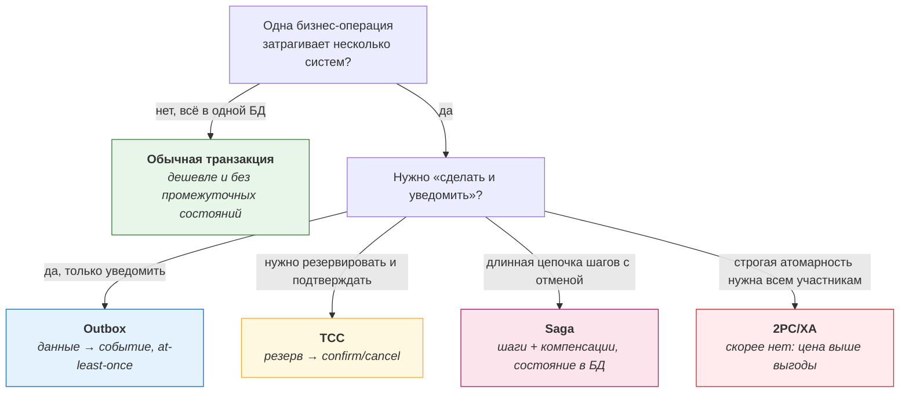

# 02. Паттерны консистентности: saga, outbox, TCC, 2PC, компенсации

> **Что проверяют.** Умеешь ли ты объяснить, **почему** нельзя просто «обернуть в транзакцию»
> операции, затрагивающие несколько систем, и знаешь ли практичные альтернативы. В вакансии:
> «много работы с консистентностью данных». Это проверка зрелости: junior предлагает
> распределённую транзакцию, senior — outbox и идемпотентность.
>
> Здесь: почему распределённых транзакций избегают, четыре паттерна (outbox, saga, TCC,
> 2PC) с ценой каждого, компенсации и откат, и готовые ответы «а что если между шагами».

---

## 1. Отправная точка: где именно ломается консистентность



**Формулировка:** «Между MySQL и RabbitMQ нет общей транзакции. Значит, любая попытка
«сделать и то, и другое» — это **dual write**, и она всегда даёт один из двух дефектов:
потерянное событие или событие без данных. Поэтому вместо попытки сделать это атомарно
мы делаем так, что **источник истины один** (БД), а доставка — производная и повторяемая.»

---

## 2. Паттерн №1: Transactional Outbox (основной инструмент биллинга)



| Свойство | Как достигается |
|---|---|
| Нет состояния «данные есть, события нет» | событие в той же транзакции |
| Нет «событие есть, данных нет» | publish **после** COMMIT (читаем из outbox) |
| Устойчивость к сбою брокера | событие остаётся в outbox, publisher повторит |
| Дубли | допустимы (at-least-once), лечатся идемпотентным консьюмером |
| Порядок | `ORDER BY id`, `SKIP LOCKED` для параллельных publisher-ов |
| Наблюдаемость | `attempts`, `published_at`, метрика «неопубликованные» |

**Цена/ограничения (обязательно назвать, иначе ответ неполный):**

* нужна таблица `outbox` и регулярно работающий publisher (или CDC);
* события доставляются с задержкой (обычно секунды — это нормально);
* `outbox` растёт, нужна очистка (архивировать/удалять опубликованные старше N дней);
* повторная публикация возможна, поэтому консьюмер обязан быть идемпотентным.

**Продвинутый вариант — **CDC** (Change Data Capture): вместо publisher-а, читающего таблицу,
изменения из binlog/CDC (Debezium) попадают в брокер. Плюс: publisher не нужен. Минус:
новая инфраструктура, и порядок/семантика зависят от CDC. Стоит упомянуть, чтобы показать широту.

---

## 3. Паттерн №2: Saga (распределённая операция с компенсациями)

Когда нужно: одна бизнес-операция требует шагов в **нескольких** сервисах, и её нельзя
сделать одной транзакцией. Пример в новой модели Профи.ру:

```
«Клиент оплатил услугу 10 000 ₽» →
  1) зачислить деньги (поступление)
  2) создать обязательство перед специалистом (9 000 ₽)
  3) зарезервировать/создать права на услугу
  4) создать запись для выплатного реестра
```

Если шаг 3 упал — надо отменять 1–2 (компенсировать), а не оставлять «деньги приняты, услуга
не оформлена».



**Два вида саг:**

| Вид | Как | Когда |
|---|---|---|
| **Оркестрация** | отдельный координатор (или процесс в БД/в Temporal-style движке) вызывает шаги | сложные цепочки, нужен явный контроль и видимость |
| **Хореография** | сервисы реагируют на события друг друга | проще, но поведение «размазано», сложно понять общий ход |

**Что важно в биллинге (и что отличает грамотный ответ):**

1. **Компенсация — это не «откат»**, а **новая операция**, которая семантически отменяет
   предыдущую: возврат денег, снятие обязательства, отмена права. В учёте — компенсирующие
   проводки, а не удаление.
2. **Компенсация может не удаться** → нужен путь «в человека» (manual) с алертом.
3. **Состояние саги хранится в БД** (шаги, статусы, где остановились) — иначе после перезапуска
   мы не знаем, на каком шаге.
4. **Идемпотентные шаги**: повтор шага не должен делать эффект дважды.
5. **Не делать сагу для «связанных данных в одной БД»** — там достаточно обычной транзакции.

> **Тезис:** «Сагу я использую только когда шаги действительно в разных сервисах/системах,
> и деньги на шаг не хотят попадать под одну транзакцию. Если всё в одной БД — я сделаю
> обычную транзакцию: это дешевле и не даёт промежуточных состояний. А внутри саги
> обязательно храню её состояние в БД, иначе после падения не пойму, где остановился.»

---

## 4. Паттерн №3: TCC (Try-Confirm-Cancel)

Хорошо ложится на биллинг, потому что это «резерв → подтверждение → отмена».



| Фаза | Что в биллинге | Важно |
|---|---|---|
| Try | зарезервировать сумму на счёте / создать `hold`/`reservation` со сроком | резерв должен **истекать** сам, иначе «застрявшие» деньги |
| Confirm | превратить резерв в списание (проводки, чек по правилам) | идемпотентно |
| Cancel | снять резерв | идемпотентно; не «минус», а снятие |

**Чем TCC лучше саги в биллинге:** деньги не «уходят и возвращаются», а сначала
резервируются — то есть нет периода, когда деньги прошли, а потом возвращались. Меньше
промежуточных состояний и меньше нужды в компенсациях.

**Чем платим:** нужен учёт резервов (отдельная сущность со сроком), нужна логика «что делать,
если клиент не подтвердил» (истечение), и нужны гарантии, что `Cancel` всегда возможен.

**Пример из вакансии (готовый):** «оплата со стороны клиента» отлично ложится в TCC:
Try — зарезервировали у клиента; Confirm — услуга оказана, перевели специалисту;
Cancel — услуга не оказалась, сняли резерв. Вот здесь я бы предложил именно TCC, а не
«списали и потом разбираемся с возвратами».

**Временной параметр — ключевой:** «Резерв обязан иметь срок, и должен быть процесс, который
его закрывает по истечении. Без этого через месяц у нас будут „висящие“ резервы, которые
никто не знает, что с ними делать.»

---

## 5. Паттерн №4: 2PC (двухфазный коммит) — почему его избегают

| Свойство | Проблема на практике |
|---|---|
| Блокирующий: prepare → commit | координатор/участники держат ресурсы, повышается риск зависаний |
| Плохо переносит сбои | «in-doubt» транзакции, требующие ручного разбора |
| Требует поддержки | не все БД/брокеры это умеют; MySQL XA существует, но редко оправдан |
| Медленный | сетевая синхронность на коммите |
| Не работает для внешних систем | вы не можете сделать XA с ПС или ОФД |

**Готовый ответ:** «XA/2PC в биллинге я не использую. Он даёт атомарность там, где обе
системы это поддерживают, но платит за неё блокировками, риском in-doubt транзакций и
невозможностью включить внешние системы (ПС, ОФД). А как только один участник — внешний
HTTP, 2PC вообще неприменим. Поэтому практичный выбор — outbox + идемпотентность, а для
многошаговых операций — saga или TCC.»

---

## 6. Выбор паттерна: дерево решений



---

## 7. Компенсации: как правильно «отменить» в биллинге

| Что произошло | Компенсация | Нельзя |
|---|---|---|
| Деньги зачислены, услуга не оформлена | вернуть деньги (новая операция) + проводки + чек возврата | «удалить платёж» |
| Обязательство создано, выплата не нужна | снять обязательство проводкой | `UPDATE` суммы |
| Чек выпущен ошибочно | чек коррекции (решение бухгалтерии) | «удалить чек» |
| Резерв взяли, но не подтвердили | `Cancel` резерва | оставить «висеть» |
| Отправили уведомление, а операция отменена | уведомление об отмене | делать вид, что уведомления не было |
| Написали партнёру вебхук, а операция откатилась | вебхук-компенсация с тем же `event_id` + типом | тихо исправлять «в базе» |

**Пять свойств правильной компенсации:**

```
1. Идемпотентна (повтор компенсации не даёт второго эффекта).
2. Учитывается в учёте как новая запись (компенсирующая проводка), а не правка.
3. Имеет причину (кто/что инициировало) — для аудита и разбора.
4. Может не удаться → путь в человека + алерт.
5. Есть метрика: сколько саг/резервов в «незавершённом» состоянии.
```

---

## 8. Ответ вслух (2 минуты)

> «Отправная точка: между MySQL и брокером нет общей транзакции, поэтому любая попытка
> «записать и отправить» — это dual write, и она даёт либо потерянное событие, либо событие
> без данных. Значит, я делаю так, что **источник истины один** — база.
>
> Основной инструмент — transactional outbox: изменение денег и запись события происходят
> в одной транзакции. Отдельный publisher читает неопубликованные события пачками через
> `SKIP LOCKED` и публикует с publisher confirms. Доставка получается at-least-once,
> возможен повторный publish — и это нормально, потому что консьюмер идемпотентен.
> Плата за это: небольшая задержка и лишняя таблица, которую нужно чистить.
>
> Если операция требует шагов в нескольких сервисах — я выбираю между saga и TCC.
> TCC для денег почти всегда лучше: «резерв → подтверждение → отмена» не создаёт состояния
> «деньги ушли, потом вернулись», а Cancel — это снятие резерва. Но резерв обязан иметь
> срок и процесс истечения, иначе появятся висящие резервы. Saga нужна, когда цепочка
> длинная и с разными участниками; тогда я обязательно храню состояние саги в базе, чтобы
> после перезапуска понимать, на каком шаге остановились, и держу компенсации идемпотентными.
>
> Компенсация — это новая операция, а не откат: в учёте это компенсирующая проводка, а чек
> не «удаляется», а корректируется. И компенсация может не пройти — тогда путь «в человека»
> с алертом, потому что незавершённые компенсации — это отложенный инцидент.
>
> 2PC/XA я не использую: блокировки, in-doubt транзакции и полная неприменимость к внешним
> системам. Если один из участников — HTTP-вызов ПС или ОФД, двухфазный коммит вообще не
> вариант.»

---

## 9. Красные флаги в этой теме

* ❌ «Обернём в распределённую транзакцию» / «сделаем XA» без обсуждения цены.
* ❌ Публикация в брокер **до** COMMIT (или в середине транзакции без outbox).
* ❌ Компенсация как `DELETE`/`UPDATE` задним числом.
* ❌ Сага без хранения состояния (после падения непонятно, где остановились).
* ❌ Резерв (hold) без срока и без процесса закрытия.
* ❌ «Откатим, если не получится» для операций с внешними системами.

## Чек-лист по этому файлу

- [ ] Могу объяснить dual write и два его дефекта.
- [ ] Могу нарисовать outbox и назвать его цену/ограничения.
- [ ] Знаю разницу saga (оркестрация/хореография) и TCC, и когда что.
- [ ] Готов ответ, почему не 2PC.
- [ ] Могу назвать 5 свойств правильной компенсации.
- [ ] Понимаю, что резерв обязан иметь срок, и что с ним делать по истечении.
- [ ] Могу применить TCC к сценарию «оплата со стороны клиента».
