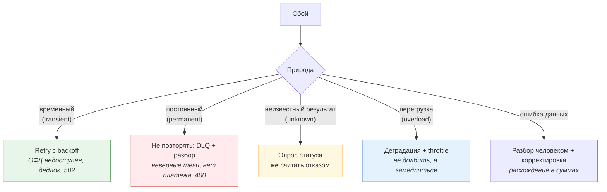
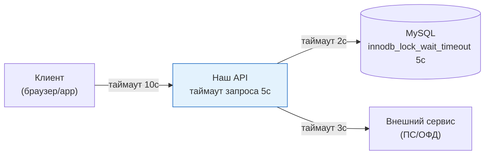
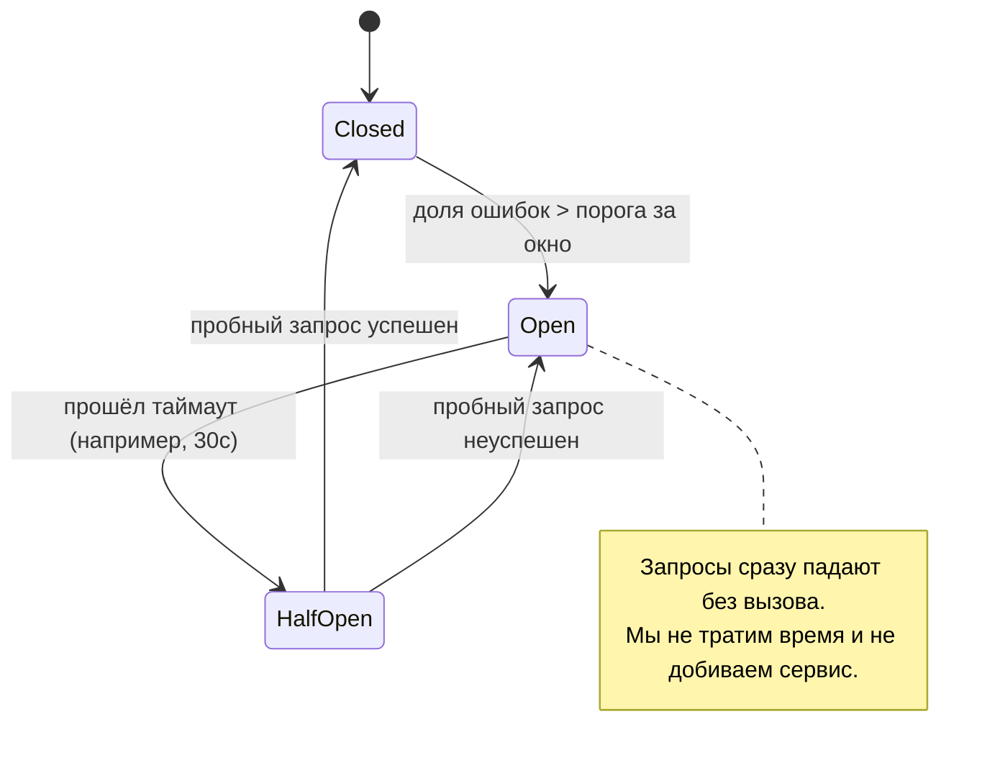
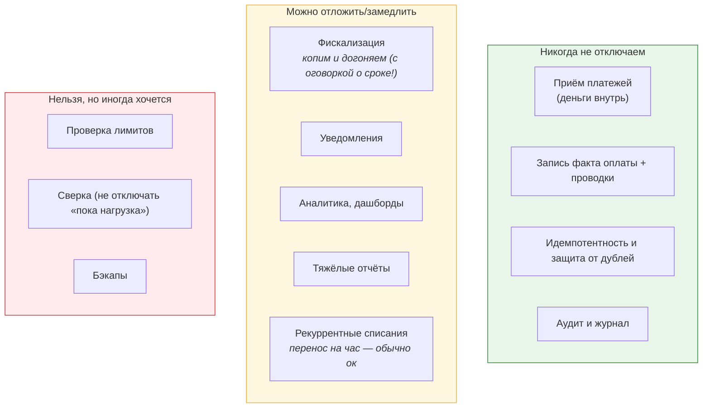

# 03. Поведение при сбоях: ретраи, таймауты, деградация, runbook

> **Что проверяют.** В вакансии прямо: «поведение системы при сбоях». Это отдельный разговор,
> и он отличается от «как обрабатывать ошибку». Проверяют: есть ли у тебя **системная позиция**
> по надёжности: что считать временным, что постоянным, где деградировать, как обнаруживать,
> кто реагирует и что делает.
>
> Здесь: типы сбоев, ретраи (правильные), таймауты, circuit breaker, bulkhead, деградация,
> «неизвестность», метрики/алерты, runbook и разбор реальных инцидентов биллинга.

---

## 1. Классификация сбоев (первый шаг любого ответа)



**Тезис:** «Первое, что я делаю при разборе любого сбоя — **классифицирую** его: временный,
постоянный, неизвестный результат или перегрузка. От этого зависит всё: ретраить или нет,
считать отказом или нет, замедляться или падать. Самая частая ошибка — один тип обработки
для всех: либо бесконечные ретраи логической ошибки, либо отказ там, где надо было подождать.»

---

## 2. Ретраи: как делать правильно

### Что можно и нельзя повторять

| Операция | Можно ретраить? | Почему |
|---|---|---|
| `SELECT` | ✅ всегда | идемпотентна |
| Идемпотентная запись (по ключу) | ✅ | повтор не меняет результат |
| Дедлок / lock wait timeout | ✅ | транзакция откатана, изменений нет |
| HTTP 5xx / таймаут GET | ✅ | но для внешних денежных операций — **сначала `getStatus`** |
| HTTP 4xx (валидация) | ❌ | не станет валидным от повтора |
| «Неверные теги» от ОФД | ❌ | логическая ошибка |
| Внешняя операция без идемпотентности (списание!) | ⚠️ **только после проверки статуса** | повтор может списать дважды |
| Отправка письма | ⚠️ | лучше через очередь с идемпотентным ключом |

### Правильный retry: экспоненциальный backoff + джиттер + предел

```php
/**
 * Универсальный ретрай для денежных операций.
 *
 * Три обязательных свойства:
 *  1. Экспоненциальная задержка — не долбить сервис, дать ему восстановиться.
 *  2. Джиттер — иначе повторы синхронизируются и бьют волной (thundering herd).
 *  3. Предел попыток — иначе бесконечная петля и «последний клиент никогда не получит ответ».
 */
function retry(
    callable $fn,
    int    $maxAttempts = 5,
    int    $baseDelayMs = 100,
    int    $maxDelayMs  = 5_000,
    ?callable $isRetryable = null,
): mixed {
    $isRetryable ??= static fn (\Throwable $e): bool => $e instanceof TransientError;

    $attempt = 0;
    while (true) {
        $attempt++;
        try {
            return $fn();
        } catch (\Throwable $e) {
            if (!$isRetryable($e) || $attempt >= $maxAttempts) {
                throw $e;                                   // постоянная ошибка или исчерпали попытки
            }
            // full jitter: случайная точка в [0, base * 2^attempt], ограниченная maxDelay
            $cap   = min($maxDelayMs, $baseDelayMs * (2 ** $attempt));
            $sleep = random_int(1, max(1, $cap));           // ← именно random, не константа
            usleep($sleep * 1000);
        }
    }
}
```

**Четыре вещи, которые надо назвать, объясняя ретраи:**

| № | Момент |
|---|---|
| 1 | **Джиттер** обязателен: без него 1000 клиентов повторят одновременно (thundering herd) и добьют сервис |
| 2 | **Предел + escalation**: после N попыток — не «ещё раз», а DLQ/ручное/алерт |
| 3 | **Разделять по типам ошибок**: `TransientError` vs `PermanentError` — иначе либо петля, либо потеря |
| 4 | **Ретрай внутри транзакции запрещён**: повтор должен начинаться с начала транзакции (иначе частично применённые изменения) |

### Отдельно: лестница задержек для разных случаев

| Сценарий | Лестница | Почему так |
|---|---|---|
| Дедлок БД | 10мс, 20мс, 40мс, 80мс | дедлок разрешается за миллисекунды |
| ПС недоступен | 1с, 3с, 10с, 30с | это сеть/внешняя система, восстанавливается секундами-минутами |
| ОФД недоступен | 30с, 2м, 10м, 1ч | фискализация может ждать дольше, но метрика обязательна |
| Уведомление пользователю | 1м, 10м, 1ч | не критично срочно |

**Важный тезис:** «Лестница задержек — это **выражение допустимого времени**, а не техника.
Для дедлока ждать час бессмысленно, для ОФД — осмысленно. Поэтому я задаю лестницу по
домену, а не одну на всё.»

---

## 3. Таймауты: три обязательных уровня



| Уровень | Настройка | Почему такие значения |
|---|---|---|
| **HTTP-клиент к внешним** | connect 1с, read 3с | без таймаута зависание = занятый воркер = каскад; обычно «правильное» время — меньше пользовательского |
| **БД** | `innodb_lock_wait_timeout` 5с на сессию (не 50!) | 50 секунд ждать лок бессмысленно: пользователь ушёл, воркер занят |
| **Запрос в целом** | 5с | превышение → освободить ресурсы, вернуть понятную ошибку |
| **Клиент** | 10с | самый большой: клиент должен дождаться нашего ответа, а не падать раньше |

**Правило:** таймауты должны **убывать** от клиента внутрь (`client > api > внешний сервис`).
Если внутренний больше внешнего, клиент уйдёт раньше, а мы продолжим работу «в пустоту».
И обязательно: **таймаут ≠ отказ** для денежных операций (см. `01-idempotency-state-machines.md`).

---

## 4. Circuit breaker: не долбить упавший сервис



| Состояние | Поведение | Что делает биллинг |
|---|---|---|
| **Closed** | обычная работа | — |
| **Open** | запросы не идут наружу, сразу ошибка/деградация | не копим таймауты; продолжаем принимать платежи, а фискализацию/уведомления — в очередь |
| **HalfOpen** | 1 пробный запрос | проверяем восстановление |

**Ключевая мысль (её обязательно сказать):** «Circuit breaker — это не только защита от
падения, это **сохранение пропускной способности себя**. Если ОФД лежит, я не хочу, чтобы мои
воркеры стояли по 3 секунды на таймаутах: тогда они перестанут обрабатывать всё остальное. Я
лучше быстро „узнаю“, что ОФД недоступен, и буду накапливать работу в очереди.»

---

## 5. Деградация: что можно отключить, а что нельзя

Это **самый важный** раздел для биллинга: не всё одинаково критично.



**Формулировка:** «При перегрузке я деградирую по приоритету: сначала откладываю аналитику и
тяжёлые отчёты, потом уведомления. Фискализацию откладывать можно технически, но это
**ограниченно**, потому что там юридический срок — поэтому её отставание обязано быть видно
и ограничено, а не «уедем в очередь на 3 дня». А приём платежей, запись факта и
идемпотентность не отключаются никогда: если мы не можем записать оплату — мы обязаны
отвечать ПС ошибкой, чтобы платёж повторился, а не „принять“ и потерять.»

**И третья группа — важная:** «Сверку и бэкапы я не отключаю „пока нагрузка“: это именно та
страховка, без которой инцидент становится необнаружимым. Может показаться, что это экономит
ресурсы, но на деле это делает систему слепой.»

---

## 6. Bulkhead: изоляция, чтобы одна дыра не утопила всё

| Приём | Что изолируем | Зачем в биллинге |
|---|---|---|
| Отдельные пулы соединений | обработка вебхуков vs отчёты | тяжёлый отчёт не должен съесть все соединения и остановить приём |
| Отдельные очереди/воркеры | фискализация vs уведомления | медленный ОФД не тормозит уведомления |
| Rate limit на внешние сервисы | не более N rps к ОФД | не нарушить лимиты провайдера (иначе блокировка) |
| Ограничение параллелизма воркеров | `prefetch`, `--max-jobs` | контролируемая нагрузка на БД |
| Отдельные инстансы Redis | кэш vs локи/счётчики | вытеснение кэша не должно убить rate limit |

**Тезис:** «Bulkhead — про то, что медленный сосед не должен замедлять меня. В биллинге это
практически: **отдельные пулы и очереди для денежного пути и для всего остального**. Если
отчёты и фискализация используют те же соединения и воркеры, что и приём платежей, любой
затор в отчётах становится инцидентом в приёме денег.»

---

## 7. Метрики и алерты: что должно «кричать» (и на что — нет)

### Четыре «золотых сигнала» в биллинге

| Сигнал | Метрика | Порог/алерт |
|---|---|---|
| **Пропускная способность** | платежей/сек, чеков/мин | падение ниже нормы за окно |
| **Ошибки** | доля ошибок по типам | рост `permanent`/DLQ; рост 5xx |
| **Задержка** | p95/p99 обработки вебхука, время до `paid` | превышение SLO |
| **Доменные метрики** | «`pending` дольше N мин», «чеки отстают», «расхождения в сверке» | **это самые важные** |

**Специфика биллинга — доменные алерты (в порядке важности):**

```
1. Платежи висят в pending > N минут            → потеряли вебхук / сбой приёма
2. Оплачено без чека > N минут                  → фискализация отстаёт (юридический риск)
3. Расхождения в сверке > порога                → деньги не сходятся
4. DLQ не пуста (или растёт)                    → «мы теряем сообщения»
5. Реплика отстала / транзакция > N секунд        → риск блокировок и DDL
6. Сверка не запускалась > N часов               → СЛЕПАЯ ЗОНА (самый недооценённый алерт)
7. Консьюмеров = 0 при непустой очереди          → «никто не читает очередь»
```

**Что НЕ должно алертить (важно для доверия к алертам):**

| Не алертить | Почему |
|---|---|
| Одиночный retry | это норма |
| Одиночное расхождение на 1 копейку из-за границы дня | шум, пока не подтверждено как реальное |
| Дедлок сам по себе | алерт на **частоту** дедлоков, а не на каждый |
| «Ошибка в логах» без контекста | не найдут; нужны структурированные логи и группировка |

**Правило:** «У нас должен быть набор из 5-7 алертов, каждый из которых означает „человеку
надо встать и посмотреть“. Если алертов 100 — их перестают читать, и это то же самое, что
их нет. Я бы шёл от доменных инвариантов: каждый инвариант из `01-domain-map.md` — это
потенциальный алерт.»

---

## 8. Runbook: как выглядит и что должно быть внутри

```markdown
# Runbook: «Оплачено, но чека нет дольше 10 минут»

## Что это значит
Деньги приняты, фискальный документ не выпущен. Технический риск — расхождение с ОФД;
юридический риск — необходимость чеков коррекции, если задержка вышла за допустимую.

## Как проверить (2 минуты)
1. Метрика: `receipt_lag_minutes` (дашборд «Биллинг/Фискализация»).
2. Очередь: `rabbitmqctl list_queues name messages_ready consumers` для `billing.receipts`.
3. Консьюмеры живы? Логи сервиса фискализации (поиск по `receipt.rejected`, `OfdTransient`).
4. Провайдер: статус-страница ОФД.
5. SQL (список конкретных операций):
   SELECT ... (см. 05-billing-domain/03-receipts-04fz.md §6)

## Что делать по симптомам
| Симптом | Действие |
|---|---|
| ОФД недоступен | ничего не делать: retry сам догонит; следить за метрикой, эскалация если > 1 часа |
| Консьюмеры = 0 | поднять сервис (алерт p1) |
| Растёт DLQ | смотреть причину (логи), остановить ретраи, фикс, replay |
| «Ошибка тегов» в DLQ | тикет бухгалтерии: возможно нужен чек коррекции |

## Кого звать
1. Дежурный биллинга (текущий on-call).
2. Владелец сервиса фискализации.
3. Бухгалтерия — если задержка > суток.
4. Провайдер фискализации — если их проблема.

## Что сделать после
- Записать факт и время в тикет.
- Проверить, что «чеков выпущено = оплат» за период (сверка).
- Обновить runbook, если нашёлся новый симптом.
```

**Что обязательно в runbook (готовый список):** симптом → как проверить → что делать →
кого звать → как понять, что стало лучше → **что записать после**. Без последних двух пунктов
runbook превращается в «позвони, если плохо».

---

## 9. Разборы инцидентов (проговори вслух)

### Инцидент 1. «В 03:00 очередь чеков выросла до 40 000, DLQ 120»

**Ход:** (1) масштаб и сумма → (2) консьюмеры живы? → (3) причина (ОФД недоступен vs ошибка
тегов) → (4) **не увеличивать воркеров, если ошибка логическая** → (5) после починки replay
из DLQ тем же идемпотентным обработчиком → (6) сверка «чеков = оплат» → (7) добавить алерт на
отставание чеков, если его не было. **Главный вывод инцидента:** «самое опасное — не
отставание, а **незаметное** отставание: очередь может быть пустой, а события не созданы».

### Инцидент 2. «В 14:00 приём платежей стал отвечать 500 у части пользователей»

**Ход:** (1) это все или часть? (2) какие ошибки (дедлок? таймаут БД? 1213? 1205? 1040 «too
many connections»?) → 1040 → значит соединения съел кто-то другой (отчёты!) → (3) подтвердить
по `SHOW PROCESSLIST` / метрикам пула → (4) стабилизировать: ограничить отчёты, перезапустить
зависшие → (5) потом: **bulkhead** — отдельный пул/лимит для отчётов; алерт на использование
пула. **Фраза:** «Мы не стали искать „кто виноват в отчёте“ в горящем режиме — сначала
восстановили приём, потом разбирались».

### Инцидент 3. «Утром бухгалтерия говорит: сверка за вчера не сошлась на 1 000 000 ₽»

**Ход:** `05-billing-domain/07-reconciliation.md` §5, 8 шагов. **Главное:** сначала проверить
**инварианты учёта** (сумма проводок по операции = 0; сальдо = сумма проводок). Если нарушены —
проблема системная у нас, и первое действие — остановить источник, а не «закрыть цифру».

### Инцидент 4. «Пользователи жалуются: списалось дважды»

**Ход:** (1) масштаб (сколько, на какую сумму) → (2) это разные платежи или дубль у ПС? →
(3) проверить наличие и стабильность ключа идемпотентности (не `now()`/`random()`?) →
(4) проверить, нет ли гонки (два обработчика одного события) → (5) возвраты пострадавшим +
обращение в ПС → (6) **добавить недостающий уровень идемпотентности** (см.
`06-reliability/01-idempotency-state-machines.md` §2) → (7) тест на гонку.

**Общий шаблон любого разбора (проговори его как схему):**

```
1. Восстановить сервис (если лежит) — приоритет над выяснением причин.
2. Оценить масштаб и деньги: сколько операций, на какую сумму, кто пострадал.
3. Локализовать: что именно, где, с какого времени, что общего у пострадавших.
4. Найти причину (не симптом): метрики, логи, БД, конфиги, релизы, внешние системы.
5. Устранить причину (или деградировать, если причина внешняя).
6. Восстановить данные: replay/compensation/reconciliation — всегда идемпотентно.
7. Проверить инварианты и сверить (доказать, что больше не теряем).
8. Зафиксировать: постмортем без обвинений, с конкретными действиями, и **добавить мониторинг**,
   чтобы следующий такой случай обнаружился раньше.
```

---

## 10. Ответ вслух (2 минуты)

> «По поведению при сбоях у меня есть системная позиция. Первое — **классификация сбоя**:
> временный, постоянный, неизвестный результат, перегрузка. От неё зависит реакция:
> retry, DLQ и разбор, опрос статуса или деградация. Самая частая ошибка — одинаковая реакция
> на все сбои.
>
> Второе — **ретраи правильные**: экспоненциальная задержка с джиттером, ограниченное число
> попыток, и лестница задержек своя для каждого домена: для дедлока — миллисекунды, для ОФД —
> минуты и часы. Без джиттера повторы синхронизируются и добивают сервис.
>
> Третье — **таймауты убывают внутрь**: клиент ждёт 10 секунд, наш запрос — 5, внешний вызов —
> 3, блокировка БД — 5 секунд вместо дефолтных пятидесяти. И принципиально: для денежных
> операций таймаут — это не отказ, а `unknown`, и из него выход только через запрос статуса.
>
> Четвёртое — **деградация по приоритету**. Приём платежей и запись факта не отключаются
> никогда: если не можем записать — отвечаем ошибкой, чтобы платёж повторился. Аналитику и
> уведомления можно отложить. Фискализацию — можно, но ограниченно, потому что там срок;
> поэтому её отставание — отдельная метрика и алерт.
>
> Пятое — **bulkhead**: отдельные пулы, очереди и воркеры для денежного пути и для всего
> остального, чтобы тяжёлый отчёт не остановил приём денег.
>
> Шестое — **наблюдаемость по доменным инвариантам**, а не «ошибка в логах»: платежи в pending
> дольше N минут, оплачено без чека, расхождения в сверке, непустая DLQ, и обязательно —
> „сверка не запускалась“. Последняя метрика самая недооценённая: молчащая сверка выглядит
> как отсутствие проблем.
>
> И седьмое — **runbook**: симптом, как проверить, что делать, кого звать, как понять, что
> стало лучше, и что записать после. Первое действие при инциденте — восстановить сервис,
> а не искать виноватого.»

---

## 11. Красные флаги в этой теме

* ❌ Retry без джиттера/предела; retry постоянной ошибки.
* ❌ Внешние вызовы без таймаутов.
* ❌ `innodb_lock_wait_timeout` = 50 секунд для веб-запроса.
* ❌ «Деградируем: отключим проверку лимитов/сверку/бэкапы».
* ❌ Один пул соединений и один воркер для всего.
* ❌ Алерты на каждый retry; 100 алертов, которые никто не читает.
* ❌ Нет метрики «сверка не запускалась».
* ❌ Runbook в голове дежурного.

## Чек-лист по этому файлу

- [ ] Могу классифицировать сбой по 4 типам и назвать реакцию на каждый.
- [ ] Могу написать retry с backoff + джиттером + пределом и объяснить каждую часть.
- [ ] Знаю три уровня таймаутов и правило «убывают внутрь».
- [ ] Объясняю circuit breaker как сохранение своей пропускной способности.
- [ ] Могу назвать, что деградируем, а что никогда (и про «ограниченно» для фискализации).
- [ ] Могу назвать 7 доменных алертов и 4 «не алертить».
- [ ] Могу структуру runbook (6 частей).
- [ ] Проговариваю шаблон разбора инцидента (8 шагов) без подсказок.
