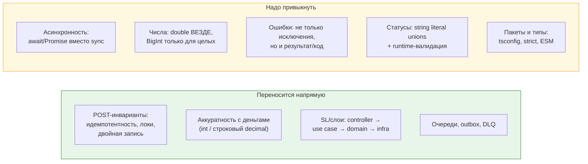
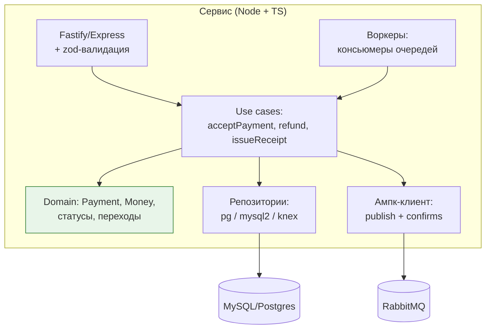

# 01. TypeScript и Node для PHP-разработчика + микросервисы биллинга

> **Что проверяют.** В вакансии: «Новые микросервисы пишем на TypeScript, поэтому с ним тоже,
> скорее всего, предстоит работать». Это **не** проверка глубины JS. Проверяют: (1) не
> будешь ли ты тормозить при чтении микросервиса; (2) понимаешь ли те же инварианты
> (идемпотентность, транзакции, ошибки) в другом рантайме; (3) не будешь ли писать
> «PHP с другим синтаксисом».
>
> Здесь: TypeScript для того, кто пришёл из PHP, ключевые отличия домена (асинхронность,
> ошибки, числа, деньги), Node-специфика для сервисов, и как выглядит микросервис биллинга
> глазами PHP-разработчика.

---

## 1. Ментальная карта: что переносится из PHP, а что нет



**Фраза, с которой стоит начинать ответ:** «TypeScript — это тот же набор инвариантов,
что в PHP-биллинге, но два места требуют особого внимания: **числа** (в JS вообще нет
десятичной арифметики — только double и BigInt) и **асинхронность** (нужно не забыть
`await`, иначе обработчик завершится раньше записи в БД, что в биллинге равно потере данных).»

---

## 2. Деньги в TypeScript: главная ловушка

```ts
// ❌ Ужас: 0.1 + 0.2 != 0.3, как и в любом double
const amount = 0.1 + 0.2;                    // 0.30000000000000004

// ❌ Диапазон: JS «number» = double → точные целые только до 2^53-1
console.log(Number.MAX_SAFE_INTEGER);        // 9007199254740991
console.log(9007199254740991 + 2);           // 9007199254740992 ← ошибка! (не +2)

// ✅ Деньги: минорные единицы в number — только если уверен, что < 2^53
//    (2^53 копеек ≈ 90 трлн ₽ — хватает для суммы операции, но НЕ для агрегатов истории)
type Minor = number;

// ✅ Для больших значений / агрегатов — BigInt или строковый decimal
const totalMinor: bigint = 12345678901234567890n;
const totalDecimal = '123456789012345678.90';   // строкой, точное

// ✅ Библиотеки: денежные (dinero.js, money.js) или decimal (decimal.js / big.js)
import Decimal from 'decimal.js';
const vat = new Decimal('150.00').mul('0.20');   // '30'
```

**Таблица решений (то, что надо произнести):**

| Что хранить | Тип в TS | Почему |
|---|---|---|
| Сумма операции (минорные единицы) | `number` (целое, < 2^53) | приходит из БД `BIGINT` как строка/число; безопасно, пока < 2^53 |
| Сумма, которую отдаём/принимаем в API | `number` (миноры) или `string` (decimal) | **никогда не `number` с копейками через точку** |
| Агрегаты по истории (могут быть > 2^53) | `bigint` или `string` | иначе молча потеряешь точность |
| Промежуточные расчёты (НДС, курс, комиссия) | `Decimal` (decimal.js) или `bigint`-арифметика | в JS нет `BCMath` |
| Валюта | union-тип или enum-like | см. §4 |

**Ключевой факт, который надо знать в отличие от PHP:**

| | PHP | TypeScript / Node |
|---|---|---|
| Целые больше 64 бит | `PHP_INT_MAX` (~9.2e18) | `BigInt` (произвольная точность), но `number` ломается уже на 2^53 |
| Десятичная арифметика | `BCMath`, `GMP` (встроены) | нет встроенной — только библиотеки (`decimal.js`, `big.js`) или `BigInt` |
| Приведение из JSON | `json_decode` с `JSON_BIGINT_AS_STRING` | `JSON.parse` **всегда** даёт `number` для чисел → **большие суммы уже испорчены** |
| Хранение `DECIMAL` из БД | строкой (PDO) | драйвер Postgres возвращает `string` для `NUMERIC`; MySQL-драйвер — зависит, требуй явного каста |

> **Практическое правило для микросервисов биллинга:** в JSON-контракте денежные суммы —
> **строки** (или минорные единицы целым числом, если гарантируемо < 2^53). Это одинаково
> правильно и для PHP, и для TS, и для партнёров. Причина жёсткая: `JSON.parse` в Node
> **не умеет** «прочитать число без потери точности» — приходится вручную либо запрещать
> числа, либо парсить свой грамматикой. Проще запретить числа.

```ts
// На границе: денежные суммы — строкой, и мы это валидируем
import { z } from 'zod';

const MoneySchema = z.object({
  currency: z.string().regex(/^[A-Z]{3}$/),
  // Копейки целым числом — безопасно, если < 2^53; для истории — строкой
  amount_minor: z.union([z.number().int().safe(), z.string().regex(/^-?\d+$/)]),
});

type Money = z.infer<typeof MoneySchema>;
```

---

## 3. Асинхронность: где ломается биллинг

```ts
// ❌ ЗАБЫЛИ await: обработчик вернул 200, а запись ещё не произошла.
//    Клиент получил "успех", процесс мог упасть — деньги потеряны.
async function handleWebhook(payload: unknown) {
  db.query('UPDATE payment SET status = $1 WHERE id = $2', ['paid', id]);   // ← без await
  return { ok: true };                                                       // ← вернули раньше!
}

// ❌ forEach + async: forEach не ждёт асинхронные колбэки
items.forEach(async (item) => { await process(item); });   // "тихо" не дожидается
// ✅
for (const item of items) { await process(item); }
await Promise.all(items.map((item) => process(item)));      // параллельно, если можно
await Promise.allSettled(items.map(...));                   // когда частичные ошибки допустимы
```

**Три правила для денежного кода на Node:**

```
1. Всегда await на всех обращениях к БД/HTTP. Включить ESLint-правило
   (@typescript-eslint/no-floating-promises) — оно ловит именно это.
2. Не использовать forEach с async. Использовать for..of (последовательно) или
   Promise.all (параллельно). Но помнить: Promise.all внутри транзакции с одним
   соединением PG/MySQL — ловушка (запросы поедут по одному соединению/пулу).
3. Всегда закрывать ресурсы (транзакцию, соединение) в try/finally — аналог PHP-паттерна.
```

```ts
// Правильный обработчик: транзакция с явным управлением
import type { Pool, PoolClient } from 'pg';

async function withTransaction<T>(pool: Pool, fn: (c: PoolClient) => Promise<T>): Promise<T> {
  const client = await pool.connect();            // берём ОДНО соединение
  try {
    await client.query('BEGIN');
    const result = await fn(client);
    await client.query('COMMIT');
    return result;
  } catch (e) {
    await client.query('ROLLBACK');
    throw e;                                       // НЕ глотать ошибку!
  } finally {
    client.release();                              // обязательно вернуть в пул
  }
}

// Идемпотентный обработчик вебхука — ровно как в PHP
async function handleWebhook(pool: Pool, evt: { eventId: string; paymentId: number; status: string }) {
  await withTransaction(pool, async (c) => {
    const inserted = await c.query(
      `INSERT INTO processed_event (source, event_id, payload_hash, processed_at)
       VALUES ('psp', $1, $2, now())
       ON CONFLICT (event_id) DO NOTHING
       RETURNING id`,
      [evt.eventId, hash(evt)],
    );
    if (inserted.rowCount === 0) return;            // дубль → ничего не делаем, но транзакция закоммитится

    const payment = await c.query(
      'SELECT id, status FROM payment WHERE id = $1 FOR UPDATE',
      [evt.paymentId],
    );
    // ... проверка допустимости перехода, UPDATE, INSERT ledger_entry, INSERT outbox
  });
}
```

**Отличия от PHP, о которых полезно сказать:**
`ON CONFLICT DO NOTHING` (Postgres) — аналог `INSERT IGNORE`/`ON DUPLICATE KEY`. Для MySQL —
`INSERT ... ON DUPLICATE KEY UPDATE`. Смысл тот же: **идемпотентность обеспечивает БД**.
И то же правило: не полагаться на `SELECT` + `INSERT`.

---

## 4. Типы: как выражать домен

```ts
// Статус: discriminated union (аналог PHP enum, но с runtime-валидацией)
export const PaymentStatuses = ['created', 'pending', 'paid', 'refunded', 'failed'] as const;
export type PaymentStatus = (typeof PaymentStatuses)[number];

export function isPaymentStatus(v: unknown): v is PaymentStatus {
  return typeof v === 'string' && (PaymentStatuses as readonly string[]).includes(v);
}

// Переходы — таблицей, как в PHP
const TRANSITIONS: Record<PaymentStatus, PaymentStatus[]> = {
  created: ['pending', 'failed'],
  pending: ['paid', 'failed'],
  paid: ['refunded'],
  refunded: [],
  failed: [],
};

export function canTransition(from: PaymentStatus, to: PaymentStatus): boolean {
  return TRANSITIONS[from].includes(to);
}

// ВАЖНО: внешние данные НИКОГДА не приводим через `as PaymentStatus` —
// «asssertion» не проверяет ничего в рантайме. Валидируем руками или через zod.
export function parseExternalStatus(raw: string): PaymentStatus | null {
  return isPaymentStatus(raw) ? raw : null;      // null → "неизвестный статус", не падаем
}
```

**Четыре правила по типам, которые отличают «пишу на TS» от «пишу JS с аннотациями»:**

| Правило | Почему |
|---|---|
| `strict: true` в `tsconfig.json` | без него `null`/`undefined` пролетают → в биллинге это «платёж не найден, но код продолжил» |
| `noUncheckedIndexedAccess` | `arr[0]` будет `T \| undefined` → не забыть проверить |
| Валидация на границе (zod/io-ts/свои guard'ы) | типы стираются в рантайме; JSON от ПС — это `unknown`, а не `Payment` |
| `unknown` вместо `any` | `any` отключает проверки и «протекает» по коду; `unknown` требует явной обработки |

```ts
// ❌ "как в PHP, только с двоеточиями"
function buildReceipt(payment: any) { return payment.amount * 1.2; }

// ✅ явная граница + типы
type ParsedPayment = { id: string; amountMinor: number; currency: string };

function parsePayment(raw: unknown): ParsedPayment {
  if (!raw || typeof raw !== 'object') throw new Error('payment must be an object');
  const o = raw as Record<string, unknown>;
  if (typeof o.id !== 'string') throw new Error('id must be string');
  if (typeof o.amount_minor !== 'number' || !Number.isSafeInteger(o.amount_minor)) {
    throw new Error('amount_minor must be a safe integer');  // ← ловим float из JSON
  }
  if (typeof o.currency !== 'string' || !/^[A-Z]{3}$/.test(o.currency)) {
    throw new Error('bad currency');
  }
  return { id: o.id, amountMinor: o.amount_minor, currency: o.currency };
}
```

**И отдельный момент — `bigint` в JSON.** `JSON.stringify(1n)` бросает `TypeError`.
Поэтому `bigint` живёт внутри сервиса, а наружу уходит строкой. Это та же проблема, что
`BIGINT` в PHP: контракт надо согласовывать явно, а не «полагаться на JSON».

---

## 5. Ошибки: исключения, коды, и почему это важно в биллинге

```ts
// Классификация ошибок — аналог PHP-классов
export class TransientError extends Error {}      // "повторить" (таймаут, 5xx, дедлок, 429)
export class PermanentError extends Error {}      // "не повторять" (валидация, 4xx, неверные теги)
export class UnknownStateError extends Error {}   // "не знаем результат" → опрос статуса

// Обработка в консьюмере: решение о retry/DLQ принимается по ТИПУ ошибки
try {
  await issueReceipt(event);
} catch (e) {
  if (e instanceof TransientError) {
    await requeueWithDelay(event, { delayMs: 30_000 });    // retry-очередь
  } else if (e instanceof PermanentError) {
    await sendToDlq(event, { reason: String(e) });         // DLQ + алерт
  } else {
    throw e;                                               // неизвестное — не глотать!
  }
}
```

**Три антипаттерна, которые убивают денежные сервисы на Node:**

| Антипаттерн | Почему плохо |
|---|---|
| `catch (e) { console.log(e); }` | ошибка «проглочена» → сообщение подтверждается, деньги не обработаны |
| `catch (e) { throw new Error('failed') }` | потерян стек и тип → нельзя понять, транзиентная ли ошибка |
| `process.on('unhandledRejection')` без логики | в Node необработанный reject может уронить процесс; в биллинге это «всё упало разом» |

**Фраза для собеседования:** «В Node обязательна дисциплина по ошибкам, потому что события
и промисы легко „утекают“: необработанный reject, забытый `await`. Поэтому у меня
централизованный error handler, типизированные классы ошибок и правило: **любое
необработанное — падать и алертить**, а не продолжать.»

---

## 6. Наблюдаемость и качество: что спросят про Node-сервис

| Тема | PHP-аналог | Node-специфика |
|---|---|---|
| Логирование | Monolog, структурированные логи | `pino` (быстрый, JSON), не `console.log`; обязательные поля: `traceId`, `paymentId` |
| Трейсинг | OpenTelemetry | OpenTelemetry Node, `AsyncLocalStorage` для контекста запроса |
| Метрики | Prometheus клиент | `prom-client`, event loop lag обязателен |
| Healthcheck | `/health` | плюс проверка «БД доступна» и «очередь читается», а не только «процесс жив» |
| Тесты | PHPUnit | Vitest/Jest + contract-тесты API (тот же принцип) |
| Проверка типов в CI | PHPStan/Psalm | `tsc --noEmit` **обязательно** в CI (иначе типы не проверяются вообще) |
| Линт | PHP-CS-Fixer | ESLint + `@typescript-eslint/no-floating-promises`, `no-misused-promises` |

**Отдельно про Node-специфичную метрику:** **event loop lag**. Если вырос — значит где-то
CPU-тяжёлая синхронная операция (крипта, парсинг, шифрование), которая блокирует всё.
В биллинге это реальная причина «сервис жив, но не отвечает». Правило: `pbkdf2/crypto`
с большими данными, `JSON.parse` гигантских payload'ов, синхронные чтения — всё в worker
thread или стриминг.

---

## 7. Как выглядит микросервис биллинга на TS (то, что стоит запомнить)



**Что важно в этом микросервисе с точки зрения биллинга (и что стоит проговорить):**

1. **Тот же сервис, что и PHP — и это ключевой вопрос границ.** Если новый микросервис
   работает с теми же таблицами `payment`/`ledger_entry`, что и PHP-биллинг — у вас
   **общая БД и два писателя**. Это опасно: разные миграции, разные представления о
   статусах, гонки. Правильный вопрос на собеседовании: «Новый сервис владеет своими
   данными или пишет в ту же схему?»
2. Если общая схема — **минимум**: одинаковые enum-статусы (в одном месте, генерируемые
   из БД/файла-контракта), запрет на DDL вне общего процесса миграций, контрактные тесты.
3. Если свои данные — границы, события, идемпотентность на стыке, outbox в каждом сервисе.
4. **Деньги — только через один владелец**. Два сервиса, независимо меняющие баланс, — путь
   к расхождениям, которые невозможно свести (см. `06-reliability/02-consistency-patterns.md`).

**Готовый вопрос и тезис:**

> «Я бы уточнил: новый TS-сервис владеет своими данными или пишет в ту же схему биллинга?
> Если в ту же — это общий домен, и тогда нам нужен один источник правды по инвариантам:
> общий контракт статусов, общий процесс миграций, контрактные тесты и правило, что деньги
> меняет только один сервис. Если свои данные — это отдельный bounded context, и на стыке
> между ними нужны события и идемпотентность, как в любом распределённом биллинге.»

---

## 8. Что реально спросят (и как отвечать)

| Вопрос | Ответ |
|---|---|
| «Как хранишь деньги в TS?» | минорные единицы, `number` только если < 2^53, для агрегатов `bigint`/строка; промежуточные расчёты — `decimal.js`; в JSON — строкой |
| «Почему не просто `number`?» | double: 0.1+0.2 ≠ 0.3 и точность целых кончается на 2^53 |
| «Как бы ты сделал идемпотентность?» | как в PHP: `UNIQUE`/`ON CONFLICT DO NOTHING` в БД в одной транзакции; Redis — не гарантия |
| «Что с транзакциями?» | `BEGIN/COMMIT` через одно соединение, никогда не внутри `Promise.all` по пулу; явный `ROLLBACK` в catch; `finally { release() }` |
| «Как отдаёшь 200 на вебхук быстро?» | пишем факт + outbox, отвечаем; фискализация — воркер |
| «Ты знаешь Node-специфику?» | event loop единственный → тяжёлые синхронные операции блокируют; не забывать `await`; централизованные ошибки; метрика event loop lag |
| «Как гарантируешь, что сервис работает?» | healthcheck с проверкой БД и очереди, а не только «процесс жив»; алерт на event loop lag и ошибки консьюмера |

---

## 9. Красные флаги в этой теме

* ❌ `amount * 1.2` для расчёта НДС (и `number` с копейками).
* ❌ Возврат ответа без `await` записи.
* ❌ `forEach` с `async` и уверенность, что «всё дождалось».
* ❌ `as SomeType` для данных из JSON/БД.
* ❌ `catch (e) { log(e) }` в консьюмере.
* ❌ Предложение «новый сервис будет писать в те же таблицы» без обсуждения владения данными.

## Чек-лист по этому файлу

- [ ] Могу назвать 2 принципиальных отличия TS от PHP для биллинга (числа, асинхронность).
- [ ] Знаю лимит `Number.MAX_SAFE_INTEGER` и что делать с агрегатами.
- [ ] Могу написать идемпотентный вебхук-хендлер с транзакцией и `ON CONFLICT`.
- [ ] Помню про `no-floating-promises` и `tsc --noEmit` в CI.
- [ ] Готов вопрос «сервис владеет своими данными или пишет в общую схему?».
- [ ] Знаю, что event loop lag — метрика, о которой стоит сказать.
