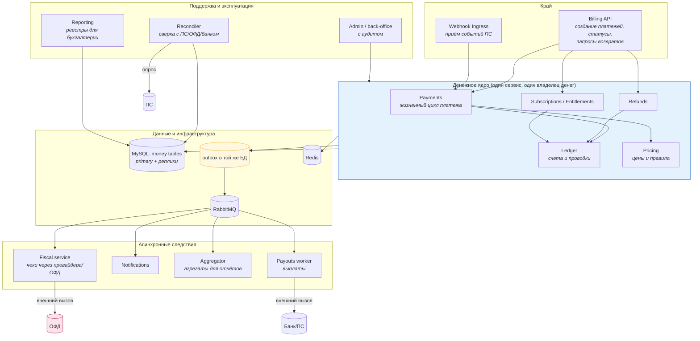
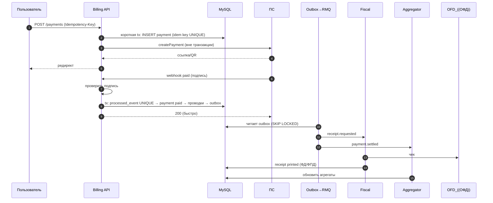

# 01. Архитектура биллинга: компоненты, потоки, решения

> **Что проверяют.** На собеседовании попросят «спроектировать» или «объяснить, как бы ты
> устроил». Проверяют не количество сервисов, а **умение выбрать границы и обосновать их**.
> В вакансии: «влияние на то, как эта система будет устроена дальше».
>
> Здесь: целевая архитектура биллинга (не «12 микросервисов», а обоснованные границы), потоки,
> что синхронно/асинхронно, где транзакции, как это масштабируется, и главное — **цена каждого
> решения**.

---

## 1. Принципы, из которых всё вытекает

```
1. Один владелец денег. Деньги (балансы, проводки) меняет только биллинг-ядро.
   Всё остальное — просит или подписывается на события.
2. Сначала данные, потом события. Источник истины — БД. Брокер — транспорт.
3. Всё, что снаружи, — идемпотентно и повторяемо. ПС, ОФД, банк, партнёры.
4. Расхождения — норма. Их надо обнаруживать автоматически, а не надеяться.
5. Правила (чёты, ставки, юрлица) — данные с версиями, а не код.
```

**Почему не «много микросервисов сразу»:** в биллинге главный риск — не производительность,
а **консистентность и разбор инцидентов**. Каждая новая сетевая граница добавляет состояние
«между сервисами» и усложняет разбор. Поэтому границы проводятся там, где есть **разные
требования** (нагрузка, релизный цикл, ответственность), а не «по модe».

---

## 2. Компоненты (минимальный достаточный набор)



**Разбор границ — почему именно так (это и есть «объясни решение»):**

| Граница | Почему отделяем | Цена |
|---|---|---|
| **Fiscal service** | внешний вызов со своим ритмом, своими ошибками, своей очередью; юридическая логика и правила | сетевая граница, нужно состояние чека и метрика отставания |
| **Notifications** | не влияет на деньги, можно отложить | — |
| **Aggregator/Reporting** | тяжёлые запросы, читают с реплик, не должны мешать приёму | данные с задержкой → нужен as-of |
| **Reconciler** | отдельный ритм (расписание), отдельные права, отдельная нагрузка | нужна инфраструктура расписаний |
| **Payouts** | самый опасный поток (деньги наружу) → отдельный сервис с жёсткими лимитами и аудитом | сложнее, но изолирует риск |
| ❌ **Ledger как отдельный сервис от Payments** | **не сразу**: это одна транзакция на одной БД; разделение внесёт распределённую консистентность туда, где она не нужна | — (если только нет требований по нагрузке/команде) |

**Фраза-маркер:** «Я бы **не** делил payments и ledger на разные сервисы на этом этапе: они
меняются в одной транзакции, и разделение добавило бы распределённую консистентность ровно
там, где она не нужна. А вот фискализацию, выплаты, сверку и отчётность — выделил бы, потому
что у них разный ритм, разные внешние зависимости и разная ответственность.»

---

## 3. Поток: оплата (что синхронно, где транзакция)



**Три решения в этом потоке, каждое из которых стоит обосновать:**

1. **Короткие транзакции, внешние вызовы — вне.** Транзакция защищает изменение состояния,
   а не «всю операцию».
2. **Ответ 200 ПС только после COMMIT.** Иначе подтвердим то, чего нет.
3. **Чек и агрегаты — асинхронно через outbox.** Внешний вызов (ОФД) не может жить в
   транзакции; и мы обязаны уметь ответить ПС за миллисекунды.

---

## 4. Масштабирование: что реально упирается

| Узел | Чем упирается | Что делать |
|---|---|---|
| **MySQL (деньги)** | записи на primary: индексы, локи, объём истории | партиционирование по времени + архивация; короткие транзакции; агрегаты вместо тяжёлых запросов; **не** шардировать «на всякий случай» |
| **Чтение (кабинет, отчёты)** | горячая таблица | реплики для чтения отчётов; кэш для справочников; keyset-пагинация |
| **Обработка вебхуков** | количество воркеров и пул соединений | горизонтально, но с bulkhead: отдельный пул для вебхуков |
| **Фискализация** | лимиты провайдера ОФД | очередь + rate limit + параллелизм, ограниченный лимитами |
| **RabbitMQ** | размер очереди, память | quorum-очереди, prefetch, DLQ, алерты |
| **Тяжёлые отчёты** | CPU/IO на реплике | агрегатные таблицы, реплика, окно низкой нагрузки |

**Порядок действий при росте (готовый ответ):**

```
1. Измерить: где узкое место (БД? воркеры? внешний сервис? очередь?).
2. Убрать лишнюю работу: тяжёлые запросы → агрегаты; N+1; keyset вместо OFFSET.
3. Разделить нагрузку: реплики для чтения; bulkhead для критичного пути.
4. Кэш для справочников (никогда — для денежных решений).
5. Партиционирование + архивация (работает лучше, чем 20-й индекс).
6. И только если реально нужно — горизонтально масштабировать запись (шардирование
   по ключу, обычно уже с пониманием, что деньги одной сущности живут на одном шарде).
```

**Тезис:** «В биллинге горизонтальное масштабирование записи — последний шаг, а не первый.
Сначала я бы убрал лишнюю работу и разделил чтение и запись: в 9 из 10 случаев этого хватает,
и это сохраняет простую, транзакционную модель денег.»

---

## 5. Что откуда читается (и почему это важно)

| Данные | Источник для решений | Источник для показа | Почему |
|---|---|---|---|
| Баланс | проводки/ledger (или денормализованный счётчик с сверкой) | кэш на секунды | показать старое можно, решать — нет |
| Статус платежа | primary | реплика (с as-of) | решение о деньгах — только primary |
| Справочники (услуги, ставки) | справочник (версионированный) | кэш | правило должно быть точным, показ — нет |
| Отчёты | агрегаты (со сверкой) | реплика | не мешать приёму платежей |
| Чеки | `receipt` + ОФД | ссылка/QR | доказательство хранится у нас |

---

## 6. Безопасность в архитектуре (кратко, но обязательно)

| Аспект | Решение |
|---|---|
| PCI DSS | карточные данные **не касаются** наших сервисов (PCI-scope минимален) — используются токены и редиректы |
| Подписи вебхуков | HMAC + allowlist + сеcret rotation |
| Доступ к деньгам | отдельные права; ручные операции только через back-office **с аудитом** |
| Секреты | в секрет-хранилище, не в коде/конфигах в git |
| Персональные данные | минимизация в выгрузках и логах; маскирование |
| Аудит | кто/что/когда менял, плюс неизменяемость учётных записей |

**Тезис:** «Минимизация PCI-scope — это архитектурное требование: мы не должны хранить и даже
пропускать через себя PAN. Поэтому у нас редиректы и токены. И второе: любое ручное изменение
денег — только через back-office с записью в аудит, никогда „напрямую в БД“, потому что иначе
невозможно восстановить, что произошло.»

---

## 7. Как это подать на собеседовании (схема ответа на «расскажи архитектуру»)

```
1. Сначала уточняющие вопросы:
   - деньги вперёд или после услуги?
   - сколько ПС, какие способы оплаты?
   - одно юрлицо или несколько?
   - есть ли уже выплаты и планируются ли?
2. Затем — контуры (3 уровня):
   - синхронный путь (приём денег);
   - асинхронные следствия (чек, уведомление, агрегат, выплата);
   - эксплуатация (сверка, отчётность, админка).
3. Затем — точки согласованности (главное!):
   - деньги ⟺ проводки (транзакция);
   - деньги ⟺ чек (отставание с метрикой);
   - деньги ⟺ банк (сверка);
   - услуга оказана ⟺ зачёт аванса (событие из продукта, идемпотентное).
4. Затем — одно-два решения с trade-off:
   "Фискализацию выделяю отдельно, потому что внешний вызов и юридическая ответственность;
    цена — состояние чека и метрика отставания. Ledger не отделяю, потому что это одна
    транзакция."
5. И обязательно — что НЕ делаю сейчас: шардирование, микросервисы ради микросервисов.
```

**Фраза, которой хорошо закрыть:** «Я бы строил так, чтобы **самое дорогое для бизнеса**
— корректность денег — защищалось транзакцией и уникальными ключами, а всё остальное было
асинхронным и повторяемым. Тогда рост нагрузки и новые продукты добавляются, не затрагивая
денежное ядро.»

---

## 8. Красные флаги в этой теме

* ❌ «Разобьём биллинг на 12 микросервисов» без обоснования границ.
* ❌ Деньги меняются из нескольких сервисов.
* ❌ Тяжёлые отчёты идут в primary и делят пул с приёмом платежей.
* ❌ Нет точки «чек»: фискализация внутри транзакции приёма.
* ❌ Шардирование как первый ответ на рост.
* ❌ «Показать баланс из кэша» и «решить по кэшу» путаются.
* ❌ Нет ручного доступа с аудитом (всё руками в БД).

## Чек-лист по этому файлу

- [ ] Могу назвать 5 принципов и объяснить, откуда они.
- [ ] Могу нарисовать компоненты и обосновать каждую границу (включая «почему не делю ledger»).
- [ ] Помню 3 решения в потоке оплаты и их обоснование.
- [ ] Знаю порядок масштабирования (6 шагов) и почему шардирование — последнее.
- [ ] Могу объяснить, что читается с primary, а что можно с реплики/кэша.
- [ ] Готов ответ «расскажи архитектуру» по 5 шагам, начиная с уточняющих вопросов.
