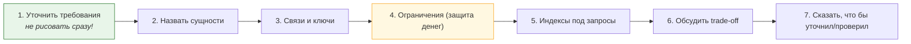
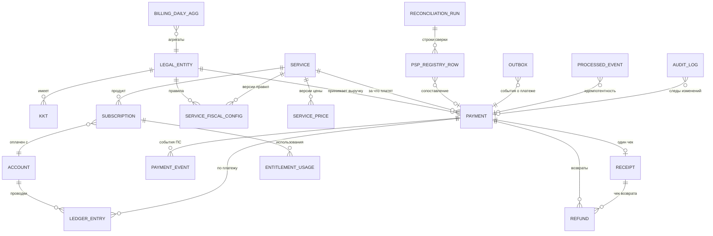

# 02. Проектирование схемы БД биллинга: полный разбор (главное практическое задание)

> В вакансии: «вместе спроектируем схему базы данных, обсудим таблицы, связи, ограничения и
> индексы». С высокой вероятностью **это и будет основная практическая часть**. Здесь —
> как вести себя в этой части интервью, полная схема с DDL, обоснование каждого индекса и
> каждого ограничения, и разбор компромиссов.

---

## 1. Как вести себя в этой части (протокол)



### Сначала — 5 вопросов (задай их обязательно)

```
1. Деньги принимаем вперёд (баланс/аванс) или по факту услуги? Есть ли оба варианта?
2. Один платёж = одна услуга, или платёж может содержать несколько позиций?
3. Есть ли холды/предоплата с отложенным оказанием?
4. Одно юрлицо или несколько (и несколько ли ККТ)?
5. Объём: сколько операций в день и какая глубина хранения нужна?
```

> **Почему это важно и почему это плюс:** от ответов меняются 2–3 таблицы. Кандидат, который
> сразу рисует 12 таблиц «по учебнику», показывает, что не уточняет требования — а в биллинге
> это разница между правильной и неправильной моделью. **Спросить — это сигнал senior, а не
> незнание.**

---

## 2. Сущности: 10 групп и за что каждая отвечает

| Группа | Таблицы | Отвечает за |
|---|---|---|
| **Организационные** | `legal_entity`, `kkt` | от какого юрлица и на какую кассу фискализируем |
| **Справочники** | `service`, `service_price` (версии), `service_fiscal_config` (версии) | что продаём, по какой цене, с какими правилами чеков |
| **Деньги (учёт)** | `account`, `ledger_entry` | счета и проводки (двойная запись) |
| **Платежи** | `payment`, `payment_event` | попытки оплаты и события от ПС |
| **Возвраты** | `refund` | обратные операции |
| **Фискализация** | `receipt` | чеки и их состояния |
| **Права/подписки** | `subscription`, `entitlement_usage` | что и сколько доступно пользователю (пакеты) |
| **Инфраструктура надёжности** | `outbox`, `processed_event` | доставка событий и идемпотентность |
| **Сверка** | `psp_registry_row`, `reconciliation_run` | внешние реестры и результаты сверок |
| **Отчётность/аудит** | `billing_daily_agg`, `audit_log` | агрегаты и след изменений |

**Фраза:** «Сущности я группирую по смыслу, и главное разделение — **деньги** (`account`,
`ledger_entry`), **попытки/события** (`payment`, `payment_event`), **документы** (`receipt`),
и **правила** (`service_fiscal_config`). Деньги — append-only. Документы — append-only.
Правила — версионируемые. Это три разных режима жизни данных, и их нельзя смешивать.»

---

## 3. ER-диаграмма (целевая)



---

## 4. DDL: полная схема (MySQL 8, InnoDB)

> Этот же DDL используется в `12-labs/sql/01-schema.sql` — можно поднять и потрогать руками.

### 4.1. Справочники и организационные

```sql
CREATE TABLE legal_entity (
  id          BIGINT UNSIGNED NOT NULL AUTO_INCREMENT,
  code        VARCHAR(32)     NOT NULL,
  name        VARCHAR(255)    NOT NULL,
  inn         VARCHAR(12)     NOT NULL,
  sno         VARCHAR(16)     NOT NULL COMMENT 'ОСНО/УСН/... (справочно; правила — в конфиге услуг)',
  is_active   TINYINT(1)      NOT NULL DEFAULT 1,
  created_at  DATETIME(6)     NOT NULL,
  PRIMARY KEY (id),
  UNIQUE KEY uq_legal_entity_code (code)
) ENGINE=InnoDB;

CREATE TABLE kkt (
  id              BIGINT UNSIGNED NOT NULL AUTO_INCREMENT,
  legal_entity_id BIGINT UNSIGNED NOT NULL,
  serial_number   VARCHAR(64)     NOT NULL,
  provider_code   VARCHAR(32)     NOT NULL COMMENT 'через какого агрегатора/ОФД работает',
  is_active       TINYINT(1)      NOT NULL DEFAULT 1,
  PRIMARY KEY (id),
  UNIQUE KEY uq_kkt (legal_entity_id, serial_number),
  KEY idx_kkt_active (legal_entity_id, is_active),
  CONSTRAINT fk_kkt_entity FOREIGN KEY (legal_entity_id) REFERENCES legal_entity(id)
) ENGINE=InnoDB;

CREATE TABLE service (
  code        VARCHAR(32)  NOT NULL COMMENT 'contact_access, promotion, package_10, partner_service...',
  name        VARCHAR(255) NOT NULL,
  description VARCHAR(512) NULL,
  is_active   TINYINT(1)   NOT NULL DEFAULT 1,
  PRIMARY KEY (code)
) ENGINE=InnoDB;

-- Версии цены: цена меняется во времени, отчёт за март считает по мартовской цене
CREATE TABLE service_price (
  id           BIGINT UNSIGNED NOT NULL AUTO_INCREMENT,
  service_code VARCHAR(32)     NOT NULL,
  amount_minor BIGINT          NOT NULL,
  currency     CHAR(3)         NOT NULL,
  valid_from   DATETIME(6)     NOT NULL,
  valid_to     DATETIME(6)     NULL COMMENT 'NULL = действует по настоящее время',
  PRIMARY KEY (id),
  KEY idx_price_lookup (service_code, valid_from, valid_to),
  CONSTRAINT fk_price_service FOREIGN KEY (service_code) REFERENCES service(code)
) ENGINE=InnoDB;

-- ★ Ядро "рефакторинга под новые требования": правила фискализации как ВЕРСИОНИРУЕМЫЕ ДАННЫЕ
CREATE TABLE service_fiscal_config (
  id                  BIGINT UNSIGNED NOT NULL AUTO_INCREMENT,
  service_code        VARCHAR(32)     NOT NULL,
  legal_entity_id     BIGINT UNSIGNED NOT NULL,
  subject_name_tpl    VARCHAR(255)    NOT NULL COMMENT 'шаблон наименования предмета расчёта',
  subject_type        TINYINT UNSIGNED NOT NULL COMMENT 'признак предмета расчёта (услуга/работа/товар)',
  method_type         TINYINT UNSIGNED NOT NULL COMMENT 'признак способа расчёта (аванс/полный/зачёт)',
  vat_rate            DECIMAL(5,2)    NOT NULL COMMENT 'ставка на период действия',
  agent_flag          TINYINT UNSIGNED NOT NULL DEFAULT 0,
  settlement_moment   ENUM('immediate','on_service_provided') NOT NULL DEFAULT 'immediate',
  valid_from          DATETIME(6)     NOT NULL,
  valid_to            DATETIME(6)     NULL,
  PRIMARY KEY (id),
  KEY idx_fiscal_config_lookup (service_code, legal_entity_id, valid_from, valid_to),
  CONSTRAINT fk_fiscal_service FOREIGN KEY (service_code) REFERENCES service(code),
  CONSTRAINT fk_fiscal_entity  FOREIGN KEY (legal_entity_id) REFERENCES legal_entity(id)
) ENGINE=InnoDB;
```

**Почему так (обоснование, которое стоит произнести):**

| Решение | Обоснование |
|---|---|
| `valid_from/valid_to` вместо «текущего значения» | отчёт за прошлый период должен считаться по правилам того периода |
| `DECIMAL(5,2)` для ставки | ставка — не деньги, но точность нужна (например, 9.09) |
| `subject_name_tpl` (шаблон) | одно правило на услугу, а в чеке — конкретное наименование с реквизитами заказа |
| Справочники **не** enum в коде | их меняют без релиза (бухгалтерия/продукт) — см. `01-php/03-php8-for-billing.md` §9 |

### 4.2. Деньги: счета и проводки

```sql
CREATE TABLE account (
  id             BIGINT UNSIGNED NOT NULL AUTO_INCREMENT,
  owner_type     ENUM('user','legal_entity','system') NOT NULL,
  owner_id       BIGINT UNSIGNED NOT NULL COMMENT 'для system — код системного счёта',
  currency       CHAR(3)      NOT NULL,
  balance_minor  BIGINT       NOT NULL DEFAULT 0 COMMENT 'ДЕНОРМАЛИЗОВАННЫЙ кэш; истина — проводки',
  status         ENUM('active','frozen','closed') NOT NULL DEFAULT 'active',
  created_at     DATETIME(6)  NOT NULL,
  updated_at     DATETIME(6)  NOT NULL,
  PRIMARY KEY (id),
  UNIQUE KEY uq_account_owner (owner_type, owner_id, currency),
  KEY idx_account_negative (balance_minor) COMMENT 'для поиска отрицательных балансов'
) ENGINE=InnoDB;
```

```sql
-- ★ Основная денежная таблица. Append-only: UPDATE/DELETE запрещены (кроме служебного).
CREATE TABLE ledger_entry (
  id            BIGINT UNSIGNED NOT NULL AUTO_INCREMENT,
  created_day   DATE            NOT NULL COMMENT 'партиционирующая колонка (входит в PK и UNIQUE!)',
  created_at    DATETIME(6)     NOT NULL,
  operation_id  CHAR(36)        NOT NULL COMMENT 'ключ идемпотентности учётной операции',
  operation_type ENUM('payment','refund','chargeback','adjustment','payout','offset') NOT NULL,
  account_id    BIGINT UNSIGNED NOT NULL,
  amount_minor  BIGINT          NOT NULL COMMENT 'знак: + дебет, − кредит',
  currency      CHAR(3)         NOT NULL,
  payment_id    BIGINT UNSIGNED NULL,
  refund_id     BIGINT UNSIGNED NULL,
  comment       VARCHAR(255)    NULL,
  PRIMARY KEY (id, created_day),
  UNIQUE KEY uq_operation_account (operation_id, account_id, created_day)
    COMMENT 'защита от двойных проводок по одной операции и счёту',
  KEY idx_account_day (account_id, created_day),
  KEY idx_payment (payment_id, created_day),
  CONSTRAINT fk_le_account FOREIGN KEY (account_id) REFERENCES account(id)
) ENGINE=InnoDB
PARTITION BY RANGE COLUMNS(created_day) (
  PARTITION p2025_05 VALUES LESS THAN ('2025-06-01'),
  PARTITION p2025_06 VALUES LESS THAN ('2025-07-01'),
  PARTITION p2025_07 VALUES LESS THAN ('2025-08-01'),
  PARTITION p_max    VALUES LESS THAN (MAXVALUE)
);
```

**Обоснование (здесь интервьюер будет слушать внимательно):**

| Решение | Обоснование |
|---|---|
| `amount_minor BIGINT` со знаком | точность; знак вместо двух колонок `debit/credit` — проще и быстрее (`SUM`) |
| `UNIQUE(operation_id, account_id, created_day)` | **идемпотентность уровня учёта**; также не даёт случайно задвоить проводку |
| `operation_id` (UUID) | связывает проводки одной операции; удобно для «сумма по операции = 0» |
| `partition by RANGE(created_day)` | история растёт линейно; `DROP PARTITION` вместо `DELETE`; pruning для отчётов |
| `created_day` в PK и в UNIQUE | **требование MySQL**: партиционирующая колонка должна входить в каждый уникальный ключ |
| Нет `FOREIGN KEY` на `payment_id` | ⚠️ осознанно: FK добавляет локи и мешает партиционированию/архивации. Целостность проверяем приложением + сверкой. **Это компромисс, и его надо назвать** |
| Нет отдельного «источника» для UPDATE | append-only; исправление — компенсирующая проводка |

**Компромисс, который стоит проговорить самому (это отличает senior):**

> «Здесь есть компромисс, который я бы обсудил с командой: партиционирование по дню требует
> включать `created_day` в уникальные ключи, а это значит, что ключ идемпотентности проводки
> проверяется в рамках **дня**. Если бы я хотел глобальную уникальность `operation_id`, я бы
> держал отдельную **непартиционированную** таблицу операций, а `ledger_entry` — только как
> проводки. Обычно так и делают: „защита от дублей“ живёт в маленькой таблице, а большие
> логи — партиционируются.»

### 4.3. Платежи и события

```sql
CREATE TABLE payment (
  id                  BIGINT UNSIGNED NOT NULL AUTO_INCREMENT,
  public_id           BINARY(16)      NOT NULL COMMENT 'ULID/UUIDv7 — то, что отдаём наружу',
  user_id             BIGINT UNSIGNED NOT NULL,
  legal_entity_id     BIGINT UNSIGNED NOT NULL,
  service_code        VARCHAR(32)     NOT NULL,
  amount_minor        BIGINT          NOT NULL,
  currency            CHAR(3)         NOT NULL,
  status              ENUM('created','pending','unknown','paid','partially_refunded','refunded','failed','expired')
                                      NOT NULL,
  idempotency_key     VARCHAR(128)    NOT NULL,
  provider_code       VARCHAR(16)     NOT NULL,
  provider_payment_id VARCHAR(128)    NULL,
  -- снимок применённых правил (воспроизводимость отчётности)
  vat_rate            DECIMAL(5,2)    NOT NULL,
  vat_base_minor      BIGINT          NOT NULL,
  vat_amount_minor    BIGINT          NOT NULL,
  fiscal_rule_version INT UNSIGNED    NOT NULL,
  -- деньги/время
  refunded_minor      BIGINT          NOT NULL DEFAULT 0 COMMENT 'денормализовано, со сверкой',
  operation_day       DATE            NOT NULL COMMENT 'бизнес-день (не UTC!)',
  created_at          DATETIME(6)     NOT NULL,
  paid_at             DATETIME(6)     NULL,
  PRIMARY KEY (id),
  UNIQUE KEY uq_public_id (public_id),
  UNIQUE KEY uq_idempotency (idempotency_key),
  UNIQUE KEY uq_provider_payment (provider_code, provider_payment_id),
  KEY idx_user_status_created (user_id, status, created_at),
  KEY idx_entity_day_status (legal_entity_id, operation_day, status),
  KEY idx_status_created (status, created_at) COMMENT 'дожим pending/unknown + узкие локи воркера'
) ENGINE=InnoDB;
```

```sql
-- Все входящие события от ПС: идемпотентность + разбор
CREATE TABLE payment_event (
  id          BIGINT UNSIGNED NOT NULL AUTO_INCREMENT,
  source      VARCHAR(16)     NOT NULL COMMENT 'psp | ofd | product',
  event_id    VARCHAR(128)    NOT NULL,
  payment_id  BIGINT UNSIGNED NULL,
  raw_status  VARCHAR(64)     NOT NULL COMMENT 'как есть от источника',
  raw_payload JSON            NOT NULL,
  seen_count  INT UNSIGNED    NOT NULL DEFAULT 1,
  received_at DATETIME(6)     NOT NULL,
  PRIMARY KEY (id),
  UNIQUE KEY uq_source_event (source, event_id),
  KEY idx_payment (payment_id)
) ENGINE=InnoDB;
```

**Что обязательно назвать:**

| Решение | Почему |
|---|---|
| `public_id BINARY(16)`, а PK — `BIGINT` | компактный PK (влезает во все индексы), наружу не светим монотонный счётчик |
| `UNIQUE(idempotency_key)` | уровень 1 идемпотентности |
| `UNIQUE(provider_code, provider_payment_id)` | поиск платежа по вебхуку; `NULL` не конфликтует в MySQL (можно много NULL) |
| `UNIQUE(source, event_id)` | уровень 2 идемпотентности |
| Снимок НДС (`vat_rate`, `vat_base_minor`, `vat_amount_minor`) | воспроизводимость отчётов (см. `05-billing-domain/04-tax-reporting.md`) |
| `operation_day` | «бизнес-день» отдельно от UTC — иначе отчёты не сходятся |
| `idx_status_created` | и для выборки воркера, и **для узких локов** (иначе диапазонные локи → дедлоки) |
| `refunded_minor` денормализовано | быстрый ответ «сколько вернули» + сверка с `refund` |

### 4.4. Чеки, возвраты, подписки

```sql
CREATE TABLE receipt (
  id                   BIGINT UNSIGNED NOT NULL AUTO_INCREMENT,
  payment_id           BIGINT UNSIGNED NULL,
  refund_id            BIGINT UNSIGNED NULL,
  receipt_type         ENUM('income','income_refund','expense','expense_refund','correction') NOT NULL,
  status               ENUM('requested','registering','retry_wait','printed','rejected','corrected','manual')
                                     NOT NULL,
  legal_entity_id      BIGINT UNSIGNED NOT NULL,
  operation_id         CHAR(36)      NOT NULL COMMENT 'идемпотентность фискализации',
  total_minor          BIGINT        NOT NULL,
  currency             CHAR(3)       NOT NULL,
  vat_rate             DECIMAL(5,2)  NOT NULL,
  vat_amount_minor     BIGINT        NOT NULL,
  subject_name         VARCHAR(255)  NOT NULL COMMENT 'снимок наименования для чека',
  method_type          TINYINT UNSIGNED NOT NULL COMMENT 'признак способа расчёта (аванс/зачёт/полный)',
  fiscal_doc_number    VARCHAR(32)   NULL COMMENT '№ ФД',
  fiscal_sign          VARCHAR(64)   NULL COMMENT 'ФПД',
  fiscal_doc_attribute VARCHAR(64)   NULL COMMENT 'ФПС',
  attempts             INT UNSIGNED  NOT NULL DEFAULT 0,
  last_error           VARCHAR(512)  NULL,
  created_at           DATETIME(6)   NOT NULL,
  registered_at        DATETIME(6)   NULL,
  PRIMARY KEY (id),
  UNIQUE KEY uq_receipt_operation (operation_id),
  KEY idx_payment (payment_id),
  KEY idx_status_created (status, created_at) COMMENT 'метрика "чек отстаёт" и выборка воркера',
  CONSTRAINT fk_receipt_payment FOREIGN KEY (payment_id) REFERENCES payment(id)
) ENGINE=InnoDB;
```

> ⚠️ **Важный разбор про «один чек на платёж»:** уникальность `payment_id` (один чек на платёж)
> работает, **пока модель односторонняя**. Как только появляются аванс и зачёт, на один платёж
> законно приходится **два** чека (аванс и зачёт). Поэтому правильно — `UNIQUE(operation_id)`
> (уникальность на **наш** ключ операции), а не на `payment_id`. И это ровно тот тип изменения,
> которое ломает «наивную» схему при переходе на новые требования. **Сказать это вслух — очень
> сильный сигнал.**

```sql
CREATE TABLE refund (
  id                 BIGINT UNSIGNED NOT NULL AUTO_INCREMENT,
  payment_id         BIGINT UNSIGNED NOT NULL,
  receipt_id         BIGINT UNSIGNED NULL COMMENT 'чек возврата',
  operation_id       CHAR(36)        NOT NULL,
  amount_minor       BIGINT          NOT NULL COMMENT 'всегда положительное',
  currency           CHAR(3)         NOT NULL,
  status             ENUM('requested','processing','unknown','completed','failed','rejected')
                                     NOT NULL,
  reason             VARCHAR(255)    NOT NULL,
  provider_refund_id VARCHAR(128)    NULL,
  requested_by       VARCHAR(64)     NOT NULL COMMENT 'кто инициировал (для аудита)',
  created_at         DATETIME(6)     NOT NULL,
  completed_at       DATETIME(6)     NULL,
  PRIMARY KEY (id),
  UNIQUE KEY uq_refund_operation (operation_id),
  UNIQUE KEY uq_refund_provider (provider_refund_id),
  KEY idx_payment_status (payment_id, status),
  CONSTRAINT fk_refund_payment FOREIGN KEY (payment_id) REFERENCES payment(id)
) ENGINE=InnoDB;

CREATE TABLE subscription (
  id              BIGINT UNSIGNED NOT NULL AUTO_INCREMENT,
  user_id         BIGINT UNSIGNED NOT NULL,
  service_code    VARCHAR(32)     NOT NULL,
  status          ENUM('active','paused','expired','cancelled') NOT NULL,
  quantity_total  INT UNSIGNED    NOT NULL DEFAULT 0 COMMENT 'например, 10 откликов',
  quantity_used   INT UNSIGNED    NOT NULL DEFAULT 0 COMMENT 'денормализовано, со сверкой',
  amount_minor    BIGINT          NOT NULL,
  currency        CHAR(3)         NOT NULL,
  auto_renew      TINYINT(1)      NOT NULL DEFAULT 0,
  mandate_ref     VARCHAR(128)    NULL COMMENT 'ссылка на сохранённое согласие/токен',
  valid_from      DATETIME(6)     NOT NULL,
  valid_to        DATETIME(6)     NULL,
  PRIMARY KEY (id),
  KEY idx_user_status (user_id, status),
  KEY idx_renew (status, auto_renew, valid_to) COMMENT 'выборка подписок к продлению',
  CONSTRAINT fk_sub_service FOREIGN KEY (service_code) REFERENCES service(code)
) ENGINE=InnoDB;

CREATE TABLE entitlement_usage (
  id              BIGINT UNSIGNED NOT NULL AUTO_INCREMENT,
  subscription_id BIGINT UNSIGNED NOT NULL,
  operation_id    CHAR(36)        NOT NULL,
  used_at         DATETIME(6)     NOT NULL,
  order_ref       VARCHAR(64)     NULL COMMENT 'за что именно списали (продуктовая ссылка)',
  PRIMARY KEY (id),
  UNIQUE KEY uq_usage_operation (operation_id),
  KEY idx_subscription_used (subscription_id, used_at),
  CONSTRAINT fk_usage_sub FOREIGN KEY (subscription_id) REFERENCES subscription(id)
) ENGINE=InnoDB;
```

### 4.5. Инфраструктура надёжности, сверка, отчётность, аудит

```sql
CREATE TABLE outbox (
  id           BIGINT UNSIGNED NOT NULL AUTO_INCREMENT,
  event_type   VARCHAR(64)     NOT NULL COMMENT 'receipt.requested, payment.settled, ...',
  aggregate_id BIGINT UNSIGNED NOT NULL,
  payload      JSON            NOT NULL,
  created_at   DATETIME(6)     NOT NULL,
  published_at DATETIME(6)     NULL,
  attempts     SMALLINT UNSIGNED NOT NULL DEFAULT 0,
  PRIMARY KEY (id),
  KEY idx_unpublished (published_at, id) COMMENT 'publisher читает по этому индексу; он же даёт узкие локи'
) ENGINE=InnoDB;

CREATE TABLE processed_event (
  id           BIGINT UNSIGNED NOT NULL AUTO_INCREMENT,
  source       VARCHAR(32)     NOT NULL,
  event_id     VARCHAR(128)    NOT NULL,
  payload_hash CHAR(64)        NOT NULL,
  seen_count   INT UNSIGNED    NOT NULL DEFAULT 1,
  processed_at DATETIME(6)     NOT NULL,
  PRIMARY KEY (id),
  UNIQUE KEY uq_source_event (source, event_id)
) ENGINE=InnoDB;

CREATE TABLE psp_registry_row (
  id                  BIGINT UNSIGNED NOT NULL AUTO_INCREMENT,
  provider_code       VARCHAR(16)     NOT NULL,
  created_day         DATE            NOT NULL,
  provider_payment_id VARCHAR(128)    NULL,
  order_id            VARCHAR(128)    NULL,
  amount_minor        BIGINT          NOT NULL,
  currency            CHAR(3)         NOT NULL,
  status              VARCHAR(32)     NOT NULL,
  raw                 JSON            NOT NULL COMMENT 'сырая строка реестра — для разбора',
  matched_payment_id  BIGINT UNSIGNED NULL,
  match_status        ENUM('matched','ours_only','theirs_only','amount_diff','status_diff') NULL,
  PRIMARY KEY (id),
  KEY idx_provider_day (provider_code, created_day),
  KEY idx_match (provider_code, created_day, match_status),
  KEY idx_provider_payment (provider_code, provider_payment_id)
) ENGINE=InnoDB;

CREATE TABLE reconciliation_run (
  id            BIGINT UNSIGNED NOT NULL AUTO_INCREMENT,
  provider_code VARCHAR(16)     NOT NULL,
  created_day   DATE            NOT NULL,
  started_at    DATETIME(6)     NOT NULL,
  finished_at   DATETIME(6)     NULL,
  status        ENUM('running','ok','mismatch','failed') NOT NULL,
  mismatch_count  INT UNSIGNED  NOT NULL DEFAULT 0,
  mismatch_minor  BIGINT        NOT NULL DEFAULT 0,
  details         JSON          NULL,
  PRIMARY KEY (id),
  UNIQUE KEY uq_run (provider_code, created_day)
) ENGINE=InnoDB;

CREATE TABLE billing_daily_agg (
  legal_entity_id BIGINT UNSIGNED NOT NULL,
  day             DATE            NOT NULL,
  service_code    VARCHAR(32)     NOT NULL,
  status          VARCHAR(16)     NOT NULL,
  operations_cnt  BIGINT UNSIGNED NOT NULL,
  amount_minor    BIGINT          NOT NULL,
  vat_amount_minor BIGINT         NOT NULL,
  updated_at      DATETIME(6)     NOT NULL,
  PRIMARY KEY (legal_entity_id, day, service_code, status),
  KEY idx_day (day)
) ENGINE=InnoDB;

CREATE TABLE audit_log (
  id           BIGINT UNSIGNED NOT NULL AUTO_INCREMENT,
  entity_type  VARCHAR(32)     NOT NULL,
  entity_id    BIGINT UNSIGNED NOT NULL,
  action       VARCHAR(64)     NOT NULL,
  actor        VARCHAR(64)     NOT NULL COMMENT 'кто: сервис/логин оператора',
  reason       VARCHAR(255)    NULL,
  before_json  JSON            NULL,
  after_json   JSON            NULL,
  created_at   DATETIME(6)     NOT NULL,
  PRIMARY KEY (id),
  KEY idx_entity (entity_type, entity_id, created_at)
) ENGINE=InnoDB;
```

---

## 5. Индексы: таблица «индекс → запрос, который он обслуживает»

Это то, что интервьюер ждёт: не «добавлю индексы», а **под каждый запрос**.

| Индекс | Запрос, который он обслуживает | Что будет без него |
|---|---|---|
| `payment.uq_idempotency` | повторный запрос с тем же ключом | двойной платёж |
| `payment.uq_provider_payment` | вебхук от ПС, сверка | поиск full scan; вебхук «не находит» платёж |
| `payment.idx_user_status_created` | «мои платежи», фильтр по статусу | full scan + filesort → отвал кабинета |
| `payment.idx_entity_day_status` | отчёты/выгрузки по юрлицу за период | ночные отчёты часами |
| `payment.idx_status_created` | дожим `pending`/`unknown` + **узкие локи воркера** | диапазонные локи → дедлоки |
| `ledger_entry.idx_account_day` | сальдо/обороты по счёту | сверка учёта не сходится в окно |
| `ledger_entry.idx_payment` | сверка «сумма проводок = сумма платежа» | проверка инварианта full scan |
| `receipt.idx_status_created` | метрика «чек отстаёт» + выборка воркера | отставание незаметно / full scan |
| `refund.idx_payment_status` | «сколько уже вернули» + пере-возврат | проверка инварианта дорогая |
| `outbox.idx_unpublished` | publisher читает неопубликованные | publisher делает full scan каждую секунду |
| `processed_event.uq_source_event` | идемпотентность входящих событий | двойная обработка |
| `psp_registry_row.idx_provider_payment` | сопоставление реестра с платежами | сверка не масштабируется |
| `billing_daily_agg.PK` | отчёты по агрегатам | отчёты по горячей таблице |

**И обязательный пункт про цену:** «Каждый индекс замедляет вставку и занимает место. У меня
на таблице платежей их пять, и каждый обоснован конкретным запросом из онлайна или сверки.
Индексы „на всякий случай“ в биллинге я не добавляю: вставка платежа — самая горячая операция.»

---

## 6. Ограничения как защита денег (главный раздел)

| Ограничение | Что защищает | Что будет без него |
|---|---|---|
| `UNIQUE(payment.idempotency_key)` | от двойного платежа по одному намерению | двойные списания |
| `UNIQUE(payment.provider_code, provider_payment_id)` | от путаницы платежей ПС | обработка чужого платежа |
| `UNIQUE(processed_event.source, event_id)` | от повторной обработки события | двойное зачисление |
| `UNIQUE(ledger_entry.operation_id, account_id, created_day)` | от двойных проводок | задвоенные деньги в учёте |
| `UNIQUE(refund.operation_id)` | от повторного возврата по одному запросу | двойной возврат |
| `NOT NULL` на `amount_minor`, `currency`, `status` | от «платежа без суммы» | нечитаемые данные, сломанная отчётность |
| `ENUM` для статуса | от опечаток в статусных строках | «paid» vs «Pаid» |
| `FOREIGN KEY` там, где нужен порядок и целостность | от «проводки к несуществующему счёту» | осиротевшие записи |
| `CHECK (amount_minor <> 0)` | от нулевых проводок | мусор в учёте |

```sql
-- Пример: CHECK-ограничения (MySQL 8 их поддерживает)
ALTER TABLE ledger_entry
  ADD CONSTRAINT chk_le_nonzero CHECK (amount_minor <> 0);
ALTER TABLE payment
  ADD CONSTRAINT chk_payment_amount_positive CHECK (amount_minor > 0),
  ADD CONSTRAINT chk_refunded_not_exceed   CHECK (refunded_minor <= amount_minor);
```

> **Мощный тезис:** «Идемпотентность и целостность денег я стараюсь выражать **ограничениями
> схемы**, а не проверками в коде. Причина: код меняется, разные сервисы пишут по-разному, а
> ограничение в базе держит инвариант для всех. Проверка в коде — это пожелание; `UNIQUE` —
> это гарантия.»

---

## 7. Компромиссы, которые будут обсуждать (и что отвечать)

| Вопрос интервьюера | Ответ с обеими сторонами |
|---|---|
| «Хранить деньги в `BIGINT`-копейках или `DECIMAL`?» | `BIGINT` для движения и балансов (быстро, атомарно, индекс компактный); `DECIMAL` там, где данные читает бухгалтерия и важна «человеческая» форма. Обязательно — экспонента валюты. Никогда float |
| «Баланс полем или через проводки?» | Истина — проводки; поле — денормализованный кэш в одной транзакции с проводкой, плюс обязательная сверка с алертом |
| «Почему партиционирование, а не просто индексы?» | История растёт линейно; `DROP PARTITION` вместо `DELETE`; pruning. Цена: уникальные ключи обязаны включать партиционирующую колонку, и защиту от дублей лучше вынести в отдельную таблицу |
| «Статус — `ENUM` или таблица?» | Технические закрытые наборы — `ENUM` (или enum в коде + `VARCHAR` в БД для переносимости); бизнес-справочники — таблица |
| «`JSON` для payload или колонки?» | `JSON` для сырых внешних данных (разбор, «что прислал ПС»); для того, по чему фильтруем/отчитываемся — колонки. `JSON` нельзя индексировать эффективно, как обычные колонки |
| «Мягкое удаление (`deleted_at`)?» | Для денежных данных — нет: только состояния и компенсации. Для справочников — лучше версионирование, чем удаление |
| «Одна БД или по БД на сервис?» | Пока это одно доменное ядро — одна БД (транзакции!). Разделять можно **по ритму и ответственности** (аналитика, выплаты), а не «по модe» |
| «Как быть с часовыми поясами?» | Всё в UTC (`DATETIME(6)`), плюс отдельный `operation_day` — бизнес-день по правилам учёта |
| «`FK` или без?» | В горячих денежных таблицах — осознанный компромисс: `FK` даёт целостность, но добавляет локи и мешает партиционированию/архивации; тогда целостность обеспечивается приложением + сверкой. В справочниках — `FK` |

---

## 8. Что я бы проверил после проектирования (закрывающий блок)

```
1. Денежные инварианты выразимы SQL-запросами? (сумма по операции = 0; сальдо = сумма проводок)
2. Есть ли идемпотентность на всех уровнях (ключ запроса, событие, переход, проводка)?
3. Каждый индекс соответствует конкретному запросу? Нет "на всякий случай"?
4. Партиционирование/архивация предусмотрены для роста (ledger, payment_event, outbox)?
5. Есть ли воспроизводимость отчётности (снимки правил, версии справочников)?
6. Где точки разрыва и как они измеряются (paid без чека, чек без paid, расхождения)?
7. Можно ли откатить изменение схемы (expand/contract)?
```

---

## 9. Типичные ошибки, которые ждёт интервьюер

| Ошибка | Почему плохо |
|---|---|
| Сразу рисует 12 таблиц без уточняющих вопросов | не выясняет требования → модель «в вакууме» |
| `balance` как единственный источник правды | нет истории, нет сверки, нельзя доказать |
| `UPDATE`/`DELETE` проводок | нарушены инварианты, нет аудита |
| `UNIQUE(payment_id)` на чек | ломается при авансе и зачёте (два чека) |
| `FLOAT`/`DOUBLE` для денег | потеря точности |
| Отсутствие `operation_day` | невозможно закрыть период |
| Индексы «на все колонки» | вставка платежа замедляется |
| Нет `outbox`/`processed_event` | двойная обработка, потерянные события |
| Нет партиционирования/архивации | таблица вырастет в терабайты, DDL станет невозможен |
| Правила фискализации в коде | новый вид услуги = релиз ядра |

---

## 10. Ответ вслух (итоговый скрипт на 3 минуты)

> «Прежде чем рисовать, я уточню пять вещей: деньги вперёд или по факту услуги; один платёж
> или несколько позиций; есть ли холды; одно юрлицо или несколько; объём и глубина хранения.
> От этих ответов зависят две-три таблицы.
>
> Сущности я разбиваю на группы: организационные (юрлицо, ККТ), справочники (услуги, цены,
> правила фискализации — все с версиями по времени), деньги (`account`, `ledger_entry`),
> платежи (`payment`, `payment_event`), возвраты, чеки, подписки, инфраструктура надёжности
> (`outbox`, `processed_event`), сверка, отчётность и аудит.
>
> Ключевые решения. Первое: деньги — только через проводки с двойной записью, append-only,
> с инвариантом „сумма проводок по операции равна нулю“. Баланс счёта — денормализованный кэш
> с обязательной сверкой.
>
> Второе: идемпотентность на четырёх уровнях и **ограничениями схемы**, а не проверками в коде:
> уникальный ключ от клиента, уникальность входящего события, `UNIQUE(operation_id)` в
> проводках, плюс машина состояний.
>
> Третье: правила фискализации — версионируемые данные. Это то, что делает „новый вид услуги“
> дешёвым и закрывает требования налоговой.
>
> Четвёртое: на каждой денежной таблице я храню **снимок применённых правил** плюс
> `operation_day` — чтобы отчёт за март считался по мартовским правилам и по правильной
> границе дня.
>
> Пятое: индексы — под конкретные запросы, и отдельный индекс под выборку воркера, потому что
> он же отвечает за **узкие локи** и отсутствие дедлоков.
>
> И шестое — про рост: `ledger_entry` партиционирую по дню, чтобы архивировать через
> `DROP PARTITION`, а защиту от дублей держу в отдельной небольшой таблице, потому что
> партиционирование требует включать деня в уникальные ключи. Фактически: логи партиционируем,
> защиту от дублей — нет.»

---

## Чек-лист по этому файлу

- [ ] Помню 5 уточняющих вопросов и задаю их до проектирования.
- [ ] Могу нарисовать ER-диаграмму по памяти (10 групп сущностей).
- [ ] Могу написать DDL основных таблиц с ключами и обосновать каждое ограничение.
- [ ] Могу объяснить таблицу «индекс → запрос».
- [ ] Знаю 3+ денежных `CHECK`/`UNIQUE`-ограничения и что каждое защищает.
- [ ] Могу обсудить любой из 9 компромиссов с обеих сторон.
- [ ] Знаю про ловушку `UNIQUE(payment_id)` на чеке при авансе и зачёте.
- [ ] Могу назвать 7 проверок «что я бы проверил после проектирования».
