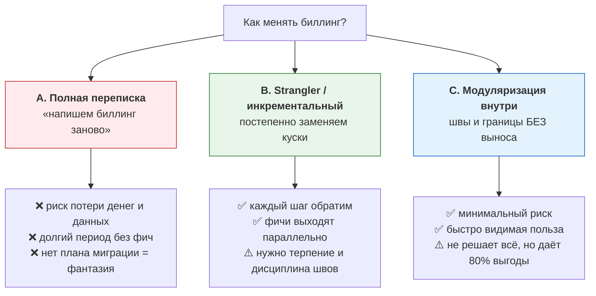
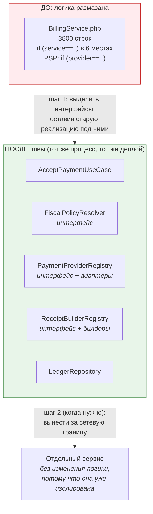

# 03. Большой рефакторинг биллинга: как менять денежную систему безопасно

> В вакансии: «Биллинг заметно меняется. Впереди крупный рефакторинг из-за новых требований
> налоговой… хочется, чтобы новую логику чеков, налоговой отчётности и платёжных сценариев
> можно было добавлять быстрее и проще». Это **самая важная тема для них** — они ищут человека
> под неё.
>
> Здесь: как обосновать стратегию, что делать первым, как не сломать деньги и уже выпущенные
> документы, как это проверить, и как рассказать план на собеседовании.

---

## 1. Рамка: что делает рефакторинг биллинга особенным

| Ограничение | Следствие для стратегии |
|---|---|
| Данные — деньги, пересчитать нельзя | никаких «переездов с потерей данных»; проверки-инварианты обязательны |
| Есть уже выпущенные документы (чеки) | нельзя «переписать историю»; только корректировки |
| Периоды закрываются | нельзя «дозаписать» в закрытый месяц без процедуры |
| Один основной разработчик (Катя) | нельзя останавливать продукт на разработку; нужны малые инкременты |
| Внешнее требование со сроком (налоговая) | часть работ **дедлайн-драйвен**: сначала то, что требует закон |
| Продукт продолжает жить | «стоп-мир на 6 месяцев» невозможен |

**Отсюда главный вывод, который надо произнести:**

> «Большой рефакторинг денежной системы нельзя делать как „заморозили фичу и переписали“.
> Он делается **по кускам, каждый из которых работоспособен и обратим**: выделяем шов, живём
> с двумя реализациями рядом, переключаемся, удаляем старое. И параллельно — обязательно
> страховочная сеть: характеризационные тесты, сверка и метрики, потому что деньги нельзя
> проверять „по ощущениям“.»

---

## 2. Три стратегии и их честная оценка



**Как отвечать на «а может, переписать?» — самый вероятный вопрос:**

> «Я против переписки „с нуля“, и вот почему конкретно в биллинге. Во-первых, в существующем
> коде зашито **знание о реальности**: какие ПС присылают какую дрянь, где какие кейсы,
> почему вот здесь стоит проверка. Переписывание это знание теряет, и мы узнаем о нём заново —
> через инциденты с деньгами. Во-вторых, переписка означает, что все новые требования
> налоговой делаются **дважды** — в старом коде (потому что срок) и в новом. В-третьих,
> миграция данных в биллинге — это не `INSERT INTO new SELECT * FROM old`: там чеки,
> корректировки, закрытые периоды, сверки. Поэтому я выбираю инкрементальный путь: сначала
> **швы и изоляция логики**, потом вынос по одному куску, начиная с того, где требования
> налоговой требуют изменений.»

**И оговорка, которая показывает гибкость (то, что просит вакансия — «менять подход, если
другой вариант сильнее»):** «Если окажется, что какой-то кусок настолько плох, что его дешевле
переписать, — я не буду настаивать на „только инкрементально“. Я выделю этот кусок, напишу
для него характеризационные тесты, и перепишу **его** — но не всю систему.»

---

## 3. Что делать первым: порядок работ


**Логика порядка (и её обязательно объяснить):**

| Шаг | Почему здесь |
|---|---|
| **0. Швы и наблюдаемость** | Без понимания схемы и без метрик любой рефакторинг — вслепую. Плюс это «быстрая видимая польза»: ER-схема и метрики полезны всем сразу |
| **1. Правила фискализации в данные** | Прямо закрывает «срок налоговой»; именно от этого зависит, дешево ли добавить новый вид услуги. И это относительно безопасно: меняется место хранения правил, а не денежная математика |
| **2. Адаптеры ПС** | «Подключение новых платёжных систем» — вторая задача вакансии; и это изолированная работа, риск ограничен |
| **3. Разделение событий** | Фундамент для аванса/зачёта и для новых продуктов. Это изменение модели, поэтому после того, как правила стали данными |
| **4. Двухэтапная фискализация** | Следствие шага 3; юридически значимое, поэтому опираемся на готовые правила из шага 1 |
| **5. Второй плательщик** | Самое большое изменение (новые обязательства, выплаты, агентские чеки). Делать последним — на подготовленной платформе |

> **Фраза для собеседования:** «Я бы начал с наблюдаемости и швов: за первые пару недель дал бы
> команде актуальную схему и метрики по деньгам — это то, что снижает риск всех последующих
> шагов. Дальше — то, что диктует срок налоговой: правила фискализации как данные. А самый
> крупный кусок — второй плательщик — уже на подготовленной платформе, потому что он требует
> и обязательств, и агентских чеков, и выплат.»

---

## 4. Как делать швы, не вынося сервисы (модуляризация внутри монолита)



**Практический порядок действий по шагу 0–1:**

```
1. Восстановить фактический контракт: выписать ВСЕ места, где код ветвится по виду услуги
   или по провайдеру. Это и есть карта долга.
2. Написать тесты-характеристики: зафиксировать ТЕКУЩЕЕ поведение на реальных кейсах
   (включая странное), потому что это наша страховка от нечаянных изменений.
   Особенно важно: тесты на состав чека по каждому виду услуги.
3. Ввести интерфейсы (швы) и подключить старый код как реализацию. Поведение не меняется.
4. Далее подменять реализации по одной, под фича-флагом, наблюдая метрики и сверку.
```

**Почему тесты-характеристики обязательны именно в биллинге:** «Они фиксируют не „как
правильно“, а „как есть“, включая баги. Это единственный способ рефакторить денежную логику
и не изменить поведение незаметно. Мы потом решаем отдельно, где текущее поведение —
баг, а где — требование.»

---

## 5. Безопасность изменений: страховочная сеть

| Инструмент | Что даёт | Как выглядит в биллинге |
|---|---|---|
| **Тесты-характеристики** | фиксируют текущее поведение | «для услуги X чек должен содержать такие теги» |
| **Golden-тесты чеков** | эталонные чеки по каждому виду услуги/сценарию | набор ожидаемых payload'ов; сравнение при каждом релизе |
| **Инварианты в CI** | ловят структурные ошибки | сумма проводок по операции = 0; сальдо = сумма проводок |
| **Dual-run / shadow** | сравнить старое и новое решение на реальном трафике | считаем старым и новым кодом, сравниваем, но применяем старое; расхождения → разбор |
| **Фича-флаги** | включать по кускам, откатывать мгновенно | новый билдер чека — под флагом на долю трафика |
| **Канареечный выкат** | сначала на малую долю | 1% платежей → метрики → 10% → 100% |
| **Сверка** | независимая проверка результата | ежедневная сверка «чеки = расчёты», «ПС = транзит» |
| **Быстрый откат** | если пошло не так | флаг → выключили; миграция — expand/contract (см. `02-mysql/03`) |

**Dual-run — лучший ответ на «как ты будешь уверен, что новый расчёт чеков верный»:**

> «Я бы сделал dual-run: на реальном трафике считаю чек и старым, и новым кодом, сравниваю
> результаты и складываю расхождения в отчёт. Применяю пока старый (или новый, но с
> фискализацией отложенно). Через несколько дней, когда расхождения разобраны и объяснены,
> переключаюсь. Это дороже по времени, но в биллинге **единственный способ не узнать о
> разнице через штраф от налоговой**.»

---

## 6. Миграции данных в рамках рефакторинга

Здесь работают те же правила, что в `02-mysql/03-migrations-and-partitioning.md` — expand/contract:

| Шаг | Что делаем | Зачем |
|---|---|---|
| 1. Expand | добавляем новые колонки/таблицы | старое продолжает работать |
| 2. Dual write | пишем и старое, и новое | в любой момент можно откатить код |
| 3. Backfill | батчами, с троттлингом, с проверкой | заполняем историю без простоя и без лага реплик |
| 4. Verify | инварианты: «расхождений 0» | доказательство корректности |
| 5. Switch read | читаем новое | поведение меняется в одном месте |
| 6. Contract | удаляем старое отдельным релизом | чистота после проверки на проде |

**И отдельно — правило про историю:**

> «Историю денег мы не переписываем. Если правило фискализации изменилось, старые проводки и
> чеки остаются как есть — они были верны на момент выпуска. Меняем только **правило для
> будущих операций**. А если обнаружилась ошибка в прошлом — это корректировка отдельным
> документом в согласованном порядке, а не `UPDATE` задним числом.»

---

## 7. План рефакторинга: как рассказать (готовый скрипт на 2–3 минуты)

```
«Я бы разделил работу на три горизонта.

ГОРИЗОНТ 1 (первые 2–4 недели) — "увидеть и обезопасить".
  • восстанавливаю ER-схему и флоу платежа (это полезно всей команде и снижает bus factor);
  • добавляю доменные метрики: платежи в pending дольше N минут, оплачено без чека,
    расхождения в сверке, непустая DLQ, "сверка не запускалась";
  • пишу тесты-характеристики на текущее поведение, в первую очередь на состав чеков
    по каждому виду услуги;
  • закрепляю денежные инварианты как SQL-проверки в CI и ночном мониторинге.
  Результат: дальше можно менять систему, видя последствия и не боясь.

ГОРИЗОНТ 2 (следующие 1–2 месяца) — "закрыть срок налоговой и убрать главный источник
дорогих изменений".
  • правила фискализации → версионируемый справочник; ядро читает правила, а не if-ы;
  • снимок применённых правил и operation_day в операциях → отчётность становится
    воспроизводимой;
  • адаптеры платёжных систем за единый интерфейс + контрактные тесты.
  Результат: новый вид услуги или новый ПС = конфигурация + адаптер, а не правка ядра.

ГОРИЗОНТ 3 (дальше) — "новые продукты".
  • разделить события "деньги получены" и "услуга оказана" (обязательное условие
    для аванса и зачёта);
  • двухэтапная фискализация (чек на аванс и чек на зачёт);
  • обязательства перед специалистом, выплаты, агентские чеки — то есть полноценный
    сценарий, когда деньгами платит не только специалист, но и клиент.

По каждому шагу: не трогаем историю, делаем expand/contract, выпускаем под фича-флагом,
проверяем dual-run'ом и сверкой, и держим метрику, по которой видно, что стало лучше.

И то, чего я делать не буду: не буду переписывать всё с нуля. Переписка в биллинге означает
потерю знания о реальности и удвоение работы по требованиям налоговой.»
```

**Плюс — измеримые критерии успеха (это почти всегда спрашивают):**

| Критерий | Как измеряется |
|---|---|
| Новый вид услуги добавляется быстрее | было: N недель/релизов ядра → стало: конфигурация + тест |
| Новый ПС подключается быстрее | было: недели → стало: дни (адаптер + контрактные тесты) |
| Отставание чеков | метрика p95 времени «paid → printed» и алерт |
| Расхождения | количество и сумма расхождений в день, время до закрытия |
| Ручная работа | сколько разборов в неделю делает поддержка/бухгалтерия |
| Сверки | «сверка сошлась» доля дней; возраст самого старого незакрытого расхождения |

---

## 8. Как это связано с их конкретными требованиями (мос­тики)

| Их строка из вакансии | Твой шаг |
|---|---|
| «крупный рефакторинг из-за новых требований налоговой» | Горизонт 2: правила фискализации → данные + версии + снимки |
| «подключение новых платёжных систем» | Горизонт 2: интерфейс + адаптеры + контрактные тесты |
| «новые виды услуг, для которых иначе формируются чеки» | Горизонт 2 (данные) + Горизонт 3 (механика через билдеры) |
| «готовить систему к новым моделям оплаты» | Горизонт 3: события, аванс/зачёт, обязательства |
| «деньги будут принимать не только со специалистов, но и с клиентов» | Горизонт 3: второй плательщик, агентские чеки, выплаты |
| «новую логику можно добавлять быстрее и безопаснее» | Критерии успеха выше: конфигурация + тест вместо релиза ядра |

---

## 9. Красные флаги в этой теме

* ❌ «Надо переписать биллинг с нуля» — без оговорок и без плана миграции данных.
* ❌ Рефакторинг без страховки: нет тестов-характеристик, нет сверки, нет dual-run.
* ❌ «Сначала рефакторим всё, потом делаем требования налоговой» (срок-то идёт!).
* ❌ Переписывание истории и правка уже выпущенных документов.
* ❌ Большие DDL-миграции в один шаг, без expand/contract.
* ❌ Рефакторинг без метрик улучшения (нельзя доказать, что стало лучше).
* ❌ Упёртость в «только мой путь» — без обсуждения альтернатив и их цены (прямо противоречит вакансии).

## Чек-лист по этому файлу

- [ ] Могу назвать 6 ограничений биллинга и что каждое означает для стратегии.
- [ ] Готов ответ «переписать или рефакторить» с тремя конкретными аргументами.
- [ ] Помню порядок работ (0→5) и могу обосновать, почему именно такой.
- [ ] Могу объяснить, как делать швы в монолите без выноса сервисов.
- [ ] Могу назвать 7 инструментов страховки и объяснить dual-run.
- [ ] Знаю правило про историю (не переписываем).
- [ ] Готов «план на 3 горизонта» + измеримые критерии успеха.
- [ ] Могу связать каждый свой шаг с конкретной строкой вакансии.
