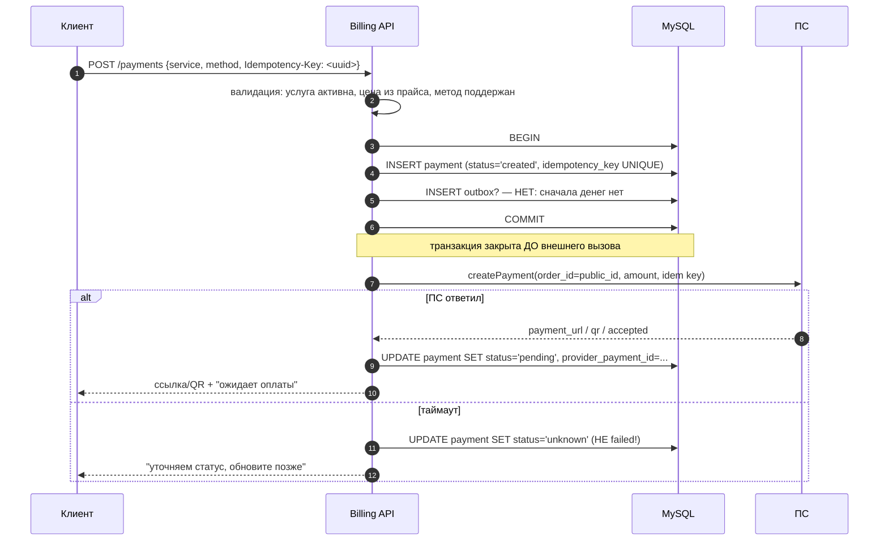

# 01. Практическая задача: приём платежа

> Формат: тебе дают задачу, ты её решаешь вслух, интервьюер подкидывает уточнения и ломает
> условия. Ниже — полный разбор: как уточнять, как решать, что спросят дальше, где ловушки.
>
> **Как пользоваться:** сначала попробуй решить сам (закрой файл), потом читай разбор.

---

## Задание (как его сформулируют)

> «Специалист платит за услугу. Деньги приходят через платёжную систему. Опиши, как ты
> организуешь приём платежа и зачисление. Что создашь в базе, какой будет порядок операций,
> что произойдёт при сбое?»

---

## Шаг 1. Уточняющие вопросы (задать ДО решения)

| № | Вопрос | Зачем |
|---|---|---|
| 1 | Деньги идут в баланс (аванс) или сразу за услугу? | определяет чек и проводки |
| 2 | Оплата одна или платёж может содержать несколько позиций? | влияет на модель |
| 3 | Какие способы оплаты (карта, СБП, кошелёк)? | одностадийная/двухстадийная схема, холды |
| 4 | Есть ли возврат и когда он возможен? | закладываем `refund` сразу |
| 5 | Как быстро нужна активация услуги — синхронно с оплатой? | определяет, что в транзакции, а что через событие |
| 6 | Кто инициирует платёж — веб, мобильное, рекуррент? | способ возврата результата |

> **Это не формальность.** Если ты не спросил про «баланс или сразу за услугу» — модель
> развалится при первом же уточнении. Спросить = показать, что ты понимаешь, где развилка.

---

## Шаг 2. Решение: порядок операций



Разберём **почему именно так**:

| Решение | Обоснование |
|---|---|
| `idempotency_key` от клиента + `UNIQUE` | повторный запрос (двойной клик, ретрай клиента) не создаёт второй платёж; повтор вернёт тот же `payment_id` и тот же ответ |
| запись **до** внешнего вызова, но **вне** транзакции вызова | мы фиксируем намерение (иначе после таймаута не сможем сопоставить ответ ПС), но не держим лок во время сети |
| `unknown` при таймауте | таймаут ≠ отказ; «failed» привёл бы к повторной оплате и двойному списанию |
| цена берётся из прайса, а не из запроса | иначе клиент пришлёт сумму 1 ₽ |

---

## Шаг 3. Что происходит, когда деньги реально пришли

```mermaid
sequenceDiagram
    autonumber
    participant PSP as ПС
    participant API as Webhook Ingress
    participant DB as MySQL
    participant PUB as Outbox publisher
    participant F as Fiscal

    PSP->>API: POST /webhook (подпись, event_id, payment_id, amount, status)
    API->>API: 1) проверить подпись (до БД!)
    API->>DB: 2) BEGIN
    API->>DB: 3) INSERT processed_event(source,event_id) UNIQUE → дубль? выйти
    API->>DB: 4) SELECT payment FOR UPDATE
    API->>API: 5) сверить сумму/валюту; сверить provider_payment_id
    API->>API: 6) проверить допустимость перехода (машина состояний)
    API->>DB: 7) UPDATE payment SET status='paid', paid_at=NOW(6) → READ COMMITTED + условие
    API->>DB: 8) INSERT ledger_entry (Дт транзит ПС / Кт авансы или выручка)
    API->>DB: 9) INSERT outbox (receipt.requested / payment.settled)
    API->>DB: 10) COMMIT
    API-->>PSP: 200 OK
    PUB->>DB: читает outbox (SKIP LOCKED)
    PUB->>F: receipt.requested
```

**Каждый шаг — защита от конкретного зла:**

| Шаг | От чего защищает |
|---|---|
| 1. подпись | от «кто угодно оплатил себе услугу» |
| 3. `processed_event` UNIQUE | от повторной доставки одного события (двойное зачисление) |
| 4. `FOR UPDATE` | от гонки двух параллельных вебхуков по одному платежу |
| 5. сверка суммы | от подмены суммы / багов ПС |
| 6. машина состояний | от «другого» события о том же факте и от устаревших событий |
| 7. атомарный переход в условии | можно не делать `FOR UPDATE` вообще — `UPDATE ... WHERE status='pending'` и `rowCount()` |
| 8. проводки в той же транзакции | от состояния «деньги есть, учёта нет» |
| 9. `outbox` в той же транзакции | от «деньги есть, чек не поставлен в очередь» |
| 10. ответ 200 после COMMIT | иначе подтвердим то, чего нет |

**Код (сокращённо, полностью — в `01-php/02-pdo-transactions.md` §8):**

```php
final class PspWebhookHandler
{
    public function handle(RawWebhook $raw): void
    {
        if (!$this->verifier->isValid($raw)) {
            throw new UnauthorizedWebhookException();     // 1
        }
        $event = PspEvent::fromJson($raw->body);

        withDeadlockRetry($this->pdo, function () use ($event) {
            $this->pdo->beginTransaction();
            try {
                // 2-3. идемпотентность события
                if (!$this->events->markSeen($event->source, $event->eventId, $event->hash())) {
                    $this->pdo->commit();
                    return;                                // дубль: считаем обработанным
                }

                // 4. блокируем строку платёжа
                $payment = $this->payments->findForUpdate($event->paymentId);   // FOR UPDATE
                if ($payment === null) {
                    $this->pdo->commit();
                    $this->alerts->unknownPayment($event);  // событие сохранили, деньги не тронули
                    return;
                }

                // 5. проверки
                $payment->assertSameAmount($event->amount, $event->currency);
                $this->mapper->assertMatches($payment->providerPaymentId, $event->providerPaymentId);

                // 6-7. переход состояния (идемпотентно: повтор ничего не меняет)
                $next = $payment->status()->transitionFor($event);
                if ($next === null) {
                    $this->pdo->commit();
                    return;                                 // устаревшее/неизвестное событие
                }
                $payment->apply($next, $event);             // домен: правила

                // 8. проводки
                $this->ledger->post(new PaymentSettledEntries($payment, $this->fiscalPolicy->resolve($payment)));

                // 9. событие для следствий
                $this->outbox->enqueue('receipt.requested', $payment->id(), $payment->receiptPayload());

                $this->pdo->commit();
            } catch (\Throwable $e) {
                if ($this->pdo->inTransaction()) $this->pdo->rollBack();
                throw $e;
            }
        });
    }
}
```

---

## Шаг 4. Проводки: как именно отражаются деньги

**Вариант А — оплата сразу за услугу:**

```
operation_id = <uuid>
  Дт  "Транзит: эквайринг"          +15 000
  Кт  "Выручка: <услуга>"           −12 500
  Кт  "НДС к уплате"                 −2 500
                           сумма по операции = 0 ✅
```

**Вариант Б — пополнение баланса (аванс):**

```
  Дт  "Транзит: эквайринг"          +100 000
  Кт  "Авансы полученные"          −100 000
```

И **позже**, при оказании услуги:

```
  Дт  "Авансы полученные"           +15 000
  Кт  "Выручка"                     −12 500
  Кт  "НДС к уплате"                 −2 500
```

> **Это ключевой момент, и его надо проговорить:** «Оплата и оказание услуги — **разные
> учётные и фискальные события**. Если платёж — аванс, то в момент оплаты появляется
> обязательство (авансы полученные), а выручка и чек на зачёт — когда услуга оказана.
> Именно поэтому в системе должно быть событие „услуга оказана“, и оно приходит из продукта.»

---

## Шаг 5. Что спросят дальше (и ответы)

| Уточнение интервьюера | Твой ответ |
|---|---|
| «А если вебхук не придёт?» | расписание-дожим: выбираем `pending`/`unknown` старше N минут, опрашиваем `getStatus`, обрабатываем **тем же** идемпотентным путём |
| «А если придёт дважды?» | `UNIQUE(source, event_id)` на уровне БД + проверка перехода; повтор — «уже обработано», не ошибка |
| «А если сумма в вебхуке не совпадает?» | не применять; записать событие, алерт, ручной разбор. Автоматически «поправить сумму» — запрещено |
| «А если ПС прислал незнакомый статус?» | `tryFrom → null`: сохранить сырое событие, состояние не менять, алерт, ответить 200 (иначе бесконечные ретраи) |
| «А если ПС ответил таймаутом на создание платежа?» | статус `unknown`, **не** ретраить слепо: сначала `getStatus` по нашему `order_id` |
| «Где гарантия, что мы не зачислим дважды?» | четыре уровня: ключ запроса, `UNIQUE(event_id)`, машина состояний, `UNIQUE(operation_id)` в проводках |
| «Почему проводки не в очереди?» | это решение, а не следствие; очередь для следствий (чек, уведомление, агрегат) |
| «Что если ПС лежит 10 минут?» | `unknown`, дожим; приём не останавливается; circuit breaker, чтобы не тратить таймауты воркеров |
| «Как узнаешь, что что-то не так?» | метрики: платежи в `pending`/`unknown` > N минут; расхождение «оплачено без проводок»; DLQ |
| «А если платёж пришёл, а услугу не активировали?» | событие `payment.settled` через outbox; продукт обязан быть идемпотентным; плюс сверка «оплачено ⟺ активировано» |

---

## Шаг 6. Ловушки (то, на чём валятся)

| Ловушка | Как выглядит ошибка |
|---|---|
| Внешний вызов внутри транзакции | «начинаю транзакцию, вызываю ПС, коммичу» |
| Ответ 200 ПС до COMMIT | «подтвердили ПС, потом записали» |
| `SELECT` + `INSERT` вместо UNIQUE | гонка при двух параллельных вебхуках |
| Таймаут → `failed` | потеря денег / повторное списание |
| Чек внутри транзакции приёма | «если ОФД тормозит, у нас таймаут вебхука» |
| Нет сверки и метрик | «инцидент обнаружим от бухгалтерии» |
| `ORDER BY`/сортировка без индекса в дожиме | диапазонные локи на горячей таблице |

---

## Шаг 7. Самопроверка (проговори вслух)

- [ ] Назвал уточняющие вопросы до решения.
- [ ] Показал две транзакции (до вызова и после), а не одну длинную.
- [ ] Объяснил `unknown` vs `failed`.
- [ ] Назвал 4 уровня идемпотентности.
- [ ] Показал проводки и объяснил, почему они в той же транзакции.
- [ ] Объяснил, почему чек — асинхронно через outbox.
- [ ] Назвал дожим через `getStatus` и метрики.
- [ ] Упомянул сбой без подсказки: «а если вебхук не придёт» — рассказал сам.
- [ ] В конце назвал **один компромисс** (например, «две транзакции вместо одной — платим
      за это возможностью состояния ``created`` без ответа ПС, зато не держим лок»).
