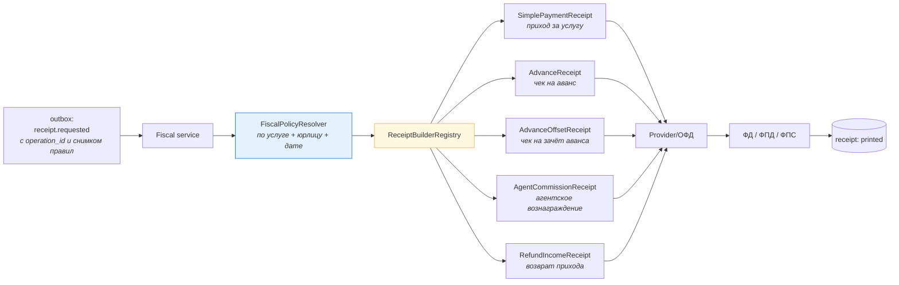

# 02. Практическая задача: формирование чека

> Это самая «доменная» задача из возможных — и вакансия её называет прямо («формирование
> чеков», «новые виды услуг, для которых иначе формируются чеки»). Здесь важно показать, что
> ты понимаешь: **чек — это функция от типа расчёта**, а не «отправим сумму в ОФД».

---

## Задание (в двух вариантах — готовься к обоим)

> **Вариант A (простой):** «Специалист оплатил услугу. Нужно сформировать чек. Как?»
>
> **Вариант B (реальный, из вакансии):** «У нас несколько видов услуг: доступ к контактам,
> продвижение профиля, пакет из 10 откликов. Ещё планируем агентскую схему и оплату со стороны
> клиента. Как организовать формирование чеков так, чтобы добавление нового вида услуги не
> требовало правки ядра?»

---

## Шаг 1. Уточняющие вопросы

| № | Вопрос | Почему это развилка |
|---|---|---|
| 1 | Деньги вперёд (аванс) или по факту оказания услуги? | аванс и зачёт → **два** чека |
| 2 | Мы исполнитель или агент? | агентский чек: наша часть и данные поставщика |
| 3 | Одно юрлицо и одна ККТ или несколько? | маршрутизация чека |
| 4 | Какая СНО и какие ставки НДС по услугам? | состав и суммы чека |
| 5 | Услуга «штучная» или в количестве (пакет из 10)? | признак и мера количества |
| 6 | Провайдер фискализации поддерживает идемпотентность по нашему ключу? | главное для защиты от двойного чека |

---

## Шаг 2. Ключевая мысль: правила фискализации — данные, а не код



**Два уровня абстракции (это самое важное, что нужно объяснить):**

| Уровень | Что это | Чем реализуется |
|---|---|---|
| **Параметры одного и того же документа** | предмет расчёта, признак способа расчёта, ставка НДС, признак агента, момент расчёта | **данные** (версионируемый справочник). Новый вид услуги = новая запись + тест |
| **Разная механика документа** | аванс, зачёт аванса, агентский чек, возврат | **полиморфизм** (билдеры). Новая механика = новый класс |

> **Фраза:** «Если отличие только в параметрах — это должна быть конфигурация, иначе каждое
> изменение требует релиза денежного кода. Если отличается **механика** (аванс против зачёта,
> агентская схема) — это разные билдеры. Смешивать эти два случая — прямой путь к легаси.»

---

## Шаг 3. Схема данных для правил (версионируемая)

```sql
-- Уже показана в 08-system-design/02, здесь — с акцентом на фискализацию
CREATE TABLE service_fiscal_config (
  id                BIGINT UNSIGNED NOT NULL AUTO_INCREMENT,
  service_code      VARCHAR(32)     NOT NULL,
  legal_entity_id   BIGINT UNSIGNED NOT NULL,
  subject_name_tpl  VARCHAR(255)    NOT NULL,   -- 'Отклик на заказ {order_title}'
  subject_type      TINYINT UNSIGNED NOT NULL,  -- признак предмета расчёта (услуга/работа/товар)
  method_type       TINYINT UNSIGNED NOT NULL,  -- признак способа расчёта (аванс/полный/зачёт)
  vat_rate          DECIMAL(5,2)    NOT NULL,
  agent_flag        TINYINT UNSIGNED NOT NULL DEFAULT 0,
  settlement_moment ENUM('immediate','on_service_provided') NOT NULL,
  valid_from        DATETIME(6)     NOT NULL,
  valid_to          DATETIME(6)     NULL,
  PRIMARY KEY (id),
  KEY idx_lookup (service_code, legal_entity_id, valid_from, valid_to)
) ENGINE=InnoDB;
```

```sql
-- Пример данных: услуга "доступ к контактам" (полный расчёт), "пакет 10 откликов" (аванс),
-- "продвижение" (услуга без НДС), "услуга партнёра" (агентская схема)
INSERT INTO service_fiscal_config
  (service_code, legal_entity_id, subject_name_tpl, subject_type, method_type, vat_rate, agent_flag, settlement_moment, valid_from)
VALUES
  ('contact_access', 1, 'Доступ к контактам заказа {ref}', 4, 4, 20.00, 0, 'immediate',            '2025-01-01 00:00:00'),
  ('promotion',      1, 'Продвижение профиля, {period}',   4, 4,  0.00, 0, 'immediate',            '2025-01-01 00:00:00'),
  ('package_10',     1, 'Пакет откликов (10 шт.)',         4, 3, 20.00, 0, 'on_service_provided',  '2025-01-01 00:00:00'),
  ('partner_service',2, 'Услуга {partner_name}: {title}',  4, 4, 20.00, 1, 'immediate',            '2025-01-01 00:00:00');
-- subject_type=4 (услуга), method_type=3 (аванс), 4 (полный расчёт) — по ФФД:
--   номера и состав тегов ВСЕГДА сверить с актуальной версией ФФД у ОФД/провайдера.
```

**Что здесь важно проговорить:**

| Решение | Обоснование |
|---|---|
| `valid_from/valid_to` | отчёт за прошлый период должен считаться по прошлым правилам |
| Снимок в операции/чеке | чтобы изменение справочника не «переписало» уже выпущенные чеки |
| `settlement_moment = on_service_provided` | сразу говорит системе: тут **два** чека (аванс и зачёт) |
| `agent_flag` | агентская схема — это другой состав чека, а не «та же сумма с флагом» |

---

## Шаг 4. Поток фискализации (асинхронно, идемпотентно, с состояниями)

```mermaid
sequenceDiagram
    autonumber
    participant PUB as Outbox publisher
    participant F as Fiscal service
    participant DB as MySQL
    participant PRV as Провайдер/ОФД

    PUB->>F: receipt.requested {operation_id, payment_id, service, amount, snapshot}
    F->>DB: BEGIN; INSERT receipt(operation_id UNIQUE, status='requested'); COMMIT
    Note over F,DB: дубль по operation_id → ничего не делаем (защита от двойного чека)
    F->>PRV: registerReceipt(operation_id=<наш ключ>, fiscal data ...)
    alt успех
        PRV-->>F: ФД, ФПД, ФПС, ссылка
        F->>DB: UPDATE receipt SET status='printed', fiscal_* ... 
    else временная ошибка (таймаут/5xx)
        PRV-->>F: ошибка
        F->>DB: UPDATE receipt SET status='retry_wait', attempts=attempts+1
        F->>F: retry с backoff (или requeue в retry-очередь)
    else постоянная ошибка (неверные теги/сумма)
        PRV-->>F: отказ
        F->>DB: UPDATE receipt SET status='rejected', last_error=...
        F->>F: DLQ + алерт; решение о чеке коррекции — с бухгалтерией
    end
```

**Пять обязательных свойств — назови их все:**

```
1. Один чек на расчёт: UNIQUE(operation_id) — а не "проверим в коде".
2. Внешний вызов вне транзакции БД (ОФД может отвечать секунды).
3. Классификация ошибок: временная → retry с backoff; постоянная → DLQ + человек.
4. Идемпотентность НА СТОРОНЕ ПРОВАЙДЕРА: передаём наш operation_id. Если провайдер не
   поддерживает — свой "журнал намерений" со статусом pending и проверкой перед повтором.
5. Метрика "оплачено без чека дольше N минут" + алерт (доменная, а не "длина очереди").
```

---

## Шаг 5. Ключевые сценарии (то, чем будут добивать)

### Сценарий A. «Пользователь пополнил баланс, потом потратил его на отклик»

```
Шаг 1: пополнение 1000 ₽ → чек №1: приход, признак способа расчёта = АВАНС (1000 ₽)
Шаг 2: услуга оказана (отклик, 150 ₽) → чек №2: ЗАЧЁТ АВАНСА (150 ₽)
Проводки: шаг 1 → Дт транзит / Кт авансы; шаг 2 → Дт авансы / Кт выручка+НДС
```

**Что спросят:** «А если пользователь пополнил, но услугу так и не купил?»
**Ответ:** «Остаётся аванс; при возврате — **чек возврата прихода по авансу** (а не по выручке).
Если аванс „сгорает“ — это решение бухгалтерии, и, скорее всего, оно потребует чека
и/или возврата. Я не решаю это сам.»

### Сценарий B. «Пакет из 10 откликов»

**Ответ:** «Оплата пакета = аванс. По мере использования — зачёты. Здесь есть выбор:
фискализировать **каждое** использование или фискализировать иначе (например, по факту
закрытия пакета/периода). Это **решение бухгалтерии**, потому что от него зависит и
количество документов, и корректность. Технически я поддержу оба: у меня есть
`entitlement_usage` с `operation_id`, из которого можно строить чек на зачёт.»

### Сценарий C. «Агентская схема»

**Ответ:** «Если мы агент, в чеке есть признак агента и данные поставщика, а наша выручка —
только вознаграждение. В учёте появляется счёт обязательств перед специалистом. И тут
обязательно два вопроса: чей это доход и как оформляется вторая часть. Если сделать „как
обычно“, мы завысим налоговую базу — то есть ошибка не техническая, а налоговая.»

### Сценарий D. «Чек не сформировался за допустимое время»

**Ответ:** «Технически: retry, потом DLQ и алерт. Но есть вторая часть — **юридическая**:
возможно, потребуется чек коррекции. Это решение бухгалтерии, а моя задача — сделать
ситуацию **видимой и ограниченной по времени**: метрика, список конкретных операций,
эскалация. Именно поэтому „оплачено без чека дольше N минут“ — отдельный алерт, а не
строчка в логах.»

---

## Шаг 6. Ловушки

| Ловушка | Правильно |
|---|---|
| Чек формируется внутри транзакции оплаты | отдельный асинхронный процесс с состоянием |
| `UNIQUE(payment_id)` на чеке | `UNIQUE(operation_id)` — иначе нельзя два чека на один платёж (аванс+зачёт) |
| Ставка НДС и предмет расчёта в коде | версионируемый справочник + снимок в операции |
| «Если чек не получился — повторим» без классификации | retry только для временных; иначе дубль или петля |
| Нет проверки идемпотентности у провайдера | передавать `operation_id`; иначе повтор создаст второй фискальный документ |
| Чек возврата не связан с исходным чеком | хранить `receipt_id` в возврате |
| Метрика «длина очереди» вместо доменной | «оплачено без чека > N минут» |

---

## Шаг 7. Самопроверка

- [ ] Назвал, что параметры фискализации — данные с версиями, а механика — полиморфизм.
- [ ] Объяснил двухэтапную фискализацию (аванс → зачёт) и откуда берётся событие «услуга оказана».
- [ ] Показал асинхронный поток с состояниями чека и классификацией ошибок.
- [ ] Назвал пять обязательных свойств (включая идемпотентность у провайдера).
- [ ] Упомянул область, где решение **не твоё** (сгорание аванса, чек коррекции) — и почему.
- [ ] Назвал доменную метрику отставания.
- [ ] Проговорил хотя бы один компромисс (например: «фискализировать каждое использование
      пакета — больше документов и нагрузки, но точнее; альтернатива — реже, но нужно
      согласование с бухгалтерией»).
