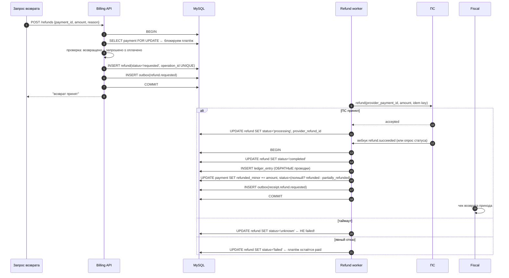
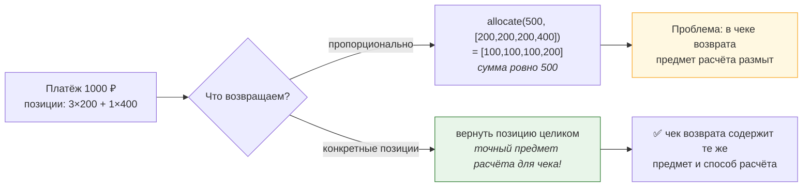

# 03. Практическая задача: возвраты

> Возврат — тема, где легко «поплыть»: кажется, что это «минус к платежу». Здесь задача
> проверяется по частям: полный возврат, частичный, возврат при авансе, возврат упал,
> два параллельных возврата, возврат в закрытом периоде.

---

## Задание

> «Пользователь хочет вернуть деньги за услугу. Опиши, как ты это сделаешь: что создашь,
> какой порядок операций, что будет с чеком, что если возврат не пройдёт. Потом добавим
> условия: возврат частичный, потом — два возврата одновременно, потом — возврат аванса.»

---

## Шаг 1. Уточняющие вопросы

| № | Вопрос | Зачем |
|---|---|---|
| 1 | Возврат полный или частичный? Возможен ли частичный в принципе? | модель суммы и остатка |
| 2 | Услуга уже оказана (в чеке был полный расчёт) или это возврат аванса? | **разный предмет расчёта в чеке возврата** |
| 3 | Кто инициирует: пользователь, поддержка, автоматика (сбой)? | права и аудит |
| 4 | Возврат идёт через тот же способ оплаты? | внешний вызов vs внутренний перевод |
| 5 | Есть ли срок давности возврата (правила ПС)? | валидации |
| 6 | Есть ли уже частичные возвраты по этому платежу? | остаток к возврату |

---

## Шаг 2. Решение: возврат — отдельная сущность



**Что здесь принципиально:**

| Решение | Обоснование |
|---|---|
| `SELECT ... FOR UPDATE` по платежу при создании | иначе два параллельных возврата «сложатся» и вернут больше, чем оплачено |
| проверка остатка **внутри** транзакции | инвариант проверяется там, где он защищён локом |
| `refund` — отдельная таблица со своим `operation_id` | идемпотентность на уровне операции возврата |
| статус платежа меняется только при **полном** возврате | частичный возврат — не «возвращённый платёж» |
| таймаут → `unknown` | как в платежах: не знаем ≠ отказ |
| возврат не прошёл → платёж остаётся `paid` | и это **не** ошибка, а состояние |
| чек возврата — асинхронно | внешний вызов; плюс юридическая значимость |

---

## Шаг 3. Проверка инварианта «не вернули больше, чем заплатили»

```php
// Внутри транзакции, под блокировкой платежа
final class CreateRefundUseCase
{
    public function __invoke(CreateRefund $cmd): RefundId
    {
        return withDeadlockRetry($this->pdo, function () use ($cmd) {
            $this->pdo->beginTransaction();
            try {
                $payment = $this->payments->findForUpdate($cmd->paymentId);   // FOR UPDATE
                if ($payment === null) {
                    throw new PaymentNotFound($cmd->paymentId);
                }
                if (!$payment->status()->allowsRefund()) {
                    throw new RefundNotAllowed($payment->status());           // нельзя вернуть из created/failed
                }

                // ★ Ключевая проверка. Источник истины — суммы успешных возвратов из БД,
                //   а не денормализованный счётчик (счётчик — только быстрый путь + сверка).
                $alreadyRefunded = $this->refunds->sumActiveMinor($payment->id());
                if ($alreadyRefunded + $cmd->amount->amountMinor() > $payment->amount()->amountMinor()) {
                    throw new RefundExceedsPaidAmount($alreadyRefunded, $cmd->amount);
                }

                $refund = Refund::request(
                    operationId: $cmd->operationId,      // идемпотентность
                    paymentId:   $payment->id(),
                    amount:      $cmd->amount,
                    reason:      $cmd->reason,
                    requestedBy: $cmd->actor,
                );
                $this->refunds->save($refund);
                $this->outbox->enqueue('refund.requested', $refund->id(), $refund->payload());

                $this->pdo->commit();
                return $refund->id();
            } catch (\Throwable $e) {
                if ($this->pdo->inTransaction()) $this->pdo->rollBack();
                throw $e;
            }
        });
    }
}
```

```sql
-- Поиск нарушений инварианта (ночной контроль, см. 02-mysql/04, Задача 4)
SELECT p.id, p.amount_minor AS paid, SUM(r.amount_minor) AS refunded
  FROM payment p
  JOIN refund r ON r.payment_id = p.id AND r.status IN ('completed')
 WHERE p.created_at >= NOW() - INTERVAL 90 DAY
 GROUP BY p.id, p.amount_minor
HAVING SUM(r.amount_minor) > p.amount_minor;
```

---

## Шаг 4. Частичный возврат: не только арифметика

Интервьюер почти наверняка добавит: «а если платёж был за пакет из 10 откликов, а возврат —
частичный?»



**Что надо сказать:**

> «Частичный возврат — это не только деление суммы. В чеке возврата должны быть **те же
> предмет расчёта и признак способа расчёта**, что в исходном чеке: возврат по авансу —
> это возврат аванса, возврат по оказанной услуге — возврат расчёта. Значит, позиции платежа
> надо хранить с их параметрами фискализации, а сумму делить с **распределением остатка**,
> чтобы части в сумме давали ровно исходную сумму, без потерянных и лишних копеек.
> Если бы платёж был „одной цифрой“, корректно отфискализировать частичный возврат было бы
> невозможно.»

Плюс: «Если часть позиций уже оплачена из аванса, а часть из выручки — возврат распределяется
между ними по тем же правилам. И это уже вопрос к бухгалтерии, а не свободный выбор.»

---

## Шаг 5. Три добивающих условия

### Условие 1. «Два возврата пришли одновременно»

**Ответ:** «Оба входят в `SELECT ... FOR UPDATE` по платежу: первый берёт лок, второй ждёт.
Первый проверяет остаток и создаёт возврат, коммитит. Второй после получения лока видит
уже изменённый остаток и отказывает, если сумма превышает. Ключевое — проверка остатка
**внутри** транзакции под локом, а не „до“ него. Плюс `UNIQUE(operation_id)` защищает от
повторной обработки одного и того же запроса.»

### Условие 2. «Возврат не прошёл в ПС»

**Ответ:**
```
1. Различаем: явный отказ (failed) vs таймаут (unknown).
2. При unknown — опрос статуса; не считать отказом.
3. Платёж остаётся paid, если возврат не прошёл. Это состояние, не ошибка.
4. Уведомить поддержку/клиента — молчание превратит это в жалобу.
5. Причина: нет средств на нашем счёте, истёк срок, неверные реквизиты → разные действия.
6. Чек возврата НЕ выпускаем, пока деньги не вернулись (или по согласованному правилу).
7. Метрика: возвраты в failed/unknown > N дней → алерт.
```

### Условие 3. «Возврат в закрытом периоде»

**Ответ:** «Возврат — событие того периода, когда он произошёл. Исходный период не трогаем:
он закрыт и отчитан. Если по правилам учёта нужна корректировка — это отдельный документ
по согласованию с бухгалтерией. Технически я обязан **не запрещать** эту операцию, но обязан
сделать её видимой: операция помечается как „возврат по операции закрытого периода“,
чтобы бухгалтерия видела её отдельно.»

---

## Шаг 6. Ловушки

| Ловушка | Правильно |
|---|---|
| `payment.amount -= refund` | возврат — отдельная запись, платёж не меняет свою сумму |
| Проверка остатка обычным `SELECT` | `FOR UPDATE` + проверка внутри транзакции |
| Возврат считается по денормализованному счётчику без сверки | источник истины — суммы из `refund`, счётчик — кэш |
| Таймаут возврата → `failed` | `unknown` + опрос статуса |
| Чек возврата выпущен до возврата денег | порядок: деньги вернулись → проводки → чек (или согласованное правило) |
| Частичный возврат «поровну» | распределение остатка + сохранение предмета расчёта |
| Возврат меняет период оплаты | возврат относится к периоду возврата |
| Нет аудита «кто инициировал возврат» | `requested_by` + `audit_log` (возвраты — зона злоупотреблений!) |

> **Про злоупотребления — отдельно:** «Возвраты — классическая зона внутреннего фрода
> (сотрудник поддержки возвращает на свой счёт). Поэтому: обязательный аудит инициатора,
> лимиты по сумме, второй глаз на крупные, и сверка „возвраты = фактическим движениям
> в ПС“. Это не паранойя, это стандартная практика в платёжках.»

---

## Шаг 7. Самопроверка

- [ ] Сказал, что возврат — отдельная сущность со своим `operation_id` и статусами.
- [ ] Показал `FOR UPDATE` и проверку остатка **внутри** транзакции.
- [ ] Различил полный и частичный возврат по влиянию на статус платежа.
- [ ] Назвал `unknown` для таймаута и то, что платёж остаётся `paid` при неисполненном возврате.
- [ ] Проговорил связь с чеком возврата и порядок «деньги → проводки → чек».
- [ ] Разобрал частичный возврат через предмет расчёта, а не только через арифметику.
- [ ] Упомянул аудит и лимиты (фрод).
- [ ] Назвал компромисс: «держу денормализованный `refunded_minor` для скорости, но источник
      истины — суммы возвратов, со сверкой».
