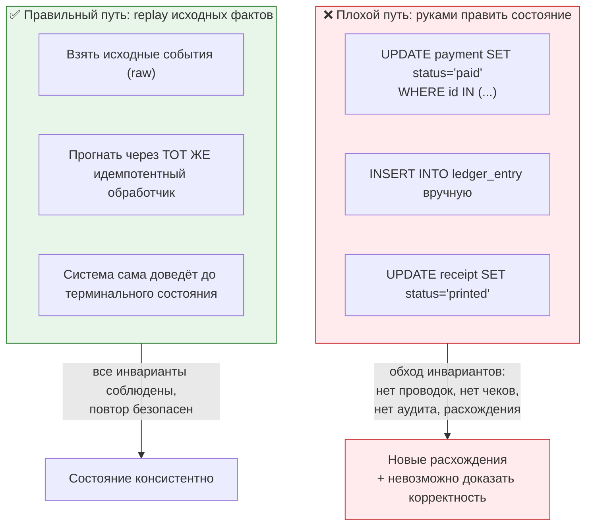
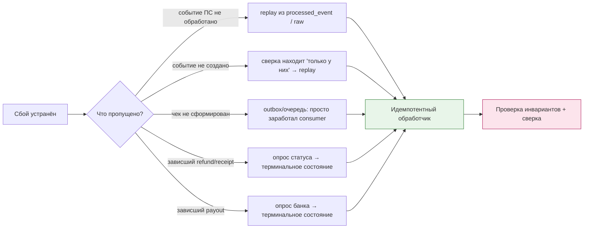

# 04. Практическая задача: повторная обработка и дубликаты

> Формулировка из вакансии: «повторная обработка операций». Это задача, где проверяется
> **вся** идемпотентность сразу: приёма, событий, учёта и внешних систем. Здесь же — «запусти
> повторно за вчера», «догони ночной сбой», «переиграй то, что упало».

---

## Задание

> «Ночью был сбой: часть операций не обработалась (например, фискализация отстала, часть
> вебхуков не дошла). Утром нужно всё догнать. Опиши, как ты организуешь повторную обработку
> так, чтобы ничего не задвоить и никого не обмануть.»

---

## Шаг 1. Уточняющие вопросы

| № | Вопрос | Зачем |
|---|---|---|
| 1 | Что именно пропущено: события ПС, формирование чеков, зачёты аванса, выплаты? | разные пути восстановления |
| 2 | За какой период и на какую сумму? | масштаб и приоритет |
| 3 | Есть ли внешние системы, которые поддерживают идемпотентность? | можно ли «просто повторить» |
| 4 | Есть ли дедлайн (юридический/клиентский)? | порядок восстановления |
| 5 | Что уже видели клиенты и поддержка? | коммуникация и приоритеты |

---

## Шаг 2. Главный принцип: **переигрываем факты, а не состояния**



**Формулировка:** «Главное правило повторной обработки: **мы переигрываем исходные факты**
через тот же обработчик, а не правим состояние руками. Если я делаю `UPDATE status='paid'`
напрямую, то проводки, чек, событие для продукта и аудит не создаются — и я получаю
состояние, где „оплачено“, но денежного учёта нет. То есть вместо инцидента я создаю
расхождение.»

---

## Шаг 3. Четыре источника восстановления

| Источник | Что восстанавливаем | Как |
|---|---|---|
| **`processed_event` / сырые вебхуки** | не обработанные события ПС | взять сырые события, отсутствующие в учёте, прогнать через обработчик |
| **`outbox`** | неопубликованные события (чек, уведомление, агрегат) | publisher сам догоняет; при сбое — просто запустить |
| **опрос внешней системы** | то, о чём мы вообще не знали (вебхук не пришёл) | `getStatus` по подозрительным операциям (сверка, дожим) |
| **`refund` / `receipt` в незавершённых статусах** | «зависшие» операции | довести через опрос + идемпотентную обработку |



---

## Шаг 4. Порядок восстановления: сначала «деньги внутрь», потом «документы»

| Приоритет | Что | Почему так |
|---|---|---|
| 1 | Незачисленные платежи (деньги пришли — услуга не активна) | прямой вред клиенту; юр. и репутационный риск |
| 2 | Возвраты, которые «зависли» | клиент ждёт деньги |
| 3 | Чеки (если позволил срок) | юридический риск, но обычно с окном |
| 4 | Агрегаты и отчётность | следствие, можно пересчитать |
| 5 | Уведомления и аналитика | косметика |

**И два ограничения, о которых надо сказать:**

```
1. НЕ переигрывать операции, у которых истёк срок (например, возврат старше срока ПС).
   Для них — отдельная процедура, не автоповтор.
2. Запускать батчами с ограничением параллелизма и паузами: догон 50 000 операций
   одной пачкой положит и БД, и внешние лимиты провайдера.
```

```php
/**
 * Replay: идемпотентный догон незавершённых операций.
 * Свойства: батчи, ограничение параллелизма, метрики, возможность остановки.
 */
final class ReplayUnfinishedPayments
{
    public function __construct(
        private readonly PDO $pdo,
        private readonly PspStatusClient $psp,          // getStatus
        private readonly PspWebhookHandler $handler,     // ТОТ ЖЕ обработчик, что для вебхуков
        private readonly LoggerInterface $log,
        private readonly Metrics $metrics,
    ) {}

    public function run(int $batchSize = 200, int $sleepMs = 100): void
    {
        $lastId = 0;

        while (true) {
            // Берём минимальные данные: только то, что нужно для опроса ПС.
            // Индекс (status, created_at) — точечное чтение и узкие локи (если понадобятся).
            $stmt = $this->pdo->prepare(
                "SELECT id, provider_code, provider_payment_id, created_at
                   FROM payment
                  WHERE status IN ('pending','unknown')
                    AND id > :last
                    AND created_at < NOW() - INTERVAL 10 MINUTE
                    AND created_at > NOW() - INTERVAL 7 DAY    -- ← окно! старше — отдельная процедура
                  ORDER BY id
                  LIMIT :lim"
            );
            $stmt->bindValue('last', $lastId, PDO::PARAM_INT);
            $stmt->bindValue('lim', $batchSize, PDO::PARAM_INT);
            $stmt->execute();
            $rows = $stmt->fetchAll(PDO::FETCH_ASSOC);

            if ($rows === []) {
                return;
            }

            foreach ($rows as $row) {
                try {
                    // 1) спрашиваем ФАКТ у источника (не догадываемся)
                    $state = $this->psp->getStatus($row['provider_code'], $row['provider_payment_id']);

                    // 2) синтезируем событие в том же формате, что приходит вебхуком,
                    //    с СТАБИЛЬНЫМ event_id (provider + txn + status), чтобы повтор не задвоил
                    $event = PspEvent::fromPoll(
                        eventId: "{$row['provider_code']}:{$row['provider_payment_id']}:{$state->status}",
                        paymentId: (int) $row['id'],
                        state: $state,
                    );

                    // 3) прогоняем через тот же идемпотентный путь
                    $this->handler->handle($event);

                    $this->metrics->increment('replay.resolved', ['status' => $state->status]);

                    if ($state->isTerminal()) {
                        $this->log->info('Replay resolved', ['payment' => $row['id'], 'state' => $state->status]);
                    }
                } catch (TransientError $e) {
                    $this->metrics->increment('replay.retry_later');   // следующий проход
                }
                // PermanentError — не глушим: пусть уйдёт в алерт/тикет, но батч продолжается
            }

            $lastId = (int) end($rows)['id'];
            usleep($sleepMs * 1000);        // троттлинг: не мешать онлайну и внешним системам
        }
    }
}
```

**Четыре тонкости, которые надо назвать (иначе решение неполное):**

| № | Тонкость |
|---|---|
| 1 | **Стабильный `event_id` при опросе.** Если генерировать случайный, повторный опрос создаст «новое» событие и (если бы мы доверяли только ему) мог бы дать второй эффект. Формат `provider:txn:status` — стабильный и разный для разных переходов |
| 2 | **Окно.** Операции старше N дней — не автоповтор, а отдельная процедура (сроки, ручное решение) |
| 3 | **Троттлинг и батчи.** Догон не должен конкурировать с онлайн-трафиком за БД и не должен превышать лимиты ПС |
| 4 | **Тот же обработчик.** Никаких «отдельных упрощённых путей» для replay: иначе появляется третий способ менять деньги, и он обязательно разойдётся с двумя другими |

---

## Шаг 5. Как доказать, что догон прошёл корректно

```sql
-- 1) Нет незакрытых операций старше порога
SELECT COUNT(*) FROM payment
 WHERE status IN ('pending','unknown') AND created_at < NOW() - INTERVAL 1 HOUR;

-- 2) Каждый оплаченный платёж имеет проводки нужной суммы
SELECT COUNT(*) FROM (
  SELECT p.id FROM payment p
   LEFT JOIN (SELECT payment_id, SUM(amount_minor) s FROM ledger_entry GROUP BY payment_id) l
     ON l.payment_id = p.id
  WHERE p.status IN ('paid','partially_refunded','refunded')
    AND p.created_at >= CURDATE() - INTERVAL 2 DAY
    AND COALESCE(l.s, 0) <> p.amount_minor
) x;

-- 3) Каждый оплаченный платёж имеет чек (или объяснимо не имеет)
SELECT COUNT(*) FROM payment p
  LEFT JOIN receipt r ON r.payment_id = p.id
 WHERE p.status = 'paid'
   AND p.created_at >= CURDATE() - INTERVAL 2 DAY
   AND (r.id IS NULL OR r.status <> 'printed');

-- 4) Никаких двойных эффектов: сумма проводок по операции = 0
SELECT operation_id, COUNT(*) FROM ledger_entry
 WHERE created_day >= CURDATE() - INTERVAL 2 DAY
 GROUP BY operation_id HAVING SUM(amount_minor) <> 0;
```

> **Фраза:** «Я считаю догон завершённым не когда „очередь пуста“, а когда **инварианты
> сходятся** и сверка не даёт расхождений. Очередь пустая может означать и „всё обработано“,
> и „мы потеряли сообщения“ — это разные вещи.»

---

## Шаг 6. Отдельная задача: «операция пришла дважды, что ты сделаешь»

| Что пришло дважды | Ответ |
|---|---|
| То же событие (тот же `event_id`) | `UNIQUE(source, event_id)` → второй раз ничего; проверить, что эффект один (уникальность проводок) |
| Другой `event_id` о том же факте | машина состояний: переход `pending → paid` уже сделан → ничего; залогировать |
| Второй **платёж** от ПС по тому же заказу | это уже реальный дубль: искать по `order_id`/`idempotency_key`; разобраться с ПС через сверку; вернуть деньги клиенту по согласованной процедуре |
| Второй чек (два фискальных документа) | 🔴 юридическая проблема: нужен чек коррекции; разбираться с провайдером, почему не сработала идемпотентность |
| Вторая выплата специалисту | 🔴 деньги ушли; идемпотентность должна была не дать (`UNIQUE(batch, recipient)`); разбор и возврат |

**Вывод, который надо произнести:** «Дубли делятся на три категории по цене ошибки:
(1) событие — лечится идемпотентностью без последствий; (2) платёж — лечится возвратом, но
это работа с клиентом и ПС; (3) **выплата** — самое дорогое, потому что деньги уходят наружу.
Именно поэтому на выплатах уникальный ключ и лимиты — обязательны, а в самом опасном месте
я склоняюсь к „лучше остановиться и позвать человека“, чем рискнуть автоматикой.»

---

## Шаг 7. Ловушки

| Ловушка | Правильно |
|---|---|
| Replay руками через `UPDATE`/`INSERT` | только через идемпотентный обработчик |
| Случайный `event_id` при синтезе события из опроса | стабильный ключ (`provider:txn:status`) |
| Повторять всё без окна | окно + отдельная процедура для старых |
| Догон одной большой транзакцией | батчи, короткие транзакции, троттлинг |
| «Очередь пуста → всё хорошо» | проверка **инвариантов** и сверка |
| Догон во время пика | окно низкой нагрузки / ограничение параллелизма |
| Нет метрик догона | метрика прогресса, ошибок и остатка |

---

## Шаг 8. Самопроверка

- [ ] Сформулировал принцип «переигрываем факты, а не состояния».
- [ ] Назвал 4 источника восстановления (raw-события, outbox, опрос, незавершённые сущности).
- [ ] Расставил приоритеты (деньги внутрь → возвраты → чеки → отчёты → уведомления).
- [ ] Упомянул про **тот же** идемпотентный обработчик.
- [ ] Назвал стабильный `event_id` при синтезе события из опроса.
- [ ] Показал окно и троттлинг.
- [ ] Перечислил 4 проверки, доказывающие корректность догона.
- [ ] Разделил дубли по цене ошибки (событие / платёж / выплата).
